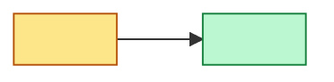

# Context Map: <Nazwa systemu/produktu>

> **Living document.** Aktualizowany iteracyjnie w miarę odkrywania granic, nie jest dokumentem końcowym.
> **Status:** in-progress
> **Data:** <YYYY-MM-DD>

## Wejścia źródłowe

<!-- Skąd pochodzą kandydaci na konteksty i granice - linki do event stormingu, ARCHITECTURE.md driverów, ownership map. -->

- Event storming: <linki do docs/event-storming/*.md>
- Drivery architektoniczne: <np. D1, D2 z ARCHITECTURE.md>
- Inne źródła: <kod, wywiady, istniejące ADR>

## Bounded Contexts

<!-- Jeden wiersz per kandydat na kontekst. Wypełniać dopiero po potwierdzeniu z użytkownikiem - nie zgadywać granic. -->

| Kontekst | Odpowiedzialność (1 zdanie) | Zespół / właściciel | Typ (Core/Supporting/Generic) |
| --- | --- | --- | --- |
| <Nazwa> | <...> | <...> | <...> |

## Mapa kontekstów (diagram)

<!-- Diagram zbiorczy: wszystkie konteksty jako węzły, relacje jako krawędzie z etykietą wzorca DDD.
     Zobacz assets/ddd-patterns-legend.md po pełną notację i klasyfikację core/supporting/generic. -->

## Słownik (Ubiquitous Language)

<!-- Kluczowe terminy per kontekst. Ten sam termin o różnym znaczeniu w różnych kontekstach = sygnał granicy. -->

| Termin | Definicja | Kontekst | Uwagi (homonimy/synonimy w innych kontekstach) |
| --- | --- | --- | --- |
| <termin> | <definicja właściwa dla kontekstu> | <Nazwa kontekstu> | <...> |

## Granice i odpowiedzialności

<!-- Jedna sekcja per kontekst. Kopiuj blok poniżej dla każdego nowego kontekstu. -->

### <Nazwa kontekstu>

- **W zakresie:** <co ten kontekst robi>
- **Poza zakresem:** <co świadomie NIE należy do tego kontekstu>
- **Dane własne (data ownership):** <jakie agregaty/dane kontekst posiada na własność>

## Relacje i integracje

<!-- Jeden wiersz per para komunikujących się kontekstów. -->

| Kontekst A (upstream) | Kontekst B (downstream) | Wzorzec DDD | Mechanizm integracji | Kontrakt / format | Zachowanie przy awarii | Uwagi |
| --- | --- | --- | --- | --- | --- | --- |
| <...> | <...> | <...> | <sync REST / async event / shared state / Module Federation / props / ...> | <...> | <...> | <...> |

## Core Domain Chart

<!-- Klasyfikacja core/supporting/generic z uzasadnieniem - pomaga priorytetyzować inwestycję zespołu. -->

| Kontekst | Klasyfikacja | Uzasadnienie |
| --- | --- | --- |
| <Nazwa> | Core / Supporting / Generic | <...> |

## Open Questions / Hotspots / Inconsistencies

<!-- Lista otwartych pytań, hotspotów i niespójności napotkanych podczas warsztatu.
     Każdy wpis odnosi się do kontekstu lub relacji, w której się pojawił. -->

- [ ] <pytanie/hotspot> — kontekst: <Nazwa>
