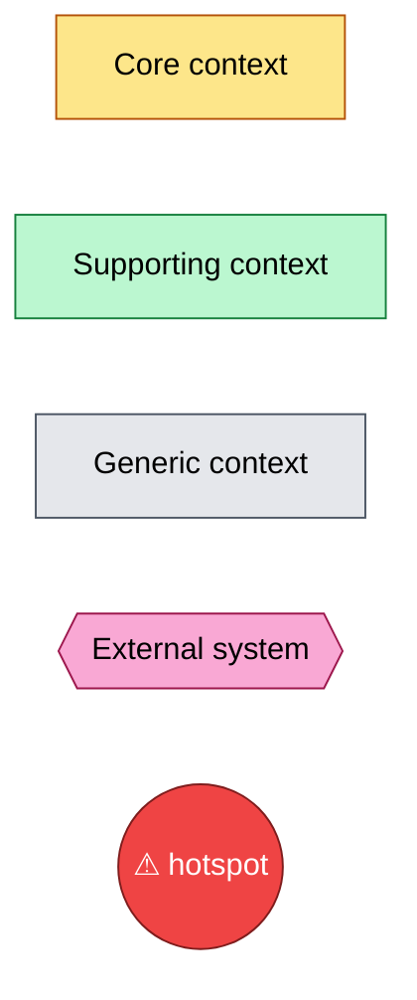
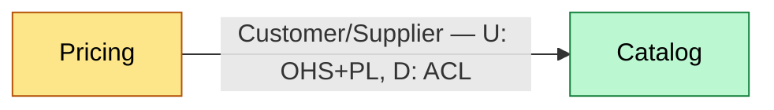

# DDD Context Mapping — Notation

Standard Context Mapping relationship patterns (Evans / Vernon), mapped to mermaid edges. Paste the `classDef` block at the top of every context-map diagram; only declare the classes actually used.

## Klasyfikacja kontekstu (Core Domain Chart)

| Klasa | Kolor | Znaczenie |
|---|---|---|
| Core | żółty (mustard) | Daje przewagę konkurencyjną, warto inwestować najwięcej |
| Supporting | zielony | Niezbędny, ale nie różnicujący — może być prostszy |
| Generic | szary | Rozwiązany problem, kandydat do kupienia/reużycia (np. Auth) |
| External system | różowy | Poza kontrolą zespołu (third-party, inny system) |

## Wzorce relacji między kontekstami

| Wzorzec | Skrót | Kiedy | Kierunek |
|---|---|---|---|
| Partnership | P | Dwa zespoły koordynują się jako równorzędni partnerzy, wspólny harmonogram wydań | symetryczny |
| Shared Kernel | SK | Świadomie dzielony podzbiór modelu/kodu między zespołami — zmiana wymaga zgody obu stron | symetryczny |
| Customer/Supplier | Cust/Supp | Downstream (klient) ma wpływ na priorytety upstream (dostawcy), ale nie blokuje go | upstream (U) → downstream (D) |
| Conformist | CF | Downstream akceptuje model upstream bez negocjacji i bez tłumaczenia (brak siły przetargowej) | U → D (CF po stronie D) |
| Anticorruption Layer | ACL | Downstream tłumaczy/izoluje się od modelu upstream własną warstwą adaptera | U → D (ACL po stronie D) |
| Open Host Service | OHS | Upstream udostępnia dobrze zdefiniowany, publiczny protokół/API dla wielu klientów | po stronie U |
| Published Language | PL | Wspólny, udokumentowany format wymiany (schema, kontrakt) — zwykle towarzyszy OHS | między U i D |
| Separate Ways | SW | Brak integracji — taniej zduplikować niż integrować | brak zależności |
| Big Ball of Mud | BBoM | Granice nieformalne/nieprzestrzegane, model rozmyty — traktować jako dług, nie wzorzec docelowy | — |

## Wiring pattern dla jednej relacji

Etykieta na krawędzi zawsze wskazuje: nazwę wzorca, oraz — jeśli wzorzec jest asymetryczny (Customer/Supplier, Conformist, ACL, OHS/PL) — który kontekst jest upstream (U) i jaki wzorzec stosuje po swojej stronie, a który downstream (D) i jaki wzorzec stosuje po swojej. Strzałka wskazuje kierunek U → D.
