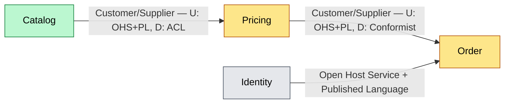

# Context Map: Sklep internetowy (przykład ilustracyjny)

> Przykład generyczny — nie odzwierciedla rzeczywistego projektu. Służy jako wzór formatu.
> **Status:** in-progress
> **Data:** 2026-09-01

## Wejścia źródłowe

- Event storming: `docs/event-storming/zlozenie-zamowienia.md`, `docs/event-storming/zwrot-towaru.md`
- Drivery architektoniczne: D1 (time-to-market zmian cenowych), D3 (odporność na częściową awarię)

## Bounded Contexts

| Kontekst | Odpowiedzialność (1 zdanie) | Zespół / właściciel | Typ (Core/Supporting/Generic) |
| --- | --- | --- | --- |
| Catalog | Definiuje produkty, kategorie i ich atrybuty prezentacyjne | Catalog Team | Supporting |
| Pricing | Wylicza i publikuje ceny oraz reguły promocyjne | Pricing Team | Core |
| Order | Obsługuje cykl życia zamówienia klienta | Order Team | Core |
| Identity | Uwierzytelnianie i role użytkowników | Platform Team | Generic |

## Mapa kontekstów (diagram)

## Słownik (Ubiquitous Language)

| Termin | Definicja | Kontekst | Uwagi (homonimy/synonimy w innych kontekstach) |
| --- | --- | --- | --- |
| Produkt | Pozycja katalogowa z opisem, zdjęciami i kategorią | Catalog | W Pricing to samo słowo oznacza tylko `productId` + cenę bazową, bez atrybutów prezentacyjnych |
| Cena | Aktualna, obowiązująca cena po zastosowaniu reguł promocyjnych | Pricing | W Order to zamrożona `unitPriceAtOrderTime`, niezależna od późniejszych zmian w Pricing |
| Zamówienie | Zestaw pozycji + status realizacji, własność Order | Order | — |

## Granice i odpowiedzialności

### Pricing

- **W zakresie:** reguły cenowe, promocje, wyliczanie ceny końcowej dla danego `productId`.
- **Poza zakresem:** opis/atrybuty produktu (należy do Catalog), zamrożenie ceny w momencie zamówienia (należy do Order).
- **Dane własne (data ownership):** `PricingRule`, `Promotion`.

### Order

- **W zakresie:** cykl życia zamówienia, zamrożenie ceny w momencie złożenia.
- **Poza zakresem:** wyliczanie reguł cenowych (konsumuje wynik z Pricing przez ACL).
- **Dane własne (data ownership):** `Order`, `OrderLine` (zawiera skopiowaną `unitPriceAtOrderTime`).

## Relacje i integracje

| Kontekst A (upstream) | Kontekst B (downstream) | Wzorzec DDD | Mechanizm integracji | Kontrakt / format | Zachowanie przy awarii | Uwagi |
| --- | --- | --- | --- | --- | --- | --- |
| Pricing | Order | Customer/Supplier + ACL w Order | Sync REST (`GET /pricing/quote`) | JSON, wersjonowany `PriceQuoteV1` | Order używa ostatniej znanej ceny z cache, oznacza zamówienie jako `price_stale` | Order nigdy nie przechowuje modelu Pricing 1:1 — mapuje na własny `OrderLine` |
| Catalog | Pricing | Customer/Supplier + ACL w Pricing | Async event (`ProductPublished`) | Event schema w rejestrze zdarzeń | Pricing działa na ostatnim znanym `productId`, event jest idempotentny | — |
| Identity | Order | OHS + PL | Sync REST (JWT introspection) | JWT z jawnym schema claimów | Order odrzuca żądanie (401), nie ma trybu degradacji | Generic subdomain — kandydat do zakupu zamiast budowy |

## Core Domain Chart

| Kontekst | Klasyfikacja | Uzasadnienie |
| --- | --- | --- |
| Pricing | Core | Bezpośrednio realizuje driver D1 (czas wdrożenia zmian cenowych) — przewaga konkurencyjna |
| Order | Core | Kluczowy dla realizacji przychodu, wysoka złożoność biznesowa |
| Catalog | Supporting | Niezbędny, ale niskie zróżnicowanie względem konkurencji |
| Identity | Generic | Rozwiązany problem branżowo, kandydat do rozwiązania gotowego (np. Auth0) |

## Open Questions / Hotspots / Inconsistencies

- [ ] Czy `ProductPublished` powinno zawierać cenę bazową, czy Pricing powinien o nią pytać osobno? — kontekst: Catalog / Pricing
- [ ] Brak zdefiniowanego trybu degradacji dla Identity przy awarii — obecnie całość ruchu blokowana. — kontekst: Identity / Order
