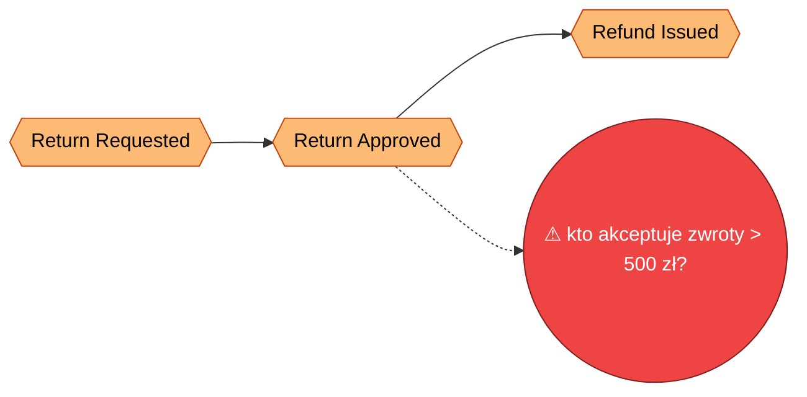
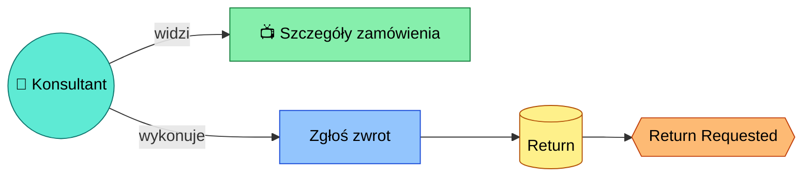
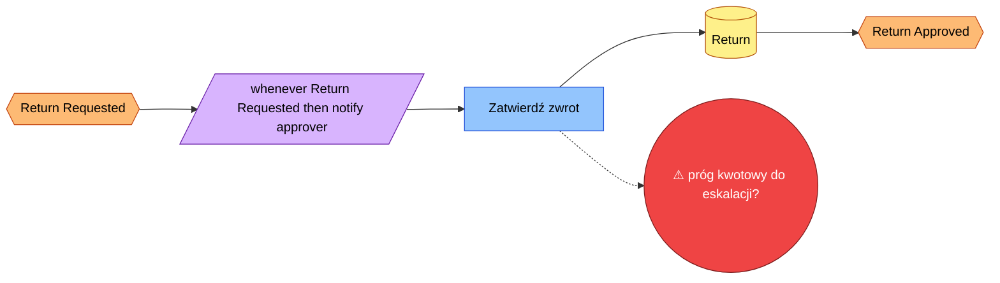
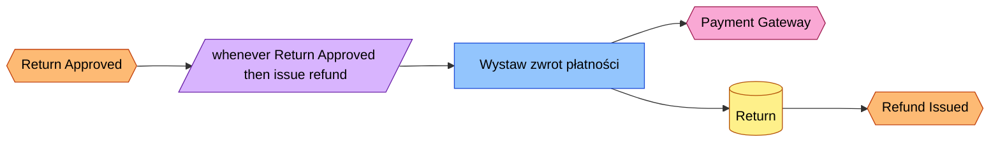

# Event Storming: Zwrot towaru przez klienta (przykład ilustracyjny)

> Przykład generyczny — nie odzwierciedla rzeczywistego procesu w projekcie. Służy jako wzór formatu.

## Kontekst

- **Rola / aktor:** Klient (przez konsultanta obsługi w portalu)
- **Cel końcowy (end goal):** Klient odzyskuje zwrot pieniędzy za wadliwy produkt, a stan magazynowy jest poprawiony
- **Status:** in-progress
- **Data:** 2026-09-01

## Big Picture

## Kroki

### Step 1: Return Requested

- **Widok (view):** Szczegóły zamówienia z listą pozycji kwalifikujących się do zwrotu.
- **Agregat(y):** `Return` (nowy, powiązany z `Order`).
- **Komenda(y):** `Zgłoś zwrot` (RequestReturn).
- **Reguły / polityki:** brak na tym etapie.
- **Zmiany stanu:** utworzony nowy agregat `Return` w statusie `Requested`.
- **Zdarzenie(a) domenowe:** `Return Requested`.

### Step 2: Return Approved

- **Widok (view):** Kolejka zwrotów oczekujących na zatwierdzenie.
- **Agregat(y):** `Return`.
- **Komenda(y):** `Zatwierdź zwrot` (ApproveReturn).
- **Reguły / polityki:** whenever `Return Requested` then powiadom osobę zatwierdzającą.
- **Zmiany stanu:** `Return` przechodzi w status `Approved`.
- **Zdarzenie(a) domenowe:** `Return Approved`.

### Step 3: Refund Issued

- **Widok (view):** Historia płatności zamówienia (potwierdzenie zwrotu środków).
- **Agregat(y):** `Return`.
- **Komenda(y):** `Wystaw zwrot płatności` (IssueRefund), wywołanie zewnętrznego `Payment Gateway`.
- **Reguły / polityki:** whenever `Return Approved` then wystaw zwrot automatycznie.
- **Zmiany stanu:** `Return` przechodzi w status `Refunded`.
- **Zdarzenie(a) domenowe:** `Refund Issued`.

## Open Questions / Hotspots / Inconsistencies

- [ ] Kto zatwierdza zwroty powyżej 500 zł — konsultant czy manager? — krok: Step 2
- [ ] Czy `Refund Issued` powinno też aktualizować stan magazynowy, czy to osobny proces (`Restock`)? — krok: Step 3
