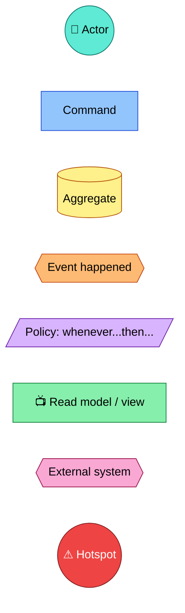
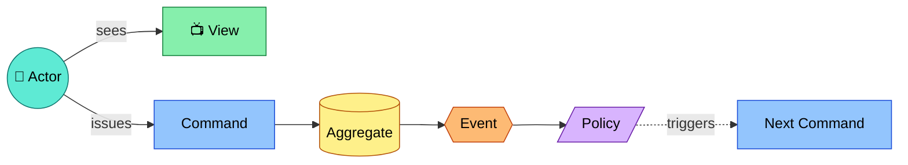

# Event Storming Notation

Standard Event Storming sticky-note colors, mapped to mermaid node shapes/classes. Paste the `classDef` block at the top of every diagram that uses these concepts; only declare the classes actually used in that diagram.

## Node shape conventions

| Concept | Shape | Example |
|---|---|---|
| Actor | circle, 🧑 prefix | `Actor((🧑 Customer)):::actor` |
| Command | rectangle, imperative verb | `Cmd[Place Order]:::command` |
| Aggregate | rounded/cylinder, noun | `Agg[(Order)]:::aggregate` |
| Domain Event | hexagon, past tense | `Evt{{Order Placed}}:::event` |
| Policy | parallelogram, "whenever/then" | `Pol[/whenever Order Placed then Reserve Stock/]:::policy` |
| View / read model | rectangle, 📺 prefix | `View[📺 Order Summary]:::view` |
| External system | hexagon, name | `Ext{{Payment Gateway}}:::external` |
| Hotspot | circle, ⚠ prefix | `Hot((⚠ who owns retries?)):::hotspot` |

## Wiring pattern for a single step

Only include the branches (view/command/aggregate/event/policy) that actually apply to the step — don't force every step to have all of them.
