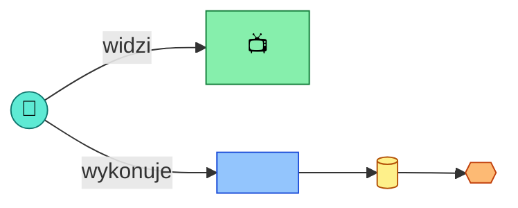

# Event Storming: <Nazwa procesu>

## Kontekst

- **Rola / aktor:** <kto inicjuje proces>
- **Cel końcowy (end goal):** <jaki rezultat biznesowy proces ma osiągnąć>
- **Status:** in-progress
- **Data:** <YYYY-MM-DD>

## Big Picture

<!-- Diagram wysokopoziomowy: łańcuch zdarzeń domenowych (E1, E2, ...) w kolejności czasowej.
     Aktualizuj po każdym kroku - dodaj nowy węzeł zdarzenia i połącz go z poprzednim. -->

## Kroki

<!-- Jeden ### Step per zdarzenie/decyzja. Skopiuj blok poniżej dla każdego nowego kroku. -->

### Step 1: <nazwa kroku / zdarzenia>

- **Widok (view):** <co użytkownik widzi>
- **Agregat(y):** <jakie dane/encje>
- **Komenda(y):** <jakie akcje>
- **Reguły / polityki:** <whenever ... then ...>
- **Zmiany stanu:** <jakie agregaty/widoki są aktualizowane>
- **Zdarzenie(a) domenowe:** <co zostało opublikowane>

## Open Questions / Hotspots / Inconsistencies

<!-- Lista otwartych pytań, hotspotów i niespójności napotkanych podczas warsztatu.
     Każdy wpis odnosi się do kroku, w którym się pojawił. -->

- [ ] <pytanie/hotspot> — krok: Step 1
