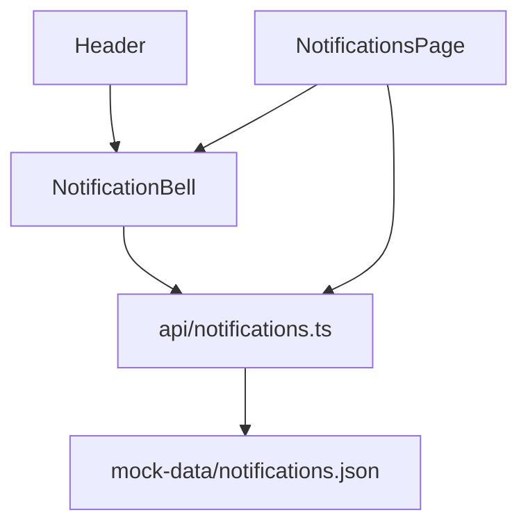

# Raport analizy architektury frontendu

> **Przykład ilustracyjny** — pokazuje wyłącznie oczekiwany format/ton raportu (minimalny, ale kompletny w strukturze). Treść uproszczona, nie stanowi zweryfikowanej analizy repozytorium.

## Metadane raportu

- **Data analizy:** 2026-09-01
- **Tryb analizy:** szczegółowa (moduł: Powiadomienia / Notifications)
- **Zakres:** `src/pages/NotificationsPage.tsx`, `src/components/NotificationBell.tsx`, `src/api/notifications.ts`, `src/mock-data/notifications.json`
- **Autor:** Mateusz Kulesza <ev45ive@gmail.com>
- **Model AI:** Claude Sonnet 4.5
- **Powiązany wcześniejszy raport (jeśli aktualizacja):** brak (pierwsza analiza tego modułu)

## 1. Kontekst i cel

Celem jest ocena spójności modułu powiadomień przed dodaniem obsługi powiadomień w czasie rzeczywistym (WebSocket). Zakres ograniczony do modułu na prośbę użytkownika.

## 2. Stack technologiczny

--- POMINIĘTO --- (poza zakresem analizy modułowej — patrz raport pełny projektu)

## 3. Struktura katalogów i konwencje

**Stan obecny:**

- Strona: `src/pages/NotificationsPage.tsx`
- Komponent współdzielony: `src/components/NotificationBell.tsx` (używany też w `src/layout/Header.tsx`)
- Klient API: `src/api/notifications.ts`
- Dane mock: `src/mock-data/notifications.json`

**Uwagi:** brak zastrzeżeń — podział zgodny z konwencją reszty repozytorium.

## 4. Warstwa danych/API

**Stan obecny:** `src/api/notifications.ts` eksportuje funkcje pobierające dane z `mock-data/notifications.json`, z symulowanym opóźnieniem przez `delay.ts`. Brak realnego klienta HTTP — moduł działa wyłącznie na mockach, co jest spójne z pozostałymi modułami (`api/*` konsekwentnie korzysta z `mock-data/*`).

**Uwagi:** brak.

## 5. Zarządzanie stanem

--- POMINIĘTO ---

## 6. Routing i nawigacja

--- POMINIĘTO ---

## 7. Komponenty i UI

**Stan obecny:** `NotificationBell.tsx` jest komponentem prezentacyjnym reużywanym w layoucie (`Header.tsx`) oraz osobno pobiera dane w `NotificationsPage.tsx`.

**Uwagi:** logika pobierania danych powtarza się w obu miejscach — potencjalna duplikacja do zweryfikowania.

## 8. Typowanie i jakość kodu

--- POMINIĘTO ---

## 9. Testowanie

**Stan obecny:** brak zidentyfikowanych testów jednostkowych dla plików w zakresie tej analizy.

**Uwagi:** ryzyko regresji przy planowanym przejściu na WebSocket bez pokrycia testami.

## 10. Wydajność

--- POMINIĘTO ---

## 11. Bezpieczeństwo

--- POMINIĘTO ---

## 12. Skalowalność i utrzymywalność

**Stan obecny:** kontrakt danych izolowany w `src/api/notifications.ts`; przejście z mocków na realne API/WebSocket wymaga zmiany tylko w tym pliku i jego konsumentach (`NotificationBell`, `NotificationsPage`).

**Uwagi:** dobra izolacja punktu styku ułatwi migrację.

## 13. Rekomendacje

- **Krytyczne:** brak (w zakresie tej analizy)
- **Ważne:** ujednolicić pobieranie danych, aby uniknąć duplikacji logiki między `NotificationBell` i `NotificationsPage`.
- **Opcjonalne:** dodać testy jednostkowe dla `src/api/notifications.ts` przed migracją na WebSocket.
