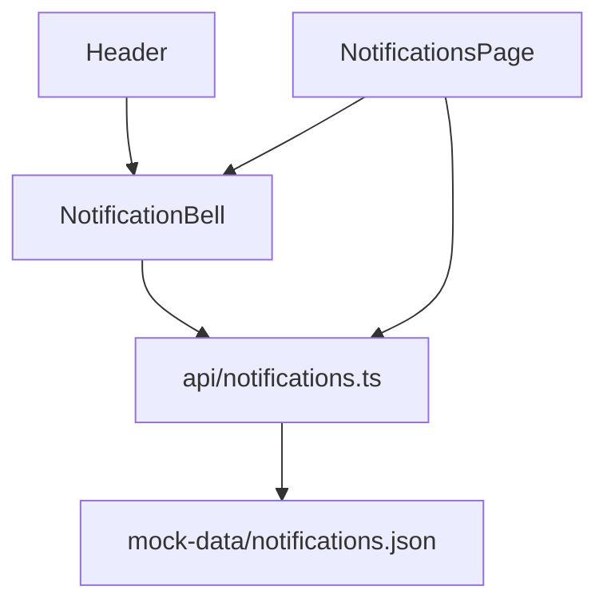

<!-- Generated by SpecStory, Markdown v2.1.0 -->

# 2026-09-01 07:27:41Z

<!-- VS Code Copilot IDE Session 7a23dd24-6892-4b4f-9bf9-a297578a0a08 (2026-09-01 07:27:41Z) -->

_**User (2026-09-01 07:27:41Z)**_

default save path to : docs/architecture-reports/*  - ask user to confirm or change

---

_**Agent (copilot/claude-sonnet-5)**_

<tool-use data-tool-type="read" data-tool-name="read_file"><details>
<summary>Tool use: **read_file**</summary>

Read skill `frontend-architecture-analysis`

**Input:**

- endLine: `400`
- filePath: `c:\Projects\bottega-frontend-architecture-rossmann\.claude\skills\frontend-architecture-analysis\SKILL.md`
- startLine: `1`

**Result:**

```
---
name: frontend-architecture-analysis
description: 'Analyze and document frontend project architecture. Use when asked to analyze, audit, or report on frontend architecture, produce or update an architecture report, or do a deep-dive on a specific feature/module/domain. Trigger phrases: analiza architektury, raport architektury, audyt frontendu, aktualizacja analizy, architecture review, architecture audit, architecture report.'
---

# Frontend Architecture Analysis

Produces a structured architecture report for a frontend project (or a scoped part of it), following a fixed checklist and template so reports stay comparable over time.

## When to Use

- User asks to analyze/audit/review frontend architecture.
- User asks to create or update an architecture report.
- User asks for a deep-dive analysis of one feature/module/domain.

## Process

### Step 1 — Determine analysis mode (ask the user)

Before exploring the codebase, ask the user (via the ask-questions tool) which mode applies:

- **Pełna/wstępna analiza całego projektu** — no existing report, or a from-scratch full review.
- **Aktualizacja istniejącej analizy** — a report already exists and needs to be refreshed against current code.
- **Szczegółowa analiza wybranego modułu/funkcji/domeny** — scoped deep-dive; if chosen, also ask *which* module/feature/domain (freeform answer).

Do not guess the mode — always confirm it first, per project rules in [CLAUDE.md](../../../CLAUDE.md) (no assumptions without confirmation).

### Step 2 — Resolve report metadata (author + model)

- **Autor:** run `git config user.name` and `git config user.email`. If both resolve, use `Name <email>` as the author. If either is missing/empty, ask the user for their name (via ask-questions tool) instead of guessing.
- **Model AI:** record the exact model identifier currently in use for this session (as stated in your own system context) — never a generic placeholder like "AI" or "Copilot".

### Step 
… (output truncated)
```
</details></tool-use>

_**Agent (copilot/claude-sonnet-5)**_

<tool-use data-tool-type="read" data-tool-name="read_file"><details>
<summary>Tool use: **read_file**</summary>

Read skill `frontend-architecture-analysis`, lines 65 to 66

**Input:**

- endLine: `120`
- filePath: `c:\Projects\bottega-frontend-architecture-rossmann\.claude\skills\frontend-architecture-analysis\SKILL.md`
- startLine: `65`

**Result:**

```
Before finalizing, compare against [example report](./assets/example-report.md) — concise, evidence-based (file refs), no filler, opinions clearly marked as such.
```
</details></tool-use>

_**Agent (copilot/claude-sonnet-5)**_

That's the end of the file (66 lines). There's no explicit "where to save" step currently. I'll add a new step for saving the report with the default path confirmation. 

_**Agent (copilot/claude-sonnet-5)**_

<tool-use data-tool-type="write" data-tool-name="textEditGroup"><details>
<summary>Edit: **SKILL.md**</summary>

@@ lines 65-65 @@

```


### Step 7 — Confirm save path and write the file

Default save location is `docs/architecture-reports/<name>.md` (create the folder if it doesn't exist). Propose a filename (e.g. `<date>_<mode-or-scope-slug>.md`) and ask the user (via ask-questions tool) to confirm this path or provide a different one before writing the report — do not save without confirmation.
```
</details></tool-use>

_**Agent (copilot/claude-sonnet-5)**_

Added Step 7 to the skill: default save path is `docs/architecture-reports/<name>.md`, with a proposed filename that the user must confirm or override via ask-questions before writing.

_**Agent (copilot/claude-sonnet-5)**_

<tool-use data-tool-type="task" data-tool-name="manage_todo_list"><details>
<summary>Tool use: **manage_todo_list**</summary>

Created 2 todos
</details></tool-use>

---

_**User (2026-09-01 07:34:46Z)**_

poprawki do szablonu i przykładu:

nie dodawaj notek w stylu  "Sekcje nieistotne dla danego t...", "(z `git config user.*`)" - nie opisuj procesu w raporcie, nie pisz jak cos robisz itp.

jeśli kontekt i cel nie są udokumentowane jasno to powiedz

Format:
- czytelny, lekki, skanowalny - listy, tabelki, małe diagramy mermaid (układ top down)

- oddziel opis tego co jest od sugestii, uwag, notek, rekomentacji etc.

- wypisz polecenia, skrypty i automatyzacje

---

_**Agent (copilot/claude-sonnet-5)**_

<tool-use data-tool-type="read" data-tool-name="read_file"><details>
<summary>Tool use: **read_file**</summary>

Read skill `frontend-architecture-analysis`: `report-template.md`

**Input:**

- endLine: `400`
- filePath: `c:\Projects\bottega-frontend-architecture-rossmann\.claude\skills\frontend-architecture-analysis\assets\report-template.md`
- startLine: `1`

**Result:**

```
# Raport analizy architektury frontendu

> Sekcje nieistotne dla danego trybu/zakresu analizy pozostają w dokumencie, a ich treść zastępuje się znacznikiem `--- POMINIĘTO ---` (nie usuwać nagłówka).

## Metadane raportu

- **Data analizy:**
- **Tryb analizy:** pełna / aktualizacja / szczegółowa (moduł: ...)
- **Zakres:**
- **Autor:** imię i nazwisko oraz e-mail osoby zlecającej/generującej raport
- **Model AI:** dokładna nazwa modelu użytego do wygenerowania raportu
- **Powiązany wcześniejszy raport (jeśli aktualizacja):**

## 1. Kontekst i cel

## 2. Stack technologiczny

## 3. Struktura katalogów i konwencje

## 4. Warstwa danych/API

## 5. Zarządzanie stanem

## 6. Routing i nawigacja

## 7. Komponenty i UI

## 8. Typowanie i jakość kodu

## 9. Testowanie

## 10. Wydajność

## 11. Bezpieczeństwo

## 12. Skalowalność i utrzymywalność

## 13. Rekomendacje

- **Krytyczne:**
- **Ważne:**
- **Opcjonalne:**
```
</details></tool-use>

_**Agent (copilot/claude-sonnet-5)**_

<tool-use data-tool-type="read" data-tool-name="read_file"><details>
<summary>Tool use: **read_file**</summary>

Read skill `frontend-architecture-analysis`: `example-report.md`

**Input:**

- endLine: `400`
- filePath: `c:\Projects\bottega-frontend-architecture-rossmann\.claude\skills\frontend-architecture-analysis\assets\example-report.md`
- startLine: `1`

**Result:**

```
# Raport analizy architektury frontendu

> **Przykład ilustracyjny** — pokazuje wyłącznie oczekiwany format/ton raportu (minimalny, ale kompletny w strukturze). Treść uproszczona, nie stanowi zweryfikowanej analizy repozytorium.

## Metadane raportu

- **Data analizy:** 2026-09-01
- **Tryb analizy:** szczegółowa (moduł: Powiadomienia / Notifications)
- **Zakres:** `src/pages/NotificationsPage.tsx`, `src/components/NotificationBell.tsx`, `src/api/notifications.ts`, `src/mock-data/notifications.json`
- **Autor:** Mateusz Kulesza <ev45ive@gmail.com> (z `git config user.*`)
- **Model AI:** Claude Sonnet 4.5
- **Powiązany wcześniejszy raport (jeśli aktualizacja):** brak (pierwsza analiza tego modułu)

## 1. Kontekst i cel

Celem jest ocena spójności modułu powiadomień przed dodaniem obsługi powiadomień w czasie rzeczywistym (WebSocket). Zakres ograniczony do modułu na prośbę użytkownika.

## 2. Stack technologiczny

--- POMINIĘTO --- (poza zakresem analizy modułowej — patrz raport pełny projektu)

## 3. Struktura katalogów i konwencje

Moduł podzielony zgodnie z konwencją repo: strona w `src/pages/NotificationsPage.tsx`, komponent współdzielony `NotificationBell.tsx` w `src/components/` (używany też w `Header.tsx`), klient API w `src/api/notifications.ts`, dane mock w `src/mock-data/notifications.json`.

## 4. Warstwa danych/API

`src/api/notifications.ts` eksportuje funkcje pobierające dane z `mock-data/notifications.json` (z symulowanym opóźnieniem przez `delay.ts`). Brak realnego klienta HTTP — cały moduł działa na mockach, co jest zgodne z resztą repo (`api/*` konsekwentnie korzysta z `mock-data/*`).

## 5. Zarządzanie stanem

--- POMINIĘTO --- (do zweryfikowania dopiero po analizie `src/store/`, poza obecnym zakresem)

## 6. Routing i nawigacja

--- POMINIĘTO ---

## 7. Komponenty i UI

`NotificationBell.tsx` jest komponentem prezentacyjnym reużywanym w layoucie (`Header.tsx`); logika pobierania danych powinna zostać sprawdzona
… (output truncated)
```
</details></tool-use>

_**Agent (copilot/claude-sonnet-5)**_

<tool-use data-tool-type="read" data-tool-name="read_file"><details>
<summary>Tool use: **read_file**</summary>

Read skill `frontend-architecture-analysis`

**Input:**

- endLine: `71`
- filePath: `c:\Projects\bottega-frontend-architecture-rossmann\.claude\skills\frontend-architecture-analysis\SKILL.md`
- startLine: `1`

**Result:**

```
---
name: frontend-architecture-analysis
description: 'Analyze and document frontend project architecture. Use when asked to analyze, audit, or report on frontend architecture, produce or update an architecture report, or do a deep-dive on a specific feature/module/domain. Trigger phrases: analiza architektury, raport architektury, audyt frontendu, aktualizacja analizy, architecture review, architecture audit, architecture report.'
---

# Frontend Architecture Analysis

Produces a structured architecture report for a frontend project (or a scoped part of it), following a fixed checklist and template so reports stay comparable over time.

## When to Use

- User asks to analyze/audit/review frontend architecture.
- User asks to create or update an architecture report.
- User asks for a deep-dive analysis of one feature/module/domain.

## Process

### Step 1 — Determine analysis mode (ask the user)

Before exploring the codebase, ask the user (via the ask-questions tool) which mode applies:

- **Pełna/wstępna analiza całego projektu** — no existing report, or a from-scratch full review.
- **Aktualizacja istniejącej analizy** — a report already exists and needs to be refreshed against current code.
- **Szczegółowa analiza wybranego modułu/funkcji/domeny** — scoped deep-dive; if chosen, also ask *which* module/feature/domain (freeform answer).

Do not guess the mode — always confirm it first, per project rules in [CLAUDE.md](../../../CLAUDE.md) (no assumptions without confirmation).

### Step 2 — Resolve report metadata (author + model)

- **Autor:** run `git config user.name` and `git config user.email`. If both resolve, use `Name <email>` as the author. If either is missing/empty, ask the user for their name (via ask-questions tool) instead of guessing.
- **Model AI:** record the exact model identifier currently in use for this session (as stated in your own system context) — never a generic placeholder like "AI" or "Copilot".

### Step 
… (output truncated)
```
</details></tool-use>

_**Agent (copilot/claude-sonnet-5)**_

<tool-use data-tool-type="write" data-tool-name="textEditGroup"><details>
<summary>Edit: **SKILL.md**</summary>

@@ lines 65-65 @@

```
 Keep the format light and scannable: prefer bullet lists and tables over prose paragraphs, and use small Mermaid diagrams (top-down layout, e.g. `graph TD`) for structure/flow where a diagram communicates faster than text.
```

@@ lines 43-57 @@

```
 If the project/module does not clearly document its own context or purpose (no README/ARCHITECTURE.md section, no discoverable rationale in code/comments), say so explicitly instead of inferring or guessing one.
2. **Stack technologiczny** — framework, bundler, language, major deps (routing, state, UI kit, forms/validation) — from `package.json`. Include the npm scripts, build/dev commands and any CI/automation config found (e.g. `package.json#scripts`, `.github/workflows/*`) as an explicit list/table.
3. **Struktura katalogów i konwencje** — folder organization (feature vs layer based), naming conventions, module boundaries.
4. **Warstwa danych/API** — API client pattern (`src/api/*`), mocking strategy (`src/mock-data/*`), caching/fetching approach.
5. **Zarządzanie stanem** — global store (`src/store/`), local component state, data flow patterns.
6. **Routing i nawigacja** — route structure (`routes.tsx`), lazy loading, guards/authorization.
7. **Komponenty i UI** — presentational vs. container split, design system usage (`src/components/ui/`), reuse.
8. **Typowanie i jakość kodu** — TypeScript usage/strictness, linter/formatter config, type conventions.
9. **Testowanie** — unit/integration/e2e coverage, tooling.
10. **Wydajność** — bundle size, code splitting, lazy loading, obvious bottlenecks.
11. **Bezpieczeństwo** — auth/authorization handling, input validation, XSS/CSRF exposure.
12. **Skalowalność i utrzymywalność** — ease of extending, technical debt, risk areas.
13. **Rekomendacje** — concrete, prioritized (krytyczne/ważne/opcjonalne).

Sections not applicable to the current scope/mode are still listed in the output — mark their body with `--- POMINIĘTO ---` instead of removing the heading (see template).

Within every section (2–12), keep the description of what currently exists ("Stan obecny") strictly separate from opinions, concerns and suggestions ("Uwagi") — never blend them into the same sentence/bullet. Do not describe your own analysis process (how you looked something up, which tool/command you ran, that a section was skipped because it was "out of scope") inside the report body — the report documents the codebase, not the act of analyzing it
```

@@ lines 30-30 @@

```
 Write only the resolved value into the report (e.g. `Jan Kowalski <jan@example.com>`) — never annotate it with how it was obtained (no "(z `git config`)" or similar process notes).
```
</details></tool-use>

_**Agent (copilot/claude-sonnet-5)**_

Now update the template file to remove process notes and add the Stan obecny/Uwagi split, format guidance, and scripts/commands listing: 

_**Agent (copilot/claude-sonnet-5)**_

<tool-use data-tool-type="read" data-tool-name="read_file"><details>
<summary>Tool use: **read_file**</summary>

Read skill `frontend-architecture-analysis`: `report-template.md`, lines 1 to 36

**Input:**

- endLine: `36`
- filePath: `c:\Projects\bottega-frontend-architecture-rossmann\.claude\skills\frontend-architecture-analysis\assets\report-template.md`
- startLine: `1`

**Result:**

```
# Raport analizy architektury frontendu

> Sekcje nieistotne dla danego trybu/zakresu analizy pozostają w dokumencie, a ich treść zastępuje się znacznikiem `--- POMINIĘTO ---` (nie usuwać nagłówka).

## Metadane raportu

- **Data analizy:**
- **Tryb analizy:** pełna / aktualizacja / szczegółowa (moduł: ...)
- **Zakres:**
- **Autor:** imię i nazwisko oraz e-mail osoby zlecającej/generującej raport
- **Model AI:** dokładna nazwa modelu użytego do wygenerowania raportu
- **Powiązany wcześniejszy raport (jeśli aktualizacja):**

## 1. Kontekst i cel

## 2. Stack technologiczny

## 3. Struktura katalogów i konwencje

## 4. Warstwa danych/API

## 5. Zarządzanie stanem

## 6. Routing i nawigacja

## 7. Komponenty i UI

## 8. Typowanie i jakość kodu

## 9. Testowanie

## 10. Wydajność

## 11. Bezpieczeństwo

## 12. Skalowalność i utrzymywalność
```
</details></tool-use>

_**Agent (copilot/claude-sonnet-5)**_

<tool-use data-tool-type="write" data-tool-name="create_file"><details>
<summary>Tool use: **create_file**</summary>

Created `report-template.md`

**Input:**

- content:

```
<!--
  Instrukcje dla generującego raport (usunąć/nie kopiować do finalnego dokumentu):
  - Sekcje nieistotne dla danego trybu/zakresu analizy pozostają w dokumencie, a ich treść
    zastępuje się znacznikiem `--- POMINIĘTO ---` (nie usuwać nagłówka).
  - Nie opisuj w treści raportu procesu analizy (jak coś sprawdzono, jakiej komendy/narzędzia
    użyto, że sekcję pominięto bo "poza zakresem tej rozmowy" itp.) — raport dokumentuje kod,
    nie sam akt analizy.
  - W sekcjach 2–12 rozdziel wyraźnie: "Stan obecny" (fakty, co jest w kodzie, z odwołaniem do
    plików) od "Uwagi" (opinie, ryzyka, sugestie) — nigdy nie mieszaj ich w jednym zdaniu/punkcie.
  - Preferuj listy i tabele nad długą prozą. Użyj małego diagramu Mermaid (`graph TD`, układ
    top-down) tam, gdzie struktura/przepływ łatwiej się komunikuje wizualnie niż tekstem.
-->

# Raport analizy architektury frontendu

## Metadane raportu

- **Data analizy:**
- **Tryb analizy:** pełna / aktualizacja / szczegółowa (moduł: ...)
- **Zakres:**
- **Autor:**
- **Model AI:**
- **Powiązany wcześniejszy raport (jeśli aktualizacja):**

## 1. Kontekst i cel

<!-- Jeśli kontekst/cel modułu lub projektu nie są nigdzie jasno udokumentowane (README, ARCHITECTURE.md, komentarze) — napisz to wprost zamiast zgadywać. -->

## 2. Stack technologiczny

**Stan obecny:**

**Skrypty i automatyzacje:**

| Skrypt/polecenie | Źródło | Opis |
| --- | --- | --- |
| | | |

**Uwagi:**

## 3. Struktura katalogów i konwencje

**Stan obecny:**

**Uwagi:**

## 4. Warstwa danych/API

**Stan obecny:**

**Uwagi:**

## 5. Zarządzanie stanem

**Stan obecny:**

**Uwagi:**

## 6. Routing i nawigacja

**Stan obecny:**

**Uwagi:**

## 7. Komponenty i UI

**Stan obecny:**

**Uwagi:**

## 8. Typowanie i jakość kodu

**Stan obecny:**

**Uwagi:**

## 9. Testowanie

**Stan obecny:**

**Uwagi:**

## 10. Wydajność

**Stan obecny:**

**Uwagi:**

## 11. Bezpieczeństwo

**Stan obecny:**

**Uwagi:**

## 12. Skalowalność i utrzymywalność

**Stan obecny:**

**Uwagi:**

## 13. Rekomendacje

- **Krytyczne:**
- **Ważne:**
- **Opcjonalne:**

```

- filePath: `c:\Projects\bottega-frontend-architecture-rossmann\.claude\skills\frontend-architecture-analysis\assets\report-template.md`

**Result:**

```
ERROR while calling tool: File already exists. You must use an edit tool to modify it.
Please check your input and try again.
```
</details></tool-use>

_**Agent (copilot/claude-sonnet-5)**_

<tool-use data-tool-type="write" data-tool-name="textEditGroup"><details>
<summary>Edit: **report-template.md**</summary>

@@ lines 1-36 @@

```
<!--
  Instrukcje dla generującego raport (nie kopiować do finalnego dokumentu):
  - Sekcje nieistotne dla danego trybu/zakresu analizy pozostają w dokumencie, a ich treść
    zastępuje się znacznikiem `--- POMINIĘTO ---` (nie usuwać nagłówka).
  - Nie opisuj w treści raportu procesu analizy (jak coś sprawdzono, jakiej komendy/narzędzia
    użyto, że sekcję pominięto bo "poza zakresem tej rozmowy" itp.) — raport dokumentuje kod,
    nie sam akt analizy.
  - W sekcjach 2–12 rozdziel wyraźnie: "Stan obecny" (fakty, co jest w kodzie, z odwołaniem do
    plików) od "Uwagi" (opinie, ryzyka, sugestie) — nigdy nie mieszaj ich w jednym zdaniu/punkcie.
  - Preferuj listy i tabele nad długą prozą. Użyj małego diagramu Mermaid (`graph TD`, układ
    top-down) tam, gdzie struktura/przepływ łatwiej się komunikuje wizualnie niż tekstem.
-->

# Raport analizy architektury frontendu

## Metadane raportu

- **Data analizy:**
- **Tryb analizy:** pełna / aktualizacja / szczegółowa (moduł: ...)
- **Zakres:**
- **Autor:**
- **Model AI:**
- **Powiązany wcześniejszy raport (jeśli aktualizacja):**

## 1. Kontekst i cel

<!-- Jeśli kontekst/cel modułu lub projektu nie są nigdzie jasno udokumentowane (README, ARCHITECTURE.md, komentarze) — napisz to wprost zamiast zgadywać. -->

## 2. Stack technologiczny

**Stan obecny:**

**Skrypty i automatyzacje:**

| Skrypt/polecenie | Źródło | Opis |
| --- | --- | --- |
| | | |

**Uwagi:**

## 3. Struktura katalogów i konwencje

**Stan obecny:**

**Uwagi:**

## 4. Warstwa danych/API

**Stan obecny:**

**Uwagi:**

## 5. Zarządzanie stanem

**Stan obecny:**

**Uwagi:**

## 6. Routing i nawigacja

**Stan obecny:**

**Uwagi:**

## 7. Komponenty i UI

**Stan obecny:**

**Uwagi:**

## 8. Typowanie i jakość kodu

**Stan obecny:**

**Uwagi:**

## 9. Testowanie

**Stan obecny:**

**Uwagi:**

## 10. Wydajność

**Stan obecny:**

**Uwagi:**

## 11. Bezpieczeństwo

**Stan obecny:**

**Uwagi:**

## 12. Skalowalność i utrzymywalność

**Stan obecny:**

**Uwagi:**
```
</details></tool-use>

_**Agent (copilot/claude-sonnet-5)**_

<tool-use data-tool-type="task" data-tool-name="manage_todo_list"><details>
<summary>Tool use: **manage_todo_list**</summary>

Created 3 todos
</details></tool-use>

_**Agent (copilot/claude-sonnet-5)**_

Now update the example report to demonstrate the new format: no process notes, Stan obecny/Uwagi split, a scripts table, and a small mermaid diagram. 

_**Agent (copilot/claude-sonnet-5)**_

<tool-use data-tool-type="write" data-tool-name="textEditGroup"><details>
<summary>Edit: **example-report.md**</summary>

@@ lines 10-60 @@

````

- **Model AI:** Claude Sonnet 4.5
- **Powiązany wcześniejszy raport (jeśli aktualizacja):** brak (pierwsza analiza tego modułu)

## 1. Kontekst i cel

Celem jest ocena spójności modułu powiadomień przed dodaniem obsługi powiadomień w czasie rzeczywistym (WebSocket). Zakres ograniczony do modułu na prośbę użytkownika.

## 2. Stack technologiczny

--- POMINIĘTO --- (poza zakresem analizy modułowej — patrz raport pełny projektu)

## 3. Struktura katalogów i konwencje

**Stan obecny:**

- Strona: `src/pages/NotificationsPage.tsx`
- Komponent współdzielony: `src/components/NotificationBell.tsx` (używany też w `src/layout/Header.tsx`)
- Klient API: `src/api/notifications.ts`
- Dane mock: `src/mock-data/notifications.json`



**Uwagi:** brak zastrzeżeń — podział zgodny z konwencją reszty repozytorium.

## 4. Warstwa danych/API

**Stan obecny:** `src/api/notifications.ts` eksportuje funkcje pobierające dane z `mock-data/notifications.json`, z symulowanym opóźnieniem przez `delay.ts`. Brak realnego klienta HTTP — moduł działa wyłącznie na mockach, co jest spójne z pozostałymi modułami (`api/*` konsekwentnie korzysta z `mock-data/*`).

**Uwagi:** brak.

## 5. Zarządzanie stanem

--- POMINIĘTO ---

## 6. Routing i nawigacja

--- POMINIĘTO ---

## 7. Komponenty i UI

**Stan obecny:** `NotificationBell.tsx` jest komponentem prezentacyjnym reużywanym w layoucie (`Header.tsx`) oraz osobno pobiera dane w `NotificationsPage.tsx`.

**Uwagi:** logika pobierania danych powtarza się w obu miejscach — potencjalna duplikacja do zweryfikowania.

## 8. Typowanie i jakość kodu

--- POMINIĘTO ---

## 9. Testowanie

**Stan obecny:** brak zidentyfikowanych testów jednostkowych dla plików w zakresie tej analizy.

**Uwagi:** ryzyko regresji przy planowanym przejściu na WebSocket bez pokrycia testami.

## 10. Wydajność

--- POMINIĘTO ---

## 11. Bezpieczeństwo

--- POMINIĘTO ---

## 12. Skalowalność i utrzymywalność

**Stan obecny:** kontrakt danych izolowany w `src/api/notifications.ts`; przejście z mocków na realne API/WebSocket wymaga zmiany tylko w tym pliku i jego konsumentach (`NotificationBell`, `NotificationsPage`).

**Uwagi:** dobra izolacja punktu styku ułatwi
````
</details></tool-use>

_**Agent (copilot/claude-sonnet-5)**_

Wprowadzone poprawki:

**`SKILL.md`**
- Krok 2: autor zapisywany tylko jako wartość, bez adnotacji o pochodzeniu (np. `git config`).
- Krok 4: sekcja 1 ma wymóg jawnego stwierdzenia, gdy kontekst/cel nie są udokumentowane; sekcja 2 wymaga wypisania skryptów/poleceń/automatyzacji; dodano zasadę rozdzielania „Stan obecny” od „Uwagi” oraz zakaz opisywania procesu analizy w treści raportu.
- Krok 6: dodano wytyczne formatu — listy, tabele, małe diagramy Mermaid w układzie top-down (`graph TD`).

**`report-template.md`** — usunięto notki procesowe z widocznej treści (przeniesione do komentarza HTML na górze pliku, który nie trafia do finalnego dokumentu), każda sekcja 2–12 ma teraz osobne pola „Stan obecny” i „Uwagi”, sekcja 2 zawiera tabelę na skrypty/automatyzacje.

**`example-report.md`** — usunięto „(z `git config user.*`)”, sekcje pokazują podział Stan obecny/Uwagi, dodano przykładowy diagram Mermaid (top-down) dla struktury modułu.

_**Agent (copilot/claude-sonnet-5)**_

<tool-use data-tool-type="task" data-tool-name="manage_todo_list"><details>
<summary>Tool use: **manage_todo_list**</summary>

Starting: *Update example report to match new template* (3/3)
</details></tool-use>
