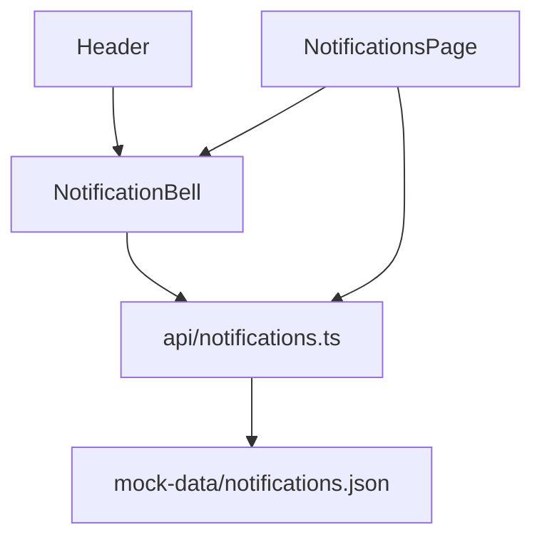

<!-- Generated by SpecStory, Markdown v2.1.0 -->

# 2026-09-01 07:50:54Z

<!-- VS Code Copilot IDE Session 88e50ff7-f8e8-4502-9e41-a7efc8615fa0 (2026-09-01 07:50:54Z) -->

_**User (2026-09-01 07:50:54Z)**_

/frontend-architecture-analysis - nowa analiza

---

_**Agent (copilot/claude-sonnet-5)**_

<tool-use data-tool-type="generic" data-tool-name="vscode_askQuestions"><details>
<summary>Tool use: **vscode_askQuestions**</summary>

Analyzing your answers...

**Input:**

- questions:

```
[
  {
    "allowFreeformInput": true,
    "header": "Tryb analizy",
    "options": [
      {
        "label": "Pełna/wstępna analiza całego projektu (od zera, ignorując istniejący raport)",
        "recommended": true
      },
      {
        "label": "Aktualizacja istniejącej analizy (docs/architecture-reports/2026-09-01_analiza-pelna-retail-operations-portal.md)"
      },
      {
        "label": "Szczegółowa analiza wybranego modułu/funkcji/domeny"
      }
    ],
    "question": "Widzę już istniejący raport (docs/architecture-reports/2026-09-01_analiza-pelna-retail-operations-portal.md). Jaki tryb analizy zastosować?"
  }
]
```


**Result:**

```
{"answers":{"Tryb analizy":{"selected":["Pełna/wstępna analiza całego projektu (od zera, ignorując istniejący raport)"],"freeText":null,"skipped":false}}}
```
</details></tool-use>

_**Agent (copilot/claude-sonnet-5)**_

<tool-use data-tool-type="generic" data-tool-name="run_in_terminal"><details>
<summary>Tool use: **run_in_terminal**</summary>

Running ` git config user.name && git config user.email`

Resolve git author identity for report metadata

```bash
git config user.name && git config user.email
```

**Result:**

```
Mateusz Kulesza
ev45ive@gmail.com
```
</details></tool-use>

_**Agent (copilot/claude-sonnet-5)**_

<tool-use data-tool-type="read" data-tool-name="read_file"><details>
<summary>Tool use: **read_file**</summary>

Read skill `frontend-architecture-analysis`: `report-template.md`

**Input:**

- endLine: `300`
- filePath: `c:\Projects\bottega-frontend-architecture-rossmann\.claude\skills\frontend-architecture-analysis\assets\report-template.md`
- startLine: `1`

**Result:**

```
<!--
  Instrukcje dla generującego raport (nie kopiować do finalnego dokumentu):
  - Sekcje nieistotne dla danego trybu/zakresu analizy pozostają w dokumencie, a ich treść
    zastępuje się znacznikiem `--- POMINIĘTO ---` (nie usuwać nagłówka).
  - Nie opisuj w treści raportu procesu analizy (jak coś sprawdzono, jakiej komendy/narzędzia
    użyto, że sekcję pominięto bo "poza zakresem tej rozmowy" itp.) — raport dokumentuje kod,
    nie sam akt analizy.
  - W sekcjach 2–12 rozdziel wyraźnie: "Stan obecny" (fakty, co jest w kodzie, z odwołaniem do
    plików) od "Uwagi" (opinie, ryzyka, sugestie) — nigdy nie mieszaj ich w jednym zdaniu/punkcie.
  - Preferuj listy i tabele nad długą prozą. Użyj małego diagramu Mermaid (`graph TD`, układ
    top-down) tam, gdzie struktura/przepływ łatwiej się komunikuje wizualnie niż tekstem.
-->

# Raport analizy architektury frontendu

## Metadane raportu

- **Data analizy:**
- **Tryb analizy:** pełna / aktualizacja / szczegółowa (moduł: ...)
- **Zakres:**
- **Autor:**
- **Model AI:**
- **Powiązany wcześniejszy raport (jeśli aktualizacja):**

## 1. Kontekst i cel

<!-- Jeśli kontekst/cel modułu lub projektu nie są nigdzie jasno udokumentowane (README, ARCHITECTURE.md, komentarze) — napisz to wprost zamiast zgadywać. -->

## 2. Stack technologiczny

**Stan obecny:**

**Skrypty i automatyzacje:**

| Skrypt/polecenie | Źródło | Opis |
| --- | --- | --- |
| | | |

**Uwagi:**

## 3. Struktura katalogów i konwencje

**Stan obecny:**

**Uwagi:**

## 4. Warstwa danych/API

**Stan obecny:**

**Uwagi:**

## 5. Zarządzanie stanem

**Stan obecny:**

**Uwagi:**

## 6. Routing i nawigacja

**Stan obecny:**

**Uwagi:**

## 7. Komponenty i UI

**Stan obecny:**

**Uwagi:**

## 8. Typowanie i jakość kodu

**Stan obecny:**

**Uwagi:**

## 9. Testowanie

**Stan obecny:**

**Uwagi:**

## 10. Wydajność

**Stan obecny:**

**Uwagi:**

## 11. Bezpieczeństwo

**Stan obec
… (output truncated)
```
</details></tool-use>

_**Agent (copilot/claude-sonnet-5)**_

<tool-use data-tool-type="read" data-tool-name="read_file"><details>
<summary>Tool use: **read_file**</summary>

Read skill `frontend-architecture-analysis`: `example-report.md`

**Input:**

- endLine: `400`
- filePath: `c:\Projects\bottega-frontend-architecture-rossmann\.claude\skills\frontend-architecture-analysis\assets\example-report.md`
- startLine: `1`

**Result:**

````
# Raport analizy architektury frontendu

> **Przykład ilustracyjny** — pokazuje wyłącznie oczekiwany format/ton raportu (minimalny, ale kompletny w strukturze). Treść uproszczona, nie stanowi zweryfikowanej analizy repozytorium.

## Metadane raportu

- **Data analizy:** 2026-09-01
- **Tryb analizy:** szczegółowa (moduł: Powiadomienia / Notifications)
- **Zakres:** `src/pages/NotificationsPage.tsx`, `src/components/NotificationBell.tsx`, `src/api/notifications.ts`, `src/mock-data/notifications.json`
- **Autor:** Mateusz Kulesza <ev45ive@gmail.com>
- **Model AI:** Claude Sonnet 4.5
- **Powiązany wcześniejszy raport (jeśli aktualizacja):** brak (pierwsza analiza tego modułu)

## 1. Kontekst i cel

Celem jest ocena spójności modułu powiadomień przed dodaniem obsługi powiadomień w czasie rzeczywistym (WebSocket). Zakres ograniczony do modułu na prośbę użytkownika.

## 2. Stack technologiczny

--- POMINIĘTO --- (poza zakresem analizy modułowej — patrz raport pełny projektu)

## 3. Struktura katalogów i konwencje

**Stan obecny:**

- Strona: `src/pages/NotificationsPage.tsx`
- Komponent współdzielony: `src/components/NotificationBell.tsx` (używany też w `src/layout/Header.tsx`)
- Klient API: `src/api/notifications.ts`
- Dane mock: `src/mock-data/notifications.json`



**Uwagi:** brak zastrzeżeń — podział zgodny z konwencją reszty repozytorium.

## 4. Warstwa danych/API

**Stan obecny:** `src/api/notifications.ts` eksportuje funkcje pobierające dane z `mock-data/notifications.json`, z symulowanym opóźnieniem przez `delay.ts`. Brak realnego klienta HTTP — moduł działa wyłącznie na mockach, co jest spójne z pozostałymi modułami (`api/*` konsekwentnie korzysta z `moc
… (output truncated)
````
</details></tool-use>

_**Agent (copilot/claude-sonnet-5)**_

<tool-use data-tool-type="read" data-tool-name="read_file"><details>
<summary>Tool use: **read_file**</summary>

Read `ARCHITECTURE.md`

**Input:**

- endLine: `400`
- filePath: `c:\Projects\bottega-frontend-architecture-rossmann\docs\ARCHITECTURE.md`
- startLine: `1`

**Result:**

```
# Project Architecture

> **Living document.** Aktualizowany na żywo w trakcie warsztatu, nie jest dokumentem końcowym.
> **Właściciel:** cały zespół warsztatowy (rotacyjnie, blok po bloku).
> **Stan na:**: 2026-09-01

# Kontekst biznesowy

Retail Operations Portal — system back-office do obsługi produktów, zamówień, oraz procesu promocji handlowej

# Drivery architektoniczne

| ID  | Driver                                                                              | Kategoria          | Źródło        |
| --- | ----------------------------------------------------------------------------------- | ------------------ | ------------- |
| D1  | Czas wdrożenia zmiany w regułach promocji musi spaść z ~3 tyg. do < 3 dni           | Time-to-market     | Product Owner |
| D2  | Zespoły Pricing i Catalog nie mogą wzajemnie blokować się przy wydaniu              | Autonomia zespołów | Tech Lead     |
| D3  | Częściowa awaria (np. serwis rekomendacji) nie może blokować całego ekranu promocji | Resilience         | Operacje      |
| D4  | Nowi dostawcy frontendu (zespół B2B) muszą móc dołączyć bez przepisywania shella    | Rozszerzalność     | Architekt     |

# Ownership map

| Krok procesu           | Domena | Zespół       | Pakiet |
| ---------------------- | ------ | ------------ | ------ |
| Wybór produktów        | _TBD_` | Catalog Team | _TBD_  |
| Reguły i ceny          | _TBD_  | Pricing Team | _TBD_  |
| Walidacja → akceptacja | _TBD_  | _TBD_        | _TBD_  |
| Aktywacja/publikacja   | _TBD_  | _TBD_        | _TBD_  |
| Raportowanie           | _TBD_  | _TBD_        | _TBD_  |

# Decyzje Architektoniczne (ADR)

- [Index decyzji architektonicznych](./docs/adr/index.md)
```
</details></tool-use>

_**Agent (copilot/claude-sonnet-5)**_

<tool-use data-tool-type="read" data-tool-name="read_file"><details>
<summary>Tool use: **read_file**</summary>

Read `package.json`

**Input:**

- endLine: `100`
- filePath: `c:\Projects\bottega-frontend-architecture-rossmann\retail-operations-portal\package.json`
- startLine: `1`

**Result:**

```
{
  "name": "retail-operations-portal",
  "private": true,
  "version": "0.0.0",
  "type": "module",
  "scripts": {
    "dev": "vite",
    "build": "tsc -b && vite build",
    "lint": "oxlint",
    "preview": "vite preview"
  },
  "dependencies": {
    "@base-ui/react": "^1.7.0",
    "@fontsource-variable/geist": "^5.3.0",
    "@reduxjs/toolkit": "^2.12.0",
    "class-variance-authority": "^0.7.1",
    "clsx": "^2.1.1",
    "lucide-react": "^1.37.0",
    "next-themes": "^0.4.6",
    "react": "^19.2.8",
    "react-dom": "^19.2.8",
    "react-redux": "^9.3.0",
    "react-router-dom": "^7.18.3",
    "shadcn": "^4.19.0",
    "sonner": "^2.0.8",
    "tailwind-merge": "^3.6.0",
    "tw-animate-css": "^1.4.0"
  },
  "devDependencies": {
    "@tailwindcss/vite": "^4.3.3",
    "@types/node": "^24.13.3",
    "@types/react": "^19.2.18",
    "@types/react-dom": "^19.2.4",
    "@vitejs/plugin-react": "^6.1.0",
    "oxlint": "^1.79.0",
    "tailwindcss": "^4.3.3",
    "typescript": "~6.0.2",
    "vite": "^8.2.2"
  }
}
```
</details></tool-use>

_**Agent (copilot/claude-sonnet-5)**_

<tool-use data-tool-type="read" data-tool-name="read_file"><details>
<summary>Tool use: **read_file**</summary>

Read `routes.tsx`

**Input:**

- endLine: `200`
- filePath: `c:\Projects\bottega-frontend-architecture-rossmann\retail-operations-portal\src\routes.tsx`
- startLine: `1`

**Result:**

```
import { createBrowserRouter } from "react-router-dom";
import { AppLayout } from "@/layout/AppLayout";
import { DashboardPage } from "@/pages/DashboardPage";
import { ProductsPage } from "@/pages/ProductsPage";
import { ProductDetailsPage } from "@/pages/ProductDetailsPage";
import { PromotionsPage } from "@/pages/PromotionsPage";
import { PromotionWizardPage } from "@/pages/PromotionWizardPage";
import { PromotionDetailsPage } from "@/pages/PromotionDetailsPage";
import { PricingRulesPage } from "@/pages/PricingRulesPage";
import { ValidationQueuePage } from "@/pages/ValidationQueuePage";
import { ApprovalsPage } from "@/pages/ApprovalsPage";
import { ReportsPage } from "@/pages/ReportsPage";
import { SuppliersPage } from "@/pages/SuppliersPage";
import { OrdersPage } from "@/pages/OrdersPage";
import { WarehousePage } from "@/pages/WarehousePage";
import { CategoriesPage } from "@/pages/CategoriesPage";
import { CustomerSegmentsPage } from "@/pages/CustomerSegmentsPage";
import { ReturnsPage } from "@/pages/ReturnsPage";
import { ImportExportPage } from "@/pages/ImportExportPage";
import { NotificationsPage } from "@/pages/NotificationsPage";
import { AuditLogPage } from "@/pages/AuditLogPage";
import { UsersPage } from "@/pages/UsersPage";

export const router = createBrowserRouter([
  {
    path: "/",
    element: <AppLayout />,
    children: [
      { index: true, element: <DashboardPage /> },
      { path: "products", element: <ProductsPage /> },
      { path: "products/:id", element: <ProductDetailsPage /> },
      { path: "promotions", element: <PromotionsPage /> },
      { path: "promotions/new", element: <PromotionWizardPage /> },
      { path: "promotions/:id", element: <PromotionDetailsPage /> },
      { path: "pricing-rules", element: <PricingRulesPage /> },
      { path: "validation-queue", element: <ValidationQueuePage /> },
      { path: "approvals", element: <ApprovalsPage /> },
      { path: "reports", element:
… (output truncated)
```
</details></tool-use>

_**Agent (copilot/claude-sonnet-5)**_

<tool-use data-tool-type="generic" data-tool-name="list_dir"><details>
<summary>Tool use: **list_dir**</summary>

Read `ui`

**Input:**

- path: `c:\Projects\bottega-frontend-architecture-rossmann\retail-operations-portal\src\components\ui`

**Result:**

```
alert.tsx
avatar.tsx
badge.tsx
button.tsx
card.tsx
checkbox.tsx
dialog.tsx
dropdown-menu.tsx
input.tsx
label.tsx
progress.tsx
select.tsx
separator.tsx
sheet.tsx
sonner.tsx
table.tsx
tabs.tsx
textarea.tsx
tooltip.tsx
```
</details></tool-use>

_**Agent (copilot/claude-sonnet-5)**_

<tool-use data-tool-type="generic" data-tool-name="list_dir"><details>
<summary>Tool use: **list_dir**</summary>

Read `bottega-frontend-architecture-rossmann`

**Input:**

- path: `c:\Projects\bottega-frontend-architecture-rossmann`

**Result:**

```
.claude/
.git/
CLAUDE.md
docs/
exercises/
node_modules/
package-lock.json
package.json
README.md
retail-operations-portal/
```
</details></tool-use>

_**Agent (copilot/claude-sonnet-5)**_

<tool-use data-tool-type="read" data-tool-name="read_file"><details>
<summary>Tool use: **read_file**</summary>

Read `tsconfig.json`

**Input:**

- endLine: `50`
- filePath: `c:\Projects\bottega-frontend-architecture-rossmann\retail-operations-portal\tsconfig.json`
- startLine: `1`

**Result:**

```
{
  "files": [],
  "references": [
    { "path": "./tsconfig.app.json" },
    { "path": "./tsconfig.node.json" }
  ],
  "compilerOptions": {
    "paths": {
      "@/*": ["./src/*"]
    }
  }
}
```
</details></tool-use>

_**Agent (copilot/claude-sonnet-5)**_

<tool-use data-tool-type="read" data-tool-name="read_file"><details>
<summary>Tool use: **read_file**</summary>

Read `.oxlintrc.json`

**Input:**

- endLine: `100`
- filePath: `c:\Projects\bottega-frontend-architecture-rossmann\retail-operations-portal\.oxlintrc.json`
- startLine: `1`

**Result:**

```
{
  "$schema": "./node_modules/oxlint/configuration_schema.json",
  "plugins": ["react", "typescript", "oxc"],
  "rules": {
    "react/rules-of-hooks": "error",
    "react/only-export-components": ["warn", { "allowConstantExport": true }]
  }
}
```
</details></tool-use>

_**Agent (copilot/claude-sonnet-5)**_

<tool-use data-tool-type="read" data-tool-name="read_file"><details>
<summary>Tool use: **read_file**</summary>

Read `App.tsx`

**Input:**

- endLine: `100`
- filePath: `c:\Projects\bottega-frontend-architecture-rossmann\retail-operations-portal\src\App.tsx`
- startLine: `1`

**Result:**

```
import { Provider } from "react-redux";
import { RouterProvider } from "react-router-dom";
import { Toaster } from "@/components/ui/sonner";
import { store } from "@/store/store";
import { router } from "@/routes";

function App() {
  return (
    <Provider store={store}>
      <RouterProvider router={router} />
      <Toaster />
    </Provider>
  );
}

export default App;
```
</details></tool-use>

_**Agent (copilot/claude-sonnet-5)**_

<tool-use data-tool-type="read" data-tool-name="read_file"><details>
<summary>Tool use: **read_file**</summary>

Read `main.tsx`

**Input:**

- endLine: `40`
- filePath: `c:\Projects\bottega-frontend-architecture-rossmann\retail-operations-portal\src\main.tsx`
- startLine: `1`

**Result:**

```
import { StrictMode } from 'react'
import { createRoot } from 'react-dom/client'
import './index.css'
import App from './App.tsx'

createRoot(document.getElementById('root')!).render(
  <StrictMode>
    <App />
  </StrictMode>,
)
```
</details></tool-use>

_**Agent (copilot/claude-sonnet-5)**_

<tool-use data-tool-type="read" data-tool-name="read_file"><details>
<summary>Tool use: **read_file**</summary>

Read `tsconfig.app.json`

**Input:**

- endLine: `50`
- filePath: `c:\Projects\bottega-frontend-architecture-rossmann\retail-operations-portal\tsconfig.app.json`
- startLine: `1`

**Result:**

```
{
  "compilerOptions": {
    "tsBuildInfoFile": "./node_modules/.tmp/tsconfig.app.tsbuildinfo",
    "target": "es2023",
    "lib": ["ES2023", "DOM"],
    "module": "esnext",
    "types": ["vite/client"],
    "allowArbitraryExtensions": true,
    "skipLibCheck": true,
    "resolveJsonModule": true,
    "paths": {
      "@/*": ["./src/*"]
    },

    /* Bundler mode */
    "moduleResolution": "bundler",
    "allowImportingTsExtensions": true,
    "verbatimModuleSyntax": true,
    "moduleDetection": "force",
    "noEmit": true,
    "jsx": "react-jsx",

    /* Linting */
    "noUnusedLocals": true,
    "noUnusedParameters": true,
    "erasableSyntaxOnly": true,
    "noFallthroughCasesInSwitch": true
  },
  "include": ["src"]
}
```
</details></tool-use>

_**Agent (copilot/claude-sonnet-5)**_

<tool-use data-tool-type="read" data-tool-name="read_file"><details>
<summary>Tool use: **read_file**</summary>

Read `store.ts`

**Input:**

- endLine: `100`
- filePath: `c:\Projects\bottega-frontend-architecture-rossmann\retail-operations-portal\src\store\store.ts`
- startLine: `1`

**Result:**

```
import { configureStore } from "@reduxjs/toolkit";
import { auditLogSlice } from "./auditLogSlice";
import { categoriesSlice } from "./categoriesSlice";
import { currentUserSlice } from "./currentUserSlice";
import { customerSegmentsSlice } from "./customerSegmentsSlice";
import { featureFlagsSlice } from "./featureFlagsSlice";
import { notificationsSlice } from "./notificationsSlice";
import { ordersSlice } from "./ordersSlice";
import { pricingRulesSlice } from "./pricingRulesSlice";
import { productsSlice } from "./productsSlice";
import { promotionsSlice } from "./promotionsSlice";
import { returnsSlice } from "./returnsSlice";
import { suppliersSlice } from "./suppliersSlice";
import { usersSlice } from "./usersSlice";
import { warehouseSlice } from "./warehouseSlice";

// One store for every domain — intentional "global store as the app's database" anti-pattern.
export const store = configureStore({
  reducer: {
    products: productsSlice.reducer,
    categories: categoriesSlice.reducer,
    suppliers: suppliersSlice.reducer,
    orders: ordersSlice.reducer,
    warehouse: warehouseSlice.reducer,
    pricingRules: pricingRulesSlice.reducer,
    promotions: promotionsSlice.reducer,
    customerSegments: customerSegmentsSlice.reducer,
    returns: returnsSlice.reducer,
    notifications: notificationsSlice.reducer,
    auditLog: auditLogSlice.reducer,
    users: usersSlice.reducer,
    featureFlags: featureFlagsSlice.reducer,
    currentUser: currentUserSlice.reducer,
  },
});

export type RootState = ReturnType<typeof store.getState>;
export type AppDispatch = typeof store.dispatch;
```
</details></tool-use>

_**Agent (copilot/claude-sonnet-5)**_

<tool-use data-tool-type="generic" data-tool-name="list_dir"><details>
<summary>Tool use: **list_dir**</summary>

Read `pages`

**Input:**

- path: `c:\Projects\bottega-frontend-architecture-rossmann\retail-operations-portal\src\pages`

**Result:**

```
ApprovalsPage.tsx
AuditLogPage.tsx
CategoriesPage.tsx
CustomerSegmentsPage.tsx
DashboardPage.tsx
ImportExportPage.tsx
NotificationsPage.tsx
OrdersPage.tsx
PricingRulesPage.tsx
ProductDetailsPage.tsx
ProductsPage.tsx
PromotionDetailsPage.tsx
PromotionsPage.tsx
PromotionWizardPage.tsx
ReportsPage.tsx
ReturnsPage.tsx
SuppliersPage.tsx
UsersPage.tsx
ValidationQueuePage.tsx
WarehousePage.tsx
```
</details></tool-use>

_**Agent (copilot/claude-sonnet-5)**_

<tool-use data-tool-type="generic" data-tool-name="list_dir"><details>
<summary>Tool use: **list_dir**</summary>

Read `mock-data`

**Input:**

- path: `c:\Projects\bottega-frontend-architecture-rossmann\retail-operations-portal\src\mock-data`

**Result:**

```
auditLog.json
categories.json
customerSegments.json
featureFlags.json
notifications.json
orders.json
pricingRules.json
products.json
promotions.json
returns.json
suppliers.json
users.json
warehouse.json
```
</details></tool-use>

_**Agent (copilot/claude-sonnet-5)**_

<tool-use data-tool-type="read" data-tool-name="read_file"><details>
<summary>Tool use: **read_file**</summary>

Read `delay.ts`

**Input:**

- endLine: `30`
- filePath: `c:\Projects\bottega-frontend-architecture-rossmann\retail-operations-portal\src\api\delay.ts`
- startLine: `1`

**Result:**

```
// Simulates network latency for every mock endpoint below.
export const delay = (ms = 200) => new Promise<void>((resolve) => setTimeout(resolve, ms));
```
</details></tool-use>

_**Agent (copilot/claude-sonnet-5)**_

<tool-use data-tool-type="read" data-tool-name="read_file"><details>
<summary>Tool use: **read_file**</summary>

Read `AppLayout.tsx`

**Input:**

- endLine: `80`
- filePath: `c:\Projects\bottega-frontend-architecture-rossmann\retail-operations-portal\src\layout\AppLayout.tsx`
- startLine: `1`

**Result:**

```
import { Outlet } from "react-router-dom";
import { Header } from "./Header";
import { Sidebar } from "./Sidebar";

export function AppLayout() {
  return (
    <div className="flex h-svh flex-col">
      <Header />
      <div className="flex flex-1 overflow-hidden">
        <Sidebar />
        <main className="flex-1 overflow-y-auto p-6">
          <Outlet />
        </main>
      </div>
    </div>
  );
}
```
</details></tool-use>

_**Agent (copilot/claude-sonnet-5)**_

<tool-use data-tool-type="read" data-tool-name="read_file"><details>
<summary>Tool use: **read_file**</summary>

Read `package.json`

**Input:**

- endLine: `40`
- filePath: `c:\Projects\bottega-frontend-architecture-rossmann\package.json`
- startLine: `1`

**Result:**

```
{
  "name": "bottega-frontend-architecture-rossmann",
  "version": "1.0.0",
  "description": "https://github.com/ev45ive/bottega-frontend-architecture-rossmann.git",
  "main": "index.js",
  "directories": {
    "doc": "docs"
  },
  "scripts": {
    "test": "echo \"Error: no test specified\" && exit 1"
  },
  "repository": {
    "type": "git",
    "url": "git+https://github.com/ev45ive/bottega-frontend-architecture-rossmann.git"
  },
  "keywords": [],
  "author": "",
  "license": "ISC",
  "type": "commonjs",
  "bugs": {
    "url": "https://github.com/ev45ive/bottega-frontend-architecture-rossmann/issues"
  },
  "homepage": "https://github.com/ev45ive/bottega-frontend-architecture-rossmann#readme",
  "devDependencies": {
    "prettier": "^3.9.6"
  }
}
```
</details></tool-use>

_**Agent (copilot/claude-sonnet-5)**_

<tool-use data-tool-type="read" data-tool-name="read_file"><details>
<summary>Tool use: **read_file**</summary>

Read `createListSlice.ts`

**Input:**

- endLine: `80`
- filePath: `c:\Projects\bottega-frontend-architecture-rossmann\retail-operations-portal\src\store\createListSlice.ts`
- startLine: `1`

**Result:**

```
import { createSlice, type PayloadAction } from "@reduxjs/toolkit";
import type { Draft } from "immer";

interface ListState<T> {
  items: T[];
  loaded: boolean;
}

// Generic list slice factory — every domain below is stored the same way, in the same store.
export function createListSlice<T>(name: string, keyField: keyof T = "id" as keyof T) {
  return createSlice({
    name,
    initialState: { items: [], loaded: false } as ListState<T>,
    reducers: {
      setItems(state, action: PayloadAction<T[]>) {
        state.items = action.payload as Draft<T>[];
        state.loaded = true;
      },
      upsertItem(state, action: PayloadAction<T>) {
        const items = state.items as unknown as T[];
        const idx = items.findIndex((item) => item[keyField] === action.payload[keyField]);
        if (idx >= 0) items[idx] = action.payload;
        else items.push(action.payload);
      },
    },
  });
}
```
</details></tool-use>

_**Agent (copilot/claude-sonnet-5)**_

<tool-use data-tool-type="read" data-tool-name="read_file"><details>
<summary>Tool use: **read_file**</summary>

Read `useLoadList.ts`

**Input:**

- endLine: `60`
- filePath: `c:\Projects\bottega-frontend-architecture-rossmann\retail-operations-portal\src\store\useLoadList.ts`
- startLine: `1`

**Result:**

```
import { useEffect } from "react";
import type { ActionCreatorWithPayload } from "@reduxjs/toolkit";
import { useAppDispatch } from "./hooks";

// Fetches once (if not already loaded) and stores the result via the slice's setItems action.
export function useLoadList<T>(
  loaded: boolean,
  fetchFn: () => Promise<T[]>,
  setItems: ActionCreatorWithPayload<T[]>,
) {
  const dispatch = useAppDispatch();
  useEffect(() => {
    if (loaded) return;
    fetchFn().then((items) => dispatch(setItems(items)));
  }, [loaded, fetchFn, setItems, dispatch]);
}
```
</details></tool-use>

_**Agent (copilot/claude-sonnet-5)**_

<tool-use data-tool-type="read" data-tool-name="read_file"><details>
<summary>Tool use: **read_file**</summary>

Read `products.ts`

**Input:**

- endLine: `60`
- filePath: `c:\Projects\bottega-frontend-architecture-rossmann\retail-operations-portal\src\api\products.ts`
- startLine: `1`

**Result:**

```
import productsRaw from "@/mock-data/products.json";
import type { Product } from "@/types";
import { delay } from "./delay";

const db = new Map<string, Product>(productsRaw.map((p) => [p.id, p as Product]));

export async function listProducts(): Promise<Product[]> {
  await delay();
  return [...db.values()];
}

export async function getProduct(id: string): Promise<Product | null> {
  await delay();
  return db.get(id) ?? null;
}

export async function updateProduct(id: string, patch: Partial<Product>): Promise<Product> {
  await delay();
  const current = db.get(id);
  if (!current) throw new Error(`Product ${id} not found`);
  const next = { ...current, ...patch };
  db.set(id, next);
  return next;
}

// Stub: real implementation would parse the file and upsert rows into `db`.
export async function importProductsFromCsv(_file: File): Promise<{ imported: number }> {
  await delay(600);
  return { imported: 0 };
}

export async function exportProducts(): Promise<Product[]> {
  await delay(400);
  return [...db.values()];
}
```
</details></tool-use>

_**Agent (copilot/claude-sonnet-5)**_

<tool-use data-tool-type="read" data-tool-name="read_file"><details>
<summary>Tool use: **read_file**</summary>

Read `ProductsPage.tsx`

**Input:**

- endLine: `80`
- filePath: `c:\Projects\bottega-frontend-architecture-rossmann\retail-operations-portal\src\pages\ProductsPage.tsx`
- startLine: `1`

**Result:**

```
import { useState } from "react";
import { Link } from "react-router-dom";
import { toast } from "sonner";
import { Button } from "@/components/ui/button";
import { Card, CardContent, CardHeader, CardTitle } from "@/components/ui/card";
import { DataTable } from "@/components/DataTable";
import { StatusBadge } from "@/components/StatusBadge";
import { listProducts } from "@/api/products";
import { listCategories } from "@/api/categories";
import { setProducts } from "@/store/productsSlice";
import { setCategories } from "@/store/categoriesSlice";
import { useAppSelector } from "@/store/hooks";
import { useLoadList } from "@/store/useLoadList";

// Extraction candidate #1 (Dzień 1, Blok C1) — first screen pulled out into its own remote.
export function ProductsPage() {
  const products = useAppSelector((s) => s.products.items);
  const productsLoaded = useAppSelector((s) => s.products.loaded);
  useLoadList(productsLoaded, listProducts, setProducts);

  const categories = useAppSelector((s) => s.categories.items);
  const categoriesLoaded = useAppSelector((s) => s.categories.loaded);
  useLoadList(categoriesLoaded, listCategories, setCategories);

  const [selectedIds, setSelectedIds] = useState<Set<string>>(new Set());
  const categoryName = (id: string) => categories.find((c) => c.id === id)?.name ?? id;

  return (
    <Card>
      <CardHeader>
        <CardTitle>Produkty</CardTitle>
      </CardHeader>
      <CardContent>
        <DataTable
          columns={[
            { key: "sku", header: "SKU", render: (p) => p.sku },
            {
              key: "name",
              header: "Nazwa",
              render: (p) => (
                <Link to={`/products/${p.id}`} className="hover:underline">
                  {p.name}
                </Link>
              ),
            },
            { key: "category", header: "Kategoria", render: (p) => categoryName(p.categoryId) },
            { key: "price", header: "Cena
… (output truncated)
```
</details></tool-use>

_**Agent (copilot/claude-sonnet-5)**_

<tool-use data-tool-type="read" data-tool-name="read_file"><details>
<summary>Tool use: **read_file**</summary>

Read `0000-podzial-na-moduly-domenowe.md`

**Input:**

- endLine: `120`
- filePath: `c:\Projects\bottega-frontend-architecture-rossmann\docs\docs\adr\0000-podzial-na-moduly-domenowe.md`
- startLine: `1`

**Result:**

```
# 0000. Podział na moduły domenowe

## Status
Proponowany

## Kontekst
<!-- Jaki problem/driver architektoniczny wymusza tę decyzję?
     Odwołaj się do konkretnych driverów z ARCHITECTURE.md (np. D1, D2). -->

## Decyzja
<!-- Co dokładnie zostało/ma zostać zrobione. Jedno zdanie-teza + uzasadnienie. -->

## Rozważane alternatywy
<!-- Krótko: opcja A / opcja B / opcja C i dlaczego odrzucone. -->

## Konsekwencje
<!-- Pozytywne i negatywne skutki, kompromisy (trade-offs), co się staje trudniejsze. -->

## Powiązane
<!-- Linki do innych ADR, driverów, sekcji Ownership map. -->
```
</details></tool-use>

_**Agent (copilot/claude-sonnet-5)**_

<tool-use data-tool-type="search" data-tool-name="grep_search"><details>
<summary>Tool use: **grep_search**</summary>

Searched for text `Extraction candidate` (`**/retail-operations-portal/src/**`), 2 results

**Input:**

- includePattern: `retail-operations-portal/src/**`
- isRegexp: `false`
- query: `Extraction candidate`

**Result:**

```
Found 2 matches in 2 files for "Extraction candidate"

retail-operations-portal/src/pages/ProductsPage.tsx
15:// Extraction candidate #1 (Dzień 1, Blok C1) — first screen pulled out into its own remote.

retail-operations-portal/src/pages/SuppliersPage.tsx
8:// Extraction candidate #2 (Dzień 1, Blok C4) — or left untouched as D3 kontrprzykład material.
```
</details></tool-use>

_**Agent (copilot/claude-sonnet-5)**_

<tool-use data-tool-type="generic" data-tool-name="list_dir"><details>
<summary>Tool use: **list_dir**</summary>

Read `.git`

**Input:**

- path: `c:\Projects\bottega-frontend-architecture-rossmann\.git`

**Result:**

```
COMMIT_EDITMSG
config
description
FETCH_HEAD
HEAD
hooks/
index
info/
logs/
objects/
ORIG_HEAD
packed-refs
refs/
```
</details></tool-use>

_**Agent (copilot/claude-sonnet-5)**_

<tool-use data-tool-type="read" data-tool-name="read_file"><details>
<summary>Tool use: **read_file**</summary>

Read `currentUserSlice.ts`

**Input:**

- endLine: `40`
- filePath: `c:\Projects\bottega-frontend-architecture-rossmann\retail-operations-portal\src\store\currentUserSlice.ts`
- startLine: `1`

**Result:**

```
import { createSlice } from "@reduxjs/toolkit";
import type { User } from "@/types";

// No login screen yet (Tier 3, added Day 3) — a hardcoded "logged in" user for now.
const hardcodedUser: User = {
  id: "user-1",
  name: "Jan Kowalski",
  email: "jan.kowalski@retailops.pl",
  role: "admin",
};

export const currentUserSlice = createSlice({
  name: "currentUser",
  initialState: hardcodedUser,
  reducers: {},
});
```
</details></tool-use>

_**Agent (copilot/claude-sonnet-5)**_

<tool-use data-tool-type="read" data-tool-name="read_file"><details>
<summary>Tool use: **read_file**</summary>

Read `README.md`

**Input:**

- endLine: `60`
- filePath: `c:\Projects\bottega-frontend-architecture-rossmann\README.md`
- startLine: `1`

**Result:**

```
# bottega-frontend-architecture-rossmann

# GIT
https://github.com/ev45ive/bottega-frontend-architecture-rossmann.git


# Ćwiczenia
https://docs.google.com/spreadsheets/d/1xSkj5Hc0ZVb2LFj2_npY02yZXxBjoD2aDVL5zCWcx78/edit?usp=sharing

```
</details></tool-use>

_**Agent (copilot/claude-sonnet-5)**_

<tool-use data-tool-type="read" data-tool-name="read_file"><details>
<summary>Tool use: **read_file**</summary>

Read `types.ts`, lines 1 to 120

**Input:**

- endLine: `120`
- filePath: `c:\Projects\bottega-frontend-architecture-rossmann\retail-operations-portal\src\types.ts`
- startLine: `1`

**Result:**

```
// Shared DTOs used across every domain — intentionally one flat file (brownfield anti-pattern).
export type ID = string;

export interface Category {
  id: ID;
  name: string;
}

export interface Product {
  id: ID;
  sku: string;
  name: string;
  categoryId: ID;
  price: number;
  unit: string;
  status: "active" | "inactive";
}

export interface Supplier {
  id: ID;
  name: string;
  contactEmail: string;
  country: string;
  status: "active" | "inactive";
}

export type OrderStatus = "new" | "approved" | "shipped" | "cancelled";

export interface Order {
  id: ID;
  orderNumber: string;
  customerName: string;
  total: number;
  status: OrderStatus;
  createdAt: string;
}

export interface WarehouseStock {
  id: ID;
  productId: ID;
  location: string;
  quantity: number;
  reserved: number;
}

export interface PricingRule {
  id: ID;
  name: string;
  type: "percentage" | "fixed" | "bundle";
  value: number;
  categoryId?: ID;
  active: boolean;
}

export type PromotionStatus =
  | "draft"
  | "pending_validation"
  | "pending_approval"
  | "active"
  | "archived";

export interface ValidationResult {
  passed: boolean;
  issues: string[];
  checkedAt: string;
}

export interface Promotion {
  id: ID;
  name: string;
  status: PromotionStatus;
  productIds: ID[];
  pricingRuleIds: ID[];
  startDate: string;
  endDate: string;
  createdBy: string;
  validation?: ValidationResult;
  approvedBy?: string;
  activatedAt?: string;
}

export interface CustomerSegment {
  id: ID;
  name: string;
  description: string;
  criteria: string;
}

export type ReturnStatus = "requested" | "approved" | "rejected" | "refunded";

export interface ReturnRequest {
  id: ID;
  orderId: ID;
  reason: string;
  status: ReturnStatus;
  createdAt: string;
}

export interface Notification {
  id: ID;
  message: string;
  read: boolean;
  createdAt: string;
  type: "info" | "warning" | 
… (output truncated)
```
</details></tool-use>

_**Agent (copilot/claude-sonnet-5)**_

<tool-use data-tool-type="read" data-tool-name="read_file"><details>
<summary>Tool use: **read_file**</summary>

Read `DataTable.tsx`, lines 1 to 120

**Input:**

- endLine: `120`
- filePath: `c:\Projects\bottega-frontend-architecture-rossmann\retail-operations-portal\src\components\DataTable.tsx`
- startLine: `1`

**Result:**

```
import { useMemo, useState } from "react";
import { Input } from "@/components/ui/input";
import {
  Table,
  TableBody,
  TableCell,
  TableHead,
  TableHeader,
  TableRow,
} from "@/components/ui/table";
import { Checkbox } from "@/components/ui/checkbox";
import { Button } from "@/components/ui/button";

export interface DataTableColumn<T> {
  key: string;
  header: string;
  render: (row: T) => React.ReactNode;
}

interface DataTableProps<T> {
  columns: DataTableColumn<T>[];
  rows: T[];
  getRowId: (row: T) => string;
  searchPlaceholder?: string;
  searchText?: (row: T) => string;
  pageSize?: number;
  emptyMessage?: string;
  selectedIds?: Set<string>;
  onSelectedIdsChange?: (ids: Set<string>) => void;
  bulkActions?: React.ReactNode;
}

// Generic table used by every list screen in the app (search + pagination + optional row selection).
export function DataTable<T>({
  columns,
  rows,
  getRowId,
  searchPlaceholder = "Szukaj...",
  searchText,
  pageSize = 8,
  emptyMessage = "Brak danych do wyświetlenia.",
  selectedIds,
  onSelectedIdsChange,
  bulkActions,
}: DataTableProps<T>) {
  const [query, setQuery] = useState("");
  const [page, setPage] = useState(0);

  const filtered = useMemo(() => {
    if (!searchText || !query.trim()) return rows;
    const q = query.trim().toLowerCase();
    return rows.filter((row) => searchText(row).toLowerCase().includes(q));
  }, [rows, query, searchText]);

  const pageCount = Math.max(1, Math.ceil(filtered.length / pageSize));
  const currentPage = Math.min(page, pageCount - 1);
  const pageRows = filtered.slice(currentPage * pageSize, currentPage * pageSize + pageSize);

  const selectable = Boolean(selectedIds && onSelectedIdsChange);
  const allOnPageSelected =
    selectable && pageRows.length > 0 && pageRows.every((row) => selectedIds!.has(getRowId(row)));

  function toggleRow(id: string) {
    if (!selectedIds || !onSelectedIdsChange) return;

… (output truncated)
```
</details></tool-use>

_**Agent (copilot/claude-sonnet-5)**_

<tool-use data-tool-type="read" data-tool-name="read_file"><details>
<summary>Tool use: **read_file**</summary>

Read `GlobalSearch.tsx`, lines 1 to 60

**Input:**

- endLine: `60`
- filePath: `c:\Projects\bottega-frontend-architecture-rossmann\retail-operations-portal\src\components\GlobalSearch.tsx`
- startLine: `1`

**Result:**

```
import { useMemo, useState } from "react";
import { Link } from "react-router-dom";
import { Input } from "@/components/ui/input";
import { useAppSelector } from "@/store/hooks";

interface SearchResult {
  id: string;
  label: string;
  href: string;
  kind: string;
}

// Reaches directly into Products/Promotions/Orders state — deliberate cross-domain coupling (API composition topic).
export function GlobalSearch() {
  const [query, setQuery] = useState("");
  const enabled = useAppSelector(
    (s) => s.featureFlags.items.find((f) => f.key === "global-search")?.enabled ?? true,
  );
  const products = useAppSelector((s) => s.products.items);
  const promotions = useAppSelector((s) => s.promotions.items);
  const orders = useAppSelector((s) => s.orders.items);

  const results: SearchResult[] = useMemo(() => {
    if (!query.trim()) return [];
    const q = query.trim().toLowerCase();
    return [
      ...products
        .filter((p) => p.name.toLowerCase().includes(q))
        .map((p) => ({ id: p.id, label: p.name, href: `/products/${p.id}`, kind: "Produkt" })),
      ...promotions
        .filter((p) => p.name.toLowerCase().includes(q))
        .map((p) => ({ id: p.id, label: p.name, href: `/promotions/${p.id}`, kind: "Promocja" })),
      ...orders
        .filter((o) => o.orderNumber.toLowerCase().includes(q))
        .map((o) => ({ id: o.id, label: o.orderNumber, href: "/orders", kind: "Zamówienie" })),
    ].slice(0, 8);
  }, [query, products, promotions, orders]);

  if (!enabled) return null;

  return (
    <div className="relative w-64">
      <Input
        value={query}
        onChange={(e) => setQuery(e.target.value)}
        placeholder="Szukaj produktów, promocji, zamówień..."
      />
      {results.length > 0 && (
        <div className="absolute z-10 mt-1 w-full rounded-md border bg-popover p-1 shadow-md">
          {results.map((r) => (
            <Link
              key={`${r.kind}-${r.id}`}
… (output truncated)
```
</details></tool-use>

_**Agent (copilot/claude-sonnet-5)**_

<tool-use data-tool-type="read" data-tool-name="read_file"><details>
<summary>Tool use: **read_file**</summary>

Read `README.md`

**Input:**

- endLine: `40`
- filePath: `c:\Projects\bottega-frontend-architecture-rossmann\retail-operations-portal\README.md`
- startLine: `1`

**Result:**

````
# React + TypeScript + Vite

This template provides a minimal setup to get React working in Vite with HMR and some Oxlint rules.

Currently, two official plugins are available:

- [@vitejs/plugin-react](https://github.com/vitejs/vite-plugin-react/blob/main/packages/plugin-react) uses [Oxc](https://oxc.rs)
- [@vitejs/plugin-react-swc](https://github.com/vitejs/vite-plugin-react/blob/main/packages/plugin-react-swc) uses [SWC](https://swc.rs/)

## React Compiler

The React Compiler is not enabled on this template because of its impact on dev & build performances. To add it, see [this documentation](https://react.dev/learn/react-compiler/installation).

## Expanding the Oxlint configuration

If you are developing a production application, we recommend enabling type-aware lint rules by installing `oxlint-tsgolint` and editing `.oxlintrc.json`:

```json
{
  "$schema": "./node_modules/oxlint/configuration_schema.json",
  "plugins": ["react", "typescript", "oxc"],
  "options": {
    "typeAware": true
  },
  "rules": {
    "react/rules-of-hooks": "error",
    "react/only-export-components": ["warn", { "allowConstantExport": true }]
  }
}
```

See the [Oxlint rules documentation](https://oxc.rs/docs/guide/usage/linter/rules) for the full list of rules and categories.
````
</details></tool-use>

_**Agent (copilot/claude-sonnet-5)**_

<tool-use data-tool-type="read" data-tool-name="read_file"><details>
<summary>Tool use: **read_file**</summary>

Read `productsSlice.ts`

**Input:**

- endLine: `30`
- filePath: `c:\Projects\bottega-frontend-architecture-rossmann\retail-operations-portal\src\store\productsSlice.ts`
- startLine: `1`

**Result:**

```
import type { Product } from "@/types";
import { createListSlice } from "./createListSlice";

export const productsSlice = createListSlice<Product>("products");
export const { setItems: setProducts, upsertItem: upsertProduct } = productsSlice.actions;
```
</details></tool-use>

_**Agent (copilot/claude-sonnet-5)**_

<tool-use data-tool-type="read" data-tool-name="read_file"><details>
<summary>Tool use: **read_file**</summary>

Read `hooks.ts`

**Input:**

- endLine: `30`
- filePath: `c:\Projects\bottega-frontend-architecture-rossmann\retail-operations-portal\src\store\hooks.ts`
- startLine: `1`

**Result:**

```
import { useDispatch, useSelector, type TypedUseSelectorHook } from "react-redux";
import type { AppDispatch, RootState } from "./store";

export const useAppDispatch: () => AppDispatch = useDispatch;
export const useAppSelector: TypedUseSelectorHook<RootState> = useSelector;
```
</details></tool-use>

_**Agent (copilot/claude-sonnet-5)**_

<tool-use data-tool-type="read" data-tool-name="read_file"><details>
<summary>Tool use: **read_file**</summary>

Read `AppErrorBoundary.tsx`

**Input:**

- endLine: `60`
- filePath: `c:\Projects\bottega-frontend-architecture-rossmann\retail-operations-portal\src\components\AppErrorBoundary.tsx`
- startLine: `1`

**Result:**

```
import { Component, type ErrorInfo, type ReactNode } from "react";
import { Alert, AlertDescription, AlertTitle } from "@/components/ui/alert";
import { Button } from "@/components/ui/button";

interface Props {
  children: ReactNode;
  /** Tag shown in the error message — stands in for "which remote failed" once this is extracted. */
  boundaryName: string;
}

interface State {
  error: Error | null;
}

// Failure isolation demo material (Dzień 3): wrap a section so its crash doesn't take down the whole app.
export class AppErrorBoundary extends Component<Props, State> {
  state: State = { error: null };

  static getDerivedStateFromError(error: Error): State {
    return { error };
  }

  componentDidCatch(error: Error, info: ErrorInfo) {
    console.error(`[${this.props.boundaryName}]`, error, info.componentStack);
  }

  render() {
    if (this.state.error) {
      return (
        <Alert variant="destructive">
          <AlertTitle>Sekcja "{this.props.boundaryName}" napotkała błąd</AlertTitle>
          <AlertDescription className="space-y-2">
            <p>{this.state.error.message}</p>
            <Button size="sm" variant="outline" onClick={() => this.setState({ error: null })}>
              Spróbuj ponownie
            </Button>
          </AlertDescription>
        </Alert>
      );
    }
    return this.props.children;
  }
}
```
</details></tool-use>

_**Agent (copilot/claude-sonnet-5)**_

<tool-use data-tool-type="read" data-tool-name="read_file"><details>
<summary>Tool use: **read_file**</summary>

Read `Header.tsx`

**Input:**

- endLine: `60`
- filePath: `c:\Projects\bottega-frontend-architecture-rossmann\retail-operations-portal\src\layout\Header.tsx`
- startLine: `1`

**Result:**

```
import { GlobalSearch } from "@/components/GlobalSearch";
import { NotificationBell } from "@/components/NotificationBell";
import { UserMenu } from "@/components/UserMenu";

export function Header() {
  return (
    <header className="flex items-center justify-between border-b px-4 py-3">
      <span className="font-semibold">Retail Operations Portal</span>
      <div className="flex items-center gap-3">
        <GlobalSearch />
        <NotificationBell />
        <UserMenu />
      </div>
    </header>
  );
}
```
</details></tool-use>

_**Agent (copilot/claude-sonnet-5)**_

<tool-use data-tool-type="read" data-tool-name="read_file"><details>
<summary>Tool use: **read_file**</summary>

Read `utils.ts`

**Input:**

- endLine: `30`
- filePath: `c:\Projects\bottega-frontend-architecture-rossmann\retail-operations-portal\src\lib\utils.ts`
- startLine: `1`

**Result:**

```
import { clsx, type ClassValue } from "clsx"
import { twMerge } from "tailwind-merge"

export function cn(...inputs: ClassValue[]) {
  return twMerge(clsx(inputs))
}
```
</details></tool-use>

_**Agent (copilot/claude-sonnet-5)**_

<tool-use data-tool-type="read" data-tool-name="read_file"><details>
<summary>Tool use: **read_file**</summary>

Read `Sidebar.tsx`

**Input:**

- endLine: `60`
- filePath: `c:\Projects\bottega-frontend-architecture-rossmann\retail-operations-portal\src\layout\Sidebar.tsx`
- startLine: `1`

**Result:**

```
import { NavLink } from "react-router-dom";
import { cn } from "@/lib/utils";

const CORE_LINKS = [
  { to: "/", label: "Dashboard" },
  { to: "/products", label: "Produkty" },
  { to: "/promotions", label: "Promocje" },
  { to: "/pricing-rules", label: "Reguły cenowe" },
  { to: "/validation-queue", label: "Kolejka walidacji" },
  { to: "/approvals", label: "Kolejka akceptacji" },
  { to: "/reports", label: "Raporty" },
];

const BUFFER_LINKS = [
  { to: "/suppliers", label: "Dostawcy" },
  { to: "/orders", label: "Zamówienia" },
  { to: "/warehouse", label: "Magazyn" },
  { to: "/categories", label: "Kategorie" },
  { to: "/customer-segments", label: "Segmenty klientów" },
  { to: "/returns", label: "Zwroty i reklamacje" },
  { to: "/import-export", label: "Import / Eksport" },
  { to: "/notifications", label: "Powiadomienia" },
  { to: "/audit-log", label: "Dziennik zdarzeń" },
  { to: "/settings/users", label: "Użytkownicy i role" },
];

function NavSection({ title, links }: { title: string; links: typeof CORE_LINKS }) {
  return (
    <div className="space-y-1">
      <p className="px-2 text-xs font-semibold tracking-wide text-muted-foreground uppercase">
        {title}
      </p>
      {links.map((link) => (
        <NavLink
          key={link.to}
          to={link.to}
          end={link.to === "/"}
          className={({ isActive }) =>
            cn(
              "block rounded-md px-2 py-1.5 text-sm hover:bg-muted",
              isActive && "bg-muted font-medium text-foreground",
            )
          }
        >
          {link.label}
        </NavLink>
      ))}
    </div>
  );
}

export function Sidebar() {
  return (
    <aside className="w-60 shrink-0 space-y-6 border-r p-4">
      <NavSection title="Proces promocji" links={CORE_LINKS} />
      <NavSection title="Pozostałe domeny" links={BUFFER_LINKS} />
    </aside>
  );
}
```
</details></tool-use>

_**Agent (copilot/claude-sonnet-5)**_

<tool-use data-tool-type="read" data-tool-name="read_file"><details>
<summary>Tool use: **read_file**</summary>

Read `PromotionWizardPage.tsx`, lines 1 to 150

**Input:**

- endLine: `150`
- filePath: `c:\Projects\bottega-frontend-architecture-rossmann\retail-operations-portal\src\pages\PromotionWizardPage.tsx`
- startLine: `1`

**Result:**

```
import { useState } from "react";
import { useNavigate } from "react-router-dom";
import { toast } from "sonner";
import { Button } from "@/components/ui/button";
import { Card, CardContent, CardHeader, CardTitle } from "@/components/ui/card";
import { Input } from "@/components/ui/input";
import { Label } from "@/components/ui/label";
import { Checkbox } from "@/components/ui/checkbox";
import {
  Dialog,
  DialogContent,
  DialogHeader,
  DialogTitle,
} from "@/components/ui/dialog";
import { Tabs, TabsContent, TabsList, TabsTrigger } from "@/components/ui/tabs";
import { ProductPicker } from "@/components/ProductPicker";
import { PricingRuleForm } from "@/components/PricingRuleForm";
import { listProducts } from "@/api/products";
import { listCategories } from "@/api/categories";
import { listPricingRules, addPricingRule } from "@/api/pricingRules";
import { createPromotion, submitPromotionForValidation } from "@/api/promotions";
import { setProducts } from "@/store/productsSlice";
import { setCategories } from "@/store/categoriesSlice";
import { setPricingRules, upsertPricingRule } from "@/store/pricingRulesSlice";
import { upsertPromotion } from "@/store/promotionsSlice";
import { useAppDispatch, useAppSelector } from "@/store/hooks";
import { useLoadList } from "@/store/useLoadList";

// Maps 1:1 onto the promotion process: wybór produktów → reguły/ceny → walidacja → akceptacja → aktywacja.
export function PromotionWizardPage() {
  const navigate = useNavigate();
  const dispatch = useAppDispatch();

  const products = useAppSelector((s) => s.products.items);
  useLoadList(useAppSelector((s) => s.products.loaded), listProducts, setProducts);
  const categories = useAppSelector((s) => s.categories.items);
  useLoadList(useAppSelector((s) => s.categories.loaded), listCategories, setCategories);
  const pricingRules = useAppSelector((s) => s.pricingRules.items);
  useLoadList(useAppSelector((s) => s.pricingRules.loaded), list
… (output truncated)
```
</details></tool-use>

_**Agent (copilot/claude-sonnet-5)**_

<tool-use data-tool-type="read" data-tool-name="read_file"><details>
<summary>Tool use: **read_file**</summary>

Read `FileImportWidget.tsx`, lines 1 to 50

**Input:**

- endLine: `50`
- filePath: `c:\Projects\bottega-frontend-architecture-rossmann\retail-operations-portal\src\components\FileImportWidget.tsx`
- startLine: `1`

**Result:**

```
import { useState } from "react";
import { Button } from "@/components/ui/button";
import { Input } from "@/components/ui/input";
import { Progress } from "@/components/ui/progress";

interface FileImportWidgetProps {
  onImport: (file: File) => Promise<{ imported: number }>;
  onExport?: () => void;
}

// Small and self-contained — another good candidate for a Web Component comparison (Dzień 2 A3).
export function FileImportWidget({ onImport, onExport }: FileImportWidgetProps) {
  const [file, setFile] = useState<File | null>(null);
  const [busy, setBusy] = useState(false);
  const [result, setResult] = useState<string | null>(null);

  async function handleImport() {
    if (!file) return;
    setBusy(true);
    setResult(null);
    try {
      const { imported } = await onImport(file);
      setResult(`Zaimportowano ${imported} rekordów.`);
    } finally {
      setBusy(false);
    }
  }

  return (
    <div className="space-y-3">
      <div className="flex items-center gap-2">
        <Input
          type="file"
          accept=".csv"
          onChange={(e) => setFile(e.target.files?.[0] ?? null)}
          className="max-w-xs"
        />
        <Button onClick={handleImport} disabled={!file || busy}>
          Importuj
        </Button>
        {onExport && (
          <Button variant="outline" onClick={onExport}>
            Eksportuj
          </Button>
        )}
      </div>
      {busy && <Progress value={null} className="w-64" />}
      {result && <p className="text-sm text-muted-foreground">{result}</p>}
    </div>
  );
```
</details></tool-use>

_**Agent (copilot/claude-sonnet-5)**_

<tool-use data-tool-type="search" data-tool-name="grep_search"><details>
<summary>Tool use: **grep_search**</summary>

Searched for regex `dangerouslySetInnerHTML|AppErrorBoundary|localStorage|sessionStorage` (`**/retail-operations-portal/src/**`), 4 results

**Input:**

- includePattern: `retail-operations-portal/src/**`
- isRegexp: `true`
- query: `dangerouslySetInnerHTML|AppErrorBoundary|localStorage|sessionStorage`

**Result:**

```
Found 4 matches in 2 files for "dangerouslySetInnerHTML|AppErrorBoundary|localStorage|sessionStorage"

retail-operations-portal/src/components/AppErrorBoundary.tsx
16:export class AppErrorBoundary extends Component<Props, State> {

retail-operations-portal/src/pages/PromotionDetailsPage.tsx
11:import { AppErrorBoundary } from "@/components/AppErrorBoundary";
137:          <AppErrorBoundary boundaryName="promotion-performance-widget">
141:          </AppErrorBoundary>
```
</details></tool-use>

_**Agent (copilot/claude-sonnet-5)**_

<tool-use data-tool-type="read" data-tool-name="read_file"><details>
<summary>Tool use: **read_file**</summary>

Read `ApprovalActionBar.tsx`

**Input:**

- endLine: `50`
- filePath: `c:\Projects\bottega-frontend-architecture-rossmann\retail-operations-portal\src\components\ApprovalActionBar.tsx`
- startLine: `1`

**Result:**

```
import { Button } from "@/components/ui/button";
import { useAppSelector } from "@/store/hooks";

interface ApprovalActionBarProps {
  onApprove: () => void;
  onReject: () => void;
  disabled?: boolean;
}

// Role-gated: only admin/manager can approve or reject (Dzień 3 auth/permissions material).
export function ApprovalActionBar({ onApprove, onReject, disabled }: ApprovalActionBarProps) {
  const role = useAppSelector((s) => s.currentUser.role);
  const canDecide = role === "admin" || role === "manager";

  if (!canDecide) {
    return <p className="text-sm text-muted-foreground">Twoja rola nie pozwala na akceptację.</p>;
  }

  return (
    <div className="flex gap-2">
      <Button onClick={onApprove} disabled={disabled}>
        Zaakceptuj
      </Button>
      <Button variant="outline" onClick={onReject} disabled={disabled}>
        Odrzuć
      </Button>
    </div>
  );
}
```
</details></tool-use>

_**Agent (copilot/claude-sonnet-5)**_

<tool-use data-tool-type="read" data-tool-name="read_file"><details>
<summary>Tool use: **read_file**</summary>

Read `UsersPage.tsx`, lines 1 to 60

**Input:**

- endLine: `60`
- filePath: `c:\Projects\bottega-frontend-architecture-rossmann\retail-operations-portal\src\pages\UsersPage.tsx`
- startLine: `1`

**Result:**

```
import { Card, CardContent, CardHeader, CardTitle } from "@/components/ui/card";
import {
  Select,
  SelectContent,
  SelectItem,
  SelectTrigger,
  SelectValue,
} from "@/components/ui/select";
import { DataTable } from "@/components/DataTable";
import { listUsers, assignUserRole } from "@/api/users";
import { setUsers, upsertUser } from "@/store/usersSlice";
import type { UserRole } from "@/types";
import { useAppDispatch, useAppSelector } from "@/store/hooks";
import { useLoadList } from "@/store/useLoadList";

// Base for Dzień 3 (role/permissions) — read + role assignment only, no full user management.
export function UsersPage() {
  const dispatch = useAppDispatch();
  const users = useAppSelector((s) => s.users.items);
  useLoadList(useAppSelector((s) => s.users.loaded), listUsers, setUsers);

  return (
    <Card>
      <CardHeader>
        <CardTitle>Użytkownicy i role</CardTitle>
      </CardHeader>
      <CardContent>
        <DataTable
          columns={[
            { key: "name", header: "Imię i nazwisko", render: (u) => u.name },
            { key: "email", header: "E-mail", render: (u) => u.email },
            {
              key: "role",
              header: "Rola",
              render: (u) => (
                <Select
                  value={u.role}
                  onValueChange={async (role) =>
                    dispatch(upsertUser(await assignUserRole(u.id, role as UserRole)))
                  }
                >
                  <SelectTrigger className="w-36">
                    <SelectValue />
                  </SelectTrigger>
                  <SelectContent>
                    <SelectItem value="admin">Administrator</SelectItem>
                    <SelectItem value="manager">Kierownik</SelectItem>
                    <SelectItem value="viewer">Podgląd</SelectItem>
                  </SelectContent>
                </Select>
              ),
            },
          ]}
     
… (output truncated)
```
</details></tool-use>

_**Agent (copilot/claude-sonnet-5)**_

<tool-use data-tool-type="generic" data-tool-name="vscode_askQuestions"><details>
<summary>Tool use: **vscode_askQuestions**</summary>

Analyzing your answers...

**Input:**

- questions:

```
[
  {
    "allowFreeformInput": true,
    "header": "Ścieżka zapisu raportu",
    "options": [
      {
        "label": "docs/architecture-reports/2026-09-01_analiza-pelna-retail-operations-portal-v2.md",
        "recommended": true
      },
      {
        "label": "Nadpisać istniejący plik 2026-09-01_analiza-pelna-retail-operations-portal.md"
      }
    ],
    "question": "Istnieje już raport pod tą samą datą (2026-09-01_analiza-pelna-retail-operations-portal.md). Jak zapisać nowy?"
  }
]
```


**Result:**

```
{"answers":{"Ścieżka zapisu raportu":{"selected":["docs/architecture-reports/2026-09-01_analiza-pelna-retail-operations-portal-v2.md"],"freeText":null,"skipped":false}}}
```
</details></tool-use>

_**Agent (copilot/claude-sonnet-5)**_

Now writing the report. 

_**Agent (copilot/claude-sonnet-5)**_

<tool-use data-tool-type="write" data-tool-name="create_file"><details>
<summary>Tool use: **create_file**</summary>

Created `2026-09-01_analiza-pelna-retail-operations-portal-v2.md`

**Input:**

- content:

```
# Raport analizy architektury frontendu

## Metadane raportu

- **Data analizy:** 2026-09-01
- **Tryb analizy:** pełna
- **Zakres:** cały projekt `retail-operations-portal/`
- **Autor:** Mateusz Kulesza <ev45ive@gmail.com>
- **Model AI:** Claude Sonnet 5
- **Powiązany wcześniejszy raport (jeśli aktualizacja):** brak — analiza wykonana od zera, niezależnie od [2026-09-01_analiza-pelna-retail-operations-portal.md](./2026-09-01_analiza-pelna-retail-operations-portal.md)

## 1. Kontekst i cel

Projekt nie dokumentuje własnego kontekstu w README (`retail-operations-portal/README.md` to niezmieniony szablon Vite/React). Kontekst biznesowy pochodzi z [docs/ARCHITECTURE.md](../ARCHITECTURE.md): „Retail Operations Portal — system back-office do obsługi produktów, zamówień oraz procesu promocji handlowej”, z listą driverów (D1–D4) i mapą ownership, które w większości pól mają wartość `_TBD_`.

Kod źródłowy w licznych komentarzach jawnie opisuje siebie jako materiał warsztatowy/ćwiczeniowy dot. przyszłego podziału na moduły/mikrofrontendy, np.:
- [src/store/store.ts](../../retail-operations-portal/src/store/store.ts) linia 17: „One store for every domain — intentional 'global store as the app's database' anti-pattern.”
- [src/types.ts](../../retail-operations-portal/src/types.ts) linia 1: „Shared DTOs used across every domain — intentionally one flat file (brownfield anti-pattern).”
- [src/pages/ProductsPage.tsx](../../retail-operations-portal/src/pages/ProductsPage.tsx) linia 15: „Extraction candidate #1 (Dzień 1, Blok C1)”.
- [src/pages/SuppliersPage.tsx](../../retail-operations-portal/src/pages/SuppliersPage.tsx) linia 8: „Extraction candidate #2 (Dzień 1, Blok C4)”.

Powiązany ADR [0000-podzial-na-moduly-domenowe.md](../docs/adr/0000-podzial-na-moduly-domenowe.md) ma status „Proponowany”, ale wszystkie jego sekcje (Kontekst, Decyzja, Alternatywy, Konsekwencje, Powiązane) są nadal pustymi placeholderami z szablonu — decyzja nie jest jeszcze udokumentowana.

## 2. Stack technologiczny

**Stan obecny:**

- Framework: React 19.2 (`react`, `react-dom` ^19.2.8) + TypeScript ~6.0.2, budowany Vite 8.2 ([package.json](../../retail-operations-portal/package.json)).
- Routing: `react-router-dom` ^7.18.3, konfiguracja w [src/routes.tsx](../../retail-operations-portal/src/routes.tsx) przez `createBrowserRouter`.
- Stan globalny: `@reduxjs/toolkit` ^2.12.0 + `react-redux` ^9.3.0.
- UI: `shadcn` ^4.19.0 na bazie `@base-ui/react` ^1.7.0 (nie Radix), Tailwind CSS 4.3 (`@tailwindcss/vite`), `lucide-react`, `class-variance-authority`, `tailwind-merge`, `next-themes`, `sonner` (toasty).
- Brak dedykowanej biblioteki formularzy/walidacji (np. react-hook-form, zod) w zależnościach.
- Linter: `oxlint` ^1.79.0, konfiguracja [.oxlintrc.json](../../retail-operations-portal/.oxlintrc.json) z pluginami `react`, `typescript`, `oxc`.
- Brak frameworka testowego w `devDependencies` (brak vitest/jest/testing-library).

**Skrypty i automatyzacje:**

| Skrypt/polecenie | Źródło | Opis |
| --- | --- | --- |
| `npm run dev` | `retail-operations-portal/package.json#scripts.dev` | `vite` — serwer deweloperski |
| `npm run build` | `retail-operations-portal/package.json#scripts.build` | `tsc -b && vite build` — typecheck + build produkcyjny |
| `npm run lint` | `retail-operations-portal/package.json#scripts.lint` | `oxlint` |
| `npm run preview` | `retail-operations-portal/package.json#scripts.preview` | `vite preview` |
| `npm test` (root) | `package.json#scripts.test` (root repo) | placeholder: `echo "Error: no test specified" && exit 1` |

Brak katalogu `.github/workflows` lub innej konfiguracji CI w repozytorium (potwierdzone listingiem katalogu głównego).

**Uwagi:**

- Brak narzędzia testowego i brak CI oznacza, że `npm run build`/`lint` nie są automatycznie egzekwowane przy zmianach.
- `shadcn` na `@base-ui/react` zamiast Radix ma odmienne API (`render` zamiast `asChild`) — istotne przy dalszej rozbudowie komponentów `ui/`.

## 3. Struktura katalogów i konwencje

**Stan obecny:**

- Organizacja warstwowa (layer-based), nie feature-based: `src/api/`, `src/components/` (w tym `components/ui/` jako warstwa design-systemu shadcn), `src/layout/`, `src/pages/`, `src/store/`, `src/mock-data/`.
- 19 stron w `src/pages/` odpowiada 1:1 trasom w [routes.tsx](../../retail-operations-portal/src/routes.tsx) (Products, Promotions, PricingRules, ValidationQueue, Approvals, Reports, Suppliers, Orders, Warehouse, Categories, CustomerSegments, Returns, ImportExport, Notifications, AuditLog, Users, + szczegóły/wizard).
- Alias importów `@/*` → `./src/*` skonfigurowany w [tsconfig.app.json](../../retail-operations-portal/tsconfig.app.json) i [tsconfig.json](../../retail-operations-portal/tsconfig.json).
- Każda domena ma równoległy zestaw plików: `api/<domena>.ts`, `store/<domena>Slice.ts`, `mock-data/<domena>.json`, `pages/<Domena>Page.tsx` — konwencja konsekwentna we wszystkich 14 domenach.
- Typy wszystkich domen scentralizowane w jednym pliku [src/types.ts](../../retail-operations-portal/src/types.ts) (opisane w kodzie jako celowy anti-pattern, patrz sekcja 1).

**Uwagi:**

- Struktura layer-based (zamiast feature/domain folders) sprawia, że zmiana jednej domeny dotyka plików rozproszonych w 4 różnych katalogach top-level — zgodnie z zamierzonym celem ćwiczenia (materiał pod ekstrakcję modułów).

## 4. Warstwa danych/API

**Stan obecny:**

- Wzorzec API klienta jednolity dla wszystkich 13 plików w `src/api/`: import danych z `mock-data/*.json`, budowa `Map` w pamięci jako „bazy” (np. [src/api/products.ts](../../retail-operations-portal/src/api/products.ts) linia 4: `const db = new Map(...)`), funkcje `list*/get*/update*` zwracające `Promise` opóźniony przez wspólny helper [src/api/delay.ts](../../retail-operations-portal/src/api/delay.ts) (`setTimeout` domyślnie 200 ms).
- Brak realnego klienta HTTP (fetch/axios) — cała warstwa działa wyłącznie na mockach w pamięci przeglądarki; stan resetuje się przy odświeżeniu strony.
- Import/eksport CSV jest zaślepiony: [src/api/products.ts](../../retail-operations-portal/src/api/products.ts) `importProductsFromCsv` zawsze zwraca `{ imported: 0 }` bez parsowania pliku.
- Brak warstwy cache/fetching (np. React Query, SWR) — pobieranie i zapis do store realizowane ręcznie przez hook [src/store/useLoadList.ts](../../retail-operations-portal/src/store/useLoadList.ts).

**Uwagi:**

- Ujednolicony wzorzec API ułatwia mechaniczną podmianę na realny HTTP klient per-domena bez zmiany konsumentów, o ile kontrakt (`list*/get*`) zostanie zachowany.
- `importProductsFromCsv` bez faktycznej logiki to funkcjonalny placeholder — do zaadresowania przed jakimkolwiek demo/testem tej ścieżki.

## 5. Zarządzanie stanem

**Stan obecny:**

- Jeden globalny store Redux Toolkit ([src/store/store.ts](../../retail-operations-portal/src/store/store.ts)) z 14 reducerami — po jednym na domenę, w tym `currentUser` i `featureFlags`.
- Generyczna fabryka slice'ów [src/store/createListSlice.ts](../../retail-operations-portal/src/store/createListSlice.ts): każdy slice domenowy to `{ items: T[], loaded: boolean }` z akcjami `setItems`/`upsertItem` (np. [src/store/productsSlice.ts](../../retail-operations-portal/src/store/productsSlice.ts) to 3-linijkowy plik wywołujący fabrykę).
- Ładowanie danych ujednolicone przez hook [src/store/useLoadList.ts](../../retail-operations-portal/src/store/useLoadList.ts): fetch przy pierwszym użyciu strony, jeśli `!loaded`.
- `currentUser` to hardkodowany użytkownik ([src/store/currentUserSlice.ts](../../retail-operations-portal/src/store/currentUserSlice.ts) — komentarz: „No login screen yet (Tier 3, added Day 3)”), reducers puste — brak akcji logowania/wylogowania.
- [src/components/GlobalSearch.tsx](../../retail-operations-portal/src/components/GlobalSearch.tsx) czyta bezpośrednio ze store'ów trzech różnych domen (`products`, `promotions`, `orders`) — jawnie skomentowane jako „deliberate cross-domain coupling (API composition topic)”.

**Uwagi:**

- Jeden store „jako baza danych aplikacji” to świadomy anti-pattern celem ćwiczenia migracji na architekturę modułową; w obecnym stanie każda domena jest jednak łatwo separowalna dzięki jednolitej fabryce slice'ów.
- Bezpośrednie odczyty cross-domenowe w `GlobalSearch` są punktem, który będzie wymagał przeprojektowania (np. przez zdarzenia/API kompozycji) przy podziale na moduły.

## 6. Routing i nawigacja

**Stan obecny:**

- Pojedyncza konfiguracja routera w [src/routes.tsx](../../retail-operations-portal/src/routes.tsx) przez `createBrowserRouter`, jeden layout `AppLayout` z zagnieżdżonymi trasami (`Outlet`).
- Brak lazy loading (`React.lazy`/`import()`) — wszystkie strony importowane statycznie na starcie.
- Brak guardów/autoryzacji na poziomie routingu — kontrola dostępu (patrz sekcja 11) realizowana punktowo w komponentach (np. `ApprovalActionBar`), nie na poziomie tras.
- [src/layout/Sidebar.tsx](../../retail-operations-portal/src/layout/Sidebar.tsx) dzieli linki na dwie sekcje: „Proces promocji” (`CORE_LINKS`, 7 tras) i „Pozostałe domeny” (`BUFFER_LINKS`, 10 tras) — podział wizualny odzwierciedlający priorytet procesu promocji nad resztą.

**Uwagi:**

- Brak code-splittingu przy 19 stronach oznacza jeden duży bundle JS ładowany na starcie (patrz też sekcja 10).
- Brak guardów tras: strona `settings/users` (zarządzanie rolami) jest dostępna pod tym samym adresem niezależnie od roli zalogowanego użytkownika — kontrola dostępu jest wyłącznie kosmetyczna wewnątrz konkretnych komponentów.

## 7. Komponenty i UI

**Stan obecny:**

- Design system: `src/components/ui/` — 18 komponentów shadcn (`button`, `card`, `dialog`, `select`, `table`, `tabs`, `checkbox`, `sonner` itd.), oparte o `@base-ui/react` (nie Radix).
- Komponenty domenowo-niezależne wielokrotnego użytku w `src/components/`: `DataTable.tsx` (generyczna tabela z wyszukiwaniem, paginacją, selekcją wierszy i akcjami masowymi — używana przez większość stron list, np. [ProductsPage.tsx](../../retail-operations-portal/src/pages/ProductsPage.tsx), [UsersPage.tsx](../../retail-operations-portal/src/pages/UsersPage.tsx)), `StatusBadge`, `ConfirmationModal`, `KpiCard`, `FileImportWidget`, `ApprovalActionBar`, `ValidationResultsPanel`, `PromotionStatusTimeline`, `AuditTrailList`, `ProductPicker`, `PricingRuleForm`.
- `AppErrorBoundary` ([src/components/AppErrorBoundary.tsx](../../retail-operations-portal/src/components/AppErrorBoundary.tsx)) — class component izolujący awarię sekcji; jedyne użycie w kodzie to [src/pages/PromotionDetailsPage.tsx](../../retail-operations-portal/src/pages/PromotionDetailsPage.tsx) linia 137, wokół widgetu wydajności promocji.
- `cn()` helper ([src/lib/utils.ts](../../retail-operations-portal/src/lib/utils.ts)) łączy `clsx` + `tailwind-merge`, standardowy wzorzec shadcn.

**Uwagi:**

- `AppErrorBoundary` istnieje jako wzorzec, ale jest użyty tylko w jednym miejscu — pozostałe strony/sekcje nie mają izolacji awarii.
- Podział prezentacyjne/kontenerowe nie jest ściśle rozdzielony: strony (np. `ProductsPage`) łączą pobieranie danych (przez hooki store'owe), logikę selekcji i renderowanie w jednym pliku.

## 8. Typowanie i jakość kodu

**Stan obecny:**

- TypeScript ~6.0.2 ze ścisłymi opcjami w [tsconfig.app.json](../../retail-operations-portal/tsconfig.app.json): `noUnusedLocals`, `noUnusedParameters`, `noFallthroughCasesInSwitch`, `verbatimModuleSyntax`, `erasableSyntaxOnly`; brak `baseUrl` (tylko `paths`, zgodnie z TS 5.x/6.x deprecацją top-level `baseUrl`).
- `moduleResolution: "bundler"`, `noEmit: true` — typecheck oddzielony od budowania (build = `tsc -b && vite build`).
- Lintowanie przez `oxlint` ([.oxlintrc.json](../../retail-operations-portal/.oxlintrc.json)) z regułami `react/rules-of-hooks: error` i `react/only-export-components: warn`; brak włączonego `typeAware` (opcja opisana w README jako opcjonalna, niewłączona).
- Typy domenowe scentralizowane w jednym pliku [src/types.ts](../../retail-operations-portal/src/types.ts) (~110 linii, wszystkie interfejsy domen).

**Uwagi:**

- Brak type-aware lint rules (`options.typeAware`) ogranicza wykrywanie błędów związanych z typami (np. niebezpieczne rzutowania) — w [src/api/products.ts](../../retail-operations-portal/src/api/products.ts) linia 4 widoczne jest rzutowanie `p as Product` bez walidacji runtime.
- Jeden plik `types.ts` dla wszystkich domen jest świadomie oznaczony w kodzie jako do zmiany przy podziale modułowym.

## 9. Testowanie

**Stan obecny:**

- Brak jakiegokolwiek frameworka testowego w zależnościach (`retail-operations-portal/package.json` — brak vitest/jest/@testing-library/playwright/cypress).
- Skrypt `test` w root [package.json](../../package.json) to nieaktywny placeholder (`echo "Error: no test specified" && exit 1`), nie dotyczy `retail-operations-portal/`.
- Brak katalogów `__tests__`, plików `*.test.tsx`/`*.spec.tsx` w `retail-operations-portal/src/`.

**Uwagi:**

- Zerowe pokrycie testami dla 19 stron, 14 domen store'a/API i ~30 komponentów — każda zmiana wymaga ręcznej weryfikacji manualnej.

## 10. Wydajność

**Stan obecny:**

- Brak code-splittingu tras (statyczne importy wszystkich 19 stron w [routes.tsx](../../retail-operations-portal/src/routes.tsx)) i brak `React.lazy` gdziekolwiek w `src/`.
- Symulowane opóźnienie sieciowe jest stałe i niewielkie (`delay()` domyślnie 200 ms, [src/api/delay.ts](../../retail-operations-portal/src/api/delay.ts)) — nie odzwierciedla realnych warunków sieciowych.
- Dane trzymane w całości w pamięci (`Map` per domena) — brak paginacji po stronie „API”, cała lista ładowana naraz; paginacja (`DataTable`, `pageSize=8`) jest wyłącznie kliencka.

**Uwagi:**

- Brak lazy loading tras przy 19 stronach i rosnącej liczbie zależności UI (shadcn/base-ui) będzie zwiększać rozmiar początkowego bundla wraz z rozwojem projektu.

## 11. Bezpieczeństwo

**Stan obecny:**

- Brak ekranu logowania — `currentUser` to zawsze hardkodowany admin ([src/store/currentUserSlice.ts](../../retail-operations-portal/src/store/currentUserSlice.ts)), brak mechanizmu autentykacji.
- Kontrola dostępu oparta o rolę realizowana wyłącznie w warstwie prezentacji, po stronie klienta: [src/components/ApprovalActionBar.tsx](../../retail-operations-portal/src/components/ApprovalActionBar.tsx) linia 13 (`role === "admin" || role === "manager"`) ukrywa przyciski, ale nie blokuje żadnego wywołania API — nie ma serwera/backendu egzekwującego uprawnienia (cała warstwa `api/*` operuje na mockach w pamięci bez żadnej weryfikacji roli).
- Strona `settings/users` (zmiana ról, [src/pages/UsersPage.tsx](../../retail-operations-portal/src/pages/UsersPage.tsx)) nie jest w żaden sposób ograniczona trasą ani rolą.
- Brak walidacji danych wejściowych po stronie klienta poza prostymi sprawdzeniami wymagalności (np. `canCreate` w [PromotionWizardPage.tsx](../../retail-operations-portal/src/pages/PromotionWizardPage.tsx)) — brak biblioteki walidacyjnej (zod/yup).
- Nie znaleziono użyć `dangerouslySetInnerHTML`, `localStorage`/`sessionStorage` do przechowywania danych wrażliwych, ani ręcznego wstrzykiwania HTML.

**Uwagi:**

- Autoryzacja wyłącznie po stronie klienta (bez backendu) jest oczekiwana w projekcie mockowym/warsztatowym, ale stanowi wzorzec do jawnego oznaczenia jako „nieprodukcyjny” — przy podłączeniu realnego API każdy endpoint musi dodatkowo weryfikować rolę serwerowo.
- Brak walidacji wejścia (np. dat w kreatorze promocji, pliku CSV) zwiększa ryzyko błędów danych przy podłączeniu realnego backendu.

## 12. Skalowalność i utrzymywalność

**Stan obecny:**

- Konsekwentny wzorzec „domena = api + slice + mock-data + strona” powtórzony 14×, co ułatwia mechaniczne odseparowanie pojedynczej domeny do osobnego modułu/pakietu.
- Świadomie oznaczone w kodzie punkty sprzężenia międzydomenowego: `GlobalSearch` (sekcja 5), pojedynczy store (`store.ts`), pojedynczy plik typów (`types.ts`) — wszystkie trzy są jawnie wskazane komentarzami jako materiał do refaktoryzacji.
- ADR [0000-podzial-na-moduly-domenowe.md](../docs/adr/0000-podzial-na-moduly-domenowe.md) i [docs/ARCHITECTURE.md](../ARCHITECTURE.md) (Ownership map) dokumentują zamiar podziału na moduły, ale kluczowe pola (`Kontekst`, `Decyzja`, domeny w Ownership map) pozostają nieuzupełnione (`_TBD_`).

**Uwagi:**

- Ryzyko: dokumentacja architektoniczna (ADR, Ownership map) jest w stanie szkieletowym — decyzje o podziale modułowym nie są jeszcze podjęte formalnie, mimo że kod już zawiera przygotowane „punkty cięcia”.
- Dobra izolacja wzorca per-domenowego obniża koszt ewentualnej migracji do osobnych pakietów/modułów, o ile sprzężenia (`GlobalSearch`, wspólny store, wspólny plik typów) zostaną zaadresowane w pierwszej kolejności.

## 13. Rekomendacje

- **Krytyczne:** żadne w zakresie samej architektury frontendowej nie blokują bieżącego działania aplikacji (projekt działa w całości na mockach); brak testów i brak CI to jednak krytyczny brak zabezpieczenia przed regresją przy dalszym rozwoju.
- **Ważne:**
  - Uzupełnić ADR 0000 (Kontekst/Decyzja/Alternatywy/Konsekwencje) zanim rozpocznie się faktyczny podział na moduły — obecnie brak formalnej decyzji mimo przygotowanego kodu.
  - Dodać minimalny framework testowy (np. Vitest + Testing Library) i pipeline CI (`.github/workflows`) wykonujący `lint` + `build` + testy.
  - Rozwiązać jawnie oznaczone sprzężenia międzydomenowe (`GlobalSearch`, wspólny `store.ts`, wspólny `types.ts`) przed lub w trakcie ekstrakcji pierwszych modułów.
- **Opcjonalne:**
  - Wprowadzić lazy loading tras (`React.lazy`) w [routes.tsx](../../retail-operations-portal/src/routes.tsx) dla stron spoza „core” procesu promocji.
  - Rozszerzyć użycie `AppErrorBoundary` na więcej sekcji niż tylko widget wydajności promocji.
  - Włączyć `options.typeAware` w `.oxlintrc.json` dla lintowania świadomego typów.

```

- filePath: `c:\Projects\bottega-frontend-architecture-rossmann\docs\architecture-reports\2026-09-01_analiza-pelna-retail-operations-portal-v2.md`

**Result:**

```
The following files were successfully edited:
c:\Projects\bottega-frontend-architecture-rossmann\docs\architecture-reports\2026-09-01_analiza-pelna-retail-operations-portal-v2.md
```
</details></tool-use>

_**Agent (copilot/claude-sonnet-5)**_

<tool-use data-tool-type="write" data-tool-name="textEditGroup"><details>
<summary>Edit: **2026-09-01_analiza-pelna-retail-operations-portal-v2.md**</summary>

@@ lines 1-1 @@

```
# Raport analizy architektury frontendu

## Metadane raportu

- **Data analizy:** 2026-09-01
- **Tryb analizy:** pełna
- **Zakres:** cały projekt `retail-operations-portal/`
- **Autor:** Mateusz Kulesza <ev45ive@gmail.com>
- **Model AI:** Claude Sonnet 5
- **Powiązany wcześniejszy raport (jeśli aktualizacja):** brak — analiza wykonana od zera, niezależnie od [2026-09-01_analiza-pelna-retail-operations-portal.md](./2026-09-01_analiza-pelna-retail-operations-portal.md)

## 1. Kontekst i cel

Projekt nie dokumentuje własnego kontekstu w README (`retail-operations-portal/README.md` to niezmieniony szablon Vite/React). Kontekst biznesowy pochodzi z [docs/ARCHITECTURE.md](../ARCHITECTURE.md): „Retail Operations Portal — system back-office do obsługi produktów, zamówień oraz procesu promocji handlowej”, z listą driverów (D1–D4) i mapą ownership, które w większości pól mają wartość `_TBD_`.

Kod źródłowy w licznych komentarzach jawnie opisuje siebie jako materiał warsztatowy/ćwiczeniowy dot. przyszłego podziału na moduły/mikrofrontendy, np.:
- [src/store/store.ts](../../retail-operations-portal/src/store/store.ts) linia 17: „One store for every domain — intentional 'global store as the app's database' anti-pattern.”
- [src/types.ts](../../retail-operations-portal/src/types.ts) linia 1: „Shared DTOs used across every domain — intentionally one flat file (brownfield anti-pattern).”
- [src/pages/ProductsPage.tsx](../../retail-operations-portal/src/pages/ProductsPage.tsx) linia 15: „Extraction candidate #1 (Dzień 1, Blok C1)”.
- [src/pages/SuppliersPage.tsx](../../retail-operations-portal/src/pages/SuppliersPage.tsx) linia 8: „Extraction candidate #2 (Dzień 1, Blok C4)”.

Powiązany ADR [0000-podzial-na-moduly-domenowe.md](../docs/adr/0000-podzial-na-moduly-domenowe.md) ma status „Proponowany”, ale wszystkie jego sekcje (Kontekst, Decyzja, Alternatywy, Konsekwencje, Powiązane) są nadal pustymi placeholderami z szablonu — decyzja nie jest jeszcze udokumentowana.

## 2. Stack technologiczny

**Stan obecny:**

- Framework: React 19.2 (`react`, `react-dom` ^19.2.8) + TypeScript ~6.0.2, budowany Vite 8.2 ([package.json](../../retail-operations-portal/package.json)).
- Routing: `react-router-dom` ^7.18.3, konfiguracja w [src/routes.tsx](../../retail-operations-portal/src/routes.tsx) przez `createBrowserRouter`.
- Stan globalny: `@reduxjs/toolkit` ^2.12.0 + `react-redux` ^9.3.0.
- UI: `shadcn` ^4.19.0 na bazie `@base-ui/react` ^1.7.0 (nie Radix), Tailwind CSS 4.3 (`@tailwindcss/vite`), `lucide-react`, `class-variance-authority`, `tailwind-merge`, `next-themes`, `sonner` (toasty).
- Brak dedykowanej biblioteki formularzy/walidacji (np. react-hook-form, zod) w zależnościach.
- Linter: `oxlint` ^1.79.0, konfiguracja [.oxlintrc.json](../../retail-operations-portal/.oxlintrc.json) z pluginami `react`, `typescript`, `oxc`.
- Brak frameworka testowego w `devDependencies` (brak vitest/jest/testing-library).

**Skrypty i automatyzacje:**

| Skrypt/polecenie | Źródło | Opis |
| --- | --- | --- |
| `npm run dev` | `retail-operations-portal/package.json#scripts.dev` | `vite` — serwer deweloperski |
| `npm run build` | `retail-operations-portal/package.json#scripts.build` | `tsc -b && vite build` — typecheck + build produkcyjny |
| `npm run lint` | `retail-operations-portal/package.json#scripts.lint` | `oxlint` |
| `npm run preview` | `retail-operations-portal/package.json#scripts.preview` | `vite preview` |
| `npm test` (root) | `package.json#scripts.test` (root repo) | placeholder: `echo "Error: no test specified" && exit 1` |

Brak katalogu `.github/workflows` lub innej konfiguracji CI w repozytorium (potwierdzone listingiem katalogu głównego).

**Uwagi:**

- Brak narzędzia testowego i brak CI oznacza, że `npm run build`/`lint` nie są automatycznie egzekwowane przy zmianach.
- `shadcn` na `@base-ui/react` zamiast Radix ma odmienne API (`render` zamiast `asChild`) — istotne przy dalszej rozbudowie komponentów `ui/`.

## 3. Struktura katalogów i konwencje

**Stan obecny:**

- Organizacja warstwowa (layer-based), nie feature-based: `src/api/`, `src/components/` (w tym `components/ui/` jako warstwa design-systemu shadcn), `src/layout/`, `src/pages/`, `src/store/`, `src/mock-data/`.
- 19 stron w `src/pages/` odpowiada 1:1 trasom w [routes.tsx](../../retail-operations-portal/src/routes.tsx) (Products, Promotions, PricingRules, ValidationQueue, Approvals, Reports, Suppliers, Orders, Warehouse, Categories, CustomerSegments, Returns, ImportExport, Notifications, AuditLog, Users, + szczegóły/wizard).
- Alias importów `@/*` → `./src/*` skonfigurowany w [tsconfig.app.json](../../retail-operations-portal/tsconfig.app.json) i [tsconfig.json](../../retail-operations-portal/tsconfig.json).
- Każda domena ma równoległy zestaw plików: `api/<domena>.ts`, `store/<domena>Slice.ts`, `mock-data/<domena>.json`, `pages/<Domena>Page.tsx` — konwencja konsekwentna we wszystkich 14 domenach.
- Typy wszystkich domen scentralizowane w jednym pliku [src/types.ts](../../retail-operations-portal/src/types.ts) (opisane w kodzie jako celowy anti-pattern, patrz sekcja 1).

**Uwagi:**

- Struktura layer-based (zamiast feature/domain folders) sprawia, że zmiana jednej domeny dotyka plików rozproszonych w 4 różnych katalogach top-level — zgodnie z zamierzonym celem ćwiczenia (materiał pod ekstrakcję modułów).

## 4. Warstwa danych/API

**Stan obecny:**

- Wzorzec API klienta jednolity dla wszystkich 13 plików w `src/api/`: import danych z `mock-data/*.json`, budowa `Map` w pamięci jako „bazy” (np. [src/api/products.ts](../../retail-operations-portal/src/api/products.ts) linia 4: `const db = new Map(...)`), funkcje `list*/get*/update*` zwracające `Promise` opóźniony przez wspólny helper [src/api/delay.ts](../../retail-operations-portal/src/api/delay.ts) (`setTimeout` domyślnie 200 ms).
- Brak realnego klienta HTTP (fetch/axios) — cała warstwa działa wyłącznie na mockach w pamięci przeglądarki; stan resetuje się przy odświeżeniu strony.
- Import/eksport CSV jest zaślepiony: [src/api/products.ts](../../retail-operations-portal/src/api/products.ts) `importProductsFromCsv` zawsze zwraca `{ imported: 0 }` bez parsowania pliku.
- Brak warstwy cache/fetching (np. React Query, SWR) — pobieranie i zapis do store realizowane ręcznie przez hook [src/store/useLoadList.ts](../../retail-operations-portal/src/store/useLoadList.ts).

**Uwagi:**

- Ujednolicony wzorzec API ułatwia mechaniczną podmianę na realny HTTP klient per-domena bez zmiany konsumentów, o ile kontrakt (`list*/get*`) zostanie zachowany.
- `importProductsFromCsv` bez faktycznej logiki to funkcjonalny placeholder — do zaadresowania przed jakimkolwiek demo/testem tej ścieżki.

## 5. Zarządzanie stanem

**Stan obecny:**

- Jeden globalny store Redux Toolkit ([src/store/store.ts](../../retail-operations-portal/src/store/store.ts)) z 14 reducerami — po jednym na domenę, w tym `currentUser` i `featureFlags`.
- Generyczna fabryka slice'ów [src/store/createListSlice.ts](../../retail-operations-portal/src/store/createListSlice.ts): każdy slice domenowy to `{ items: T[], loaded: boolean }` z akcjami `setItems`/`upsertItem` (np. [src/store/productsSlice.ts](../../retail-operations-portal/src/store/productsSlice.ts) to 3-linijkowy plik wywołujący fabrykę).
- Ładowanie danych ujednolicone przez hook [src/store/useLoadList.ts](../../retail-operations-portal/src/store/useLoadList.ts): fetch przy pierwszym użyciu strony, jeśli `!loaded`.
- `currentUser` to hardkodowany użytkownik ([src/store/currentUserSlice.ts](../../retail-operations-portal/src/store/currentUserSlice.ts) — komentarz: „No login screen yet (Tier 3, added Day 3)”), reducers puste — brak akcji logowania/wylogowania.
- [src/components/GlobalSearch.tsx](../../retail-operations-portal/src/components/GlobalSearch.tsx) czyta bezpośrednio ze store'ów trzech różnych domen (`products`, `promotions`, `orders`) — jawnie skomentowane jako „deliberate cross-domain coupling (API composition topic)”.

**Uwagi:**

- Jeden store „jako baza danych aplikacji” to świadomy anti-pattern celem ćwiczenia migracji na architekturę modułową; w obecnym stanie każda domena jest jednak łatwo separowalna dzięki jednolitej fabryce slice'ów.
- Bezpośrednie odczyty cross-domenowe w `GlobalSearch` są punktem, który będzie wymagał przeprojektowania (np. przez zdarzenia/API kompozycji) przy podziale na moduły.

## 6. Routing i nawigacja

**Stan obecny:**

- Pojedyncza konfiguracja routera w [src/routes.tsx](../../retail-operations-portal/src/routes.tsx) przez `createBrowserRouter`, jeden layout `AppLayout` z zagnieżdżonymi trasami (`Outlet`).
- Brak lazy loading (`React.lazy`/`import()`) — wszystkie strony importowane statycznie na starcie.
- Brak guardów/autoryzacji na poziomie routingu — kontrola dostępu (patrz sekcja 11) realizowana punktowo w komponentach (np. `ApprovalActionBar`), nie na poziomie tras.
- [src/layout/Sidebar.tsx](../../retail-operations-portal/src/layout/Sidebar.tsx) dzieli linki na dwie sekcje: „Proces promocji” (`CORE_LINKS`, 7 tras) i „Pozostałe domeny” (`BUFFER_LINKS`, 10 tras) — podział wizualny odzwierciedlający priorytet procesu promocji nad resztą.

**Uwagi:**

- Brak code-splittingu przy 19 stronach oznacza jeden duży bundle JS ładowany na starcie (patrz też sekcja 10).
- Brak guardów tras: strona `settings/users` (zarządzanie rolami) jest dostępna pod tym samym adresem niezależnie od roli zalogowanego użytkownika — kontrola dostępu jest wyłącznie kosmetyczna wewnątrz konkretnych komponentów.

## 7. Komponenty i UI

**Stan obecny:**

- Design system: `src/components/ui/` — 18 komponentów shadcn (`button`, `card`, `dialog`, `select`, `table`, `tabs`, `checkbox`, `sonner` itd.), oparte o `@base-ui/react` (nie Radix).
- Komponenty domenowo-niezależne wielokrotnego użytku w `src/components/`: `DataTable.tsx` (generyczna tabela z wyszukiwaniem, paginacją, selekcją wierszy i akcjami masowymi — używana przez większość stron list, np. [ProductsPage.tsx](../../retail-operations-portal/src/pages/ProductsPage.tsx), [UsersPage.tsx](../../retail-operations-portal/src/pages/UsersPage.tsx)), `StatusBadge`, `ConfirmationModal`, `KpiCard`, `FileImportWidget`, `ApprovalActionBar`, `ValidationResultsPanel`, `PromotionStatusTimeline`, `AuditTrailList`, `ProductPicker`, `PricingRuleForm`.
- `AppErrorBoundary` ([src/components/AppErrorBoundary.tsx](../../retail-operations-portal/src/components/AppErrorBoundary.tsx)) — class component izolujący awarię sekcji; jedyne użycie w kodzie to [src/pages/PromotionDetailsPage.tsx](../../retail-operations-portal/src/pages/PromotionDetailsPage.tsx) linia 137, wokół widgetu wydajności promocji.
- `cn()` helper ([src/lib/utils.ts](../../retail-operations-portal/src/lib/utils.ts)) łączy `clsx` + `tailwind-merge`, standardowy wzorzec shadcn.

**Uwagi:**

- `AppErrorBoundary` istnieje jako wzorzec, ale jest użyty tylko w jednym miejscu — pozostałe strony/sekcje nie mają izolacji awarii.
- Podział prezentacyjne/kontenerowe nie jest ściśle rozdzielony: strony (np. `ProductsPage`) łączą pobieranie danych (przez hooki store'owe), logikę selekcji i renderowanie w jednym pliku.

## 8. Typowanie i jakość kodu

**Stan obecny:**

- TypeScript ~6.0.2 ze ścisłymi opcjami w [tsconfig.app.json](../../retail-operations-portal/tsconfig.app.json): `noUnusedLocals`, `noUnusedParameters`, `noFallthroughCasesInSwitch`, `verbatimModuleSyntax`, `erasableSyntaxOnly`; brak `baseUrl` (tylko `paths`, zgodnie z TS 5.x/6.x deprecацją top-level `baseUrl`).
- `moduleResolution: "bundler"`, `noEmit: true` — typecheck oddzielony od budowania (build = `tsc -b && vite build`).
- Lintowanie przez `oxlint` ([.oxlintrc.json](../../retail-operations-portal/.oxlintrc.json)) z regułami `react/rules-of-hooks: error` i `react/only-export-components: warn`; brak włączonego `typeAware` (opcja opisana w README jako opcjonalna, niewłączona).
- Typy domenowe scentralizowane w jednym pliku [src/types.ts](../../retail-operations-portal/src/types.ts) (~110 linii, wszystkie interfejsy domen).

**Uwagi:**

- Brak type-aware lint rules (`options.typeAware`) ogranicza wykrywanie błędów związanych z typami (np. niebezpieczne rzutowania) — w [src/api/products.ts](../../retail-operations-portal/src/api/products.ts) linia 4 widoczne jest rzutowanie `p as Product` bez walidacji runtime.
- Jeden plik `types.ts` dla wszystkich domen jest świadomie oznaczony w kodzie jako do zmiany przy podziale modułowym.

## 9. Testowanie

**Stan obecny:**

- Brak jakiegokolwiek frameworka testowego w zależnościach (`retail-operations-portal/package.json` — brak vitest/jest/@testing-library/playwright/cypress).
- Skrypt `test` w root [package.json](../../package.json) to nieaktywny placeholder (`echo "Error: no test specified" && exit 1`), nie dotyczy `retail-operations-portal/`.
- Brak katalogów `__tests__`, plików `*.test.tsx`/`*.spec.tsx` w `retail-operations-portal/src/`.

**Uwagi:**

- Zerowe pokrycie testami dla 19 stron, 14 domen store'a/API i ~30 komponentów — każda zmiana wymaga ręcznej weryfikacji manualnej.

## 10. Wydajność

**Stan obecny:**

- Brak code-splittingu tras (statyczne importy wszystkich 19 stron w [routes.tsx](../../retail-operations-portal/src/routes.tsx)) i brak `React.lazy` gdziekolwiek w `src/`.
- Symulowane opóźnienie sieciowe jest stałe i niewielkie (`delay()` domyślnie 200 ms, [src/api/delay.ts](../../retail-operations-portal/src/api/delay.ts)) — nie odzwierciedla realnych warunków sieciowych.
- Dane trzymane w całości w pamięci (`Map` per domena) — brak paginacji po stronie „API”, cała lista ładowana naraz; paginacja (`DataTable`, `pageSize=8`) jest wyłącznie kliencka.

**Uwagi:**

- Brak lazy loading tras przy 19 stronach i rosnącej liczbie zależności UI (shadcn/base-ui) będzie zwiększać rozmiar początkowego bundla wraz z rozwojem projektu.

## 11. Bezpieczeństwo

**Stan obecny:**

- Brak ekranu logowania — `currentUser` to zawsze hardkodowany admin ([src/store/currentUserSlice.ts](../../retail-operations-portal/src/store/currentUserSlice.ts)), brak mechanizmu autentykacji.
- Kontrola dostępu oparta o rolę realizowana wyłącznie w warstwie prezentacji, po stronie klienta: [src/components/ApprovalActionBar.tsx](../../retail-operations-portal/src/components/ApprovalActionBar.tsx) linia 13 (`role === "admin" || role === "manager"`) ukrywa przyciski, ale nie blokuje żadnego wywołania API — nie ma serwera/backendu egzekwującego uprawnienia (cała warstwa `api/*` operuje na mockach w pamięci bez żadnej weryfikacji roli).
- Strona `settings/users` (zmiana ról, [src/pages/UsersPage.tsx](../../retail-operations-portal/src/pages/UsersPage.tsx)) nie jest w żaden sposób ograniczona trasą ani rolą.
- Brak walidacji danych wejściowych po stronie klienta poza prostymi sprawdzeniami wymagalności (np. `canCreate` w [PromotionWizardPage.tsx](../../retail-operations-portal/src/pages/PromotionWizardPage.tsx)) — brak biblioteki walidacyjnej (zod/yup).
- Nie znaleziono użyć `dangerouslySetInnerHTML`, `localStorage`/`sessionStorage` do przechowywania danych wrażliwych, ani ręcznego wstrzykiwania HTML.

**Uwagi:**

- Autoryzacja wyłącznie po stronie klienta (bez backendu) jest oczekiwana w projekcie mockowym/warsztatowym, ale stanowi wzorzec do jawnego oznaczenia jako „nieprodukcyjny” — przy podłączeniu realnego API każdy endpoint musi dodatkowo weryfikować rolę serwerowo.
- Brak walidacji wejścia (np. dat w kreatorze promocji, pliku CSV) zwiększa ryzyko błędów danych przy podłączeniu realnego backendu.

## 12. Skalowalność i utrzymywalność

**Stan obecny:**

- Konsekwentny wzorzec „domena = api + slice + mock-data + strona” powtórzony 14×, co ułatwia mechaniczne odseparowanie pojedynczej domeny do osobnego modułu/pakietu.
- Świadomie oznaczone w kodzie punkty sprzężenia międzydomenowego: `GlobalSearch` (sekcja 5), pojedynczy store (`store.ts`), pojedynczy plik typów (`types.ts`) — wszystkie trzy są jawnie wskazane komentarzami jako materiał do refaktoryzacji.
- ADR [0000-podzial-na-moduly-domenowe.md](../docs/adr/0000-podzial-na-moduly-domenowe.md) i [docs/ARCHITECTURE.md](../ARCHITECTURE.md) (Ownership map) dokumentują zamiar podziału na moduły, ale kluczowe pola (`Kontekst`, `Decyzja`, domeny w Ownership map) pozostają nieuzupełnione (`_TBD_`).

**Uwagi:**

- Ryzyko: dokumentacja architektoniczna (ADR, Ownership map) jest w stanie szkieletowym — decyzje o podziale modułowym nie są jeszcze podjęte formalnie, mimo że kod już zawiera przygotowane „punkty cięcia”.
- Dobra izolacja wzorca per-domenowego obniża koszt ewentualnej migracji do osobnych pakietów/modułów, o ile sprzężenia (`GlobalSearch`, wspólny store, wspólny plik typów) zostaną zaadresowane w pierwszej kolejności.

## 13. Rekomendacje

- **Krytyczne:** żadne w zakresie samej architektury frontendowej nie blokują bieżącego działania aplikacji (projekt działa w całości na mockach); brak testów i brak CI to jednak krytyczny brak zabezpieczenia przed regresją przy dalszym rozwoju.
- **Ważne:**
  - Uzupełnić ADR 0000 (Kontekst/Decyzja/Alternatywy/Konsekwencje) zanim rozpocznie się faktyczny podział na moduły — obecnie brak formalnej decyzji mimo przygotowanego kodu.
  - Dodać minimalny framework testowy (np. Vitest + Testing Library) i pipeline CI (`.github/workflows`) wykonujący `lint` + `build` + testy.
  - Rozwiązać jawnie oznaczone sprzężenia międzydomenowe (`GlobalSearch`, wspólny `store.ts`, wspólny `types.ts`) przed lub w trakcie ekstrakcji pierwszych modułów.
- **Opcjonalne:**
  - Wprowadzić lazy loading tras (`React.lazy`) w [routes.tsx](../../retail-operations-portal/src/routes.tsx) dla stron spoza „core” procesu promocji.
  - Rozszerzyć użycie `AppErrorBoundary` na więcej sekcji niż tylko widget wydajności promocji.
  - Włączyć `options.typeAware` w `.oxlintrc.json` dla lintowania świadomego typów.

```
</details></tool-use>

_**Agent (copilot/claude-sonnet-5)**_

Raport 

Raport zapisany: `docs/architecture-reports/2026-09-01_analiza-pelna-retail-operations-portal-v2.md`.

Kluczowe ustalenia:
- Kod jest jawnie oznaczony komentarzami jako materiał warsztatowy z celowymi anti-wzorcami (jeden store, jeden plik typów, cross-domenowe sprzężenie w ) przygotowanymi pod przyszły podział na moduły.
- ADR 0000 i Ownership map w `docs/ARCHITECTURE.md` pozostają nieuzupełnione mimo przygotowanego kodu.
- Brak testów, brak CI, brak lazy loadingu tras, autoryzacja tylko kliencka (bez backendu egzekwującego role).

_**Agent (copilot/claude-sonnet-5)**_

<tool-use data-tool-type="task" data-tool-name="manage_todo_list"><details>
<summary>Tool use: **manage_todo_list**</summary>

Created 6 todos
</details></tool-use>
