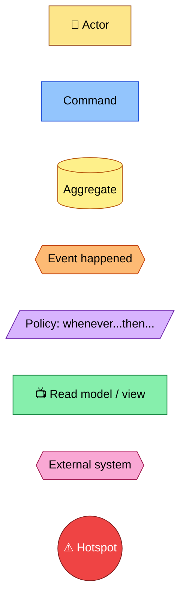
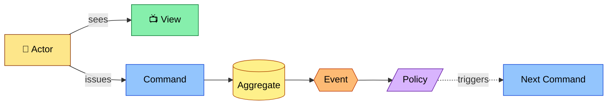
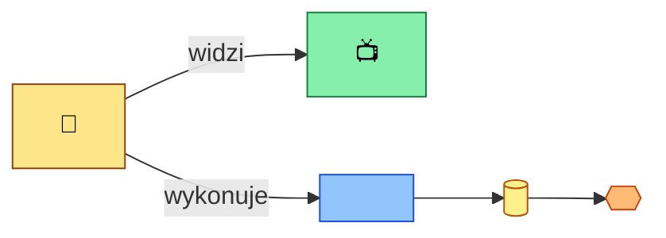
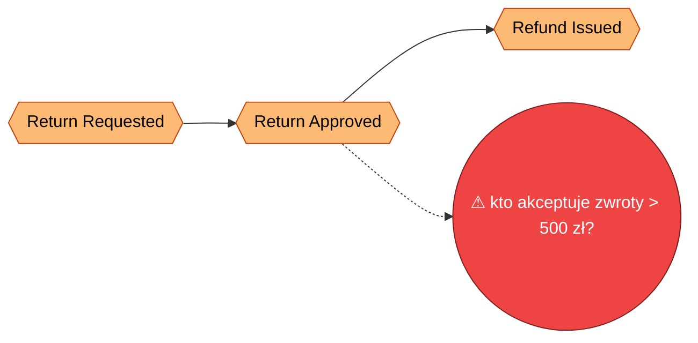
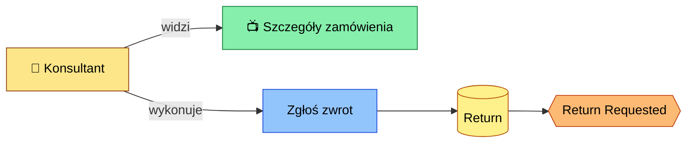
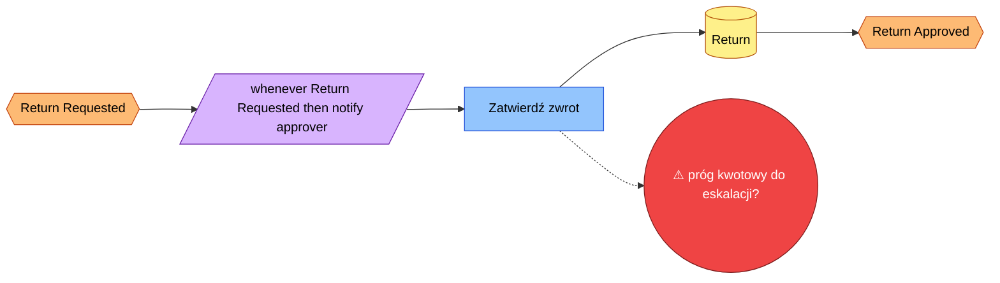
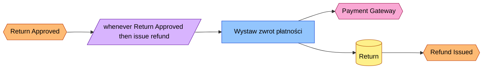

<!-- Generated by SpecStory, Markdown v2.1.0 -->

# 2026-09-01 09:17:44Z

<!-- VS Code Copilot IDE Session 61948502-a439-47dc-ae8b-a1a97f4b5db9 (2026-09-01 09:17:44Z) -->

_**User (2026-09-01 09:17:44Z)**_

create skill for event storming:
- load exiting map or create new one
- use small mermaid diagrams + top level connecting diagams
- interactive - ask for role/actor, end goal 
- iterate - what user needs to see (views), what data (aggregates) are involved, what actions user can take (commands), any rules (policies), what aggregates/views are updated, what domain (events) should be published.

Iterate, update diagrams in file, until user stops.

note down open questions, hotspots, inconsitencies as list below

---

_**Agent (copilot/claude-sonnet-5)**_

<tool-use data-tool-type="read" data-tool-name="read_file"><details>
<summary>Tool use: **read_file**</summary>

Read skill `agent-customization`

**Input:**

- endLine: `400`
- filePath: `c:\Program Files\Microsoft VS Code\e4c7e7b1d6\resources\app\extensions\copilot\assets\prompts\skills\agent-customization\SKILL.md`
- startLine: `1`

**Result:**

```
---
name: agent-customization
user-invocable: false # don't show as slash command, we have sepcialized create-agent, create-instructions, create-hook prompts for that
description: '**WORKFLOW SKILL** — Create, update, review, fix, or debug VS Code agent customization files (.instructions.md, .prompt.md, .agent.md, SKILL.md, copilot-instructions.md, AGENTS.md). USE FOR: saving coding preferences; troubleshooting why instructions/skills/agents are ignored or not invoked; configuring applyTo patterns; defining tool restrictions; creating custom agent modes or specialized workflows; packaging domain knowledge; fixing YAML frontmatter syntax. DO NOT USE FOR: general coding questions (use default agent); runtime debugging or error diagnosis; MCP server configuration (use MCP docs directly); VS Code extension development. INVOKES: file system tools (read/write customization files), ask-questions tool (interview user for requirements), subagents for codebase exploration. FOR SINGLE OPERATIONS: For quick YAML frontmatter fixes or creating a single file from a known pattern, edit the file directly — no skill needed.'
---

# Agent Customization

## Decision Flow

| Primitive | When to Use |
|-----------|-------------|
| agent instructions | Always-on, applies everywhere in the project |
| File Instructions | Explicit via `applyTo` patterns, or on-demand via `description` |
| MCP | Integrates external systems, APIs, or data |
| Hooks | Deterministic shell commands at agent lifecycle points (block tools, auto-format, inject context) |
| Custom Agents | Subagents for context isolation, or multi-stage workflows with tool restrictions |
| Prompts | Single focused task with parameterized inputs |
| Skills | On-demand workflow with bundled assets (scripts/templates) |

## Quick Reference

Consult the reference docs for templates, domain examples, advanced frontmatter options, asset organization, anti-patterns, and creation checklists. If the references are not enough, load the offici
… (output truncated)
```
</details></tool-use>

_**Agent (copilot/claude-sonnet-5)**_

<tool-use data-tool-type="read" data-tool-name="read_file"><details>
<summary>Tool use: **read_file**</summary>

Read skill `agent-customization`: `skills.md`

**Input:**

- endLine: `400`
- filePath: `c:\Program Files\Microsoft VS Code\e4c7e7b1d6\resources\app\extensions\copilot\assets\prompts\skills\agent-customization\references\skills.md`
- startLine: `1`

**Result:**

````
# [Agent Skills (SKILL.md)](https://code.visualstudio.com/docs/copilot/customization/agent-skills)

Folders of instructions, scripts, and resources that agents load on-demand for specialized tasks.

## Structure

```
.github/skills/<skill-name>/
├── SKILL.md           # Required (name must match folder)
├── scripts/           # Executable code
├── references/        # Docs loaded as needed
└── assets/            # Templates, boilerplate
```

## Locations

| Path | Scope |
|------|-------|
| `.github/skills/<name>/` | Project |
| `.agents/skills/<name>/` | Project |
| `.claude/skills/<name>/` | Project |
| `~/.copilot/skills/<name>/` | Personal |
| `~/.agents/skills/<name>/` | Personal |
| `~/.claude/skills/<name>/` | Personal |

## SKILL.md Format

```yaml
---
name: skill-name              # Required: 1-64 chars, lowercase alphanumeric + hyphens, must match folder
description: 'What and when to use. Max 1024 chars.'
argument-hint: 'Optional hint shown for slash invocation'
user-invocable: true          # Optional: show as slash command (default: true)
disable-model-invocation: false # Optional: disable automatic model-triggered loading
---
```

### Body

- What the skill accomplishes
- When to use (triggers and use cases)
- Step-by-step procedures
- References to resources: `[script](./scripts/test.js)`

## Template

```markdown
---
name: webapp-testing
description: 'Test web applications using Playwright. Use for verifying frontend, debugging UI, capturing screenshots.'
---

# Web Application Testing

## When to Use
- Verify frontend functionality
- Debug UI behavior

## Procedure
1. Start the web server
2. Run [test script](./scripts/test.js)
3. Review screenshots in `./screenshots/`
```

## Progressive Loading

1. **Discovery** (~100 tokens): Agent reads `name` and `description`
2. **Instructions** (<5000 tokens): Loads `SKILL.md` body when relevant
3. **Resources**: Additional files load only when referenced

Keep file references one level deep from `SKILL.md`.

… (output truncated)
````
</details></tool-use>

_**Agent (copilot/claude-sonnet-5)**_

<tool-use data-tool-type="generic" data-tool-name="list_dir"><details>
<summary>Tool use: **list_dir**</summary>

Read `skills`

**Input:**

- path: `c:\Projects\bottega-frontend-architecture-rossmann\.claude\skills`

**Result:**

```
adr-management/
frontend-architecture-analysis/
```
</details></tool-use>

_**Agent (copilot/claude-sonnet-5)**_

<tool-use data-tool-type="read" data-tool-name="read_file"><details>
<summary>Tool use: **read_file**</summary>

Read skill `adr-management`

**Input:**

- endLine: `400`
- filePath: `c:\Projects\bottega-frontend-architecture-rossmann\.claude\skills\adr-management\SKILL.md`
- startLine: `1`

**Result:**

```
---
name: adr-management
description: 'Create, update, review, summarize, and search Architecture Decision Records (ADR). Use when asked to write a new ADR, update an existing ADR, list/search/summarize ADRs, or check consistency between docs/adr/index.md and the ADR files. Trigger phrases: nowy ADR, dodaj ADR, zaktualizuj ADR, przeglądaj ADR, podsumuj ADR, szukaj ADR, spójność indeksu ADR, architecture decision record.'
---

# ADR Management

Manages Architecture Decision Records under `docs/adr/` — creating, updating, reviewing/summarizing, searching, and keeping [index.md](../../../docs/adr/index.md) in sync with the actual ADR files.

## When to Use

- User wants a new ADR created for a decision.
- User wants an existing ADR updated (status transition, content revision).
- User wants ADRs listed, searched, or summarized.
- User wants to check/fix consistency between the index and the ADR files.

## Conventions

- Location: `docs/adr/`.
- Filenames: `NNNN-kebab-case-title.md` — zero-padded 4-digit sequential number, ASCII only (no Polish diacritics, no spaces).
- Index: [index.md](../../../docs/adr/index.md), a single markdown table with columns `Nr | Tytuł | Status | Data`. Links must be real markdown links (`[text](./file.md)`) — never wrapped in backticks.
- Status values: `Proponowany`, `Zaakceptowany`, `Odrzucony`, `Zastąpiony przez ADR-NNNN`, `Wycofany`.
- Individual ADR sections (in order): `Status`, `Kontekst`, `Decyzja`, `Rozważane alternatywy`, `Konsekwencje`, `Powiązane`. See [adr-template.md](./assets/adr-template.md).
- One ADR = one decision. ADRs are immutable once `Zaakceptowany` — a changed decision becomes a new ADR that supersedes the old one, not an edit of the old one.
- See [example-adr.md](./assets/example-adr.md) for a fully filled-in illustrative ADR (generic content, not a real project decision).

## Procedures

### Create a new ADR

1. Read [index.md](../../../docs/adr/index.md) to find the next free number
… (output truncated)
```
</details></tool-use>

_**Agent (copilot/claude-sonnet-5)**_

<tool-use data-tool-type="generic" data-tool-name="list_dir"><details>
<summary>Tool use: **list_dir**</summary>

Read `frontend-architecture-analysis`

**Input:**

- path: `c:\Projects\bottega-frontend-architecture-rossmann\.claude\skills\frontend-architecture-analysis`

**Result:**

```
assets/
SKILL.md
```
</details></tool-use>

_**Agent (copilot/claude-sonnet-5)**_

<tool-use data-tool-type="read" data-tool-name="read_file"><details>
<summary>Tool use: **read_file**</summary>

Read `ARCHITECTURE.md`

**Input:**

- endLine: `120`
- filePath: `c:\Projects\bottega-frontend-architecture-rossmann\docs\ARCHITECTURE.md`
- startLine: `1`

**Result:**

```
# Project Architecture

> **Living document.** Aktualizowany na żywo w trakcie warsztatu, nie jest dokumentem końcowym.
> **Właściciel:** cały zespół warsztatowy (rotacyjnie, blok po bloku).
> **Stan na:**: 2026-09-01

# Kontekst biznesowy

Retail Operations Portal — system back-office do obsługi produktów, zamówień, oraz procesu promocji handlowej

# Drivery architektoniczne

| ID  | Driver                                                                              | Kategoria          | Źródło        |
| --- | ----------------------------------------------------------------------------------- | ------------------ | ------------- |
| D1  | Czas wdrożenia zmiany w regułach promocji musi spaść z ~3 tyg. do < 3 dni           | Time-to-market     | Product Owner |
| D2  | Zespoły Pricing i Catalog nie mogą wzajemnie blokować się przy wydaniu              | Autonomia zespołów | Tech Lead     |
| D3  | Częściowa awaria (np. serwis rekomendacji) nie może blokować całego ekranu promocji | Resilience         | Operacje      |
| D4  | Nowi dostawcy frontendu (zespół B2B) muszą móc dołączyć bez przepisywania shella    | Rozszerzalność     | Architekt     |

# Ownership map

| Krok procesu           | Domena | Zespół       | Pakiet |
| ---------------------- | ------ | ------------ | ------ |
| Wybór produktów        | _TBD_` | Catalog Team | _TBD_  |
| Reguły i ceny          | _TBD_  | Pricing Team | _TBD_  |
| Walidacja → akceptacja | _TBD_  | _TBD_        | _TBD_  |
| Aktywacja/publikacja   | _TBD_  | _TBD_        | _TBD_  |
| Raportowanie           | _TBD_  | _TBD_        | _TBD_  |

# Decyzje Architektoniczne (ADR)

- [Index decyzji architektonicznych](./docs/adr/index.md)
```
</details></tool-use>

_**Agent (copilot/claude-sonnet-5)**_

<tool-use data-tool-type="generic" data-tool-name="list_dir"><details>
<summary>Tool use: **list_dir**</summary>

Read `assets`

**Input:**

- path: `c:\Projects\bottega-frontend-architecture-rossmann\.claude\skills\adr-management\assets`

**Result:**

```
adr-template.md
example-adr.md
```
</details></tool-use>

_**Agent (copilot/claude-sonnet-5)**_

<tool-use data-tool-type="read" data-tool-name="read_file"><details>
<summary>Tool use: **read_file**</summary>

Read skill `adr-management`: `adr-template.md`

**Input:**

- endLine: `200`
- filePath: `c:\Projects\bottega-frontend-architecture-rossmann\.claude\skills\adr-management\assets\adr-template.md`
- startLine: `1`

**Result:**

```
# NNNN. <Tytuł decyzji>

## Status

Proponowany

## Kontekst

<!-- Jaki problem/driver architektoniczny wymusza tę decyzję?
     Odwołaj się do konkretnych driverów z ARCHITECTURE.md (np. D1, D2). -->

## Decyzja

<!-- Co dokładnie zostało/ma zostać zrobione. Jedno zdanie-teza + uzasadnienie. -->

## Rozważane alternatywy

<!-- Krótko: opcja A / opcja B / opcja C i dlaczego odrzucone. -->

## Konsekwencje

<!-- Pozytywne i negatywne skutki, kompromisy (trade-offs), co się staje trudniejsze. -->

## Powiązane

<!-- Linki do innych ADR, driverów, sekcji Ownership map. -->
```
</details></tool-use>

_**Agent (copilot/claude-sonnet-5)**_

<tool-use data-tool-type="write" data-tool-name="create_file"><details>
<summary>Tool use: **create_file**</summary>

Created `SKILL.md`

**Input:**

- content:

````
---
name: event-storming
description: 'Run an interactive Event Storming workshop and maintain its output as a living map of mermaid diagrams under docs/event-storming/. Use when asked to do event storming, map domain events, model a business process (actors, commands, aggregates, policies, views, domain events), or update/continue an existing event storming map. Trigger phrases: event storming, mapa zdarzeń domenowych, warsztat event storming, domain events mapping, big picture, zamodeluj proces biznesowy.'
---

# Event Storming

Runs an interactive Event Storming workshop with the user and persists the result as a living markdown document with mermaid diagrams under `docs/event-storming/`. One document = one business process/flow.

## When to Use

- User wants to event-storm / map a business process, feature, or flow.
- User wants to continue, update, or review an existing event storming map.
- User is defining domain events, aggregates, commands, policies, or read models for a process.

## Notation (Event Storming color legend)

Reuse this `classDef` block in every mermaid diagram in a map (see [legend.md](./assets/legend.md) for the full reference and node-shape conventions):

| Concept | Color | Meaning |
|---|---|---|
| Actor / Role | yellow (small) | Who triggers a command |
| Command | blue | An intent / action a user or system requests |
| Aggregate | mustard | Entity/cluster enforcing invariants, handles commands |
| Domain Event | orange | "X happened" — fact, past tense |
| Policy | lilac | Reactive rule: "whenever `<event>` then `<command>`" |
| Read Model / View | green | What the user sees on screen, derived from events |
| External System | pink | Third-party / other bounded context |
| Hotspot | red | Open question, conflict, or inconsistency |

## Conventions

- Location: `docs/event-storming/`.
- Filename: `<kebab-case-process-name>.md` (ASCII only, no diacritics — matches ADR filename convention).
- One file per business process/flow. A file contains: context header, one **Big Picture** overview diagram, one small mermaid diagram per step, and a trailing **Open Questions / Hotspots / Inconsistencies** list.
- Overview diagram nodes and per-step diagram event nodes share the same IDs (`E1`, `E2`, ...) so the big picture and the zoomed-in steps stay traceable to each other.
- Use [map-template.md](./assets/map-template.md) as the skeleton for a new map and [example-map.md](./assets/example-map.md) as an illustrative filled-in example (generic content, not a real project process).
- Never invent actors, rules, or events the user hasn't stated — per [CLAUDE.md](../../../CLAUDE.md), ask instead of guessing. Every step's questions must actually be asked with the ask-questions tool, not assumed.

## Procedure

### 1. Load or create the map

1. Ask the user (ask-questions tool) which process/flow to storm, unless already stated.
2. `grep_search`/`file_search` over `docs/event-storming/**` for a matching filename or heading.
   - **Found:** read the full file, summarize its current state back to the user (steps so far, last event reached, open hotspots) before continuing.
   - **Not found:** create `docs/event-storming/<slug>.md` from [map-template.md](./assets/map-template.md).

### 2. Capture context (new maps only, or if missing)

Ask the user for:
- **Role / actor** — who initiates this process.
- **End goal** — what business outcome the process should achieve.

Fill these into the map's `## Kontekst` section.

### 3. Iterate step by step

Repeat for each step until the user says to stop. For every step, ask each question below explicitly (ask-questions tool, one question at a time or grouped — do not assume answers):

1. **View** — what does the user need to see at this point (read model)?
2. **Aggregate(s)** — what data/entity is involved?
3. **Command(s)** — what action(s) can the user (or system) take?
4. **Policy / rules** — any automatic reaction ("whenever `<event>` then `<command>`") or business rule that constrains this step?
5. **State changes** — which aggregate(s)/view(s) get created or updated as a result?
6. **Domain event(s)** — what fact gets published once the command succeeds?

Then:

1. Add/update a `### Step N: <event name>` section with a small mermaid flowchart wiring Actor → View, Actor → Command → Aggregate → Event → Policy → next Command (only include the elements that actually apply to this step).
2. Add a bullet list under the diagram restating the answers to the 6 questions in prose.
3. Update the **Big Picture** overview diagram: append the new event node (`E<N>`) connected to the previous one.
4. If anything surfaced is ambiguous, contradicts an earlier step, has no clear owner, or the user is unsure — add a red `hotspot` node in the step diagram AND a bullet under **Open Questions / Hotspots / Inconsistencies** (reference the step).
5. Ask the user whether to continue to the next step or stop.

### 4. Stop and finalize

When the user stops:

1. Do a consistency pass: every event in the Big Picture has a matching `### Step` section; every command in a step diagram connects to an aggregate; every policy references the event that triggers it and the command it invokes.
2. Report any newly found inconsistencies by adding them to the Open Questions list (do not silently fix content decisions — only fix structural/diagram wiring).
3. Format the file:

```
npx prettier --write docs/event-storming/<changed-file>.md
```

````

- filePath: `c:\Projects\bottega-frontend-architecture-rossmann\.claude\skills\event-storming\SKILL.md`

**Result:**

```
The following files were successfully edited:
c:\Projects\bottega-frontend-architecture-rossmann\.claude\skills\event-storming\SKILL.md
```
</details></tool-use>

_**Agent (copilot/claude-sonnet-5)**_

<tool-use data-tool-type="write" data-tool-name="textEditGroup"><details>
<summary>Edit: **SKILL.md**</summary>

@@ lines 1-1 @@

````
---
name: event-storming
description: 'Run an interactive Event Storming workshop and maintain its output as a living map of mermaid diagrams under docs/event-storming/. Use when asked to do event storming, map domain events, model a business process (actors, commands, aggregates, policies, views, domain events), or update/continue an existing event storming map. Trigger phrases: event storming, mapa zdarzeń domenowych, warsztat event storming, domain events mapping, big picture, zamodeluj proces biznesowy.'
---

# Event Storming

Runs an interactive Event Storming workshop with the user and persists the result as a living markdown document with mermaid diagrams under `docs/event-storming/`. One document = one business process/flow.

## When to Use

- User wants to event-storm / map a business process, feature, or flow.
- User wants to continue, update, or review an existing event storming map.
- User is defining domain events, aggregates, commands, policies, or read models for a process.

## Notation (Event Storming color legend)

Reuse this `classDef` block in every mermaid diagram in a map (see [legend.md](./assets/legend.md) for the full reference and node-shape conventions):

| Concept | Color | Meaning |
|---|---|---|
| Actor / Role | yellow (small) | Who triggers a command |
| Command | blue | An intent / action a user or system requests |
| Aggregate | mustard | Entity/cluster enforcing invariants, handles commands |
| Domain Event | orange | "X happened" — fact, past tense |
| Policy | lilac | Reactive rule: "whenever `<event>` then `<command>`" |
| Read Model / View | green | What the user sees on screen, derived from events |
| External System | pink | Third-party / other bounded context |
| Hotspot | red | Open question, conflict, or inconsistency |

## Conventions

- Location: `docs/event-storming/`.
- Filename: `<kebab-case-process-name>.md` (ASCII only, no diacritics — matches ADR filename convention).
- One file per business process/flow. A file contains: context header, one **Big Picture** overview diagram, one small mermaid diagram per step, and a trailing **Open Questions / Hotspots / Inconsistencies** list.
- Overview diagram nodes and per-step diagram event nodes share the same IDs (`E1`, `E2`, ...) so the big picture and the zoomed-in steps stay traceable to each other.
- Use [map-template.md](./assets/map-template.md) as the skeleton for a new map and [example-map.md](./assets/example-map.md) as an illustrative filled-in example (generic content, not a real project process).
- Never invent actors, rules, or events the user hasn't stated — per [CLAUDE.md](../../../CLAUDE.md), ask instead of guessing. Every step's questions must actually be asked with the ask-questions tool, not assumed.

## Procedure

### 1. Load or create the map

1. Ask the user (ask-questions tool) which process/flow to storm, unless already stated.
2. `grep_search`/`file_search` over `docs/event-storming/**` for a matching filename or heading.
   - **Found:** read the full file, summarize its current state back to the user (steps so far, last event reached, open hotspots) before continuing.
   - **Not found:** create `docs/event-storming/<slug>.md` from [map-template.md](./assets/map-template.md).

### 2. Capture context (new maps only, or if missing)

Ask the user for:
- **Role / actor** — who initiates this process.
- **End goal** — what business outcome the process should achieve.

Fill these into the map's `## Kontekst` section.

### 3. Iterate step by step

Repeat for each step until the user says to stop. For every step, ask each question below explicitly (ask-questions tool, one question at a time or grouped — do not assume answers):

1. **View** — what does the user need to see at this point (read model)?
2. **Aggregate(s)** — what data/entity is involved?
3. **Command(s)** — what action(s) can the user (or system) take?
4. **Policy / rules** — any automatic reaction ("whenever `<event>` then `<command>`") or business rule that constrains this step?
5. **State changes** — which aggregate(s)/view(s) get created or updated as a result?
6. **Domain event(s)** — what fact gets published once the command succeeds?

Then:

1. Add/update a `### Step N: <event name>` section with a small mermaid flowchart wiring Actor → View, Actor → Command → Aggregate → Event → Policy → next Command (only include the elements that actually apply to this step).
2. Add a bullet list under the diagram restating the answers to the 6 questions in prose.
3. Update the **Big Picture** overview diagram: append the new event node (`E<N>`) connected to the previous one.
4. If anything surfaced is ambiguous, contradicts an earlier step, has no clear owner, or the user is unsure — add a red `hotspot` node in the step diagram AND a bullet under **Open Questions / Hotspots / Inconsistencies** (reference the step).
5. Ask the user whether to continue to the next step or stop.

### 4. Stop and finalize

When the user stops:

1. Do a consistency pass: every event in the Big Picture has a matching `### Step` section; every command in a step diagram connects to an aggregate; every policy references the event that triggers it and the command it invokes.
2. Report any newly found inconsistencies by adding them to the Open Questions list (do not silently fix content decisions — only fix structural/diagram wiring).
3. Format the file:

```
npx prettier --write docs/event-storming/<changed-file>.md
```

````
</details></tool-use>

_**Agent (copilot/claude-sonnet-5)**_

<tool-use data-tool-type="write" data-tool-name="create_file"><details>
<summary>Tool use: **create_file**</summary>

Created `legend.md`

**Input:**

- content:

````
# Event Storming Notation

Standard Event Storming sticky-note colors, mapped to mermaid node shapes/classes. Paste the `classDef` block at the top of every diagram that uses these concepts; only declare the classes actually used in that diagram.



## Node shape conventions

| Concept | Shape | Example |
|---|---|---|
| Actor | rectangle, 🧑 prefix | `Actor[🧑 Customer]:::actor` |
| Command | rectangle, imperative verb | `Cmd[Place Order]:::command` |
| Aggregate | rounded/cylinder, noun | `Agg[(Order)]:::aggregate` |
| Domain Event | hexagon, past tense | `Evt{{Order Placed}}:::event` |
| Policy | parallelogram, "whenever/then" | `Pol[/whenever Order Placed then Reserve Stock/]:::policy` |
| View / read model | rectangle, 📺 prefix | `View[📺 Order Summary]:::view` |
| External system | hexagon, name | `Ext{{Payment Gateway}}:::external` |
| Hotspot | circle, ⚠ prefix | `Hot((⚠ who owns retries?)):::hotspot` |

## Wiring pattern for a single step



Only include the branches (view/command/aggregate/event/policy) that actually apply to the step — don't force every step to have all of them.

````

- filePath: `c:\Projects\bottega-frontend-architecture-rossmann\.claude\skills\event-storming\assets\legend.md`

**Result:**

```
The following files were successfully edited:
c:\Projects\bottega-frontend-architecture-rossmann\.claude\skills\event-storming\assets\legend.md
```
</details></tool-use>

_**Agent (copilot/claude-sonnet-5)**_

<tool-use data-tool-type="write" data-tool-name="textEditGroup"><details>
<summary>Edit: **legend.md**</summary>

@@ lines 1-1 @@

````
# Event Storming Notation

Standard Event Storming sticky-note colors, mapped to mermaid node shapes/classes. Paste the `classDef` block at the top of every diagram that uses these concepts; only declare the classes actually used in that diagram.


## Node shape conventions

| Concept | Shape | Example |
|---|---|---|
| Actor | rectangle, 🧑 prefix | `Actor[🧑 Customer]:::actor` |
| Command | rectangle, imperative verb | `Cmd[Place Order]:::command` |
| Aggregate | rounded/cylinder, noun | `Agg[(Order)]:::aggregate` |
| Domain Event | hexagon, past tense | `Evt{{Order Placed}}:::event` |
| Policy | parallelogram, "whenever/then" | `Pol[/whenever Order Placed then Reserve Stock/]:::policy` |
| View / read model | rectangle, 📺 prefix | `View[📺 Order Summary]:::view` |
| External system | hexagon, name | `Ext{{Payment Gateway}}:::external` |
| Hotspot | circle, ⚠ prefix | `Hot((⚠ who owns retries?)):::hotspot` |

## Wiring pattern for a single step


Only include the branches (view/command/aggregate/event/policy) that actually apply to the step — don't force every step to have all of them.

````
</details></tool-use>

_**Agent (copilot/claude-sonnet-5)**_

Now the template and example files: 

_**Agent (copilot/claude-sonnet-5)**_

<tool-use data-tool-type="write" data-tool-name="create_file"><details>
<summary>Tool use: **create_file**</summary>

Created `map-template.md`

**Input:**

- content:

````
# Event Storming: <Nazwa procesu>

## Kontekst

- **Rola / aktor:** <kto inicjuje proces>
- **Cel końcowy (end goal):** <jaki rezultat biznesowy proces ma osiągnąć>
- **Status:** in-progress
- **Data:** <YYYY-MM-DD>

## Big Picture

<!-- Diagram wysokopoziomowy: łańcuch zdarzeń domenowych (E1, E2, ...) w kolejności czasowej.
     Aktualizuj po każdym kroku - dodaj nowy węzeł zdarzenia i połącz go z poprzednim. -->


## Kroki

<!-- Jeden ### Step per zdarzenie/decyzja. Skopiuj blok poniżej dla każdego nowego kroku. -->

### Step 1: <nazwa kroku / zdarzenia>



- **Widok (view):** <co użytkownik widzi>
- **Agregat(y):** <jakie dane/encje>
- **Komenda(y):** <jakie akcje>
- **Reguły / polityki:** <whenever ... then ...>
- **Zmiany stanu:** <jakie agregaty/widoki są aktualizowane>
- **Zdarzenie(a) domenowe:** <co zostało opublikowane>

## Open Questions / Hotspots / Inconsistencies

<!-- Lista otwartych pytań, hotspotów i niespójności napotkanych podczas warsztatu.
     Każdy wpis odnosi się do kroku, w którym się pojawił. -->

- [ ] <pytanie/hotspot> — krok: Step 1

````

- filePath: `c:\Projects\bottega-frontend-architecture-rossmann\.claude\skills\event-storming\assets\map-template.md`

**Result:**

```
The following files were successfully edited:
c:\Projects\bottega-frontend-architecture-rossmann\.claude\skills\event-storming\assets\map-template.md
```
</details></tool-use>

_**Agent (copilot/claude-sonnet-5)**_

<tool-use data-tool-type="write" data-tool-name="create_file"><details>
<summary>Tool use: **create_file**</summary>

Created `example-map.md`

**Input:**

- content:

````
# Event Storming: Zwrot towaru przez klienta (przykład ilustracyjny)

> Przykład generyczny — nie odzwierciedla rzeczywistego procesu w projekcie. Służy jako wzór formatu.

## Kontekst

- **Rola / aktor:** Klient (przez konsultanta obsługi w portalu)
- **Cel końcowy (end goal):** Klient odzyskuje zwrot pieniędzy za wadliwy produkt, a stan magazynowy jest poprawiony
- **Status:** in-progress
- **Data:** 2026-09-01

## Big Picture



## Kroki

### Step 1: Return Requested



- **Widok (view):** Szczegóły zamówienia z listą pozycji kwalifikujących się do zwrotu.
- **Agregat(y):** `Return` (nowy, powiązany z `Order`).
- **Komenda(y):** `Zgłoś zwrot` (RequestReturn).
- **Reguły / polityki:** brak na tym etapie.
- **Zmiany stanu:** utworzony nowy agregat `Return` w statusie `Requested`.
- **Zdarzenie(a) domenowe:** `Return Requested`.

### Step 2: Return Approved



- **Widok (view):** Kolejka zwrotów oczekujących na zatwierdzenie.
- **Agregat(y):** `Return`.
- **Komenda(y):** `Zatwierdź zwrot` (ApproveReturn).
- **Reguły / polityki:** whenever `Return Requested` then powiadom osobę zatwierdzającą.
- **Zmiany stanu:** `Return` przechodzi w status `Approved`.
- **Zdarzenie(a) domenowe:** `Return Approved`.

### Step 3: Refund Issued



- **Widok (view):** Historia płatności zamówienia (potwierdzenie zwrotu środków).
- **Agregat(y):** `Return`.
- **Komenda(y):** `Wystaw zwrot płatności` (IssueRefund), wywołanie zewnętrznego `Payment Gateway`.
- **Reguły / polityki:** whenever `Return Approved` then wystaw zwrot automatycznie.
- **Zmiany stanu:** `Return` przechodzi w status `Refunded`.
- **Zdarzenie(a) domenowe:** `Refund Issued`.

## Open Questions / Hotspots / Inconsistencies

- [ ] Kto zatwierdza zwroty powyżej 500 zł — konsultant czy manager? — krok: Step 2
- [ ] Czy `Refund Issued` powinno też aktualizować stan magazynowy, czy to osobny proces (`Restock`)? — krok: Step 3

````

- filePath: `c:\Projects\bottega-frontend-architecture-rossmann\.claude\skills\event-storming\assets\example-map.md`

**Result:**

```
The following files were successfully edited:
c:\Projects\bottega-frontend-architecture-rossmann\.claude\skills\event-storming\assets\example-map.md
```
</details></tool-use>

_**Agent (copilot/claude-sonnet-5)**_

<tool-use data-tool-type="write" data-tool-name="textEditGroup"><details>
<summary>Edit: **map-template.md**</summary>

@@ lines 1-1 @@

````
# Event Storming: <Nazwa procesu>

## Kontekst

- **Rola / aktor:** <kto inicjuje proces>
- **Cel końcowy (end goal):** <jaki rezultat biznesowy proces ma osiągnąć>
- **Status:** in-progress
- **Data:** <YYYY-MM-DD>

## Big Picture

<!-- Diagram wysokopoziomowy: łańcuch zdarzeń domenowych (E1, E2, ...) w kolejności czasowej.
     Aktualizuj po każdym kroku - dodaj nowy węzeł zdarzenia i połącz go z poprzednim. -->


## Kroki

<!-- Jeden ### Step per zdarzenie/decyzja. Skopiuj blok poniżej dla każdego nowego kroku. -->

### Step 1: <nazwa kroku / zdarzenia>


- **Widok (view):** <co użytkownik widzi>
- **Agregat(y):** <jakie dane/encje>
- **Komenda(y):** <jakie akcje>
- **Reguły / polityki:** <whenever ... then ...>
- **Zmiany stanu:** <jakie agregaty/widoki są aktualizowane>
- **Zdarzenie(a) domenowe:** <co zostało opublikowane>

## Open Questions / Hotspots / Inconsistencies

<!-- Lista otwartych pytań, hotspotów i niespójności napotkanych podczas warsztatu.
     Każdy wpis odnosi się do kroku, w którym się pojawił. -->

- [ ] <pytanie/hotspot> — krok: Step 1

````
</details></tool-use>

_**Agent (copilot/claude-sonnet-5)**_

<tool-use data-tool-type="write" data-tool-name="textEditGroup"><details>
<summary>Edit: **example-map.md**</summary>

@@ lines 1-1 @@

````
# Event Storming: Zwrot towaru przez klienta (przykład ilustracyjny)

> Przykład generyczny — nie odzwierciedla rzeczywistego procesu w projekcie. Służy jako wzór formatu.

## Kontekst

- **Rola / aktor:** Klient (przez konsultanta obsługi w portalu)
- **Cel końcowy (end goal):** Klient odzyskuje zwrot pieniędzy za wadliwy produkt, a stan magazynowy jest poprawiony
- **Status:** in-progress
- **Data:** 2026-09-01

## Big Picture


## Kroki

### Step 1: Return Requested


- **Widok (view):** Szczegóły zamówienia z listą pozycji kwalifikujących się do zwrotu.
- **Agregat(y):** `Return` (nowy, powiązany z `Order`).
- **Komenda(y):** `Zgłoś zwrot` (RequestReturn).
- **Reguły / polityki:** brak na tym etapie.
- **Zmiany stanu:** utworzony nowy agregat `Return` w statusie `Requested`.
- **Zdarzenie(a) domenowe:** `Return Requested`.

### Step 2: Return Approved


- **Widok (view):** Kolejka zwrotów oczekujących na zatwierdzenie.
- **Agregat(y):** `Return`.
- **Komenda(y):** `Zatwierdź zwrot` (ApproveReturn).
- **Reguły / polityki:** whenever `Return Requested` then powiadom osobę zatwierdzającą.
- **Zmiany stanu:** `Return` przechodzi w status `Approved`.
- **Zdarzenie(a) domenowe:** `Return Approved`.

### Step 3: Refund Issued


- **Widok (view):** Historia płatności zamówienia (potwierdzenie zwrotu środków).
- **Agregat(y):** `Return`.
- **Komenda(y):** `Wystaw zwrot płatności` (IssueRefund), wywołanie zewnętrznego `Payment Gateway`.
- **Reguły / polityki:** whenever `Return Approved` then wystaw zwrot automatycznie.
- **Zmiany stanu:** `Return` przechodzi w status `Refunded`.
- **Zdarzenie(a) domenowe:** `Refund Issued`.

## Open Questions / Hotspots / Inconsistencies

- [ ] Kto zatwierdza zwroty powyżej 500 zł — konsultant czy manager? — krok: Step 2
- [ ] Czy `Refund Issued` powinno też aktualizować stan magazynowy, czy to osobny proces (`Restock`)? — krok: Step 3

````
</details></tool-use>

_**Agent (copilot/claude-sonnet-5)**_

Created the 

_**Agent (copilot/claude-sonnet-5)**_

<tool-use data-tool-type="task" data-tool-name="manage_todo_list"><details>
<summary>Tool use: **manage_todo_list**</summary>

Created 5 todos
</details></tool-use>

_**Agent (copilot/claude-sonnet-5)**_

`event-storming` skill at `.claude/skills/event-storming/SKILL.md`, with two supporting assets:

- `.claude/skills/event-storming/assets/legend.md` — mermaid `classDef` color/shape legend (actor, command, aggregate, event, policy, view, external system, hotspot).
- `.claude/skills/event-storming/assets/map-template.md` — blank skeleton for a new map (context, Big Picture, per-step section, open questions list).
- `.claude/skills/event-storming/assets/example-map.md` — a generic filled-in illustration (return/refund flow) showing the expected end state.

Key behavior encoded in the skill:
- Loads an existing map from `docs/event-storming/<slug>.md` (searched by name) or creates a new one from the template.
- Asks for role/actor and end goal up front.
- Iterates step by step, explicitly asking (via ask-questions) about views, aggregates, commands, policies, state changes, and domain events for each step — never guessing.
- Updates both the small per-step mermaid diagram and the top-level Big Picture diagram (shared event node IDs keep them traceable).
- Tracks hotspots/inconsistencies/open questions as a running list at the bottom of the file, referenced by step.
- Loops until the user says stop, then does a consistency pass and formats with Prettier (matching the ADR skill's convention).

---

_**User (2026-09-01 09:25:42Z)**_

make actor a circle, more different color then Aggergate

---

_**Agent (copilot/claude-sonnet-5)**_

<tool-use data-tool-type="read" data-tool-name="read_file"><details>
<summary>Tool use: **read_file**</summary>

Read skill `event-storming`: `legend.md`

**Input:**

- endLine: `60`
- filePath: `c:\Projects\bottega-frontend-architecture-rossmann\.claude\skills\event-storming\assets\legend.md`
- startLine: `1`

**Result:**

````
# Event Storming Notation

Standard Event Storming sticky-note colors, mapped to mermaid node shapes/classes. Paste the `classDef` block at the top of every diagram that uses these concepts; only declare the classes actually used in that diagram.


## Node shape conventions

| Concept | Shape | Example |
|---|---|---|
| Actor | rectangle, 🧑 prefix | `Actor[🧑 Customer]:::actor` |
| Command | rectangle, imperative verb | `Cmd[Place Order]:::command` |
| Aggregate | rounded/cylinder, noun | `Agg[(Order)]:::aggregate` |
| Domain Event | hexagon, past tense | `Evt{{Order Placed}}:::event` |
| Policy | parallelogram, "whenever/then" | `Pol[/whenever Order Placed then Reserve Stock/]:::policy` |
| View / read model | rectangle, 📺 prefix | `View[📺 Order Summary]:::view` |
| External system | hexagon, name | `Ext{{Payment Gateway}}:::external` |
| Hotspot | circle, ⚠ prefix | `Hot((⚠ who owns retries?)):::hotspot` |

## Wiring pattern for a single step

```mermaid
flowchart LR
  classDef actor fill:#fde68a,stroke:#92400e,color:#000
  classDef command fill:#93c5fd,stroke:#1d4ed8,color:#000
  classDef aggregate fill:#fef08a,stroke:#b45309,color:#000
  classDef event fill:#fdba74,stroke:#c2410c,color:#
… (output truncated)
````
</details></tool-use>

_**Agent (copilot/claude-sonnet-5)**_

<tool-use data-tool-type="read" data-tool-name="read_file"><details>
<summary>Tool use: **read_file**</summary>

Read skill `event-storming`: `map-template.md`

**Input:**

- endLine: `60`
- filePath: `c:\Projects\bottega-frontend-architecture-rossmann\.claude\skills\event-storming\assets\map-template.md`
- startLine: `1`

**Result:**

````
# Event Storming: <Nazwa procesu>

## Kontekst

- **Rola / aktor:** <kto inicjuje proces>
- **Cel końcowy (end goal):** <jaki rezultat biznesowy proces ma osiągnąć>
- **Status:** in-progress
- **Data:** <YYYY-MM-DD>

## Big Picture

<!-- Diagram wysokopoziomowy: łańcuch zdarzeń domenowych (E1, E2, ...) w kolejności czasowej.
     Aktualizuj po każdym kroku - dodaj nowy węzeł zdarzenia i połącz go z poprzednim. -->

```mermaid
flowchart LR
  classDef event fill:#fdba74,stroke:#c2410c,color:#000
  classDef hotspot fill:#ef4444,stroke:#7f1d1d,color:#fff

  E1{{"<Zdarzenie 1>"}}:::event
```

## Kroki

<!-- Jeden ### Step per zdarzenie/decyzja. Skopiuj blok poniżej dla każdego nowego kroku. -->

### Step 1: <nazwa kroku / zdarzenia>


- **Widok (view):** <co użytkownik widzi>
- **Agregat(y):** <jakie dane/encje>
- **Komenda(y):** <jakie akcje>
- **Reguły / polityki:** <whenever ... then ...>
- **Zmiany stanu:** <jakie agregaty/widoki są aktualizowane>
- **Zdarzenie(a) domenowe:** <co zostało opublikowane>

## Open Questions / Hotspots / Inconsistencies

<!-- Lista otwartych pytań, hotspotów i niespójności napotkanych podczas warsztatu.
     Każdy wpis odnosi się do kroku, w którym się pojawił. -->

- [ ] <pytanie/hotspot> — krok: Step 1
````
</details></tool-use>

_**Agent (copilot/claude-sonnet-5)**_

<tool-use data-tool-type="read" data-tool-name="read_file"><details>
<summary>Tool use: **read_file**</summary>

Read skill `event-storming`: `example-map.md`, lines 1 to 100

**Input:**

- endLine: `100`
- filePath: `c:\Projects\bottega-frontend-architecture-rossmann\.claude\skills\event-storming\assets\example-map.md`
- startLine: `1`

**Result:**

````
# Event Storming: Zwrot towaru przez klienta (przykład ilustracyjny)

> Przykład generyczny — nie odzwierciedla rzeczywistego procesu w projekcie. Służy jako wzór formatu.

## Kontekst

- **Rola / aktor:** Klient (przez konsultanta obsługi w portalu)
- **Cel końcowy (end goal):** Klient odzyskuje zwrot pieniędzy za wadliwy produkt, a stan magazynowy jest poprawiony
- **Status:** in-progress
- **Data:** 2026-09-01

## Big Picture


## Kroki

### Step 1: Return Requested

```mermaid
flowchart LR
  classDef actor fill:#fde68a,stroke:#92400e,color:#000
  classDef command fill:#93c5fd,stroke:#1d4ed8,color:#000
  classDef aggregate fill:#fef08a,stroke:#b45309,color:#000
  classDef event fill:#fdba74,stroke:#c2410c,color:#000
  classDef view fill:#86efac,stroke:#15803d,color:#000

  Actor[🧑 Konsultant]:::actor -->|widzi| View1[📺 Szczegóły zamówienia]:::view
  Actor -->|wykonuje| Cmd1[Zgłoś zwrot]:::command
  Cmd1 --> Agg1[(Return)]:::aggregate
  Agg1 --> E1{{"Return Requested"}}:::event
```

- **Widok (view):** Szczegóły zamówienia z listą pozycji kwalifikujących się do zwrotu.
- **Agregat(y):** `Return` (nowy, powiązany z `Order`).
- **Komenda(y):** `Zgłoś zwrot` (RequestReturn).
- **Reguły / polityki:** brak na tym etapie.
- **Zmiany stanu:** utworzony nowy agregat `Return` w statusie `Requested`.
- **Zdarzenie(a) domenowe:** `Return Requested`.

### Step 2: Return Approved

```mermaid
flowchart LR
  classDef actor fill:#fde68a,stroke:#92400e,color:#000
  classDef command fill:#93c5fd,stroke:#1d4ed8,color:#000
  classDef aggregate fill:#fef08a,stroke:#b45309,color:#000
  classDef event fill:#fdba74,stroke:#c2410c,col
… (output truncated)
````
</details></tool-use>

_**Agent (copilot/claude-sonnet-5)**_

<tool-use data-tool-type="read" data-tool-name="read_file"><details>
<summary>Tool use: **read_file**</summary>

Read skill `event-storming`, lines 1 to 40

**Input:**

- endLine: `40`
- filePath: `c:\Projects\bottega-frontend-architecture-rossmann\.claude\skills\event-storming\SKILL.md`
- startLine: `1`

**Result:**

```
---
name: event-storming
description: 'Run an interactive Event Storming workshop and maintain its output as a living map of mermaid diagrams under docs/event-storming/. Use when asked to do event storming, map domain events, model a business process (actors, commands, aggregates, policies, views, domain events), or update/continue an existing event storming map. Trigger phrases: event storming, mapa zdarzeń domenowych, warsztat event storming, domain events mapping, big picture, zamodeluj proces biznesowy.'
---

# Event Storming

Runs an interactive Event Storming workshop with the user and persists the result as a living markdown document with mermaid diagrams under `docs/event-storming/`. One document = one business process/flow.

## When to Use

- User wants to event-storm / map a business process, feature, or flow.
- User wants to continue, update, or review an existing event storming map.
- User is defining domain events, aggregates, commands, policies, or read models for a process.

## Notation (Event Storming color legend)

Reuse this `classDef` block in every mermaid diagram in a map (see [legend.md](./assets/legend.md) for the full reference and node-shape conventions):

| Concept | Color | Meaning |
|---|---|---|
| Actor / Role | yellow (small) | Who triggers a command |
| Command | blue | An intent / action a user or system requests |
| Aggregate | mustard | Entity/cluster enforcing invariants, handles commands |
| Domain Event | orange | "X happened" — fact, past tense |
| Policy | lilac | Reactive rule: "whenever `<event>` then `<command>`" |
| Read Model / View | green | What the user sees on screen, derived from events |
| External System | pink | Third-party / other bounded context |
| Hotspot | red | Open question, conflict, or inconsistency |

## Conventions

- Location: `docs/event-storming/`.
- Filename: `<kebab-case-process-name>.md` (ASCII only, no diacritics — matches ADR filename convention).
- One file per 
… (output truncated)
```
</details></tool-use>

_**Agent (copilot/claude-sonnet-5)**_

<tool-use data-tool-type="write" data-tool-name="textEditGroup"><details>
<summary>Edit: **legend.md**</summary>

@@ lines 43-50 @@

```
5eead4,stroke:#0f766e,color:#000
  classDef command fill:#93c5fd,stroke:#1d4ed8,color:#000
  classDef aggregate fill:#fef08a,stroke:#b45309,color:#000
  classDef event fill:#fdba74,stroke:#c2410c,color:#000
  classDef policy fill:#d8b4fe,stroke:#6b21a8,color:#000
  classDef view fill:#86efac,stroke:#15803d,color:#000

  Actor((🧑 Actor))
```

@@ lines 30-30 @@

```
circle, 🧑 prefix | `Actor((🧑 Customer))
```

@@ lines 7-16 @@

```
5eead4,stroke:#0f766e,color:#000
  classDef command fill:#93c5fd,stroke:#1d4ed8,color:#000
  classDef aggregate fill:#fef08a,stroke:#b45309,color:#000
  classDef event fill:#fdba74,stroke:#c2410c,color:#000
  classDef policy fill:#d8b4fe,stroke:#6b21a8,color:#000
  classDef view fill:#86efac,stroke:#15803d,color:#000
  classDef external fill:#f9a8d4,stroke:#9d174d,color:#000
  classDef hotspot fill:#ef4444,stroke:#7f1d1d,color:#fff

  Actor((🧑 Actor))
```
</details></tool-use>

_**Agent (copilot/claude-sonnet-5)**_


```

```


_**Agent (copilot/claude-sonnet-5)**_

<tool-use data-tool-type="write" data-tool-name="textEditGroup"><details>
<summary>Edit: **map-template.md**</summary>

@@ lines 31-38 @@

```
5eead4,stroke:#0f766e,color:#000
  classDef command fill:#93c5fd,stroke:#1d4ed8,color:#000
  classDef aggregate fill:#fef08a,stroke:#b45309,color:#000
  classDef event fill:#fdba74,stroke:#c2410c,color:#000
  classDef policy fill:#d8b4fe,stroke:#6b21a8,color:#000
  classDef view fill:#86efac,stroke:#15803d,color:#000

  Actor((🧑 <Aktor>))
```
</details></tool-use>

_**Agent (copilot/claude-sonnet-5)**_


```

```


_**Agent (copilot/claude-sonnet-5)**_

<tool-use data-tool-type="write" data-tool-name="textEditGroup"><details>
<summary>Edit: **example-map.md**</summary>

@@ lines 52-52 @@

```
5eead4,stroke:#0f766
```

@@ lines 29-35 @@

```
5eead4,stroke:#0f766e,color:#000
  classDef command fill:#93c5fd,stroke:#1d4ed8,color:#000
  classDef aggregate fill:#fef08a,stroke:#b45309,color:#000
  classDef event fill:#fdba74,stroke:#c2410c,color:#000
  classDef view fill:#86efac,stroke:#15803d,color:#000

  Actor((🧑 Konsultant))
```
</details></tool-use>

_**Agent (copilot/claude-sonnet-5)**_


```

```


_**Agent (copilot/claude-sonnet-5)**_

<tool-use data-tool-type="write" data-tool-name="textEditGroup"><details>
<summary>Edit: **SKILL.md**</summary>

@@ lines 22-22 @@

```
teal (circle
```
</details></tool-use>

_**Agent (copilot/claude-sonnet-5)**_

Updated actor nodes to a teal circle (`((🧑 ...)):::actor`, `fill:#5eead4,stroke:#0f766e`) — clearly distinct from aggregate's yellow — across `.claude/skills/event-storming/assets/legend.md`, `.claude/skills/event-storming/assets/map-template.md`, `.claude/skills/event-storming/assets/example-map.md`, and the notation table in `.claude/skills/event-storming/SKILL.md`.

_**Agent (copilot/claude-sonnet-5)**_

<tool-use data-tool-type="task" data-tool-name="manage_todo_list"><details>
<summary>Tool use: **manage_todo_list**</summary>

Created 6 todos
</details></tool-use>
