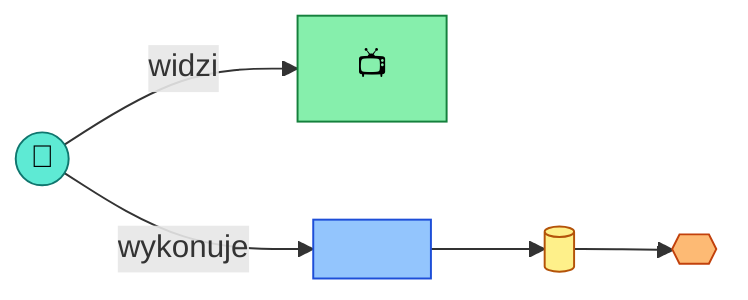
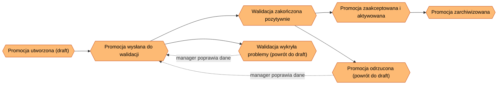
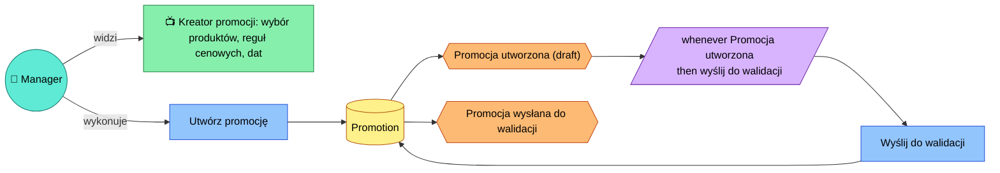
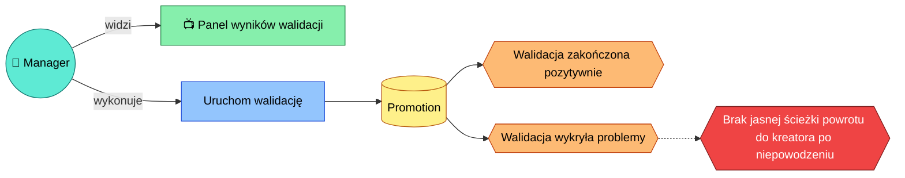
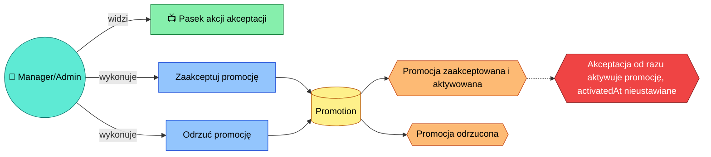

<!-- Generated by SpecStory, Markdown v2.1.0 -->

# 2026-09-01 09:29:29Z

<!-- VS Code Copilot IDE Session ec356f60-65fd-48af-aca3-3be60c33c239 (2026-09-01 09:29:29Z) -->

_**User (2026-09-01 09:29:29Z)**_

/event-storming  manager wants to create new promotion

---

_**Agent (copilot/claude-sonnet-5)**_

<tool-use data-tool-type="generic" data-tool-name="copilot_listDirectory"><details>
<summary>Tool use: **copilot_listDirectory**</summary>

Read `event-storming`
</details></tool-use>

_**Agent (copilot/claude-sonnet-5)**_

<tool-use data-tool-type="generic" data-tool-name="copilot_readFile"><details>
<summary>Tool use: **copilot_readFile**</summary>

Read skill `event-storming`: `map-template.md`
</details></tool-use>

_**Agent (copilot/claude-sonnet-5)**_

<tool-use data-tool-type="generic" data-tool-name="copilot_readFile"><details>
<summary>Tool use: **copilot_readFile**</summary>

Read skill `event-storming`: `example-map.md`
</details></tool-use>

_**Agent (copilot/claude-sonnet-5)**_

<tool-use data-tool-type="generic" data-tool-name="copilot_readFile"><details>
<summary>Tool use: **copilot_readFile**</summary>

Read skill `event-storming`: `legend.md`
</details></tool-use>

_**Agent (copilot/claude-sonnet-5)**_

No existing map found for "create new promotion" — this will be a new map. Following the skill, I need to gather context first: role/actor and end goal. 

_**Agent (copilot/claude-sonnet-5)**_

<tool-use data-tool-type="generic" data-tool-name="vscode_askQuestions"><details>
<summary>Tool use: **vscode_askQuestions**</summary>

Analyzing your answers...
</details></tool-use>

_**Agent (copilot/claude-sonnet-5)**_

Creating the new map file with the context filled in. 

_**Agent (copilot/claude-sonnet-5)**_

<tool-use data-tool-type="generic" data-tool-name="copilot_createFile"><details>
<summary>Tool use: **copilot_createFile**</summary>

Created `utworzenie-nowej-promocji.md`
</details></tool-use>

_**Agent (copilot/claude-sonnet-5)**_

<tool-use data-tool-type="write" data-tool-name="textEditGroup"><details>
<summary>Edit: **utworzenie-nowej-promocji.md**</summary>

@@ lines 1-1 @@

````
# Event Storming: Utworzenie nowej promocji

## Kontekst

- **Rola / aktor:** Manager
- **Cel końcowy (end goal):** Nowa promocja jest utworzona i czeka na zatwierdzenie
- **Status:** in-progress
- **Data:** 2026-09-01

## Big Picture

<!-- Diagram wysokopoziomowy: łańcuch zdarzeń domenowych (E1, E2, ...) w kolejności czasowej.
     Aktualizuj po każdym kroku - dodaj nowy węzeł zdarzenia i połącz go z poprzednim. -->


## Kroki

<!-- Jeden ### Step per zdarzenie/decyzja. Skopiuj blok poniżej dla każdego nowego kroku. -->

### Step 1: <nazwa kroku / zdarzenia>



- **Widok (view):** <co użytkownik widzi>
- **Agregat(y):** <jakie dane/encje>
- **Komenda(y):** <jakie akcje>
- **Reguły / polityki:** <whenever ... then ...>
- **Zmiany stanu:** <jakie agregaty/widoki są aktualizowane>
- **Zdarzenie(a) domenowe:** <co zostało opublikowane>

## Open Questions / Hotspots / Inconsistencies

<!-- Lista otwartych pytań, hotspotów i niespójności napotkanych podczas warsztatu.
     Każdy wpis odnosi się do kroku, w którym się pojawił. -->

- [ ] <pytanie/hotspot> — krok: Step 1

````
</details></tool-use>

_**Agent (copilot/claude-sonnet-5)**_

Now let's start Step 1 by asking the six questions explicitly. 

_**Agent (copilot/claude-sonnet-5)**_

<tool-use data-tool-type="generic" data-tool-name="vscode_askQuestions"><details>
<summary>Tool use: **vscode_askQuestions**</summary>

Asked 6 questions (Widok (View), Agregat, Komenda, Reguły / polityki, Zmiany stanu, Zdarzenie domenowe)
</details></tool-use>

---

_**User (2026-09-01 09:32:06Z)**_

try to infer existing flow

---

_**Agent (copilot/claude-sonnet-5)**_

<tool-use data-tool-type="task" data-tool-name="manage_todo_list"><details>
<summary>Tool use: **manage_todo_list**</summary>

Created 2 todos
</details></tool-use>

_**Agent (copilot/claude-sonnet-5)**_

<tool-use data-tool-type="read" data-tool-name="read_file"><details>
<summary>Tool use: **read_file**</summary>

Read skill `event-storming`

**Input:**

- endLine: `400`
- filePath: `c:\Projects\bottega-frontend-architecture-rossmann\.claude\skills\event-storming\SKILL.md`
- startLine: `1`

**Result:**

```
---
name: event-storming
description: 'Run an interactive Event Storming workshop and maintain its output as a living map of mermaid diagrams under docs/event-storming/. Use when asked to do event storming, map domain events, model a business process (actors, commands, aggregates, policies, views, domain events), or update/continue an existing event storming map. Trigger phrases: event storming, mapa zdarzeń domenowych, warsztat event storming, domain events mapping, big picture, zamodeluj proces biznesowy.'
---

# Event Storming

Runs an interactive Event Storming workshop with the user and persists the result as a living markdown document with mermaid diagrams under `docs/event-storming/`. One document = one business process/flow.

## When to Use

- User wants to event-storm / map a business process, feature, or flow.
- User wants to continue, update, or review an existing event storming map.
- User is defining domain events, aggregates, commands, policies, or read models for a process.

## Notation (Event Storming color legend)

Reuse this `classDef` block in every mermaid diagram in a map (see [legend.md](./assets/legend.md) for the full reference and node-shape conventions):

| Concept | Color | Meaning |
|---|---|---|
| Actor / Role | teal (circle) | Who triggers a command |
| Command | blue | An intent / action a user or system requests |
| Aggregate | mustard | Entity/cluster enforcing invariants, handles commands |
| Domain Event | orange | "X happened" — fact, past tense |
| Policy | lilac | Reactive rule: "whenever `<event>` then `<command>`" |
| Read Model / View | green | What the user sees on screen, derived from events |
| External System | pink | Third-party / other bounded context |
| Hotspot | red | Open question, conflict, or inconsistency |

## Conventions

- Location: `docs/event-storming/`.
- Filename: `<kebab-case-process-name>.md` (ASCII only, no diacritics — matches ADR filename convention).
- One file per b
… (output truncated)
```
</details></tool-use>

_**Agent (copilot/claude-sonnet-5)**_

<tool-use data-tool-type="read" data-tool-name="read_file"><details>
<summary>Tool use: **read_file**</summary>

Read skill `event-storming`: `map-template.md`

**Input:**

- endLine: `200`
- filePath: `c:\Projects\bottega-frontend-architecture-rossmann\.claude\skills\event-storming\assets\map-template.md`
- startLine: `1`

**Result:**

````
# Event Storming: <Nazwa procesu>

## Kontekst

- **Rola / aktor:** <kto inicjuje proces>
- **Cel końcowy (end goal):** <jaki rezultat biznesowy proces ma osiągnąć>
- **Status:** in-progress
- **Data:** <YYYY-MM-DD>

## Big Picture

<!-- Diagram wysokopoziomowy: łańcuch zdarzeń domenowych (E1, E2, ...) w kolejności czasowej.
     Aktualizuj po każdym kroku - dodaj nowy węzeł zdarzenia i połącz go z poprzednim. -->


## Kroki

<!-- Jeden ### Step per zdarzenie/decyzja. Skopiuj blok poniżej dla każdego nowego kroku. -->

### Step 1: <nazwa kroku / zdarzenia>


- **Widok (view):** <co użytkownik widzi>
- **Agregat(y):** <jakie dane/encje>
- **Komenda(y):** <jakie akcje>
- **Reguły / polityki:** <whenever ... then ...>
- **Zmiany stanu:** <jakie agregaty/widoki są aktualizowane>
- **Zdarzenie(a) domenowe:** <co zostało opublikowane>

## Open Questions / Hotspots / Inconsistencies

<!-- Lista otwartych pytań, hotspotów i niespójności napotkanych podczas warsztatu.
     Każdy wpis odnosi się do kroku, w którym się pojawił. -->

- [ ] <pytanie/hotspot> — krok: Step 1
````
</details></tool-use>

_**Agent (copilot/claude-sonnet-5)**_

<tool-use data-tool-type="read" data-tool-name="read_file"><details>
<summary>Tool use: **read_file**</summary>

Read `utworzenie-nowej-promocji.md`

**Input:**

- endLine: `400`
- filePath: `c:\Projects\bottega-frontend-architecture-rossmann\docs\event-storming\utworzenie-nowej-promocji.md`
- startLine: `1`

**Result:**

````
# Event Storming: Utworzenie nowej promocji

## Kontekst

- **Rola / aktor:** Manager
- **Cel końcowy (end goal):** Nowa promocja jest utworzona i czeka na zatwierdzenie
- **Status:** in-progress
- **Data:** 2026-09-01

## Big Picture

<!-- Diagram wysokopoziomowy: łańcuch zdarzeń domenowych (E1, E2, ...) w kolejności czasowej.
     Aktualizuj po każdym kroku - dodaj nowy węzeł zdarzenia i połącz go z poprzednim. -->


## Kroki

<!-- Jeden ### Step per zdarzenie/decyzja. Skopiuj blok poniżej dla każdego nowego kroku. -->

### Step 1: <nazwa kroku / zdarzenia>


- **Widok (view):** <co użytkownik widzi>
- **Agregat(y):** <jakie dane/encje>
- **Komenda(y):** <jakie akcje>
- **Reguły / polityki:** <whenever ... then ...>
- **Zmiany stanu:** <jakie agregaty/widoki są aktualizowane>
- **Zdarzenie(a) domenowe:** <co zostało opublikowane>

## Open Questions / Hotspots / Inconsistencies

<!-- Lista otwartych pytań, hotspotów i niespójności napotkanych podczas warsztatu.
     Każdy wpis odnosi się do kroku, w którym się pojawił. -->

- [ ] <pytanie/hotspot> — krok: Step 1
````
</details></tool-use>

_**Agent (copilot/claude-sonnet-5)**_

<tool-use data-tool-type="read" data-tool-name="read_file"><details>
<summary>Tool use: **read_file**</summary>

Read `promotions.ts`

**Input:**

- endLine: `200`
- filePath: `c:\Projects\bottega-frontend-architecture-rossmann\retail-operations-portal\src\api\promotions.ts`
- startLine: `1`

**Result:**

```
import promotionsRaw from "@/mock-data/promotions.json";
import type { Promotion } from "@/types";
import { delay } from "./delay";

const db = new Map<string, Promotion>(promotionsRaw.map((p) => [p.id, p as Promotion]));

export async function listPromotions(): Promise<Promotion[]> {
  await delay();
  return [...db.values()];
}

export async function getPromotion(id: string): Promise<Promotion | null> {
  await delay();
  return db.get(id) ?? null;
}

export async function createPromotion(
  draft: Omit<Promotion, "id" | "status">,
): Promise<Promotion> {
  await delay();
  const id = `promo-${db.size + 1}-${Date.now()}`;
  const next: Promotion = { ...draft, id, status: "draft" };
  db.set(id, next);
  return next;
}

export async function updatePromotion(id: string, patch: Partial<Promotion>): Promise<Promotion> {
  await delay();
  const current = db.get(id);
  if (!current) throw new Error(`Promotion ${id} not found`);
  const next = { ...current, ...patch };
  db.set(id, next);
  return next;
}

export async function selectProductsForPromotion(
  id: string,
  productIds: string[],
): Promise<Promotion> {
  return updatePromotion(id, { productIds });
}

export async function submitPromotionForValidation(id: string): Promise<Promotion> {
  return updatePromotion(id, { status: "pending_validation" });
}

// Naive rule-based check standing in for a real validation service.
export async function runValidation(id: string): Promise<Promotion> {
  await delay(500);
  const current = db.get(id);
  if (!current) throw new Error(`Promotion ${id} not found`);
  const issues: string[] = [];
  if (current.productIds.length === 0) issues.push("Brak wybranych produktów");
  if (current.pricingRuleIds.length === 0) issues.push("Brak reguły cenowej");
  const validation = { passed: issues.length === 0, issues, checkedAt: new Date().toISOString() };
  const next: Promotion = {
    ...current,
    validation,
    status:
… (output truncated)
```
</details></tool-use>

_**Agent (copilot/claude-sonnet-5)**_

<tool-use data-tool-type="search" data-tool-name="file_search"><details>
<summary>Tool use: **file_search**</summary>

Searched for files matching `**/Promotion*`, 7 matches

**Input:**

- query: `**/Promotion*`

**Result:**

```
7 total results
c:\Projects\bottega-frontend-architecture-rossmann\retail-operations-portal\src\store\promotionsSlice.ts
c:\Projects\bottega-frontend-architecture-rossmann\retail-operations-portal\src\pages\PromotionWizardPage.tsx
c:\Projects\bottega-frontend-architecture-rossmann\retail-operations-portal\src\pages\PromotionsPage.tsx
c:\Projects\bottega-frontend-architecture-rossmann\retail-operations-portal\src\pages\PromotionDetailsPage.tsx
c:\Projects\bottega-frontend-architecture-rossmann\retail-operations-portal\src\api\promotions.ts
c:\Projects\bottega-frontend-architecture-rossmann\retail-operations-portal\src\components\PromotionStatusTimeline.tsx
c:\Projects\bottega-frontend-architecture-rossmann\retail-operations-portal\src\mock-data\promotions.json
```
</details></tool-use>

_**Agent (copilot/claude-sonnet-5)**_

<tool-use data-tool-type="search" data-tool-name="grep_search"><details>
<summary>Tool use: **grep_search**</summary>

Searched for text `Promotion` (`**/retail-operations-portal/src/types.ts`), 3 results

**Input:**

- includePattern: `retail-operations-portal/src/types.ts`
- isRegexp: `false`
- query: `Promotion`

**Result:**

```
Found 3 matches in 1 file for "Promotion"

retail-operations-portal/src/types.ts
55:export type PromotionStatus =
68:export interface Promotion {
71:  status: PromotionStatus;
```
</details></tool-use>

_**Agent (copilot/claude-sonnet-5)**_

<tool-use data-tool-type="read" data-tool-name="read_file"><details>
<summary>Tool use: **read_file**</summary>

Read `PromotionDetailsPage.tsx`

**Input:**

- endLine: `400`
- filePath: `c:\Projects\bottega-frontend-architecture-rossmann\retail-operations-portal\src\pages\PromotionDetailsPage.tsx`
- startLine: `1`

**Result:**

```
import { useState } from "react";
import { useParams } from "react-router-dom";
import { toast } from "sonner";
import { Button } from "@/components/ui/button";
import { Card, CardContent, CardHeader, CardTitle } from "@/components/ui/card";
import { StatusBadge } from "@/components/StatusBadge";
import { PromotionStatusTimeline } from "@/components/PromotionStatusTimeline";
import { ValidationResultsPanel } from "@/components/ValidationResultsPanel";
import { ApprovalActionBar } from "@/components/ApprovalActionBar";
import { AuditTrailList } from "@/components/AuditTrailList";
import { AppErrorBoundary } from "@/components/AppErrorBoundary";
import {
  runValidation,
  approvePromotion,
  rejectPromotion,
  archivePromotion,
} from "@/api/promotions";
import { listAuditLog } from "@/api/auditLog";
import { setAuditLog } from "@/store/auditLogSlice";
import { upsertPromotion } from "@/store/promotionsSlice";
import { listPromotions } from "@/api/promotions";
import { setPromotions } from "@/store/promotionsSlice";
import { useAppDispatch, useAppSelector } from "@/store/hooks";
import { useLoadList } from "@/store/useLoadList";

export function PromotionDetailsPage() {
  const { id = "" } = useParams();
  const dispatch = useAppDispatch();
  useLoadList(useAppSelector((s) => s.promotions.loaded), listPromotions, setPromotions);
  const promotion = useAppSelector((s) => s.promotions.items.find((p) => p.id === id));

  const allAuditEntries = useAppSelector((s) => s.auditLog.items);
  const auditEntries = allAuditEntries.filter((a) => a.entityId === id);
  useLoadList(useAppSelector((s) => s.auditLog.loaded), listAuditLog, setAuditLog);

  const [running, setRunning] = useState(false);

  if (!promotion) return <p className="text-muted-foreground">Ładowanie...</p>;

  async function handleRunValidation() {
    setRunning(true);
    const updated = await runValidation(id);
    dispatch(upsertPromotion(updated));
    setRunning
… (output truncated)
```
</details></tool-use>

_**Agent (copilot/claude-sonnet-5)**_

<tool-use data-tool-type="read" data-tool-name="read_file"><details>
<summary>Tool use: **read_file**</summary>

Read `types.ts`, lines 40 to 90

**Input:**

- endLine: `90`
- filePath: `c:\Projects\bottega-frontend-architecture-rossmann\retail-operations-portal\src\types.ts`
- startLine: `40`

**Result:**

```
  productId: ID;
  location: string;
  quantity: number;
  reserved: number;
}

export interface PricingRule {
  id: ID;
  name: string;
  type: "percentage" | "fixed" | "bundle";
  value: number;
  categoryId?: ID;
  active: boolean;
}

export type PromotionStatus =
  | "draft"
  | "pending_validation"
  | "pending_approval"
  | "active"
  | "archived";

export interface ValidationResult {
  passed: boolean;
  issues: string[];
  checkedAt: string;
}

export interface Promotion {
  id: ID;
  name: string;
  status: PromotionStatus;
  productIds: ID[];
  pricingRuleIds: ID[];
  startDate: string;
  endDate: string;
  createdBy: string;
  validation?: ValidationResult;
  approvedBy?: string;
  activatedAt?: string;
}

export interface CustomerSegment {
  id: ID;
  name: string;
  description: string;
  criteria: string;
}

export type ReturnStatus = "requested" | "approved" | "rejected" | "refunded";
```
</details></tool-use>

_**Agent (copilot/claude-sonnet-5)**_

<tool-use data-tool-type="read" data-tool-name="read_file"><details>
<summary>Tool use: **read_file**</summary>

Read `PromotionStatusTimeline.tsx`

**Input:**

- endLine: `120`
- filePath: `c:\Projects\bottega-frontend-architecture-rossmann\retail-operations-portal\src\components\PromotionStatusTimeline.tsx`
- startLine: `1`

**Result:**

```
import type { Promotion, PromotionStatus } from "@/types";
import { cn } from "@/lib/utils";

const STEPS: { status: PromotionStatus; label: string }[] = [
  { status: "draft", label: "Szkic" },
  { status: "pending_validation", label: "Walidacja" },
  { status: "pending_approval", label: "Akceptacja" },
  { status: "active", label: "Aktywacja" },
];

// Visualizes where a promotion is in the wybór→reguły→walidacja→akceptacja→aktywacja process.
export function PromotionStatusTimeline({ promotion }: { promotion: Promotion }) {
  const archived = promotion.status === "archived";
  const currentIndex = archived
    ? STEPS.length - 1
    : STEPS.findIndex((s) => s.status === promotion.status);

  return (
    <div className="flex items-center gap-2">
      {STEPS.map((step, idx) => (
        <div key={step.status} className="flex flex-1 items-center gap-2">
          <div
            className={cn(
              "flex h-7 w-7 shrink-0 items-center justify-center rounded-full border text-xs font-medium",
              idx <= currentIndex
                ? "border-primary bg-primary text-primary-foreground"
                : "border-border bg-background text-muted-foreground",
            )}
          >
            {idx + 1}
          </div>
          <span className="text-xs text-muted-foreground">{step.label}</span>
          {idx < STEPS.length - 1 && <div className="h-px flex-1 bg-border" />}
        </div>
      ))}
      {archived && <span className="ml-2 text-xs text-muted-foreground">(zarchiwizowana)</span>}
    </div>
  );
}
```
</details></tool-use>

_**Agent (copilot/claude-sonnet-5)**_

<tool-use data-tool-type="search" data-tool-name="grep_search"><details>
<summary>Tool use: **grep_search**</summary>

Searched for regex `activatePromotion|deactivatePromotion|selectProductsForPromotion` (`**/retail-operations-portal/src/**`), 3 results

**Input:**

- includePattern: `retail-operations-portal/src/**`
- isRegexp: `true`
- query: `activatePromotion|deactivatePromotion|selectProductsForPromotion`

**Result:**

```
Found 3 matches in 1 file for "activatePromotion|deactivatePromotion|selectProductsForPromotion"

retail-operations-portal/src/api/promotions.ts
36:export async function selectProductsForPromotion(
73:export async function activatePromotion(id: string): Promise<Promotion> {
77:export async function deactivatePromotion(id: string): Promise<Promotion> {
```
</details></tool-use>

_**Agent (copilot/claude-sonnet-5)**_

<tool-use data-tool-type="read" data-tool-name="read_file"><details>
<summary>Tool use: **read_file**</summary>

Read `ApprovalActionBar.tsx`

**Input:**

- endLine: `60`
- filePath: `c:\Projects\bottega-frontend-architecture-rossmann\retail-operations-portal\src\components\ApprovalActionBar.tsx`
- startLine: `1`

**Result:**

```
import { Button } from "@/components/ui/button";
import { useAppSelector } from "@/store/hooks";

interface ApprovalActionBarProps {
  onApprove: () => void;
  onReject: () => void;
  disabled?: boolean;
}

// Role-gated: only admin/manager can approve or reject (Dzień 3 auth/permissions material).
export function ApprovalActionBar({ onApprove, onReject, disabled }: ApprovalActionBarProps) {
  const role = useAppSelector((s) => s.currentUser.role);
  const canDecide = role === "admin" || role === "manager";

  if (!canDecide) {
    return <p className="text-sm text-muted-foreground">Twoja rola nie pozwala na akceptację.</p>;
  }

  return (
    <div className="flex gap-2">
      <Button onClick={onApprove} disabled={disabled}>
        Zaakceptuj
      </Button>
      <Button variant="outline" onClick={onReject} disabled={disabled}>
        Odrzuć
      </Button>
    </div>
  );
}
```
</details></tool-use>

_**Agent (copilot/claude-sonnet-5)**_

<tool-use data-tool-type="read" data-tool-name="read_file"><details>
<summary>Tool use: **read_file**</summary>

Read `ValidationResultsPanel.tsx`

**Input:**

- endLine: `60`
- filePath: `c:\Projects\bottega-frontend-architecture-rossmann\retail-operations-portal\src\components\ValidationResultsPanel.tsx`
- startLine: `1`

**Result:**

```
import type { ValidationResult } from "@/types";
import { Alert, AlertDescription, AlertTitle } from "@/components/ui/alert";
import { Button } from "@/components/ui/button";

interface ValidationResultsPanelProps {
  validation?: ValidationResult;
  onRunValidation: () => void;
  running?: boolean;
}

export function ValidationResultsPanel({
  validation,
  onRunValidation,
  running,
}: ValidationResultsPanelProps) {
  return (
    <div className="space-y-3">
      <Button onClick={onRunValidation} disabled={running}>
        {running ? "Walidacja w toku..." : "Uruchom walidację"}
      </Button>
      {validation && (
        <Alert variant={validation.passed ? "default" : "destructive"}>
          <AlertTitle>
            {validation.passed ? "Walidacja zakończona pomyślnie" : "Walidacja wykryła problemy"}
          </AlertTitle>
          <AlertDescription>
            {validation.issues.length > 0 ? (
              <ul className="list-disc pl-4">
                {validation.issues.map((issue) => (
                  <li key={issue}>{issue}</li>
                ))}
              </ul>
            ) : (
              "Brak zastrzeżeń."
            )}
            <div className="mt-1 text-xs text-muted-foreground">
              Sprawdzono: {new Date(validation.checkedAt).toLocaleString("pl-PL")}
            </div>
          </AlertDescription>
        </Alert>
      )}
    </div>
  );
}
```
</details></tool-use>

_**Agent (copilot/claude-sonnet-5)**_

<tool-use data-tool-type="read" data-tool-name="read_file"><details>
<summary>Tool use: **read_file**</summary>

Read `auditLog.ts`

**Input:**

- endLine: `60`
- filePath: `c:\Projects\bottega-frontend-architecture-rossmann\retail-operations-portal\src\api\auditLog.ts`
- startLine: `1`

**Result:**

```
import auditLogRaw from "@/mock-data/auditLog.json";
import type { AuditLogEntry } from "@/types";
import { delay } from "./delay";

const db = new Map<string, AuditLogEntry>(auditLogRaw.map((a) => [a.id, a as AuditLogEntry]));

export async function listAuditLog(): Promise<AuditLogEntry[]> {
  await delay();
  return [...db.values()].sort((a, b) => b.timestamp.localeCompare(a.timestamp));
}

export async function addAuditLogEntry(entry: Omit<AuditLogEntry, "id">): Promise<AuditLogEntry> {
  await delay();
  const id = `audit-${db.size + 1}-${Date.now()}`;
  const next: AuditLogEntry = { ...entry, id };
  db.set(id, next);
  return next;
}
```
</details></tool-use>

_**Agent (copilot/claude-sonnet-5)**_

<tool-use data-tool-type="write" data-tool-name="textEditGroup"><details>
<summary>Edit: **utworzenie-nowej-promocji.md**</summary>

@@ lines 10-56 @@

````
> **Uwaga metodologiczna:** ten dokument został wywnioskowany z istniejącego kodu (`PromotionWizardPage.tsx`, `PromotionDetailsPage.tsx`, `api/promotions.ts`, `store/promotionsSlice.ts`, `PromotionStatusTimeline.tsx`, `ApprovalActionBar.tsx`, `ValidationResultsPanel.tsx`), a nie z warsztatu z użytkownikiem. Wymaga potwierdzenia przez osobę merytoryczną (manager/product owner) przed uznaniem za źródło prawdy.

## Big Picture

<!-- Diagram wysokopoziomowy: łańcuch zdarzeń domenowych (E1, E2, ...) w kolejności czasowej.
     Aktualizuj po każdym kroku - dodaj nowy węzeł zdarzenia i połącz go z poprzednim. -->



## Kroki

<!-- Jeden ### Step per zdarzenie/decyzja. Skopiuj blok poniżej dla każdego nowego kroku. -->

### Step 1: Promocja utworzona i wysłana do walidacji



- **Widok (view):** Kreator promocji (`PromotionWizardPage`) — zakładki: wybór produktów (`ProductPicker`), reguły cenowe (lista + formularz nowej reguły), oraz informacyjne zakładki walidacji/akceptacji/aktywacji odsyłające do strony szczegółów.
- **Agregat(y):** `Promotion` (nazwa, `productIds`, `pricingRuleIds`, `startDate`, `endDate`, `createdBy`, `status`).
- **Komenda(y):** "Utwórz promocję i wyślij do walidacji" (jeden przycisk w UI wywołuje dwie komendy pod spodem: `createPromotion` → `submitPromotionForValidation`).
- **Reguły / polityki:** Przycisk aktywny tylko gdy podano nazwę, co najmniej 1 produkt oraz obie daty (`canCreate`). Wysłanie do walidacji następuje automatycznie zaraz po utworzeniu, bez odrębnej decyzji managera — modelowane jako polityka.
- **Zmiany stanu:** Nowy `Promotion` powstaje ze statusem `draft`, następnie natychmiast aktualizowany na `pending_validation`.
- **Zdarzenie(a) domenowe:** `Promocja utworzona (draft)`, `Promocja wysłana do walidacji`.

### Step 2: Walidacja promocji



- **Widok (view):** `ValidationResultsPanel` na stronie szczegółów promocji (`PromotionDetailsPage`) — widoczny gdy status to `pending_validation` lub `draft` z nieudaną walidacją.
- **Agregat(y):** `Promotion` (pole `validation: { passed, issues, checkedAt }`).
- **Komenda(y):** "Uruchom walidację" (`runValidation`).
- **Reguły / polityki:** Naiwna reguła: brak wybranych produktów → issue "Brak wybranych produktów"; brak reguły cenowej → issue "Brak reguły cenowej". Walidacja przechodzi tylko gdy `issues` jest puste.
- **Zmiany stanu:** `Promotion.validation` ustawiany zawsze; `status` → `pending_approval` (sukces) lub z powrotem → `draft` (niepowodzenie).
- **Zdarzenie(a) domenowe:** `Walidacja zakończona pozytywnie`, `Walidacja wykryła problemy`.

### Step 3: Akceptacja i aktywacja promocji



- **Widok (view):** `ApprovalActionBar` na stronie szczegółów promocji — widoczny gdy status to `pending_approval`. Widoczny/aktywny tylko dla ról `admin` lub `manager`.
- **Agregat(y):** `Promotion` (pola `status`, `approvedBy`, `activatedAt`).
- **Komenda(y):** "Zaakceptuj" (`approvePromotion`), "Odrzuć" (`rejectPromotion`).
- **Reguły / polityki:** Rola musi być `admin` lub `manager`, inaczej widok informuje "Twoja rola nie pozwala na akceptację" i akcje są niedostępne.
- **Zmiany stanu:** Akceptacja → `status: active`, `approvedBy` ustawiony, `activatedAt` jawnie ustawiany na `undefined`. Odrzucenie → `status: draft` (powrót do szkicu, bez zapisania powodu w modelu poza toastem).
- **Zdarzenie(a) domenowe:** `Promocja zaakceptowana i aktywowana`, `Promocja odrzucona`.

### Step 4: Archiwizacja promocji

```mermaid
flowchart LR
  classDef actor fill:#5eead4,stroke:#0f766e,color:#000
  classDef command fill:#93c5fd,stroke:#1d4ed8,color:#000
  classDef aggregate fill:#fef08a,stroke:#b45309,color:#000
  classDef event fill:#fdba74,stroke:#c2410c,color:#000
  classDef view fill:#86efac,stroke:#15803d,color:#000

  Actor((🧑 Manager)):::actor -->|widzi| View4[📺 Karta "Aktywacja / publikacja"]:::view
  Actor -->|wykonuje| Cmd6[Zarchiwizuj promocję]:::command
  Cmd6 --> Agg1[(Promotion)]:::aggregate
  Agg1 --> E5{{"Promocja zarchiwizowana"}}:::event
```

- **Widok (view):** Karta "Aktywacja / publikacja" na stronie szczegółów promocji, widoczna gdy status to `active`; zawiera jedynie przycisk "Zarchiwizuj".
- **Agregat(y):** `Promotion` (`status`).
- **Komenda(y):** "Zarchiwizuj" (`archivePromotion`).
- **Reguły / polityki:** Brak dodatkowych reguł widocznych w kodzie (brak potwierdzenia, brak roli-gate).
- **Zmiany stanu:** `status` → `archived`.
- **Zdarzenie(a) domenowe:** `Promocja zarchiwizowana`.

## Open Questions / Hotspots / Inconsistencies

<!-- Lista otwartych pytań, hotspotów i niespójności napotkanych podczas warsztatu.
     Każdy wpis odnosi się do kroku, w którym się pojawił. -->

- [ ] Kreator (`canCreate`) nie wymaga wybrania reguły cenowej, a walidacja w Step 2 zgłasza jej brak jako błąd — niespójność między warunkiem utworzenia a warunkiem przejścia walidacji. — krok: Step 1
- [ ] Po nieudanej walidacji promocja wraca do statusu `draft`, ale w UI brak jest jawnej ścieżki powrotu do kreatora (`PromotionWizardPage`), by uzupełnić brakujące produkty/reguły — jedyna dostępna akcja to ponowne "Uruchom walidację" na tych samych (niezmienionych) danych. — krok: Step 2
- [ ] `approvePromotion` łączy akceptację z natychmiastową aktywacją (`status: active`) i jawnie ustawia `activatedAt: undefined`. Osobne funkcje `activatePromotion`/`deactivatePromotion` w `api/promotions.ts` faktycznie zapisują `activatedAt`, ale nie są wywoływane z żadnego UI — sugeruje to niedokończony lub porzucony, odrębny krok "aktywacji" po akceptacji. — krok: Step 3
- [ ] Żadna z komend (utworzenie, walidacja, akceptacja, odrzucenie, archiwizacja) nie wywołuje `addAuditLogEntry` — sekcja "Dziennik zdarzeń" na stronie szczegółów promocji czyta wyłącznie statyczne dane mockowe (`auditLog.json`) i nigdy nie jest aktualizowana w wyniku akcji w tym procesie. — krok: Step 1-4
- [ ] Ograniczenie roli (`admin`/`manager`) egzekwowane jest tylko przy akceptacji/odrzuceniu (`ApprovalActionBar`); tworzenie promocji, uruchamianie walidacji i archiwizacja nie mają analogicznego sprawdzenia roli w UI — niespójne pokrycie autoryzacji w procesie. — krok: Step 1, Step 2, Step 4
- [ ] Funkcja `selectProductsForPromotion` w `api/promotions.ts` istnieje, ale nie jest wywoływana z żadnego UI — nieużywany kod, potencjalnie ślad po innej wersji przepływu (edycja produktów po utworzeniu promocji?).
````
</details></tool-use>

_**Agent (copilot/claude-sonnet-5)**_

Also update status since the flow is now drafted (still needs user confirmation, so keeping `in-progress`). 

_**Agent (copilot/claude-sonnet-5)**_

<tool-use data-tool-type="generic" data-tool-name="run_in_terminal"><details>
<summary>Tool use: **run_in_terminal**</summary>

Running ` npx prettier --write docs/event-storming/utworzenie-nowej-promocji.md`

Format the updated event storming map with prettier

```bash
npx prettier --write docs/event-storming/utworzenie-nowej-promocji.md
```

**Result:**

```
docs/event-storming/utworzenie-nowej-promocji.md 60ms
```
</details></tool-use>

_**Agent (copilot/claude-sonnet-5)**_

<tool-use data-tool-type="write" data-tool-name="textEditGroup"><details>
<summary>Edit: **utworzenie-nowej-promocji.md**</summary>

@@ lines 10-56 @@

````
> **Uwaga metodologiczna:** ten dokument został wywnioskowany z istniejącego kodu (`PromotionWizardPage.tsx`, `PromotionDetailsPage.tsx`, `api/promotions.ts`, `store/promotionsSlice.ts`, `PromotionStatusTimeline.tsx`, `ApprovalActionBar.tsx`, `ValidationResultsPanel.tsx`), a nie z warsztatu z użytkownikiem. Wymaga potwierdzenia przez osobę merytoryczną (manager/product owner) przed uznaniem za źródło prawdy.

## Big Picture

<!-- Diagram wysokopoziomowy: łańcuch zdarzeń domenowych (E1, E2, ...) w kolejności czasowej.
     Aktualizuj po każdym kroku - dodaj nowy węzeł zdarzenia i połącz go z poprzednim. -->


## Kroki

<!-- Jeden ### Step per zdarzenie/decyzja. Skopiuj blok poniżej dla każdego nowego kroku. -->

### Step 1: Promocja utworzona i wysłana do walidacji


- **Widok (view):** Kreator promocji (`PromotionWizardPage`) — zakładki: wybór produktów (`ProductPicker`), reguły cenowe (lista + formularz nowej reguły), oraz informacyjne zakładki walidacji/akceptacji/aktywacji odsyłające do strony szczegółów.
- **Agregat(y):** `Promotion` (nazwa, `productIds`, `pricingRuleIds`, `startDate`, `endDate`, `createdBy`, `status`).
- **Komenda(y):** "Utwórz promocję i wyślij do walidacji" (jeden przycisk w UI wywołuje dwie komendy pod spodem: `createPromotion` → `submitPromotionForValidation`).
- **Reguły / polityki:** Przycisk aktywny tylko gdy podano nazwę, co najmniej 1 produkt oraz obie daty (`canCreate`). Wysłanie do walidacji następuje automatycznie zaraz po utworzeniu, bez odrębnej decyzji managera — modelowane jako polityka.
- **Zmiany stanu:** Nowy `Promotion` powstaje ze statusem `draft`, następnie natychmiast aktualizowany na `pending_validation`.
- **Zdarzenie(a) domenowe:** `Promocja utworzona (draft)`, `Promocja wysłana do walidacji`.

### Step 2: Walidacja promocji


- **Widok (view):** `ValidationResultsPanel` na stronie szczegółów promocji (`PromotionDetailsPage`) — widoczny gdy status to `pending_validation` lub `draft` z nieudaną walidacją.
- **Agregat(y):** `Promotion` (pole `validation: { passed, issues, checkedAt }`).
- **Komenda(y):** "Uruchom walidację" (`runValidation`).
- **Reguły / polityki:** Naiwna reguła: brak wybranych produktów → issue "Brak wybranych produktów"; brak reguły cenowej → issue "Brak reguły cenowej". Walidacja przechodzi tylko gdy `issues` jest puste.
- **Zmiany stanu:** `Promotion.validation` ustawiany zawsze; `status` → `pending_approval` (sukces) lub z powrotem → `draft` (niepowodzenie).
- **Zdarzenie(a) domenowe:** `Walidacja zakończona pozytywnie`, `Walidacja wykryła problemy`.

### Step 3: Akceptacja i aktywacja promocji


- **Widok (view):** `ApprovalActionBar` na stronie szczegółów promocji — widoczny gdy status to `pending_approval`. Widoczny/aktywny tylko dla ról `admin` lub `manager`.
- **Agregat(y):** `Promotion` (pola `status`, `approvedBy`, `activatedAt`).
- **Komenda(y):** "Zaakceptuj" (`approvePromotion`), "Odrzuć" (`rejectPromotion`).
- **Reguły / polityki:** Rola musi być `admin` lub `manager`, inaczej widok informuje "Twoja rola nie pozwala na akceptację" i akcje są niedostępne.
- **Zmiany stanu:** Akceptacja → `status: active`, `approvedBy` ustawiony, `activatedAt` jawnie ustawiany na `undefined`. Odrzucenie → `status: draft` (powrót do szkicu, bez zapisania powodu w modelu poza toastem).
- **Zdarzenie(a) domenowe:** `Promocja zaakceptowana i aktywowana`, `Promocja odrzucona`.

### Step 4: Archiwizacja promocji

```mermaid
flowchart LR
  classDef actor fill:#5eead4,stroke:#0f766e,color:#000
  classDef command fill:#93c5fd,stroke:#1d4ed8,color:#000
  classDef aggregate fill:#fef08a,stroke:#b45309,color:#000
  classDef event fill:#fdba74,stroke:#c2410c,color:#000
  classDef view fill:#86efac,stroke:#15803d,color:#000

  Actor((🧑 Manager)):::actor -->|widzi| View4[📺 Karta "Aktywacja / publikacja"]:::view
  Actor -->|wykonuje| Cmd6[Zarchiwizuj promocję]:::command
  Cmd6 --> Agg1[(Promotion)]:::aggregate
  Agg1 --> E5{{"Promocja zarchiwizowana"}}:::event
```

- **Widok (view):** Karta "Aktywacja / publikacja" na stronie szczegółów promocji, widoczna gdy status to `active`; zawiera jedynie przycisk "Zarchiwizuj".
- **Agregat(y):** `Promotion` (`status`).
- **Komenda(y):** "Zarchiwizuj" (`archivePromotion`).
- **Reguły / polityki:** Brak dodatkowych reguł widocznych w kodzie (brak potwierdzenia, brak roli-gate).
- **Zmiany stanu:** `status` → `archived`.
- **Zdarzenie(a) domenowe:** `Promocja zarchiwizowana`.

## Open Questions / Hotspots / Inconsistencies

<!-- Lista otwartych pytań, hotspotów i niespójności napotkanych podczas warsztatu.
     Każdy wpis odnosi się do kroku, w którym się pojawił. -->

- [ ] Kreator (`canCreate`) nie wymaga wybrania reguły cenowej, a walidacja w Step 2 zgłasza jej brak jako błąd — niespójność między warunkiem utworzenia a warunkiem przejścia walidacji. — krok: Step 1
- [ ] Po nieudanej walidacji promocja wraca do statusu `draft`, ale w UI brak jest jawnej ścieżki powrotu do kreatora (`PromotionWizardPage`), by uzupełnić brakujące produkty/reguły — jedyna dostępna akcja to ponowne "Uruchom walidację" na tych samych (niezmienionych) danych. — krok: Step 2
- [ ] `approvePromotion` łączy akceptację z natychmiastową aktywacją (`status: active`) i jawnie ustawia `activatedAt: undefined`. Osobne funkcje `activatePromotion`/`deactivatePromotion` w `api/promotions.ts` faktycznie zapisują `activatedAt`, ale nie są wywoływane z żadnego UI — sugeruje to niedokończony lub porzucony, odrębny krok "aktywacji" po akceptacji. — krok: Step 3
- [ ] Żadna z komend (utworzenie, walidacja, akceptacja, odrzucenie, archiwizacja) nie wywołuje `addAuditLogEntry` — sekcja "Dziennik zdarzeń" na stronie szczegółów promocji czyta wyłącznie statyczne dane mockowe (`auditLog.json`) i nigdy nie jest aktualizowana w wyniku akcji w tym procesie. — krok: Step 1-4
- [ ] Ograniczenie roli (`admin`/`manager`) egzekwowane jest tylko przy akceptacji/odrzuceniu (`ApprovalActionBar`); tworzenie promocji, uruchamianie walidacji i archiwizacja nie mają analogicznego sprawdzenia roli w UI — niespójne pokrycie autoryzacji w procesie. — krok: Step 1, Step 2, Step 4
- [ ] Funkcja `selectProductsForPromotion` w `api/promotions.ts` istnieje, ale nie jest wywoływana z żadnego UI — nieużywany kod, potencjalnie ślad po innej wersji przepływu (edycja produktów po utworzeniu promocji?).
````
</details></tool-use>

_**Agent (copilot/claude-sonnet-5)**_

Also update status since the flow is now drafted (still needs user confirmation, so keeping `in-progress`). 

I inferred the full flow from the code and wrote it to `docs/event-storming/utworzenie-nowej-promocji.md`. Summary:

**Chain:**  → `Promocja wysłana do walidacji` (auto, same click) → `Walidacja pozytywna` / `wykryła problemy` (→ draft) → `Zaakceptowana i aktywowana` / `odrzucona` (→ draft) → `Zarchiwizowana`.

Since this came from code, not a live workshop, I flagged it clearly at the top of the doc as inferred and needing confirmation, and logged 6 hotspots, notably:

- Kreator nie wymaga reguły cenowej, ale walidacja tego wymaga.
- Brak ścieżki powrotu do kreatora po nieudanej walidacji/odrzuceniu.
- Akceptacja od razu aktywuje promocję ( zostaje `undefined`); istnieje martwy kod /.
- Żadna akcja nie zapisuje wpisu w audit logu mimo istnienia sekcji "Dziennik zdarzeń".
- Niespójne pokrycie autoryzacji ról (tylko akceptacja/odrzucenie jest role-gated).
- Martwa funkcja .

Let me know if this matches reality — I can adjust any step, mark the doc `confirmed`, or continue storming further steps (e.g. what happens after archiving, or a deeper look at pricing rule validation).

_**Agent (copilot/claude-sonnet-5)**_

<tool-use data-tool-type="task" data-tool-name="manage_todo_list"><details>
<summary>Tool use: **manage_todo_list**</summary>

Created 2 todos
</details></tool-use>

---

_**User (2026-09-01 09:57:31Z)**_

### Step 4: Archiwizacja promocji

```
Parse error on line 8:...zi| View4[📺 Karta "Aktywacja / publikac...-----------------------^Expecting 'SQE', 'DOUBLECIRCLEEND', 'PE', '-)', 'STADIUMEND', 'SUBROUTINEEND', 'PIPE', 'CYLINDEREND', 'DIAMOND_STOP', 'TAGEND', 'TRAPEND', 'INVTRAPEND', 'UNICODE_TEXT', 'TEXT', 'TAGSTART', got 'STR'
```

---

_**Agent (copilot/claude-sonnet-5)**_

<tool-use data-tool-type="read" data-tool-name="read_file"><details>
<summary>Tool use: **read_file**</summary>

Read `utworzenie-nowej-promocji.md`

**Input:**

- endLine: `200`
- filePath: `c:\Projects\bottega-frontend-architecture-rossmann\docs\event-storming\utworzenie-nowej-promocji.md`
- startLine: `1`

**Result:**

````
# Event Storming: Utworzenie nowej promocji

## Kontekst

- **Rola / aktor:** Manager
- **Cel końcowy (end goal):** Nowa promocja jest utworzona i czeka na zatwierdzenie
- **Status:** in-progress
- **Data:** 2026-09-01

> **Uwaga metodologiczna:** ten dokument został wywnioskowany z istniejącego kodu (`PromotionWizardPage.tsx`, `PromotionDetailsPage.tsx`, `api/promotions.ts`, `store/promotionsSlice.ts`, `PromotionStatusTimeline.tsx`, `ApprovalActionBar.tsx`, `ValidationResultsPanel.tsx`), a nie z warsztatu z użytkownikiem. Wymaga potwierdzenia przez osobę merytoryczną (manager/product owner) przed uznaniem za źródło prawdy.

## Big Picture

<!-- Diagram wysokopoziomowy: łańcuch zdarzeń domenowych (E1, E2, ...) w kolejności czasowej.
     Aktualizuj po każdym kroku - dodaj nowy węzeł zdarzenia i połącz go z poprzednim. -->


## Kroki

<!-- Jeden ### Step per zdarzenie/decyzja. Skopiuj blok poniżej dla każdego nowego kroku. -->

### Step 1: Promocja utworzona i wysłana do walidacji

```mermaid
flowchart LR
  classDef actor fill:#5eead4,stroke:#0f766e,color:#000
  classDef command fill:#93c5fd,stroke:#1d4ed8,color:#000
  classDef aggregate fill:#fef08a,stroke:#b45309,color:#000
  classDef event fill:#fdba74,stroke:#c2410c,color:#000
  classDef policy fill:#d8b4fe,stroke:#6b21a8,color:#000
  classDef view fill:#86efac,stroke:#15803d,color:#000

  Actor((🧑 Manager)
… (output truncated)
````
</details></tool-use>

_**Agent (copilot/claude-sonnet-5)**_

Found it — the label `View4[📺 Karta "Aktywacja / publikacja"]` has unescaped double quotes inside a square-bracket node, which breaks Mermaid's parser. Fixing by removing the inner quotes. 

_**Agent (copilot/claude-sonnet-5)**_

<tool-use data-tool-type="write" data-tool-name="textEditGroup"><details>
<summary>Edit: **utworzenie-nowej-promocji.md**</summary>

@@ lines 130-130 @@

```
Aktywacja / publikacja
```
</details></tool-use>

_**Agent (copilot/claude-sonnet-5)**_

Fixed and reformatted. 

_**Agent (copilot/claude-sonnet-5)**_

<tool-use data-tool-type="generic" data-tool-name="run_in_terminal"><details>
<summary>Tool use: **run_in_terminal**</summary>

Running ` npx prettier --write docs/event-storming/utworzenie-nowej-promocji.md`

Re-format the file after fixing the mermaid syntax error

```bash
npx prettier --write docs/event-storming/utworzenie-nowej-promocji.md
```

**Result:**

```
docs/event-storming/utworzenie-nowej-promocji.md 76ms (unchanged)
```
</details></tool-use>

_**Agent (copilot/claude-sonnet-5)**_

Removed the stray double quotes around "Aktywacja / publikacja" in the Step 4 diagram's `View4` node — Mermaid can't parse literal `"` inside unquoted `[...]` bracket labels. The rest of the map's diagrams don't have this pattern, so no other fixes needed.

_**Agent (copilot/claude-sonnet-5)**_

<tool-use data-tool-type="task" data-tool-name="manage_todo_list"><details>
<summary>Tool use: **manage_todo_list**</summary>

Created 3 todos
</details></tool-use>
