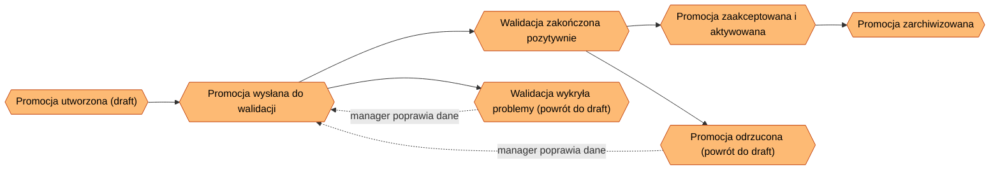

<!-- Generated by SpecStory, Markdown v2.1.0 -->

# 2026-09-01 09:34:38Z

<!-- VS Code Copilot IDE Session fb45a990-0974-428f-9bcd-f69e28f6f908 (2026-09-01 09:34:38Z) -->

_**User (2026-09-01 09:34:38Z)**_

jaki byłby proces planowania mapy kontekstów stylu DDD przez któy możemy przejść razem z AI, np. na spotkaniu lub samodzielnie aby wynikiem była mapa kontekstów, słownik, granice/intergracje, i co jeszcze?

---

_**Agent (copilot/claude-sonnet-5)**_

<tool-use data-tool-type="read" data-tool-name="read_file"><details>
<summary>Tool use: **read_file**</summary>

Read `ARCHITECTURE.md`

**Input:**

- endLine: `400`
- filePath: `c:\Projects\bottega-frontend-architecture-rossmann\docs\ARCHITECTURE.md`
- startLine: `1`

**Result:**

```
# Project Architecture

> **Living document.** Aktualizowany na żywo w trakcie warsztatu, nie jest dokumentem końcowym.
> **Właściciel:** cały zespół warsztatowy (rotacyjnie, blok po bloku).
> **Stan na:**: 2026-09-01

# Kontekst biznesowy

Retail Operations Portal — system back-office do obsługi produktów, zamówień, oraz procesu promocji handlowej

# Drivery architektoniczne

| ID  | Driver                                                                              | Kategoria          | Źródło        |
| --- | ----------------------------------------------------------------------------------- | ------------------ | ------------- |
| D1  | Czas wdrożenia zmiany w regułach promocji musi spaść z ~3 tyg. do < 3 dni           | Time-to-market     | Product Owner |
| D2  | Zespoły Pricing i Catalog nie mogą wzajemnie blokować się przy wydaniu              | Autonomia zespołów | Tech Lead     |
| D3  | Częściowa awaria (np. serwis rekomendacji) nie może blokować całego ekranu promocji | Resilience         | Operacje      |
| D4  | Nowi dostawcy frontendu (zespół B2B) muszą móc dołączyć bez przepisywania shella    | Rozszerzalność     | Architekt     |

# Ownership map

| Krok procesu           | Domena | Zespół       | Pakiet |
| ---------------------- | ------ | ------------ | ------ |
| Wybór produktów        | _TBD_` | Catalog Team | _TBD_  |
| Reguły i ceny          | _TBD_  | Pricing Team | _TBD_  |
| Walidacja → akceptacja | _TBD_  | _TBD_        | _TBD_  |
| Aktywacja/publikacja   | _TBD_  | _TBD_        | _TBD_  |
| Raportowanie           | _TBD_  | _TBD_        | _TBD_  |

# Decyzje Architektoniczne (ADR)

- [Index decyzji architektonicznych](./docs/adr/index.md)
```
</details></tool-use>

_**Agent (copilot/claude-sonnet-5)**_

<tool-use data-tool-type="read" data-tool-name="read_file"><details>
<summary>Tool use: **read_file**</summary>

Read `0000-podzial-na-moduly-domenowe.md`

**Input:**

- endLine: `200`
- filePath: `c:\Projects\bottega-frontend-architecture-rossmann\docs\adr\0000-podzial-na-moduly-domenowe.md`
- startLine: `1`

**Result:**

```
# 0000. Podział na moduły domenowe

## Status
Proponowany

## Kontekst
<!-- Jaki problem/driver architektoniczny wymusza tę decyzję?
     Odwołaj się do konkretnych driverów z ARCHITECTURE.md (np. D1, D2). -->

## Decyzja
<!-- Co dokładnie zostało/ma zostać zrobione. Jedno zdanie-teza + uzasadnienie. -->

## Rozważane alternatywy
<!-- Krótko: opcja A / opcja B / opcja C i dlaczego odrzucone. -->

## Konsekwencje
<!-- Pozytywne i negatywne skutki, kompromisy (trade-offs), co się staje trudniejsze. -->

## Powiązane
<!-- Linki do innych ADR, driverów, sekcji Ownership map. -->
```
</details></tool-use>

_**Agent (copilot/claude-sonnet-5)**_

<tool-use data-tool-type="read" data-tool-name="read_file"><details>
<summary>Tool use: **read_file**</summary>

Read skill `event-storming`

**Input:**

- endLine: `400`
- filePath: `c:\Projects\bottega-frontend-architecture-rossmann\.claude\skills\event-storming\SKILL.md`
- startLine: `1`

**Result:**

```
---
name: event-storming
description: 'Run an interactive Event Storming workshop and maintain its output as a living map of mermaid diagrams under docs/event-storming/. Use when asked to do event storming, map domain events, model a business process (actors, commands, aggregates, policies, views, domain events), or update/continue an existing event storming map. Trigger phrases: event storming, mapa zdarzeń domenowych, warsztat event storming, domain events mapping, big picture, zamodeluj proces biznesowy.'
---

# Event Storming

Runs an interactive Event Storming workshop with the user and persists the result as a living markdown document with mermaid diagrams under `docs/event-storming/`. One document = one business process/flow.

## When to Use

- User wants to event-storm / map a business process, feature, or flow.
- User wants to continue, update, or review an existing event storming map.
- User is defining domain events, aggregates, commands, policies, or read models for a process.

## Notation (Event Storming color legend)

Reuse this `classDef` block in every mermaid diagram in a map (see [legend.md](./assets/legend.md) for the full reference and node-shape conventions):

| Concept | Color | Meaning |
|---|---|---|
| Actor / Role | teal (circle) | Who triggers a command |
| Command | blue | An intent / action a user or system requests |
| Aggregate | mustard | Entity/cluster enforcing invariants, handles commands |
| Domain Event | orange | "X happened" — fact, past tense |
| Policy | lilac | Reactive rule: "whenever `<event>` then `<command>`" |
| Read Model / View | green | What the user sees on screen, derived from events |
| External System | pink | Third-party / other bounded context |
| Hotspot | red | Open question, conflict, or inconsistency |

## Conventions

- Location: `docs/event-storming/`.
- Filename: `<kebab-case-process-name>.md` (ASCII only, no diacritics — matches ADR filename convention).
- One file per b
… (output truncated)
```
</details></tool-use>

_**Agent (copilot/claude-sonnet-5)**_

<tool-use data-tool-type="read" data-tool-name="read_file"><details>
<summary>Tool use: **read_file**</summary>

Read `utworzenie-nowej-promocji.md`

**Input:**

- endLine: `200`
- filePath: `c:\Projects\bottega-frontend-architecture-rossmann\docs\event-storming\utworzenie-nowej-promocji.md`
- startLine: `1`

**Result:**

````
# Event Storming: Utworzenie nowej promocji

## Kontekst

- **Rola / aktor:** Manager
- **Cel końcowy (end goal):** Nowa promocja jest utworzona i czeka na zatwierdzenie
- **Status:** in-progress
- **Data:** 2026-09-01

> **Uwaga metodologiczna:** ten dokument został wywnioskowany z istniejącego kodu (`PromotionWizardPage.tsx`, `PromotionDetailsPage.tsx`, `api/promotions.ts`, `store/promotionsSlice.ts`, `PromotionStatusTimeline.tsx`, `ApprovalActionBar.tsx`, `ValidationResultsPanel.tsx`), a nie z warsztatu z użytkownikiem. Wymaga potwierdzenia przez osobę merytoryczną (manager/product owner) przed uznaniem za źródło prawdy.

## Big Picture

<!-- Diagram wysokopoziomowy: łańcuch zdarzeń domenowych (E1, E2, ...) w kolejności czasowej.
     Aktualizuj po każdym kroku - dodaj nowy węzeł zdarzenia i połącz go z poprzednim. -->



## Kroki

<!-- Jeden ### Step per zdarzenie/decyzja. Skopiuj blok poniżej dla każdego nowego kroku. -->

### Step 1: Promocja utworzona i wysłana do walidacji

```mermaid
flowchart LR
  classDef actor fill:#5eead4,stroke:#0f766e,color:#000
  classDef command fill:#93c5fd,stroke:#1d4ed8,color:#000
  classDef aggregate fill:#fef08a,stroke:#b45309,color:#000
  classDef event fill:#fdba74,stroke:#c2410c,color:#000
  classDef policy fill:#d8b4fe,stroke:#6b21a8,color:#000
  classDef view fill:#86efac,st
… (output truncated)
````
</details></tool-use>

_**Agent (copilot/claude-sonnet-5)**_

<tool-use data-tool-type="read" data-tool-name="read_file"><details>
<summary>Tool use: **read_file**</summary>

Read `index.md`

**Input:**

- endLine: `100`
- filePath: `c:\Projects\bottega-frontend-architecture-rossmann\docs\adr\index.md`
- startLine: `1`

**Result:**

```
# Decyzje Architektoniczne (ADR)

| Nr   | Tytuł                                                              | Status      | Data       |
| ---- | ------------------------------------------------------------------ | ----------- | ---------- |
| 0000 | [Podział na moduły domenowe](./0000-podzial-na-moduly-domenowe.md) | Proponowany | 2026-09-01 |
```
</details></tool-use>

_**Agent (copilot/claude-sonnet-5)**_

## Kontekst z repo

Macie już częściowe wejścia do tego procesu:
- `docs/ARCHITECTURE.md` — drivery (D1–D4) i pusta **Ownership map** (kolumny Domena/Pakiet oznaczone `_TBD_`).
- `docs/adr/0000-podzial-na-moduly-domenowe.md` — ADR w statusie „Proponowany", ale bez treści.
- `docs/event-storming/utworzenie-nowej-promocji.md` — event storming z agregatami, komendami i 6 hotspotami dla procesu promocji.

Context Mapping naturalnie **konsumuje** event storming (agregaty/komendy → kandydaci na konteksty) i **wypełnia** ADR 0000 + Ownership map. Sensowna kolejność: event storming → context mapping → ADR/ownership.

## Proponowany proces (analogiczny do skilla event-storming w tym repo)

### 1. Zbiórka wejść (można solo, bez spotkania)
- Zebrać istniejące mapy event storming (agregaty, komendy, aktorzy).
- Zebrać drivery i zespoły z ARCHITECTURE.md.
- Wstępnie pogrupować agregaty/komendy w kandydatów na konteksty (np. `Promotion`, `Pricing`, `Catalog`, `Approval`?, `Audit`).

### 2. Warsztat: identyfikacja Bounded Contexts
Dla każdego kandydata: nazwa, jednozdaniowa odpowiedzialność, właściciel/zespół.
**Test granicy:** czy ten sam termin znaczy co innego w dwóch miejscach (np. „Produkt" w Catalog vs w Promotion)? To sygnał realnej granicy.

### 3. Słownik / Ubiquitous Language per kontekst
Tabela: `termin | definicja | kontekst | uwagi (homonimy/synonimy między kontekstami)`.

### 4. Granice odpowiedzialności
Dla każdego kontekstu: co robi / czego świadomie NIE robi / jakie dane (agregaty) posiada na własność. Szare strefy (np. czy „Validation" to osobny kontekst, czy część `Promotion`?) → kandydaci na ADR.

### 5. Mapa relacji (Context Map właściwa)
Dla każdej pary komunikujących się kontekstów — wzorzec DDD: Partnership, Shared Kernel, Customer/Supplier, Conformist, Anticorruption Layer, Open Host Service + Published Language, Separate Ways, Big Ball of Mud. Plus kierunek zależności (upstream/downstream).
→ diagram mermaid, analogicznie do diagramów w event-storming.

### 6. Integracje / kontrakty
Mechanizm (REST, zdarzenia async, shared state, Module Federation remote, propsy), format kontraktu, kto go wersjonuje, zachowanie przy awarii (nawiązanie do D3 — resilience).

### 7. Core Domain Chart
Klasyfikacja: Core (przewaga konkurencyjna, np. Pricing/Promotion) / Supporting / Generic (np. Auth). Pomaga priorytetyzować inwestycję zespołu.

### 8. Hotspoty i otwarte pytania
Zebrane z event stormingu + nowe z warsztatu granic.

### 9. Utrwalenie decyzji
- Wypełnić **Ownership map** w `ARCHITECTURE.md` (zamiast `_TBD_`).
- Uzupełnić ADR 0000 (lub rozbić na kilka ADR, jeśli decyzje graniczne są niezależne).
- Nowy dokument, np. `docs/context-map/context-map.md`, z diagramem + słownikiem + tabelami.

## Wynik końcowy — artefakty
1. Diagram mapy kontekstów (mermaid, wzorce DDD na strzałkach)
2. Słownik (Ubiquitous Language) per kontekst
3. Tabela granic/odpowiedzialności (w tym data ownership)
4. Tabela integracji/kontraktów
5. Core Domain Chart
6. Zaktualizowana Ownership map w `ARCHITECTURE.md`
7. ADR-y dla kluczowych decyzji granicznych
8. Lista hotspotów/otwartych pytań

## Tryb pracy z AI
Jak w skill event-storming: pytania zadawane po jednej na raz (ask-questions), AI nie zgaduje granic ani właścicieli bez potwierdzenia — tylko proponuje kandydatów na podstawie kodu/event stormingu, a decyzję podejmuje osoba merytoryczna.

---

Czy mam:
1. przygotować to jako powtarzalny skill (`.claude/skills/context-mapping/`, analogicznie do event-storming), czy
2. od razu przeprowadzić ten proces krok po kroku dla tego projektu (zaczynając od kandydatów na konteksty z istniejącego event stormingu)?

_**Agent (copilot/claude-sonnet-5)**_

<tool-use data-tool-type="task" data-tool-name="manage_todo_list"><details>
<summary>Tool use: **manage_todo_list**</summary>

Created 9 todos
</details></tool-use>
