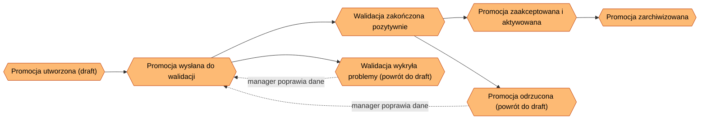
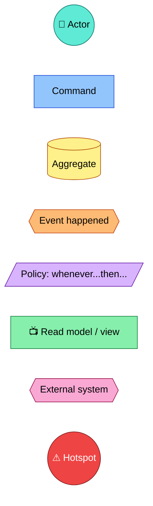
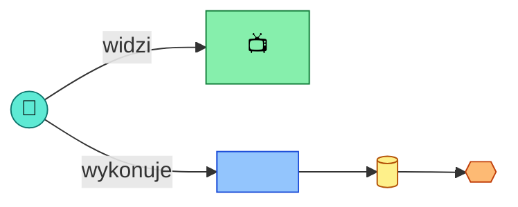
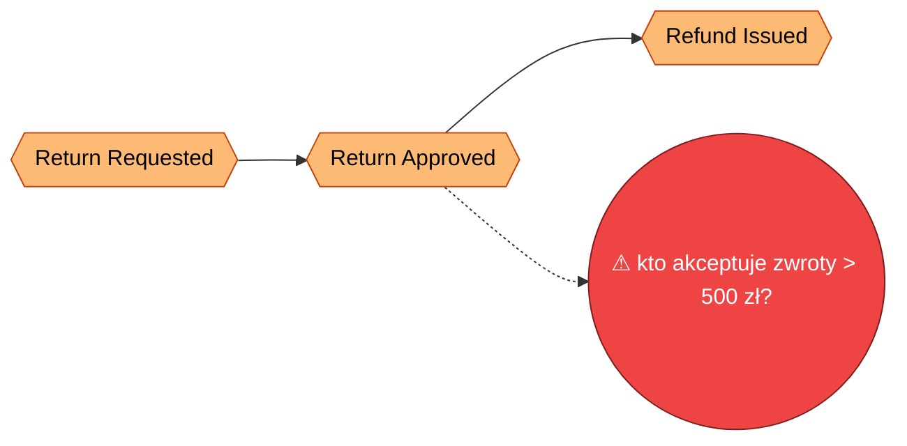
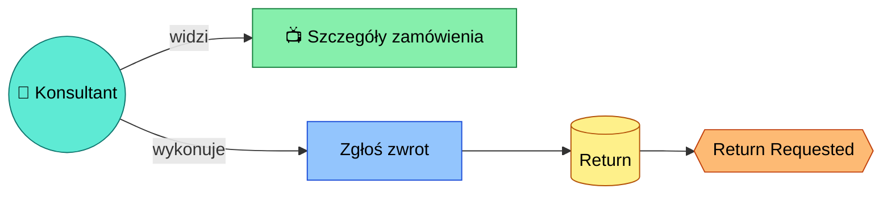
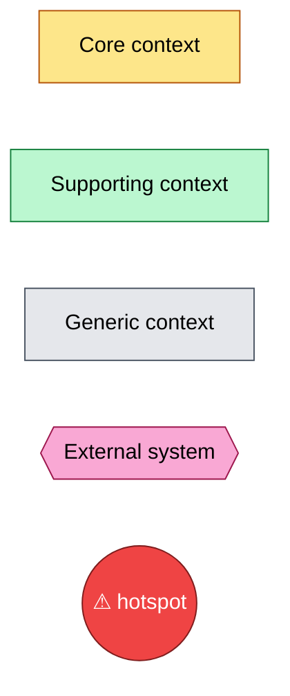
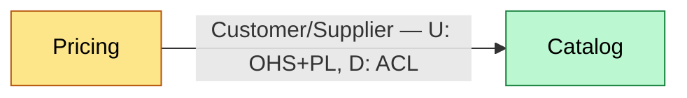
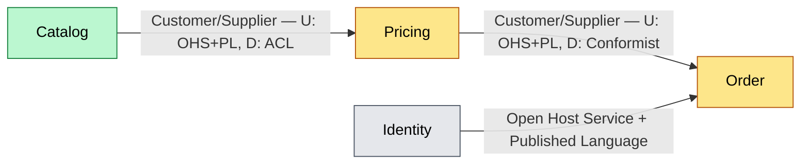

<!-- Generated by SpecStory, Markdown v2.1.0 -->

# 2026-09-01 09:34:38Z

<!-- VS Code Copilot IDE Session fb45a990-0974-428f-9bcd-f69e28f6f908 (2026-09-01 09:34:38Z) -->

_**User (2026-09-01 09:34:38Z)**_

jaki byłby proces planowania mapy kontekstów stylu DDD przez któy możemy przejść razem z AI, np. na spotkaniu lub samodzielnie aby wynikiem była mapa kontekstów, słownik, granice/intergracje, i co jeszcze?

---

_**Agent (copilot/claude-sonnet-5)**_

<tool-use data-tool-type="read" data-tool-name="read_file"><details>
<summary>Tool use: **read_file**</summary>

Read `ARCHITECTURE.md`

**Input:**

- endLine: `400`
- filePath: `c:\Projects\bottega-frontend-architecture-rossmann\docs\ARCHITECTURE.md`
- startLine: `1`

**Result:**

```
# Project Architecture

> **Living document.** Aktualizowany na żywo w trakcie warsztatu, nie jest dokumentem końcowym.
> **Właściciel:** cały zespół warsztatowy (rotacyjnie, blok po bloku).
> **Stan na:**: 2026-09-01

# Kontekst biznesowy

Retail Operations Portal — system back-office do obsługi produktów, zamówień, oraz procesu promocji handlowej

# Drivery architektoniczne

| ID  | Driver                                                                              | Kategoria          | Źródło        |
| --- | ----------------------------------------------------------------------------------- | ------------------ | ------------- |
| D1  | Czas wdrożenia zmiany w regułach promocji musi spaść z ~3 tyg. do < 3 dni           | Time-to-market     | Product Owner |
| D2  | Zespoły Pricing i Catalog nie mogą wzajemnie blokować się przy wydaniu              | Autonomia zespołów | Tech Lead     |
| D3  | Częściowa awaria (np. serwis rekomendacji) nie może blokować całego ekranu promocji | Resilience         | Operacje      |
| D4  | Nowi dostawcy frontendu (zespół B2B) muszą móc dołączyć bez przepisywania shella    | Rozszerzalność     | Architekt     |

# Ownership map

| Krok procesu           | Domena | Zespół       | Pakiet |
| ---------------------- | ------ | ------------ | ------ |
| Wybór produktów        | _TBD_` | Catalog Team | _TBD_  |
| Reguły i ceny          | _TBD_  | Pricing Team | _TBD_  |
| Walidacja → akceptacja | _TBD_  | _TBD_        | _TBD_  |
| Aktywacja/publikacja   | _TBD_  | _TBD_        | _TBD_  |
| Raportowanie           | _TBD_  | _TBD_        | _TBD_  |

# Decyzje Architektoniczne (ADR)

- [Index decyzji architektonicznych](./docs/adr/index.md)
```
</details></tool-use>

_**Agent (copilot/claude-sonnet-5)**_

<tool-use data-tool-type="read" data-tool-name="read_file"><details>
<summary>Tool use: **read_file**</summary>

Read `0000-podzial-na-moduly-domenowe.md`

**Input:**

- endLine: `200`
- filePath: `c:\Projects\bottega-frontend-architecture-rossmann\docs\adr\0000-podzial-na-moduly-domenowe.md`
- startLine: `1`

**Result:**

```
# 0000. Podział na moduły domenowe

## Status
Proponowany

## Kontekst
<!-- Jaki problem/driver architektoniczny wymusza tę decyzję?
     Odwołaj się do konkretnych driverów z ARCHITECTURE.md (np. D1, D2). -->

## Decyzja
<!-- Co dokładnie zostało/ma zostać zrobione. Jedno zdanie-teza + uzasadnienie. -->

## Rozważane alternatywy
<!-- Krótko: opcja A / opcja B / opcja C i dlaczego odrzucone. -->

## Konsekwencje
<!-- Pozytywne i negatywne skutki, kompromisy (trade-offs), co się staje trudniejsze. -->

## Powiązane
<!-- Linki do innych ADR, driverów, sekcji Ownership map. -->
```
</details></tool-use>

_**Agent (copilot/claude-sonnet-5)**_

<tool-use data-tool-type="read" data-tool-name="read_file"><details>
<summary>Tool use: **read_file**</summary>

Read skill `event-storming`

**Input:**

- endLine: `400`
- filePath: `c:\Projects\bottega-frontend-architecture-rossmann\.claude\skills\event-storming\SKILL.md`
- startLine: `1`

**Result:**

```
---
name: event-storming
description: 'Run an interactive Event Storming workshop and maintain its output as a living map of mermaid diagrams under docs/event-storming/. Use when asked to do event storming, map domain events, model a business process (actors, commands, aggregates, policies, views, domain events), or update/continue an existing event storming map. Trigger phrases: event storming, mapa zdarzeń domenowych, warsztat event storming, domain events mapping, big picture, zamodeluj proces biznesowy.'
---

# Event Storming

Runs an interactive Event Storming workshop with the user and persists the result as a living markdown document with mermaid diagrams under `docs/event-storming/`. One document = one business process/flow.

## When to Use

- User wants to event-storm / map a business process, feature, or flow.
- User wants to continue, update, or review an existing event storming map.
- User is defining domain events, aggregates, commands, policies, or read models for a process.

## Notation (Event Storming color legend)

Reuse this `classDef` block in every mermaid diagram in a map (see [legend.md](./assets/legend.md) for the full reference and node-shape conventions):

| Concept | Color | Meaning |
|---|---|---|
| Actor / Role | teal (circle) | Who triggers a command |
| Command | blue | An intent / action a user or system requests |
| Aggregate | mustard | Entity/cluster enforcing invariants, handles commands |
| Domain Event | orange | "X happened" — fact, past tense |
| Policy | lilac | Reactive rule: "whenever `<event>` then `<command>`" |
| Read Model / View | green | What the user sees on screen, derived from events |
| External System | pink | Third-party / other bounded context |
| Hotspot | red | Open question, conflict, or inconsistency |

## Conventions

- Location: `docs/event-storming/`.
- Filename: `<kebab-case-process-name>.md` (ASCII only, no diacritics — matches ADR filename convention).
- One file per b
… (output truncated)
```
</details></tool-use>

_**Agent (copilot/claude-sonnet-5)**_

<tool-use data-tool-type="read" data-tool-name="read_file"><details>
<summary>Tool use: **read_file**</summary>

Read `utworzenie-nowej-promocji.md`

**Input:**

- endLine: `200`
- filePath: `c:\Projects\bottega-frontend-architecture-rossmann\docs\event-storming\utworzenie-nowej-promocji.md`
- startLine: `1`

**Result:**

````
# Event Storming: Utworzenie nowej promocji

## Kontekst

- **Rola / aktor:** Manager
- **Cel końcowy (end goal):** Nowa promocja jest utworzona i czeka na zatwierdzenie
- **Status:** in-progress
- **Data:** 2026-09-01

> **Uwaga metodologiczna:** ten dokument został wywnioskowany z istniejącego kodu (`PromotionWizardPage.tsx`, `PromotionDetailsPage.tsx`, `api/promotions.ts`, `store/promotionsSlice.ts`, `PromotionStatusTimeline.tsx`, `ApprovalActionBar.tsx`, `ValidationResultsPanel.tsx`), a nie z warsztatu z użytkownikiem. Wymaga potwierdzenia przez osobę merytoryczną (manager/product owner) przed uznaniem za źródło prawdy.

## Big Picture

<!-- Diagram wysokopoziomowy: łańcuch zdarzeń domenowych (E1, E2, ...) w kolejności czasowej.
     Aktualizuj po każdym kroku - dodaj nowy węzeł zdarzenia i połącz go z poprzednim. -->



## Kroki

<!-- Jeden ### Step per zdarzenie/decyzja. Skopiuj blok poniżej dla każdego nowego kroku. -->

### Step 1: Promocja utworzona i wysłana do walidacji

```mermaid
flowchart LR
  classDef actor fill:#5eead4,stroke:#0f766e,color:#000
  classDef command fill:#93c5fd,stroke:#1d4ed8,color:#000
  classDef aggregate fill:#fef08a,stroke:#b45309,color:#000
  classDef event fill:#fdba74,stroke:#c2410c,color:#000
  classDef policy fill:#d8b4fe,stroke:#6b21a8,color:#000
  classDef view fill:#86efac,st
… (output truncated)
````
</details></tool-use>

_**Agent (copilot/claude-sonnet-5)**_

<tool-use data-tool-type="read" data-tool-name="read_file"><details>
<summary>Tool use: **read_file**</summary>

Read `index.md`

**Input:**

- endLine: `100`
- filePath: `c:\Projects\bottega-frontend-architecture-rossmann\docs\adr\index.md`
- startLine: `1`

**Result:**

```
# Decyzje Architektoniczne (ADR)

| Nr   | Tytuł                                                              | Status      | Data       |
| ---- | ------------------------------------------------------------------ | ----------- | ---------- |
| 0000 | [Podział na moduły domenowe](./0000-podzial-na-moduly-domenowe.md) | Proponowany | 2026-09-01 |
```
</details></tool-use>

_**Agent (copilot/claude-sonnet-5)**_

## Kontekst z repo

Macie już częściowe wejścia do tego procesu:
- `docs/ARCHITECTURE.md` — drivery (D1–D4) i pusta **Ownership map** (kolumny Domena/Pakiet oznaczone `_TBD_`).
- `docs/adr/0000-podzial-na-moduly-domenowe.md` — ADR w statusie „Proponowany", ale bez treści.
- `docs/event-storming/utworzenie-nowej-promocji.md` — event storming z agregatami, komendami i 6 hotspotami dla procesu promocji.

Context Mapping naturalnie **konsumuje** event storming (agregaty/komendy → kandydaci na konteksty) i **wypełnia** ADR 0000 + Ownership map. Sensowna kolejność: event storming → context mapping → ADR/ownership.

## Proponowany proces (analogiczny do skilla event-storming w tym repo)

### 1. Zbiórka wejść (można solo, bez spotkania)
- Zebrać istniejące mapy event storming (agregaty, komendy, aktorzy).
- Zebrać drivery i zespoły z ARCHITECTURE.md.
- Wstępnie pogrupować agregaty/komendy w kandydatów na konteksty (np. `Promotion`, `Pricing`, `Catalog`, `Approval`?, `Audit`).

### 2. Warsztat: identyfikacja Bounded Contexts
Dla każdego kandydata: nazwa, jednozdaniowa odpowiedzialność, właściciel/zespół.
**Test granicy:** czy ten sam termin znaczy co innego w dwóch miejscach (np. „Produkt" w Catalog vs w Promotion)? To sygnał realnej granicy.

### 3. Słownik / Ubiquitous Language per kontekst
Tabela: `termin | definicja | kontekst | uwagi (homonimy/synonimy między kontekstami)`.

### 4. Granice odpowiedzialności
Dla każdego kontekstu: co robi / czego świadomie NIE robi / jakie dane (agregaty) posiada na własność. Szare strefy (np. czy „Validation" to osobny kontekst, czy część `Promotion`?) → kandydaci na ADR.

### 5. Mapa relacji (Context Map właściwa)
Dla każdej pary komunikujących się kontekstów — wzorzec DDD: Partnership, Shared Kernel, Customer/Supplier, Conformist, Anticorruption Layer, Open Host Service + Published Language, Separate Ways, Big Ball of Mud. Plus kierunek zależności (upstream/downstream).
→ diagram mermaid, analogicznie do diagramów w event-storming.

### 6. Integracje / kontrakty
Mechanizm (REST, zdarzenia async, shared state, Module Federation remote, propsy), format kontraktu, kto go wersjonuje, zachowanie przy awarii (nawiązanie do D3 — resilience).

### 7. Core Domain Chart
Klasyfikacja: Core (przewaga konkurencyjna, np. Pricing/Promotion) / Supporting / Generic (np. Auth). Pomaga priorytetyzować inwestycję zespołu.

### 8. Hotspoty i otwarte pytania
Zebrane z event stormingu + nowe z warsztatu granic.

### 9. Utrwalenie decyzji
- Wypełnić **Ownership map** w `ARCHITECTURE.md` (zamiast `_TBD_`).
- Uzupełnić ADR 0000 (lub rozbić na kilka ADR, jeśli decyzje graniczne są niezależne).
- Nowy dokument, np. `docs/context-map/context-map.md`, z diagramem + słownikiem + tabelami.

## Wynik końcowy — artefakty
1. Diagram mapy kontekstów (mermaid, wzorce DDD na strzałkach)
2. Słownik (Ubiquitous Language) per kontekst
3. Tabela granic/odpowiedzialności (w tym data ownership)
4. Tabela integracji/kontraktów
5. Core Domain Chart
6. Zaktualizowana Ownership map w `ARCHITECTURE.md`
7. ADR-y dla kluczowych decyzji granicznych
8. Lista hotspotów/otwartych pytań

## Tryb pracy z AI
Jak w skill event-storming: pytania zadawane po jednej na raz (ask-questions), AI nie zgaduje granic ani właścicieli bez potwierdzenia — tylko proponuje kandydatów na podstawie kodu/event stormingu, a decyzję podejmuje osoba merytoryczna.

---

Czy mam:
1. przygotować to jako powtarzalny skill (`.claude/skills/context-mapping/`, analogicznie do event-storming), czy
2. od razu przeprowadzić ten proces krok po kroku dla tego projektu (zaczynając od kandydatów na konteksty z istniejącego event stormingu)?

_**Agent (copilot/claude-sonnet-5)**_

<tool-use data-tool-type="task" data-tool-name="manage_todo_list"><details>
<summary>Tool use: **manage_todo_list**</summary>

Created 9 todos
</details></tool-use>

---

_**User (2026-09-01 11:03:33Z)**_

1. 

---

_**Agent (copilot/claude-sonnet-5)**_

<tool-use data-tool-type="generic" data-tool-name="list_dir"><details>
<summary>Tool use: **list_dir**</summary>

Read `event-storming`

**Input:**

- path: `c:\Projects\bottega-frontend-architecture-rossmann\.claude\skills\event-storming`

**Result:**

```
assets/
SKILL.md
```
</details></tool-use>

_**Agent (copilot/claude-sonnet-5)**_

<tool-use data-tool-type="generic" data-tool-name="list_dir"><details>
<summary>Tool use: **list_dir**</summary>

Read `skills`

**Input:**

- path: `c:\Projects\bottega-frontend-architecture-rossmann\.claude\skills`

**Result:**

```
adr-management/
event-storming/
frontend-architecture-analysis/
```
</details></tool-use>

_**Agent (copilot/claude-sonnet-5)**_

<tool-use data-tool-type="generic" data-tool-name="list_dir"><details>
<summary>Tool use: **list_dir**</summary>

Read `assets`

**Input:**

- path: `c:\Projects\bottega-frontend-architecture-rossmann\.claude\skills\event-storming\assets`

**Result:**

```
example-map.md
legend.md
map-template.md
```
</details></tool-use>

_**Agent (copilot/claude-sonnet-5)**_

<tool-use data-tool-type="generic" data-tool-name="list_dir"><details>
<summary>Tool use: **list_dir**</summary>

Read `adr-management`

**Input:**

- path: `c:\Projects\bottega-frontend-architecture-rossmann\.claude\skills\adr-management`

**Result:**

```
assets/
SKILL.md
```
</details></tool-use>

_**Agent (copilot/claude-sonnet-5)**_

<tool-use data-tool-type="generic" data-tool-name="list_dir"><details>
<summary>Tool use: **list_dir**</summary>

Read `frontend-architecture-analysis`

**Input:**

- path: `c:\Projects\bottega-frontend-architecture-rossmann\.claude\skills\frontend-architecture-analysis`

**Result:**

```
assets/
SKILL.md
```
</details></tool-use>

_**Agent (copilot/claude-sonnet-5)**_

<tool-use data-tool-type="read" data-tool-name="read_file"><details>
<summary>Tool use: **read_file**</summary>

Read skill `event-storming`: `legend.md`

**Input:**

- endLine: `200`
- filePath: `c:\Projects\bottega-frontend-architecture-rossmann\.claude\skills\event-storming\assets\legend.md`
- startLine: `1`

**Result:**

````
# Event Storming Notation

Standard Event Storming sticky-note colors, mapped to mermaid node shapes/classes. Paste the `classDef` block at the top of every diagram that uses these concepts; only declare the classes actually used in that diagram.



## Node shape conventions

| Concept | Shape | Example |
|---|---|---|
| Actor | circle, 🧑 prefix | `Actor((🧑 Customer)):::actor` |
| Command | rectangle, imperative verb | `Cmd[Place Order]:::command` |
| Aggregate | rounded/cylinder, noun | `Agg[(Order)]:::aggregate` |
| Domain Event | hexagon, past tense | `Evt{{Order Placed}}:::event` |
| Policy | parallelogram, "whenever/then" | `Pol[/whenever Order Placed then Reserve Stock/]:::policy` |
| View / read model | rectangle, 📺 prefix | `View[📺 Order Summary]:::view` |
| External system | hexagon, name | `Ext{{Payment Gateway}}:::external` |
| Hotspot | circle, ⚠ prefix | `Hot((⚠ who owns retries?)):::hotspot` |

## Wiring pattern for a single step

```mermaid
flowchart LR
  classDef actor fill:#5eead4,stroke:#0f766e,color:#000
  classDef command fill:#93c5fd,stroke:#1d4ed8,color:#000
  classDef aggregate fill:#fef08a,stroke:#b45309,color:#000
  classDef event fill:#fdba74,stroke:#c2410c,color:
… (output truncated)
````
</details></tool-use>

_**Agent (copilot/claude-sonnet-5)**_

<tool-use data-tool-type="read" data-tool-name="read_file"><details>
<summary>Tool use: **read_file**</summary>

Read skill `event-storming`: `map-template.md`

**Input:**

- endLine: `200`
- filePath: `c:\Projects\bottega-frontend-architecture-rossmann\.claude\skills\event-storming\assets\map-template.md`
- startLine: `1`

**Result:**

````
# Event Storming: <Nazwa procesu>

## Kontekst

- **Rola / aktor:** <kto inicjuje proces>
- **Cel końcowy (end goal):** <jaki rezultat biznesowy proces ma osiągnąć>
- **Status:** in-progress
- **Data:** <YYYY-MM-DD>

## Big Picture

<!-- Diagram wysokopoziomowy: łańcuch zdarzeń domenowych (E1, E2, ...) w kolejności czasowej.
     Aktualizuj po każdym kroku - dodaj nowy węzeł zdarzenia i połącz go z poprzednim. -->

```mermaid
flowchart LR
  classDef event fill:#fdba74,stroke:#c2410c,color:#000
  classDef hotspot fill:#ef4444,stroke:#7f1d1d,color:#fff

  E1{{"<Zdarzenie 1>"}}:::event
```

## Kroki

<!-- Jeden ### Step per zdarzenie/decyzja. Skopiuj blok poniżej dla każdego nowego kroku. -->

### Step 1: <nazwa kroku / zdarzenia>



- **Widok (view):** <co użytkownik widzi>
- **Agregat(y):** <jakie dane/encje>
- **Komenda(y):** <jakie akcje>
- **Reguły / polityki:** <whenever ... then ...>
- **Zmiany stanu:** <jakie agregaty/widoki są aktualizowane>
- **Zdarzenie(a) domenowe:** <co zostało opublikowane>

## Open Questions / Hotspots / Inconsistencies

<!-- Lista otwartych pytań, hotspotów i niespójności napotkanych podczas warsztatu.
     Każdy wpis odnosi się do kroku, w którym się pojawił. -->

- [ ] <pytanie/hotspot> — krok: Step 1
````
</details></tool-use>

_**Agent (copilot/claude-sonnet-5)**_

<tool-use data-tool-type="read" data-tool-name="read_file"><details>
<summary>Tool use: **read_file**</summary>

Read skill `adr-management`

**Input:**

- endLine: `300`
- filePath: `c:\Projects\bottega-frontend-architecture-rossmann\.claude\skills\adr-management\SKILL.md`
- startLine: `1`

**Result:**

```
---
name: adr-management
description: 'Create, update, review, summarize, and search Architecture Decision Records (ADR). Use when asked to write a new ADR, update an existing ADR, list/search/summarize ADRs, or check consistency between docs/adr/index.md and the ADR files. Trigger phrases: nowy ADR, dodaj ADR, zaktualizuj ADR, przeglądaj ADR, podsumuj ADR, szukaj ADR, spójność indeksu ADR, architecture decision record.'
---

# ADR Management

Manages Architecture Decision Records under `docs/adr/` — creating, updating, reviewing/summarizing, searching, and keeping [index.md](../../../docs/adr/index.md) in sync with the actual ADR files.

## When to Use

- User wants a new ADR created for a decision.
- User wants an existing ADR updated (status transition, content revision).
- User wants ADRs listed, searched, or summarized.
- User wants to check/fix consistency between the index and the ADR files.

## Conventions

- Location: `docs/adr/`.
- Filenames: `NNNN-kebab-case-title.md` — zero-padded 4-digit sequential number, ASCII only (no Polish diacritics, no spaces).
- Index: [index.md](../../../docs/adr/index.md), a single markdown table with columns `Nr | Tytuł | Status | Data`. Links must be real markdown links (`[text](./file.md)`) — never wrapped in backticks.
- Status values: `Proponowany`, `Zaakceptowany`, `Odrzucony`, `Zastąpiony przez ADR-NNNN`, `Wycofany`.
- Individual ADR sections (in order): `Status`, `Kontekst`, `Decyzja`, `Rozważane alternatywy`, `Konsekwencje`, `Powiązane`. See [adr-template.md](./assets/adr-template.md).
- One ADR = one decision. ADRs are immutable once `Zaakceptowany` — a changed decision becomes a new ADR that supersedes the old one, not an edit of the old one.
- See [example-adr.md](./assets/example-adr.md) for a fully filled-in illustrative ADR (generic content, not a real project decision).

## Procedures

### Create a new ADR

1. Read [index.md](../../../docs/adr/index.md) to find the next free number
… (output truncated)
```
</details></tool-use>

_**Agent (copilot/claude-sonnet-5)**_

<tool-use data-tool-type="read" data-tool-name="read_file"><details>
<summary>Tool use: **read_file**</summary>

Read skill `event-storming`: `example-map.md`

**Input:**

- endLine: `150`
- filePath: `c:\Projects\bottega-frontend-architecture-rossmann\.claude\skills\event-storming\assets\example-map.md`
- startLine: `1`

**Result:**

````
# Event Storming: Zwrot towaru przez klienta (przykład ilustracyjny)

> Przykład generyczny — nie odzwierciedla rzeczywistego procesu w projekcie. Służy jako wzór formatu.

## Kontekst

- **Rola / aktor:** Klient (przez konsultanta obsługi w portalu)
- **Cel końcowy (end goal):** Klient odzyskuje zwrot pieniędzy za wadliwy produkt, a stan magazynowy jest poprawiony
- **Status:** in-progress
- **Data:** 2026-09-01

## Big Picture



## Kroki

### Step 1: Return Requested



- **Widok (view):** Szczegóły zamówienia z listą pozycji kwalifikujących się do zwrotu.
- **Agregat(y):** `Return` (nowy, powiązany z `Order`).
- **Komenda(y):** `Zgłoś zwrot` (RequestReturn).
- **Reguły / polityki:** brak na tym etapie.
- **Zmiany stanu:** utworzony nowy agregat `Return` w statusie `Requested`.
- **Zdarzenie(a) domenowe:** `Return Requested`.

### Step 2: Return Approved

```mermaid
flowchart LR
  classDef actor fill:#5eead4,stroke:#0f766e,color:#000
  classDef command fill:#93c5fd,stroke:#1d4ed8,color:#000
  classDef aggregate fill:#fef08a,stroke:#b45309,color:#000
  classDef event fill:#fdba74,stroke:#c2410c,c
… (output truncated)
````
</details></tool-use>

_**Agent (copilot/claude-sonnet-5)**_

<tool-use data-tool-type="read" data-tool-name="read_file"><details>
<summary>Tool use: **read_file**</summary>

Read skill `adr-management`: `adr-template.md`

**Input:**

- endLine: `100`
- filePath: `c:\Projects\bottega-frontend-architecture-rossmann\.claude\skills\adr-management\assets\adr-template.md`
- startLine: `1`

**Result:**

```
# NNNN. <Tytuł decyzji>

## Status

Proponowany

## Kontekst

<!-- Jaki problem/driver architektoniczny wymusza tę decyzję?
     Odwołaj się do konkretnych driverów z ARCHITECTURE.md (np. D1, D2). -->

## Decyzja

<!-- Co dokładnie zostało/ma zostać zrobione. Jedno zdanie-teza + uzasadnienie. -->

## Rozważane alternatywy

<!-- Krótko: opcja A / opcja B / opcja C i dlaczego odrzucone. -->

## Konsekwencje

<!-- Pozytywne i negatywne skutki, kompromisy (trade-offs), co się staje trudniejsze. -->

## Powiązane

<!-- Linki do innych ADR, driverów, sekcji Ownership map. -->
```
</details></tool-use>

_**Agent (copilot/claude-sonnet-5)**_

<tool-use data-tool-type="write" data-tool-name="create_file"><details>
<summary>Tool use: **create_file**</summary>

Created `ddd-patterns-legend.md`

**Input:**

- content:

````
# DDD Context Mapping — Notation

Standard Context Mapping relationship patterns (Evans / Vernon), mapped to mermaid edges. Paste the `classDef` block at the top of every context-map diagram; only declare the classes actually used.



## Klasyfikacja kontekstu (Core Domain Chart)

| Klasa | Kolor | Znaczenie |
|---|---|---|
| Core | żółty (mustard) | Daje przewagę konkurencyjną, warto inwestować najwięcej |
| Supporting | zielony | Niezbędny, ale nie różnicujący — może być prostszy |
| Generic | szary | Rozwiązany problem, kandydat do kupienia/reużycia (np. Auth) |
| External system | różowy | Poza kontrolą zespołu (third-party, inny system) |

## Wzorce relacji między kontekstami

| Wzorzec | Skrót | Kiedy | Kierunek |
|---|---|---|---|
| Partnership | P | Dwa zespoły koordynują się jako równorzędni partnerzy, wspólny harmonogram wydań | symetryczny |
| Shared Kernel | SK | Świadomie dzielony podzbiór modelu/kodu między zespołami — zmiana wymaga zgody obu stron | symetryczny |
| Customer/Supplier | Cust/Supp | Downstream (klient) ma wpływ na priorytety upstream (dostawcy), ale nie blokuje go | upstream (U) → downstream (D) |
| Conformist | CF | Downstream akceptuje model upstream bez negocjacji i bez tłumaczenia (brak siły przetargowej) | U → D (CF po stronie D) |
| Anticorruption Layer | ACL | Downstream tłumaczy/izoluje się od modelu upstream własną warstwą adaptera | U → D (ACL po stronie D) |
| Open Host Service | OHS | Upstream udostępnia dobrze zdefiniowany, publiczny protokół/API dla wielu klientów | po stronie U |
| Published Language | PL | Wspólny, udokumentowany format wymiany (schema, kontrakt) — zwykle towarzyszy OHS | między U i D |
| Separate Ways | SW | Brak integracji — taniej zduplikować niż integrować | brak zależności |
| Big Ball of Mud | BBoM | Granice nieformalne/nieprzestrzegane, model rozmyty — traktować jako dług, nie wzorzec docelowy | — |

## Wiring pattern dla jednej relacji



Etykieta na krawędzi zawsze wskazuje: nazwę wzorca, oraz — jeśli wzorzec jest asymetryczny (Customer/Supplier, Conformist, ACL, OHS/PL) — który kontekst jest upstream (U) i jaki wzorzec stosuje po swojej stronie, a który downstream (D) i jaki wzorzec stosuje po swojej. Strzałka wskazuje kierunek U → D.

````

- filePath: `c:\Projects\bottega-frontend-architecture-rossmann\.claude\skills\context-mapping\assets\ddd-patterns-legend.md`

**Result:**

```
The following files were successfully edited:
c:\Projects\bottega-frontend-architecture-rossmann\.claude\skills\context-mapping\assets\ddd-patterns-legend.md
```
</details></tool-use>

_**Agent (copilot/claude-sonnet-5)**_

<tool-use data-tool-type="write" data-tool-name="textEditGroup"><details>
<summary>Edit: **ddd-patterns-legend.md**</summary>

@@ lines 1-1 @@

````
# DDD Context Mapping — Notation

Standard Context Mapping relationship patterns (Evans / Vernon), mapped to mermaid edges. Paste the `classDef` block at the top of every context-map diagram; only declare the classes actually used.


## Klasyfikacja kontekstu (Core Domain Chart)

| Klasa | Kolor | Znaczenie |
|---|---|---|
| Core | żółty (mustard) | Daje przewagę konkurencyjną, warto inwestować najwięcej |
| Supporting | zielony | Niezbędny, ale nie różnicujący — może być prostszy |
| Generic | szary | Rozwiązany problem, kandydat do kupienia/reużycia (np. Auth) |
| External system | różowy | Poza kontrolą zespołu (third-party, inny system) |

## Wzorce relacji między kontekstami

| Wzorzec | Skrót | Kiedy | Kierunek |
|---|---|---|---|
| Partnership | P | Dwa zespoły koordynują się jako równorzędni partnerzy, wspólny harmonogram wydań | symetryczny |
| Shared Kernel | SK | Świadomie dzielony podzbiór modelu/kodu między zespołami — zmiana wymaga zgody obu stron | symetryczny |
| Customer/Supplier | Cust/Supp | Downstream (klient) ma wpływ na priorytety upstream (dostawcy), ale nie blokuje go | upstream (U) → downstream (D) |
| Conformist | CF | Downstream akceptuje model upstream bez negocjacji i bez tłumaczenia (brak siły przetargowej) | U → D (CF po stronie D) |
| Anticorruption Layer | ACL | Downstream tłumaczy/izoluje się od modelu upstream własną warstwą adaptera | U → D (ACL po stronie D) |
| Open Host Service | OHS | Upstream udostępnia dobrze zdefiniowany, publiczny protokół/API dla wielu klientów | po stronie U |
| Published Language | PL | Wspólny, udokumentowany format wymiany (schema, kontrakt) — zwykle towarzyszy OHS | między U i D |
| Separate Ways | SW | Brak integracji — taniej zduplikować niż integrować | brak zależności |
| Big Ball of Mud | BBoM | Granice nieformalne/nieprzestrzegane, model rozmyty — traktować jako dług, nie wzorzec docelowy | — |

## Wiring pattern dla jednej relacji


Etykieta na krawędzi zawsze wskazuje: nazwę wzorca, oraz — jeśli wzorzec jest asymetryczny (Customer/Supplier, Conformist, ACL, OHS/PL) — który kontekst jest upstream (U) i jaki wzorzec stosuje po swojej stronie, a który downstream (D) i jaki wzorzec stosuje po swojej. Strzałka wskazuje kierunek U → D.

````
</details></tool-use>

_**Agent (copilot/claude-sonnet-5)**_

<tool-use data-tool-type="write" data-tool-name="create_file"><details>
<summary>Tool use: **create_file**</summary>

Created `context-map-template.md`

**Input:**

- content:

````
# Context Map: <Nazwa systemu/produktu>

> **Living document.** Aktualizowany iteracyjnie w miarę odkrywania granic, nie jest dokumentem końcowym.
> **Status:** in-progress
> **Data:** <YYYY-MM-DD>

## Wejścia źródłowe

<!-- Skąd pochodzą kandydaci na konteksty i granice - linki do event stormingu, ARCHITECTURE.md driverów, ownership map. -->

- Event storming: <linki do docs/event-storming/*.md>
- Drivery architektoniczne: <np. D1, D2 z ARCHITECTURE.md>
- Inne źródła: <kod, wywiady, istniejące ADR>

## Bounded Contexts

<!-- Jeden wiersz per kandydat na kontekst. Wypełniać dopiero po potwierdzeniu z użytkownikiem - nie zgadywać granic. -->

| Kontekst | Odpowiedzialność (1 zdanie) | Zespół / właściciel | Typ (Core/Supporting/Generic) |
| --- | --- | --- | --- |
| <Nazwa> | <...> | <...> | <...> |

## Mapa kontekstów (diagram)

<!-- Diagram zbiorczy: wszystkie konteksty jako węzły, relacje jako krawędzie z etykietą wzorca DDD.
     Zobacz assets/ddd-patterns-legend.md po pełną notację i klasyfikację core/supporting/generic. -->


## Słownik (Ubiquitous Language)

<!-- Kluczowe terminy per kontekst. Ten sam termin o różnym znaczeniu w różnych kontekstach = sygnał granicy. -->

| Termin | Definicja | Kontekst | Uwagi (homonimy/synonimy w innych kontekstach) |
| --- | --- | --- | --- |
| <termin> | <definicja właściwa dla kontekstu> | <Nazwa kontekstu> | <...> |

## Granice i odpowiedzialności

<!-- Jedna sekcja per kontekst. Kopiuj blok poniżej dla każdego nowego kontekstu. -->

### <Nazwa kontekstu>

- **W zakresie:** <co ten kontekst robi>
- **Poza zakresem:** <co świadomie NIE należy do tego kontekstu>
- **Dane własne (data ownership):** <jakie agregaty/dane kontekst posiada na własność>

## Relacje i integracje

<!-- Jeden wiersz per para komunikujących się kontekstów. -->

| Kontekst A (upstream) | Kontekst B (downstream) | Wzorzec DDD | Mechanizm integracji | Kontrakt / format | Zachowanie przy awarii | Uwagi |
| --- | --- | --- | --- | --- | --- | --- |
| <...> | <...> | <...> | <sync REST / async event / shared state / Module Federation / props / ...> | <...> | <...> | <...> |

## Core Domain Chart

<!-- Klasyfikacja core/supporting/generic z uzasadnieniem - pomaga priorytetyzować inwestycję zespołu. -->

| Kontekst | Klasyfikacja | Uzasadnienie |
| --- | --- | --- |
| <Nazwa> | Core / Supporting / Generic | <...> |

## Open Questions / Hotspots / Inconsistencies

<!-- Lista otwartych pytań, hotspotów i niespójności napotkanych podczas warsztatu.
     Każdy wpis odnosi się do kontekstu lub relacji, w której się pojawił. -->

- [ ] <pytanie/hotspot> — kontekst: <Nazwa>

````

- filePath: `c:\Projects\bottega-frontend-architecture-rossmann\.claude\skills\context-mapping\assets\context-map-template.md`

**Result:**

```
The following files were successfully edited:
c:\Projects\bottega-frontend-architecture-rossmann\.claude\skills\context-mapping\assets\context-map-template.md
```
</details></tool-use>

_**Agent (copilot/claude-sonnet-5)**_

<tool-use data-tool-type="write" data-tool-name="create_file"><details>
<summary>Tool use: **create_file**</summary>

Created `example-context-map.md`

**Input:**

- content:

````
# Context Map: Sklep internetowy (przykład ilustracyjny)

> Przykład generyczny — nie odzwierciedla rzeczywistego projektu. Służy jako wzór formatu.
> **Status:** in-progress
> **Data:** 2026-09-01

## Wejścia źródłowe

- Event storming: `docs/event-storming/zlozenie-zamowienia.md`, `docs/event-storming/zwrot-towaru.md`
- Drivery architektoniczne: D1 (time-to-market zmian cenowych), D3 (odporność na częściową awarię)

## Bounded Contexts

| Kontekst | Odpowiedzialność (1 zdanie) | Zespół / właściciel | Typ (Core/Supporting/Generic) |
| --- | --- | --- | --- |
| Catalog | Definiuje produkty, kategorie i ich atrybuty prezentacyjne | Catalog Team | Supporting |
| Pricing | Wylicza i publikuje ceny oraz reguły promocyjne | Pricing Team | Core |
| Order | Obsługuje cykl życia zamówienia klienta | Order Team | Core |
| Identity | Uwierzytelnianie i role użytkowników | Platform Team | Generic |

## Mapa kontekstów (diagram)



## Słownik (Ubiquitous Language)

| Termin | Definicja | Kontekst | Uwagi (homonimy/synonimy w innych kontekstach) |
| --- | --- | --- | --- |
| Produkt | Pozycja katalogowa z opisem, zdjęciami i kategorią | Catalog | W Pricing to samo słowo oznacza tylko `productId` + cenę bazową, bez atrybutów prezentacyjnych |
| Cena | Aktualna, obowiązująca cena po zastosowaniu reguł promocyjnych | Pricing | W Order to zamrożona `unitPriceAtOrderTime`, niezależna od późniejszych zmian w Pricing |
| Zamówienie | Zestaw pozycji + status realizacji, własność Order | Order | — |

## Granice i odpowiedzialności

### Pricing

- **W zakresie:** reguły cenowe, promocje, wyliczanie ceny końcowej dla danego `productId`.
- **Poza zakresem:** opis/atrybuty produktu (należy do Catalog), zamrożenie ceny w momencie zamówienia (należy do Order).
- **Dane własne (data ownership):** `PricingRule`, `Promotion`.

### Order

- **W zakresie:** cykl życia zamówienia, zamrożenie ceny w momencie złożenia.
- **Poza zakresem:** wyliczanie reguł cenowych (konsumuje wynik z Pricing przez ACL).
- **Dane własne (data ownership):** `Order`, `OrderLine` (zawiera skopiowaną `unitPriceAtOrderTime`).

## Relacje i integracje

| Kontekst A (upstream) | Kontekst B (downstream) | Wzorzec DDD | Mechanizm integracji | Kontrakt / format | Zachowanie przy awarii | Uwagi |
| --- | --- | --- | --- | --- | --- | --- |
| Pricing | Order | Customer/Supplier + ACL w Order | Sync REST (`GET /pricing/quote`) | JSON, wersjonowany `PriceQuoteV1` | Order używa ostatniej znanej ceny z cache, oznacza zamówienie jako `price_stale` | Order nigdy nie przechowuje modelu Pricing 1:1 — mapuje na własny `OrderLine` |
| Catalog | Pricing | Customer/Supplier + ACL w Pricing | Async event (`ProductPublished`) | Event schema w rejestrze zdarzeń | Pricing działa na ostatnim znanym `productId`, event jest idempotentny | — |
| Identity | Order | OHS + PL | Sync REST (JWT introspection) | JWT z jawnym schema claimów | Order odrzuca żądanie (401), nie ma trybu degradacji | Generic subdomain — kandydat do zakupu zamiast budowy |

## Core Domain Chart

| Kontekst | Klasyfikacja | Uzasadnienie |
| --- | --- | --- |
| Pricing | Core | Bezpośrednio realizuje driver D1 (czas wdrożenia zmian cenowych) — przewaga konkurencyjna |
| Order | Core | Kluczowy dla realizacji przychodu, wysoka złożoność biznesowa |
| Catalog | Supporting | Niezbędny, ale niskie zróżnicowanie względem konkurencji |
| Identity | Generic | Rozwiązany problem branżowo, kandydat do rozwiązania gotowego (np. Auth0) |

## Open Questions / Hotspots / Inconsistencies

- [ ] Czy `ProductPublished` powinno zawierać cenę bazową, czy Pricing powinien o nią pytać osobno? — kontekst: Catalog / Pricing
- [ ] Brak zdefiniowanego trybu degradacji dla Identity przy awarii — obecnie całość ruchu blokowana. — kontekst: Identity / Order

````

- filePath: `c:\Projects\bottega-frontend-architecture-rossmann\.claude\skills\context-mapping\assets\example-context-map.md`

**Result:**

```
The following files were successfully edited:
c:\Projects\bottega-frontend-architecture-rossmann\.claude\skills\context-mapping\assets\example-context-map.md
```
</details></tool-use>

_**Agent (copilot/claude-sonnet-5)**_

<tool-use data-tool-type="write" data-tool-name="textEditGroup"><details>
<summary>Edit: **ddd-patterns-legend.md**</summary>

@@ lines 1-1 @@

````
# DDD Context Mapping — Notation

Standard Context Mapping relationship patterns (Evans / Vernon), mapped to mermaid edges. Paste the `classDef` block at the top of every context-map diagram; only declare the classes actually used.


## Klasyfikacja kontekstu (Core Domain Chart)

| Klasa | Kolor | Znaczenie |
|---|---|---|
| Core | żółty (mustard) | Daje przewagę konkurencyjną, warto inwestować najwięcej |
| Supporting | zielony | Niezbędny, ale nie różnicujący — może być prostszy |
| Generic | szary | Rozwiązany problem, kandydat do kupienia/reużycia (np. Auth) |
| External system | różowy | Poza kontrolą zespołu (third-party, inny system) |

## Wzorce relacji między kontekstami

| Wzorzec | Skrót | Kiedy | Kierunek |
|---|---|---|---|
| Partnership | P | Dwa zespoły koordynują się jako równorzędni partnerzy, wspólny harmonogram wydań | symetryczny |
| Shared Kernel | SK | Świadomie dzielony podzbiór modelu/kodu między zespołami — zmiana wymaga zgody obu stron | symetryczny |
| Customer/Supplier | Cust/Supp | Downstream (klient) ma wpływ na priorytety upstream (dostawcy), ale nie blokuje go | upstream (U) → downstream (D) |
| Conformist | CF | Downstream akceptuje model upstream bez negocjacji i bez tłumaczenia (brak siły przetargowej) | U → D (CF po stronie D) |
| Anticorruption Layer | ACL | Downstream tłumaczy/izoluje się od modelu upstream własną warstwą adaptera | U → D (ACL po stronie D) |
| Open Host Service | OHS | Upstream udostępnia dobrze zdefiniowany, publiczny protokół/API dla wielu klientów | po stronie U |
| Published Language | PL | Wspólny, udokumentowany format wymiany (schema, kontrakt) — zwykle towarzyszy OHS | między U i D |
| Separate Ways | SW | Brak integracji — taniej zduplikować niż integrować | brak zależności |
| Big Ball of Mud | BBoM | Granice nieformalne/nieprzestrzegane, model rozmyty — traktować jako dług, nie wzorzec docelowy | — |

## Wiring pattern dla jednej relacji


Etykieta na krawędzi zawsze wskazuje: nazwę wzorca, oraz — jeśli wzorzec jest asymetryczny (Customer/Supplier, Conformist, ACL, OHS/PL) — który kontekst jest upstream (U) i jaki wzorzec stosuje po swojej stronie, a który downstream (D) i jaki wzorzec stosuje po swojej. Strzałka wskazuje kierunek U → D.

````
</details></tool-use>

_**Agent (copilot/claude-sonnet-5)**_

<tool-use data-tool-type="write" data-tool-name="textEditGroup"><details>
<summary>Edit: **context-map-template.md**</summary>

@@ lines 1-1 @@

````
# Context Map: <Nazwa systemu/produktu>

> **Living document.** Aktualizowany iteracyjnie w miarę odkrywania granic, nie jest dokumentem końcowym.
> **Status:** in-progress
> **Data:** <YYYY-MM-DD>

## Wejścia źródłowe

<!-- Skąd pochodzą kandydaci na konteksty i granice - linki do event stormingu, ARCHITECTURE.md driverów, ownership map. -->

- Event storming: <linki do docs/event-storming/*.md>
- Drivery architektoniczne: <np. D1, D2 z ARCHITECTURE.md>
- Inne źródła: <kod, wywiady, istniejące ADR>

## Bounded Contexts

<!-- Jeden wiersz per kandydat na kontekst. Wypełniać dopiero po potwierdzeniu z użytkownikiem - nie zgadywać granic. -->

| Kontekst | Odpowiedzialność (1 zdanie) | Zespół / właściciel | Typ (Core/Supporting/Generic) |
| --- | --- | --- | --- |
| <Nazwa> | <...> | <...> | <...> |

## Mapa kontekstów (diagram)

<!-- Diagram zbiorczy: wszystkie konteksty jako węzły, relacje jako krawędzie z etykietą wzorca DDD.
     Zobacz assets/ddd-patterns-legend.md po pełną notację i klasyfikację core/supporting/generic. -->


## Słownik (Ubiquitous Language)

<!-- Kluczowe terminy per kontekst. Ten sam termin o różnym znaczeniu w różnych kontekstach = sygnał granicy. -->

| Termin | Definicja | Kontekst | Uwagi (homonimy/synonimy w innych kontekstach) |
| --- | --- | --- | --- |
| <termin> | <definicja właściwa dla kontekstu> | <Nazwa kontekstu> | <...> |

## Granice i odpowiedzialności

<!-- Jedna sekcja per kontekst. Kopiuj blok poniżej dla każdego nowego kontekstu. -->

### <Nazwa kontekstu>

- **W zakresie:** <co ten kontekst robi>
- **Poza zakresem:** <co świadomie NIE należy do tego kontekstu>
- **Dane własne (data ownership):** <jakie agregaty/dane kontekst posiada na własność>

## Relacje i integracje

<!-- Jeden wiersz per para komunikujących się kontekstów. -->

| Kontekst A (upstream) | Kontekst B (downstream) | Wzorzec DDD | Mechanizm integracji | Kontrakt / format | Zachowanie przy awarii | Uwagi |
| --- | --- | --- | --- | --- | --- | --- |
| <...> | <...> | <...> | <sync REST / async event / shared state / Module Federation / props / ...> | <...> | <...> | <...> |

## Core Domain Chart

<!-- Klasyfikacja core/supporting/generic z uzasadnieniem - pomaga priorytetyzować inwestycję zespołu. -->

| Kontekst | Klasyfikacja | Uzasadnienie |
| --- | --- | --- |
| <Nazwa> | Core / Supporting / Generic | <...> |

## Open Questions / Hotspots / Inconsistencies

<!-- Lista otwartych pytań, hotspotów i niespójności napotkanych podczas warsztatu.
     Każdy wpis odnosi się do kontekstu lub relacji, w której się pojawił. -->

- [ ] <pytanie/hotspot> — kontekst: <Nazwa>

````
</details></tool-use>

_**Agent (copilot/claude-sonnet-5)**_

<tool-use data-tool-type="write" data-tool-name="textEditGroup"><details>
<summary>Edit: **example-context-map.md**</summary>

@@ lines 1-1 @@

````
# Context Map: Sklep internetowy (przykład ilustracyjny)

> Przykład generyczny — nie odzwierciedla rzeczywistego projektu. Służy jako wzór formatu.
> **Status:** in-progress
> **Data:** 2026-09-01

## Wejścia źródłowe

- Event storming: `docs/event-storming/zlozenie-zamowienia.md`, `docs/event-storming/zwrot-towaru.md`
- Drivery architektoniczne: D1 (time-to-market zmian cenowych), D3 (odporność na częściową awarię)

## Bounded Contexts

| Kontekst | Odpowiedzialność (1 zdanie) | Zespół / właściciel | Typ (Core/Supporting/Generic) |
| --- | --- | --- | --- |
| Catalog | Definiuje produkty, kategorie i ich atrybuty prezentacyjne | Catalog Team | Supporting |
| Pricing | Wylicza i publikuje ceny oraz reguły promocyjne | Pricing Team | Core |
| Order | Obsługuje cykl życia zamówienia klienta | Order Team | Core |
| Identity | Uwierzytelnianie i role użytkowników | Platform Team | Generic |

## Mapa kontekstów (diagram)


## Słownik (Ubiquitous Language)

| Termin | Definicja | Kontekst | Uwagi (homonimy/synonimy w innych kontekstach) |
| --- | --- | --- | --- |
| Produkt | Pozycja katalogowa z opisem, zdjęciami i kategorią | Catalog | W Pricing to samo słowo oznacza tylko `productId` + cenę bazową, bez atrybutów prezentacyjnych |
| Cena | Aktualna, obowiązująca cena po zastosowaniu reguł promocyjnych | Pricing | W Order to zamrożona `unitPriceAtOrderTime`, niezależna od późniejszych zmian w Pricing |
| Zamówienie | Zestaw pozycji + status realizacji, własność Order | Order | — |

## Granice i odpowiedzialności

### Pricing

- **W zakresie:** reguły cenowe, promocje, wyliczanie ceny końcowej dla danego `productId`.
- **Poza zakresem:** opis/atrybuty produktu (należy do Catalog), zamrożenie ceny w momencie zamówienia (należy do Order).
- **Dane własne (data ownership):** `PricingRule`, `Promotion`.

### Order

- **W zakresie:** cykl życia zamówienia, zamrożenie ceny w momencie złożenia.
- **Poza zakresem:** wyliczanie reguł cenowych (konsumuje wynik z Pricing przez ACL).
- **Dane własne (data ownership):** `Order`, `OrderLine` (zawiera skopiowaną `unitPriceAtOrderTime`).

## Relacje i integracje

| Kontekst A (upstream) | Kontekst B (downstream) | Wzorzec DDD | Mechanizm integracji | Kontrakt / format | Zachowanie przy awarii | Uwagi |
| --- | --- | --- | --- | --- | --- | --- |
| Pricing | Order | Customer/Supplier + ACL w Order | Sync REST (`GET /pricing/quote`) | JSON, wersjonowany `PriceQuoteV1` | Order używa ostatniej znanej ceny z cache, oznacza zamówienie jako `price_stale` | Order nigdy nie przechowuje modelu Pricing 1:1 — mapuje na własny `OrderLine` |
| Catalog | Pricing | Customer/Supplier + ACL w Pricing | Async event (`ProductPublished`) | Event schema w rejestrze zdarzeń | Pricing działa na ostatnim znanym `productId`, event jest idempotentny | — |
| Identity | Order | OHS + PL | Sync REST (JWT introspection) | JWT z jawnym schema claimów | Order odrzuca żądanie (401), nie ma trybu degradacji | Generic subdomain — kandydat do zakupu zamiast budowy |

## Core Domain Chart

| Kontekst | Klasyfikacja | Uzasadnienie |
| --- | --- | --- |
| Pricing | Core | Bezpośrednio realizuje driver D1 (czas wdrożenia zmian cenowych) — przewaga konkurencyjna |
| Order | Core | Kluczowy dla realizacji przychodu, wysoka złożoność biznesowa |
| Catalog | Supporting | Niezbędny, ale niskie zróżnicowanie względem konkurencji |
| Identity | Generic | Rozwiązany problem branżowo, kandydat do rozwiązania gotowego (np. Auth0) |

## Open Questions / Hotspots / Inconsistencies

- [ ] Czy `ProductPublished` powinno zawierać cenę bazową, czy Pricing powinien o nią pytać osobno? — kontekst: Catalog / Pricing
- [ ] Brak zdefiniowanego trybu degradacji dla Identity przy awarii — obecnie całość ruchu blokowana. — kontekst: Identity / Order

````
</details></tool-use>

_**Agent (copilot/claude-sonnet-5)**_

Now the main SKILL.md: 

_**Agent (copilot/claude-sonnet-5)**_

<tool-use data-tool-type="write" data-tool-name="create_file"><details>
<summary>Tool use: **create_file**</summary>

Created `SKILL.md`

**Input:**

- content:

````
---
name: context-mapping
description: 'Run an interactive DDD Context Mapping workshop and maintain its output as a living map under docs/context-map/. Use when asked to identify bounded contexts, build a context map, define a ubiquitous language glossary, define context boundaries/ownership, or map integrations/relationships between contexts (Partnership, Shared Kernel, Customer/Supplier, Conformist, ACL, OHS, Published Language, Separate Ways). Trigger phrases: mapa kontekstów, context mapping, bounded context, granice kontekstów, słownik dziedzinowy, ubiquitous language, integracje między kontekstami, core domain chart.'
---

# Context Mapping

Runs an interactive DDD Context Mapping workshop with the user and persists the result as a single living markdown document under `docs/context-map/`. One document = one system/product's full context map (unlike Event Storming, which is one file per business process).

## When to Use

- User wants to identify bounded contexts / draw a context map for the system.
- User wants a ubiquitous language glossary per context.
- User wants to define context boundaries, ownership, or data ownership.
- User wants to map relationships/integrations between contexts using DDD patterns.
- User wants to continue, update, or review an existing context map.

## Relationship to other artifacts

Context Mapping sits between Event Storming and ADRs/ARCHITECTURE.md — reuse, don't duplicate:

- **Input from Event Storming** (`docs/event-storming/*.md`): aggregates, commands, and actors are the raw material for candidate bounded contexts. Read existing maps before inventing candidates.
- **Input from [ARCHITECTURE.md](../../../docs/ARCHITECTURE.md):** architectural drivers (D1, D2, ...) justify Core/Supporting/Generic classification; the existing **Ownership map** table may already contain team/domain hints.
- **Output to ARCHITECTURE.md:** once contexts are confirmed, offer to fill in the `Ownership map` table (currently `_TBD_` placeholders) — only after explicit user confirmation, never silently.
- **Output to ADRs** (`docs/adr/`): a confirmed boundary or integration-pattern decision is a candidate ADR (e.g. `0000-podzial-na-moduly-domenowe.md`). Hand off to the adr-management skill/conventions rather than writing ADR prose here.

## Notation

Reuse [ddd-patterns-legend.md](./assets/ddd-patterns-legend.md) in every diagram — it has the `classDef` block, the Core/Supporting/Generic color legend, and the table of DDD relationship patterns (Partnership, Shared Kernel, Customer/Supplier, Conformist, Anticorruption Layer, Open Host Service, Published Language, Separate Ways, Big Ball of Mud).

## Conventions

- Location: `docs/context-map/`.
- Filename: `context-map.md` (single file; ASCII only). If the workspace genuinely has multiple independent systems/products, ask the user and use `<kebab-case-system-name>-context-map.md` instead — do not assume multi-system without confirmation.
- Sections in order: `Wejścia źródłowe`, `Bounded Contexts`, `Mapa kontekstów (diagram)`, `Słownik (Ubiquitous Language)`, `Granice i odpowiedzialności`, `Relacje i integracje`, `Core Domain Chart`, `Open Questions / Hotspots / Inconsistencies`.
- Use [context-map-template.md](./assets/context-map-template.md) as the skeleton for a new map and [example-context-map.md](./assets/example-context-map.md) as an illustrative filled-in example (generic content, not a real project).
- Never invent context boundaries, ownership, glossary definitions, or relationship patterns the user hasn't confirmed — per [CLAUDE.md](../../../CLAUDE.md), ask instead of guessing. Every phase's questions must actually be asked with the ask-questions tool, not assumed. AI may *propose* candidates derived from event storming/code, but the user (someone with domain authority) must confirm before it's written as fact.

## Procedure

### 1. Load or create the map

1. `grep_search`/`file_search` over `docs/context-map/**` for an existing file.
   - **Found:** read the full file, summarize its current state back to the user (contexts identified so far, open hotspots) before continuing.
   - **Not found:** ask the user (ask-questions tool) for the system/product name if the workspace could plausibly have more than one; otherwise create `docs/context-map/context-map.md` from [context-map-template.md](./assets/context-map-template.md).

### 2. Gather inputs (before inventing candidates)

1. `grep_search`/`file_search` over `docs/event-storming/**` and read any existing maps — extract aggregates, commands, and actors as candidate context seeds.
2. Read [ARCHITECTURE.md](../../../docs/ARCHITECTURE.md) for drivers and the existing Ownership map.
3. Present the candidate list (grounded in what was actually found) to the user and confirm/correct it via ask-questions — do not silently commit unconfirmed candidates to the table.

### 3. Identify Bounded Contexts

For each candidate context, ask (ask-questions tool):
1. **Responsibility** — one-sentence purpose.
2. **Owner** — team/person responsible.
3. **Boundary test** — is there a term that means something different here than in a neighboring context? (a "yes" is a strong signal the boundary is real; a "no" may mean two candidates should merge)

Update the `Bounded Contexts` table and the `Mapa kontekstów` diagram (add a node per confirmed context, no edges yet).

### 4. Build the Glossary (Ubiquitous Language)

For each confirmed context, ask the user for 2-5 key domain terms and their definitions **as used in that context specifically**. Cross-check against other contexts' glossary entries for the same word — if found, add a note under "Uwagi" describing the homonym/synonym. Update the `Słownik` table.

### 5. Define boundaries and ownership

For each context, ask:
1. **W zakresie** — what it does.
2. **Poza zakresem** — what it explicitly does NOT do (common confusion points first).
3. **Dane własne** — which aggregates/data it owns.

Add/update the context's subsection under `Granice i odpowiedzialności`. If scope is disputed or unclear, add a hotspot instead of guessing a resolution.

### 6. Map relationships between contexts

For each pair of contexts that actually communicate (confirm the pair exists — don't assume all contexts talk to each other), ask:
1. Who depends on whom (which side would break if the other changed its model)?
2. Present the relevant DDD patterns from [ddd-patterns-legend.md](./assets/ddd-patterns-legend.md) as options and ask the user to pick (or confirm your proposal) rather than asserting one.

Add an edge to the `Mapa kontekstów` diagram with the pattern label, and a row to `Relacje i integracje` (mechanism/contract columns filled in step 7).

### 7. Document integration mechanisms

For each relationship row, ask:
1. **Mechanizm** — sync REST/GraphQL, async event, shared state/store, Module Federation remote, in-process import, props/callbacks (frontend-specific options).
2. **Kontrakt / format** — schema name/location, who versions it.
3. **Zachowanie przy awarii** — degradation behavior, tie back to resilience drivers (e.g. D3 in this project) if relevant.

### 8. Classify Core / Supporting / Generic (Core Domain Chart)

For each context, ask the user to classify it as Core (competitive advantage, invest most), Supporting (necessary, not differentiating), or Generic (solved problem, buy/reuse candidate), with a one-line rationale tied to a driver if possible. Update `Core Domain Chart` and the node's `classDef` in the diagram.

### 9. Hotspots

Throughout steps 3-8, whenever something is ambiguous, disputed, has no clear owner, or the user is unsure, add a bullet to `Open Questions / Hotspots / Inconsistencies` referencing the context/relationship. Also carry over any unresolved Event Storming hotspots that turned out to be boundary-related.

### 10. Finalize and sync

When the user stops or a full pass is done:

1. Do a consistency pass: every context in the diagram has a matching row in `Bounded Contexts` and a `Granice i odpowiedzialności` subsection; every diagram edge has a matching row in `Relacje i integracje`.
2. Ask the user whether to sync confirmed contexts into the [ARCHITECTURE.md](../../../docs/ARCHITECTURE.md) `Ownership map` table (replacing `_TBD_` placeholders). Only edit ARCHITECTURE.md after explicit confirmation.
3. Ask the user whether any confirmed boundary/relationship decision should become (or update) an ADR under `docs/adr/` — if yes, follow the adr-management skill's conventions rather than writing ADR content here.
4. Format the changed file(s):

```
npx prettier --write docs/context-map/<changed-file>.md
```

````

- filePath: `c:\Projects\bottega-frontend-architecture-rossmann\.claude\skills\context-mapping\SKILL.md`

**Result:**

```
The following files were successfully edited:
c:\Projects\bottega-frontend-architecture-rossmann\.claude\skills\context-mapping\SKILL.md
```
</details></tool-use>

_**Agent (copilot/claude-sonnet-5)**_

<tool-use data-tool-type="write" data-tool-name="textEditGroup"><details>
<summary>Edit: **SKILL.md**</summary>

@@ lines 1-1 @@

````
---
name: context-mapping
description: 'Run an interactive DDD Context Mapping workshop and maintain its output as a living map under docs/context-map/. Use when asked to identify bounded contexts, build a context map, define a ubiquitous language glossary, define context boundaries/ownership, or map integrations/relationships between contexts (Partnership, Shared Kernel, Customer/Supplier, Conformist, ACL, OHS, Published Language, Separate Ways). Trigger phrases: mapa kontekstów, context mapping, bounded context, granice kontekstów, słownik dziedzinowy, ubiquitous language, integracje między kontekstami, core domain chart.'
---

# Context Mapping

Runs an interactive DDD Context Mapping workshop with the user and persists the result as a single living markdown document under `docs/context-map/`. One document = one system/product's full context map (unlike Event Storming, which is one file per business process).

## When to Use

- User wants to identify bounded contexts / draw a context map for the system.
- User wants a ubiquitous language glossary per context.
- User wants to define context boundaries, ownership, or data ownership.
- User wants to map relationships/integrations between contexts using DDD patterns.
- User wants to continue, update, or review an existing context map.

## Relationship to other artifacts

Context Mapping sits between Event Storming and ADRs/ARCHITECTURE.md — reuse, don't duplicate:

- **Input from Event Storming** (`docs/event-storming/*.md`): aggregates, commands, and actors are the raw material for candidate bounded contexts. Read existing maps before inventing candidates.
- **Input from [ARCHITECTURE.md](../../../docs/ARCHITECTURE.md):** architectural drivers (D1, D2, ...) justify Core/Supporting/Generic classification; the existing **Ownership map** table may already contain team/domain hints.
- **Output to ARCHITECTURE.md:** once contexts are confirmed, offer to fill in the `Ownership map` table (currently `_TBD_` placeholders) — only after explicit user confirmation, never silently.
- **Output to ADRs** (`docs/adr/`): a confirmed boundary or integration-pattern decision is a candidate ADR (e.g. `0000-podzial-na-moduly-domenowe.md`). Hand off to the adr-management skill/conventions rather than writing ADR prose here.

## Notation

Reuse [ddd-patterns-legend.md](./assets/ddd-patterns-legend.md) in every diagram — it has the `classDef` block, the Core/Supporting/Generic color legend, and the table of DDD relationship patterns (Partnership, Shared Kernel, Customer/Supplier, Conformist, Anticorruption Layer, Open Host Service, Published Language, Separate Ways, Big Ball of Mud).

## Conventions

- Location: `docs/context-map/`.
- Filename: `context-map.md` (single file; ASCII only). If the workspace genuinely has multiple independent systems/products, ask the user and use `<kebab-case-system-name>-context-map.md` instead — do not assume multi-system without confirmation.
- Sections in order: `Wejścia źródłowe`, `Bounded Contexts`, `Mapa kontekstów (diagram)`, `Słownik (Ubiquitous Language)`, `Granice i odpowiedzialności`, `Relacje i integracje`, `Core Domain Chart`, `Open Questions / Hotspots / Inconsistencies`.
- Use [context-map-template.md](./assets/context-map-template.md) as the skeleton for a new map and [example-context-map.md](./assets/example-context-map.md) as an illustrative filled-in example (generic content, not a real project).
- Never invent context boundaries, ownership, glossary definitions, or relationship patterns the user hasn't confirmed — per [CLAUDE.md](../../../CLAUDE.md), ask instead of guessing. Every phase's questions must actually be asked with the ask-questions tool, not assumed. AI may *propose* candidates derived from event storming/code, but the user (someone with domain authority) must confirm before it's written as fact.

## Procedure

### 1. Load or create the map

1. `grep_search`/`file_search` over `docs/context-map/**` for an existing file.
   - **Found:** read the full file, summarize its current state back to the user (contexts identified so far, open hotspots) before continuing.
   - **Not found:** ask the user (ask-questions tool) for the system/product name if the workspace could plausibly have more than one; otherwise create `docs/context-map/context-map.md` from [context-map-template.md](./assets/context-map-template.md).

### 2. Gather inputs (before inventing candidates)

1. `grep_search`/`file_search` over `docs/event-storming/**` and read any existing maps — extract aggregates, commands, and actors as candidate context seeds.
2. Read [ARCHITECTURE.md](../../../docs/ARCHITECTURE.md) for drivers and the existing Ownership map.
3. Present the candidate list (grounded in what was actually found) to the user and confirm/correct it via ask-questions — do not silently commit unconfirmed candidates to the table.

### 3. Identify Bounded Contexts

For each candidate context, ask (ask-questions tool):
1. **Responsibility** — one-sentence purpose.
2. **Owner** — team/person responsible.
3. **Boundary test** — is there a term that means something different here than in a neighboring context? (a "yes" is a strong signal the boundary is real; a "no" may mean two candidates should merge)

Update the `Bounded Contexts` table and the `Mapa kontekstów` diagram (add a node per confirmed context, no edges yet).

### 4. Build the Glossary (Ubiquitous Language)

For each confirmed context, ask the user for 2-5 key domain terms and their definitions **as used in that context specifically**. Cross-check against other contexts' glossary entries for the same word — if found, add a note under "Uwagi" describing the homonym/synonym. Update the `Słownik` table.

### 5. Define boundaries and ownership

For each context, ask:
1. **W zakresie** — what it does.
2. **Poza zakresem** — what it explicitly does NOT do (common confusion points first).
3. **Dane własne** — which aggregates/data it owns.

Add/update the context's subsection under `Granice i odpowiedzialności`. If scope is disputed or unclear, add a hotspot instead of guessing a resolution.

### 6. Map relationships between contexts

For each pair of contexts that actually communicate (confirm the pair exists — don't assume all contexts talk to each other), ask:
1. Who depends on whom (which side would break if the other changed its model)?
2. Present the relevant DDD patterns from [ddd-patterns-legend.md](./assets/ddd-patterns-legend.md) as options and ask the user to pick (or confirm your proposal) rather than asserting one.

Add an edge to the `Mapa kontekstów` diagram with the pattern label, and a row to `Relacje i integracje` (mechanism/contract columns filled in step 7).

### 7. Document integration mechanisms

For each relationship row, ask:
1. **Mechanizm** — sync REST/GraphQL, async event, shared state/store, Module Federation remote, in-process import, props/callbacks (frontend-specific options).
2. **Kontrakt / format** — schema name/location, who versions it.
3. **Zachowanie przy awarii** — degradation behavior, tie back to resilience drivers (e.g. D3 in this project) if relevant.

### 8. Classify Core / Supporting / Generic (Core Domain Chart)

For each context, ask the user to classify it as Core (competitive advantage, invest most), Supporting (necessary, not differentiating), or Generic (solved problem, buy/reuse candidate), with a one-line rationale tied to a driver if possible. Update `Core Domain Chart` and the node's `classDef` in the diagram.

### 9. Hotspots

Throughout steps 3-8, whenever something is ambiguous, disputed, has no clear owner, or the user is unsure, add a bullet to `Open Questions / Hotspots / Inconsistencies` referencing the context/relationship. Also carry over any unresolved Event Storming hotspots that turned out to be boundary-related.

### 10. Finalize and sync

When the user stops or a full pass is done:

1. Do a consistency pass: every context in the diagram has a matching row in `Bounded Contexts` and a `Granice i odpowiedzialności` subsection; every diagram edge has a matching row in `Relacje i integracje`.
2. Ask the user whether to sync confirmed contexts into the [ARCHITECTURE.md](../../../docs/ARCHITECTURE.md) `Ownership map` table (replacing `_TBD_` placeholders). Only edit ARCHITECTURE.md after explicit confirmation.
3. Ask the user whether any confirmed boundary/relationship decision should become (or update) an ADR under `docs/adr/` — if yes, follow the adr-management skill's conventions rather than writing ADR content here.
4. Format the changed file(s):

```
npx prettier --write docs/context-map/<changed-file>.md
```

````
</details></tool-use>

_**Agent (copilot/claude-sonnet-5)**_

Created a new skill at 

_**Agent (copilot/claude-sonnet-5)**_

<tool-use data-tool-type="task" data-tool-name="manage_todo_list"><details>
<summary>Tool use: **manage_todo_list**</summary>

Created 4 todos
</details></tool-use>

_**Agent (copilot/claude-sonnet-5)**_

.claude/skills/context-mapping/:

- **`.claude/skills/context-mapping/SKILL.md`** — 10-step procedure (load/create → gather inputs from event storming + `ARCHITECTURE.md` → identify bounded contexts → glossary → boundaries/ownership → relationships → integrations → Core Domain Chart → hotspots → sync to ARCHITECTURE.md/ADRs), all gated by ask-questions (no guessing, per `CLAUDE.md`).
- **`.claude/skills/context-mapping/assets/ddd-patterns-legend.md`** — mermaid notation + table of DDD relationship patterns (Partnership, Shared Kernel, Customer/Supplier, Conformist, ACL, OHS, Published Language, Separate Ways, Big Ball of Mud) and Core/Supporting/Generic legend.
- **`.claude/skills/context-mapping/assets/context-map-template.md`** — skeleton document (single living file, unlike event-storming's one-per-process).
- **`.claude/skills/context-mapping/assets/example-context-map.md`** — illustrative filled example (generic e-commerce, not this project).

Output document location: `docs/context-map/context-map.md`.

Want me to run this skill now against the existing `Promotion` event storming map to produce a first draft context map for this project?
