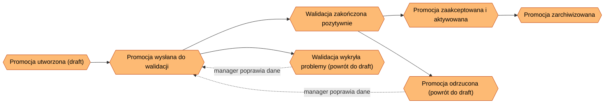
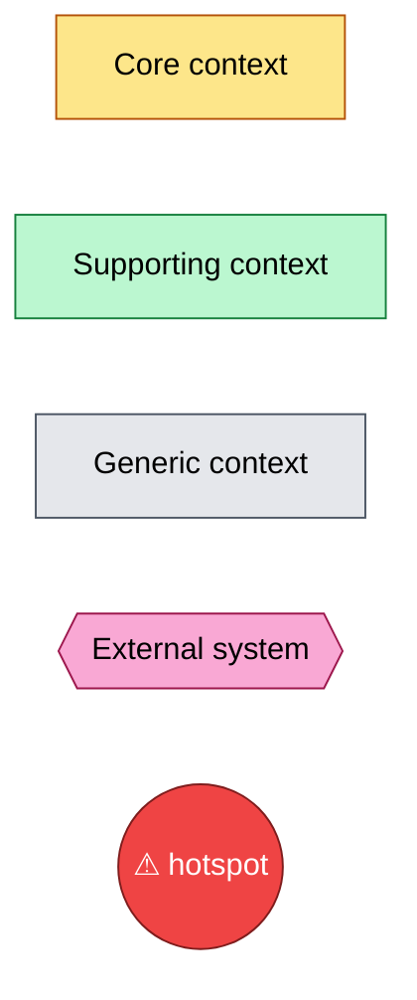
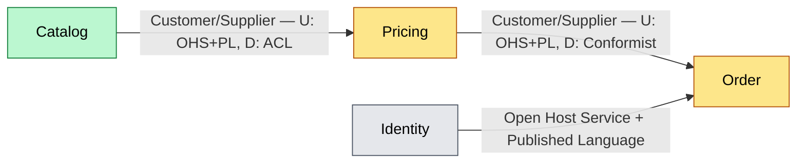
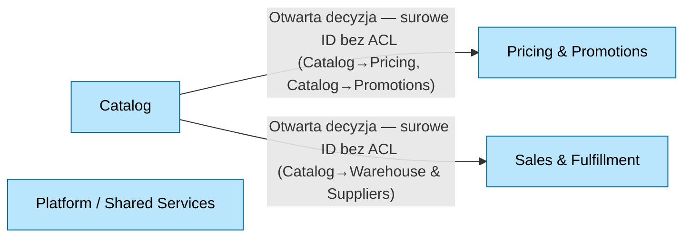

<!-- Generated by SpecStory, Markdown v2.1.0 -->

# 2026-09-01 11:29:55Z

<!-- VS Code Copilot IDE Session 6ca23107-4a40-44b8-90db-5981ed9dbee8 (2026-09-01 11:29:55Z) -->

_**User (2026-09-01 11:29:55Z)**_

/context-mapping - interactive - propose, ask me questions, propose... until i say OK, proceed to next area

---

_**Agent (copilot/claude-sonnet-5)**_

<think><details><summary>Thought Process</summary>
Prettier is available at root; it only reported ARCHITECTURE.md meaning context-map.md may already have been unchanged by formatting (no diffs needed) or printed silently. Let me confirm explicitly.
</details></think>

_**Agent (copilot/claude-sonnet-5)**_

<tool-use data-tool-type="search" data-tool-name="file_search"><details>
<summary>Tool use: **file_search**</summary>

Searched for files matching `**/docs/context-map/**`, no matches

**Input:**

- query: `docs/context-map/**`

**Result:**

```
No files found
```
</details></tool-use>

_**Agent (copilot/claude-sonnet-5)**_

<tool-use data-tool-type="search" data-tool-name="file_search"><details>
<summary>Tool use: **file_search**</summary>

Searched for files matching `**/docs/event-storming/**`, 1 match

**Input:**

- query: `docs/event-storming/**`

**Result:**

```
1 total result
c:\Projects\bottega-frontend-architecture-rossmann\docs\event-storming\utworzenie-nowej-promocji.md
```
</details></tool-use>

_**Agent (copilot/claude-sonnet-5)**_

<tool-use data-tool-type="read" data-tool-name="read_file"><details>
<summary>Tool use: **read_file**</summary>

Read `ARCHITECTURE.md`

**Input:**

- endLine: `400`
- filePath: `c:\Projects\bottega-frontend-architecture-rossmann\docs\ARCHITECTURE.md`
- startLine: `1`

**Result:**

```
# Project Architecture

> **Living document.** Aktualizowany na żywo w trakcie warsztatu, nie jest dokumentem końcowym.
> **Właściciel:** cały zespół warsztatowy (rotacyjnie, blok po bloku).
> **Stan na:**: 2026-09-01

# Kontekst biznesowy

Retail Operations Portal — system back-office do obsługi produktów, zamówień, oraz procesu promocji handlowej

# Drivery architektoniczne

| ID  | Driver                                                                              | Kategoria          | Źródło        |
| --- | ----------------------------------------------------------------------------------- | ------------------ | ------------- |
| D1  | Czas wdrożenia zmiany w regułach promocji musi spaść z ~3 tyg. do < 3 dni           | Time-to-market     | Product Owner |
| D2  | Zespoły Pricing i Catalog nie mogą wzajemnie blokować się przy wydaniu              | Autonomia zespołów | Tech Lead     |
| D3  | Częściowa awaria (np. serwis rekomendacji) nie może blokować całego ekranu promocji | Resilience         | Operacje      |
| D4  | Nowi dostawcy frontendu (zespół B2B) muszą móc dołączyć bez przepisywania shella    | Rozszerzalność     | Architekt     |

# Ownership map

| Krok procesu           | Domena | Zespół       | Pakiet |
| ---------------------- | ------ | ------------ | ------ |
| Wybór produktów        | _TBD_` | Catalog Team | _TBD_  |
| Reguły i ceny          | _TBD_  | Pricing Team | _TBD_  |
| Walidacja → akceptacja | _TBD_  | _TBD_        | _TBD_  |
| Aktywacja/publikacja   | _TBD_  | _TBD_        | _TBD_  |
| Raportowanie           | _TBD_  | _TBD_        | _TBD_  |

# Decyzje Architektoniczne (ADR)

- [Index decyzji architektonicznych](./docs/adr/index.md)
```
</details></tool-use>

_**Agent (copilot/claude-sonnet-5)**_

<tool-use data-tool-type="generic" data-tool-name="list_dir"><details>
<summary>Tool use: **list_dir**</summary>

Read `context-mapping`

**Input:**

- path: `c:\Projects\bottega-frontend-architecture-rossmann\.claude\skills\context-mapping`

**Result:**

```
assets/
SKILL.md
```
</details></tool-use>

_**Agent (copilot/claude-sonnet-5)**_

<tool-use data-tool-type="read" data-tool-name="read_file"><details>
<summary>Tool use: **read_file**</summary>

Read `utworzenie-nowej-promocji.md`

**Input:**

- endLine: `400`
- filePath: `c:\Projects\bottega-frontend-architecture-rossmann\docs\event-storming\utworzenie-nowej-promocji.md`
- startLine: `1`

**Result:**

````
# Event Storming: Utworzenie nowej promocji

## Kontekst

- **Rola / aktor:** Manager
- **Cel końcowy (end goal):** Nowa promocja jest utworzona i czeka na zatwierdzenie
- **Status:** in-progress
- **Data:** 2026-09-01

> **Uwaga metodologiczna:** ten dokument został wywnioskowany z istniejącego kodu (`PromotionWizardPage.tsx`, `PromotionDetailsPage.tsx`, `api/promotions.ts`, `store/promotionsSlice.ts`, `PromotionStatusTimeline.tsx`, `ApprovalActionBar.tsx`, `ValidationResultsPanel.tsx`), a nie z warsztatu z użytkownikiem. Wymaga potwierdzenia przez osobę merytoryczną (manager/product owner) przed uznaniem za źródło prawdy.

## Big Picture

<!-- Diagram wysokopoziomowy: łańcuch zdarzeń domenowych (E1, E2, ...) w kolejności czasowej.
     Aktualizuj po każdym kroku - dodaj nowy węzeł zdarzenia i połącz go z poprzednim. -->



## Kroki

<!-- Jeden ### Step per zdarzenie/decyzja. Skopiuj blok poniżej dla każdego nowego kroku. -->

### Step 1: Promocja utworzona i wysłana do walidacji

```mermaid
flowchart LR
  classDef actor fill:#5eead4,stroke:#0f766e,color:#000
  classDef command fill:#93c5fd,stroke:#1d4ed8,color:#000
  classDef aggregate fill:#fef08a,stroke:#b45309,color:#000
  classDef event fill:#fdba74,stroke:#c2410c,color:#000
  classDef policy fill:#d8b4fe,stroke:#6b21a8,color:#000
  classDef view fill:#86efac,stroke:#15803d,color:#000

  Actor((🧑 Manager)
… (output truncated)
````
</details></tool-use>

_**Agent (copilot/claude-sonnet-5)**_

<tool-use data-tool-type="generic" data-tool-name="list_dir"><details>
<summary>Tool use: **list_dir**</summary>

Read `assets`

**Input:**

- path: `c:\Projects\bottega-frontend-architecture-rossmann\.claude\skills\context-mapping\assets`

**Result:**

```
context-map-template.md
ddd-patterns-legend.md
example-context-map.md
```
</details></tool-use>

_**Agent (copilot/claude-sonnet-5)**_

<tool-use data-tool-type="read" data-tool-name="read_file"><details>
<summary>Tool use: **read_file**</summary>

Read skill `context-mapping`: `context-map-template.md`

**Input:**

- endLine: `300`
- filePath: `c:\Projects\bottega-frontend-architecture-rossmann\.claude\skills\context-mapping\assets\context-map-template.md`
- startLine: `1`

**Result:**

````
# Context Map: <Nazwa systemu/produktu>

> **Living document.** Aktualizowany iteracyjnie w miarę odkrywania granic, nie jest dokumentem końcowym.
> **Status:** in-progress
> **Data:** <YYYY-MM-DD>

## Wejścia źródłowe

<!-- Skąd pochodzą kandydaci na konteksty i granice - linki do event stormingu, ARCHITECTURE.md driverów, ownership map. -->

- Event storming: <linki do docs/event-storming/*.md>
- Drivery architektoniczne: <np. D1, D2 z ARCHITECTURE.md>
- Inne źródła: <kod, wywiady, istniejące ADR>

## Bounded Contexts

<!-- Jeden wiersz per kandydat na kontekst. Wypełniać dopiero po potwierdzeniu z użytkownikiem - nie zgadywać granic. -->

| Kontekst | Odpowiedzialność (1 zdanie) | Zespół / właściciel | Typ (Core/Supporting/Generic) |
| --- | --- | --- | --- |
| <Nazwa> | <...> | <...> | <...> |

## Mapa kontekstów (diagram)

<!-- Diagram zbiorczy: wszystkie konteksty jako węzły, relacje jako krawędzie z etykietą wzorca DDD.
     Zobacz assets/ddd-patterns-legend.md po pełną notację i klasyfikację core/supporting/generic. -->


## Słownik (Ubiquitous Language)

<!-- Kluczowe terminy per kontekst. Ten sam termin o różnym znaczeniu w różnych kontekstach = sygnał granicy. -->

| Termin | Definicja | Kontekst | Uwagi (homonimy/synonimy w innych kontekstach) |
| --- | --- | --- | --- |
| <termin> | <definicja właściwa dla kontekstu> | <Nazwa kontekstu> | <...> |

## Granice i odpowiedzialności

<!-- Jedna sekcja per kontekst. Kopiuj blok poniżej dla każdego nowego kontekstu. -->

### <Nazwa kontekstu>

- **W zakresie:** <co ten kontekst robi>
- **Poza zakresem:** <co świadomie NIE należy do tego kontekstu>
- **Dane własne (data o
… (output truncated)
````
</details></tool-use>

_**Agent (copilot/claude-sonnet-5)**_

<tool-use data-tool-type="read" data-tool-name="read_file"><details>
<summary>Tool use: **read_file**</summary>

Read skill `context-mapping`: `ddd-patterns-legend.md`

**Input:**

- endLine: `200`
- filePath: `c:\Projects\bottega-frontend-architecture-rossmann\.claude\skills\context-mapping\assets\ddd-patterns-legend.md`
- startLine: `1`

**Result:**

````
# DDD Context Mapping — Notation

Standard Context Mapping relationship patterns (Evans / Vernon), mapped to mermaid edges. Paste the `classDef` block at the top of every context-map diagram; only declare the classes actually used.



## Klasyfikacja kontekstu (Core Domain Chart)

| Klasa | Kolor | Znaczenie |
|---|---|---|
| Core | żółty (mustard) | Daje przewagę konkurencyjną, warto inwestować najwięcej |
| Supporting | zielony | Niezbędny, ale nie różnicujący — może być prostszy |
| Generic | szary | Rozwiązany problem, kandydat do kupienia/reużycia (np. Auth) |
| External system | różowy | Poza kontrolą zespołu (third-party, inny system) |

## Wzorce relacji między kontekstami

| Wzorzec | Skrót | Kiedy | Kierunek |
|---|---|---|---|
| Partnership | P | Dwa zespoły koordynują się jako równorzędni partnerzy, wspólny harmonogram wydań | symetryczny |
| Shared Kernel | SK | Świadomie dzielony podzbiór modelu/kodu między zespołami — zmiana wymaga zgody obu stron | symetryczny |
| Customer/Supplier | Cust/Supp | Downstream (klient) ma wpływ na priorytety upstream (dostawcy), ale nie blokuje go | upstream (U) → downstream (D) |
| Conformist | CF | Downstream akceptuje model upstream bez negocjacji i bez tłumaczenia (brak siły przetargowej) | U → D (CF po stronie D) |
| Anticorruption Layer | ACL | Downstream tłumaczy/izoluje się od modelu upstream własną warstwą adaptera | U → D (ACL po st
… (output truncated)
````
</details></tool-use>

_**Agent (copilot/claude-sonnet-5)**_

<tool-use data-tool-type="read" data-tool-name="read_file"><details>
<summary>Tool use: **read_file**</summary>

Read skill `context-mapping`: `example-context-map.md`

**Input:**

- endLine: `300`
- filePath: `c:\Projects\bottega-frontend-architecture-rossmann\.claude\skills\context-mapping\assets\example-context-map.md`
- startLine: `1`

**Result:**

````
# Context Map: Sklep internetowy (przykład ilustracyjny)

> Przykład generyczny — nie odzwierciedla rzeczywistego projektu. Służy jako wzór formatu.
> **Status:** in-progress
> **Data:** 2026-09-01

## Wejścia źródłowe

- Event storming: `docs/event-storming/zlozenie-zamowienia.md`, `docs/event-storming/zwrot-towaru.md`
- Drivery architektoniczne: D1 (time-to-market zmian cenowych), D3 (odporność na częściową awarię)

## Bounded Contexts

| Kontekst | Odpowiedzialność (1 zdanie) | Zespół / właściciel | Typ (Core/Supporting/Generic) |
| --- | --- | --- | --- |
| Catalog | Definiuje produkty, kategorie i ich atrybuty prezentacyjne | Catalog Team | Supporting |
| Pricing | Wylicza i publikuje ceny oraz reguły promocyjne | Pricing Team | Core |
| Order | Obsługuje cykl życia zamówienia klienta | Order Team | Core |
| Identity | Uwierzytelnianie i role użytkowników | Platform Team | Generic |

## Mapa kontekstów (diagram)



## Słownik (Ubiquitous Language)

| Termin | Definicja | Kontekst | Uwagi (homonimy/synonimy w innych kontekstach) |
| --- | --- | --- | --- |
| Produkt | Pozycja katalogowa z opisem, zdjęciami i kategorią | Catalog | W Pricing to samo słowo oznacza tylko `productId` + cenę bazową, bez atrybutów prezentacyjnych |
| Cena | Aktualna, obowiązująca cena po zastosowaniu reguł promocyjnych | Pricing | W Order to zamrożona `unitPriceAtOrderTime`, niezależna od późniejszych zmian w Pricing |
| Zamówienie | Zestaw poz
… (output truncated)
````
</details></tool-use>

_**Agent (copilot/claude-sonnet-5)**_

<tool-use data-tool-type="read" data-tool-name="read_file"><details>
<summary>Tool use: **read_file**</summary>

Read `routes.tsx`

**Input:**

- endLine: `200`
- filePath: `c:\Projects\bottega-frontend-architecture-rossmann\retail-operations-portal\src\routes.tsx`
- startLine: `1`

**Result:**

```
import { createBrowserRouter } from "react-router-dom";
import { AppLayout } from "@/layout/AppLayout";
import { DashboardPage } from "@/pages/DashboardPage";
import { ProductsPage } from "@/pages/ProductsPage";
import { ProductDetailsPage } from "@/pages/ProductDetailsPage";
import { PromotionsPage } from "@/pages/PromotionsPage";
import { PromotionWizardPage } from "@/pages/PromotionWizardPage";
import { PromotionDetailsPage } from "@/pages/PromotionDetailsPage";
import { PricingRulesPage } from "@/pages/PricingRulesPage";
import { ValidationQueuePage } from "@/pages/ValidationQueuePage";
import { ApprovalsPage } from "@/pages/ApprovalsPage";
import { ReportsPage } from "@/pages/ReportsPage";
import { SuppliersPage } from "@/pages/SuppliersPage";
import { OrdersPage } from "@/pages/OrdersPage";
import { WarehousePage } from "@/pages/WarehousePage";
import { CategoriesPage } from "@/pages/CategoriesPage";
import { CustomerSegmentsPage } from "@/pages/CustomerSegmentsPage";
import { ReturnsPage } from "@/pages/ReturnsPage";
import { ImportExportPage } from "@/pages/ImportExportPage";
import { NotificationsPage } from "@/pages/NotificationsPage";
import { AuditLogPage } from "@/pages/AuditLogPage";
import { UsersPage } from "@/pages/UsersPage";

export const router = createBrowserRouter([
  {
    path: "/",
    element: <AppLayout />,
    children: [
      { index: true, element: <DashboardPage /> },
      { path: "products", element: <ProductsPage /> },
      { path: "products/:id", element: <ProductDetailsPage /> },
      { path: "promotions", element: <PromotionsPage /> },
      { path: "promotions/new", element: <PromotionWizardPage /> },
      { path: "promotions/:id", element: <PromotionDetailsPage /> },
      { path: "pricing-rules", element: <PricingRulesPage /> },
      { path: "validation-queue", element: <ValidationQueuePage /> },
      { path: "approvals", element: <ApprovalsPage /> },
      { path: "reports", element:
… (output truncated)
```
</details></tool-use>

_**Agent (copilot/claude-sonnet-5)**_

<tool-use data-tool-type="read" data-tool-name="read_file"><details>
<summary>Tool use: **read_file**</summary>

Read `0000-podzial-na-moduly-domenowe.md`

**Input:**

- endLine: `200`
- filePath: `c:\Projects\bottega-frontend-architecture-rossmann\docs\adr\0000-podzial-na-moduly-domenowe.md`
- startLine: `1`

**Result:**

```
# 0000. Podział na moduły domenowe

## Status
Proponowany

## Kontekst
<!-- Jaki problem/driver architektoniczny wymusza tę decyzję?
     Odwołaj się do konkretnych driverów z ARCHITECTURE.md (np. D1, D2). -->

## Decyzja
<!-- Co dokładnie zostało/ma zostać zrobione. Jedno zdanie-teza + uzasadnienie. -->

## Rozważane alternatywy
<!-- Krótko: opcja A / opcja B / opcja C i dlaczego odrzucone. -->

## Konsekwencje
<!-- Pozytywne i negatywne skutki, kompromisy (trade-offs), co się staje trudniejsze. -->

## Powiązane
<!-- Linki do innych ADR, driverów, sekcji Ownership map. -->
```
</details></tool-use>

_**Agent (copilot/claude-sonnet-5)**_

<tool-use data-tool-type="write" data-tool-name="create_file"><details>
<summary>Tool use: **create_file**</summary>

Created `context-map.md`

**Input:**

- content:

````
# Context Map: Retail Operations Portal

> **Living document.** Aktualizowany iteracyjnie w miarę odkrywania granic, nie jest dokumentem końcowym.
> **Status:** in-progress
> **Data:** 2026-09-01

## Wejścia źródłowe

- Event storming: [docs/event-storming/utworzenie-nowej-promocji.md](../event-storming/utworzenie-nowej-promocji.md) (proces: utworzenie i akceptacja promocji)
- Drivery architektoniczne: D1 (czas wdrożenia zmian w regułach promocji), D2 (autonomia zespołów Pricing/Catalog), D3 (odporność na częściową awarię), D4 (rozszerzalność — nowi dostawcy frontendu B2B) z [ARCHITECTURE.md](../ARCHITECTURE.md)
- Ownership map (ARCHITECTURE.md): Wybór produktów → Catalog Team, Reguły i ceny → Pricing Team, pozostałe kroki `_TBD_`
- Inne źródła: struktura kodu `retail-operations-portal/src` (routes, api, store) — kandydaci wywnioskowani z modułów, wymagają potwierdzenia

## Bounded Contexts

<!-- do uzupełnienia po potwierdzeniu z użytkownikiem -->

## Mapa kontekstów (diagram)

```mermaid
flowchart LR
  classDef core fill:#fde68a,stroke:#b45309,color:#000
  classDef supporting fill:#bbf7d0,stroke:#15803d,color:#000
  classDef generic fill:#e5e7eb,stroke:#4b5563,color:#000
```

## Słownik (Ubiquitous Language)

<!-- do uzupełnienia -->

## Granice i odpowiedzialności

<!-- do uzupełnienia -->

## Relacje i integracje

<!-- do uzupełnienia -->

## Core Domain Chart

<!-- do uzupełnienia -->

## Open Questions / Hotspots / Inconsistencies

- [ ] Ownership map w ARCHITECTURE.md pokrywa tylko kroki procesu promocji (Walidacja→akceptacja, Aktywacja/publikacja, Raportowanie nadal `_TBD_`) — reszta modułów portalu (Orders, Warehouse, Suppliers, Users, ...) nie ma jeszcze przypisanego ownera. — kontekst: cały system

````

- filePath: `c:\Projects\bottega-frontend-architecture-rossmann\docs\context-map\context-map.md`

**Result:**

```
The following files were successfully edited:
c:\Projects\bottega-frontend-architecture-rossmann\docs\context-map\context-map.md
```
</details></tool-use>

_**Agent (copilot/claude-sonnet-5)**_

<tool-use data-tool-type="write" data-tool-name="textEditGroup"><details>
<summary>Edit: **context-map.md**</summary>

@@ lines 1-1 @@

````
# Context Map: Retail Operations Portal

> **Living document.** Aktualizowany iteracyjnie w miarę odkrywania granic, nie jest dokumentem końcowym.
> **Status:** in-progress
> **Data:** 2026-09-01

## Wejścia źródłowe

- Event storming: [docs/event-storming/utworzenie-nowej-promocji.md](../event-storming/utworzenie-nowej-promocji.md) (proces: utworzenie i akceptacja promocji)
- Drivery architektoniczne: D1 (czas wdrożenia zmian w regułach promocji), D2 (autonomia zespołów Pricing/Catalog), D3 (odporność na częściową awarię), D4 (rozszerzalność — nowi dostawcy frontendu B2B) z [ARCHITECTURE.md](../ARCHITECTURE.md)
- Ownership map (ARCHITECTURE.md): Wybór produktów → Catalog Team, Reguły i ceny → Pricing Team, pozostałe kroki `_TBD_`
- Inne źródła: struktura kodu `retail-operations-portal/src` (routes, api, store) — kandydaci wywnioskowani z modułów, wymagają potwierdzenia

## Bounded Contexts

<!-- do uzupełnienia po potwierdzeniu z użytkownikiem -->

## Mapa kontekstów (diagram)

```mermaid
flowchart LR
  classDef core fill:#fde68a,stroke:#b45309,color:#000
  classDef supporting fill:#bbf7d0,stroke:#15803d,color:#000
  classDef generic fill:#e5e7eb,stroke:#4b5563,color:#000
```

## Słownik (Ubiquitous Language)

<!-- do uzupełnienia -->

## Granice i odpowiedzialności

<!-- do uzupełnienia -->

## Relacje i integracje

<!-- do uzupełnienia -->

## Core Domain Chart

<!-- do uzupełnienia -->

## Open Questions / Hotspots / Inconsistencies

- [ ] Ownership map w ARCHITECTURE.md pokrywa tylko kroki procesu promocji (Walidacja→akceptacja, Aktywacja/publikacja, Raportowanie nadal `_TBD_`) — reszta modułów portalu (Orders, Warehouse, Suppliers, Users, ...) nie ma jeszcze przypisanego ownera. — kontekst: cały system

````
</details></tool-use>

_**Agent (copilot/claude-sonnet-5)**_

<tool-use data-tool-type="generic" data-tool-name="vscode_askQuestions"><details>
<summary>Tool use: **vscode_askQuestions**</summary>

Analyzing your answers...

**Input:**

- questions:

```
[
  {
    "header": "Zakres mapy",
    "options": [
      {
        "description": "Wszystkie 20 modułów z routes.tsx jako kandydaci na konteksty",
        "label": "Cały portal",
        "recommended": true
      },
      {
        "description": "Zawężamy do procesu z event stormingu (Promotion, Pricing Rules, Validation, Approval)",
        "label": "Tylko Promotions/Pricing"
      }
    ],
    "question": "Czy mapa kontekstów ma objąć cały portal (wszystkie moduły z routingu), czy tylko obszar promocji/cennika już opisany w event stormingu?"
  },
  {
    "allowFreeformInput": true,
    "header": "Kandydaci na konteksty",
    "message": "Na podstawie struktury kodu (`routes.tsx`, `api/`, `store/`) proponuję wstępne pogrupowanie modułów na kandydatów na bounded context (do potwierdzenia/korekty):\n\n1. **Catalog** — Products, ProductDetails, Categories\n2. **Pricing** — PricingRules, CustomerSegments (jeśli segmenty służą do cen)\n3. **Promotions** — Promotions, PromotionWizard, PromotionDetails, ValidationQueue\n4. **Approvals** — Approvals (cross-cutting: czy osobny kontekst, czy część Promotions?)\n5. **Orders** — Orders, Returns (czy Returns to osobny kontekst, czy podproces Orders?)\n6. **Warehouse** — Warehouse (stany magazynowe)\n7. **Suppliers** — Suppliers\n8. **Reports** — Reports (cross-cutting reporting)\n9. **Import/Export** — ImportExportPage, FileImportWidget (cross-cutting bulk ops)\n10. **Notifications** — Notifications, NotificationBell\n11. **Audit Log** — AuditLog, AuditTrailList\n12. **Identity/Users** — Users, currentUser, role-based access\n13. **Feature Flags** — featureFlags (brak własnej strony w routingu, używane jako platform capability)\n\nCzy ten podział jest OK, czy chcesz coś połączyć/rozdzielić/usunąć?",
    "question": "Czy powyższe wstępne pogrupowanie kandydatów na konteksty jest akceptowalne jako punkt startowy?"
  }
]
```


**Result:**

```
{"answers":{"Zakres mapy":{"selected":["Cały portal"],"freeText":null,"skipped":false},"Kandydaci na konteksty":{"selected":[],"freeText":"mniejsze rozbicie, które sa core, supporting (cross cutting), które generyczne","skipped":false}}}
```
</details></tool-use>

_**Agent (copilot/claude-sonnet-5)**_

<tool-use data-tool-type="generic" data-tool-name="vscode_askQuestions"><details>
<summary>Tool use: **vscode_askQuestions**</summary>

Analyzing your answers...

**Input:**

- questions:

```
[
  {
    "allowFreeformInput": true,
    "header": "Finer breakdown + classification",
    "message": "Rozbijam listę na drobniejsze konteksty (bliżej 1:1 z modułami z routingu) i proponuję wstępną klasyfikację Core/Supporting (cross-cutting)/Generic z uzasadnieniem względem driverów D1-D4:\n\n| # | Kontekst | Zakres (moduły) | Klasyfikacja | Uzasadnienie |\n|---|---|---|---|---|\n| 1 | Catalog | Products, ProductDetails, Categories | Supporting | Katalog jest niezbędny, ale nie różnicujący sam w sobie |\n| 2 | Pricing | PricingRules | Core | Bezpośrednio realizuje D1 (czas wdrożenia zmian cenowych) |\n| 3 | Customer Segments | CustomerSegments | Supporting | Segmentacja zasila targeting promocji/cen, ale nie jest samodzielną przewagą |\n| 4 | Promotions | Promotions, PromotionWizard, PromotionDetails | Core | D1 wprost dotyczy promocji; wysoka złożoność biznesowa |\n| 5 | Validation Queue | ValidationQueue | Supporting (cross-cutting) | Bramka jakości, potencjalnie reużywalna poza promocjami |\n| 6 | Approvals | Approvals, ApprovalActionBar | Supporting (cross-cutting) | Workflow akceptacji, potencjalnie reużywalny poza promocjami |\n| 7 | Orders | Orders | Core | Realizacja przychodu, wysoka złożoność |\n| 8 | Returns | Returns | Supporting | Podproces posprzedażowy, mniej złożony niż Orders |\n| 9 | Warehouse | Warehouse | Supporting | Stany magazynowe wspierają Orders/Catalog |\n| 10 | Suppliers | Suppliers | Supporting | Dane dostawców, mało zróżnicowane |\n| 11 | Reports | Reports | Generic | Rozwiązany problem, kandydat do BI/reużycia |\n| 12 | Import/Export | ImportExport, FileImportWidget | Generic | Standardowa masowa operacja na danych |\n| 13 | Notifications | Notifications, NotificationBell | Generic | Platformowa zdolność, brak zróżnicowania biznesowego |\n| 14 | Audit Log | AuditLog, AuditTrailList | Generic | Standardowy dziennik zdarzeń |\n| 15 | Identity/Users | Users, currentUser | Generic | Auth/role — kandydat do rozwiązania gotowego |\n| 16 | Feature Flags | featureFlags | Generic | Standardowa platformowa zdolność |\n\nCzy ta klasyfikacja i podział są OK? Jakie korekty (merge/split/zmiana klasy) chcesz wprowadzić?",
    "question": "Czy akceptujesz powyższy drobniejszy podział na 16 kandydatów wraz z proponowaną klasyfikacją Core/Supporting/Generic?"
  }
]
```


**Result:**

```
{"answers":{"Finer breakdown + classification":{"selected":[],"freeText":"ok, jak to podzielimy na domeny (kilka)","skipped":false}}}
```
</details></tool-use>

_**Agent (copilot/claude-sonnet-5)**_

<tool-use data-tool-type="generic" data-tool-name="vscode_askQuestions"><details>
<summary>Tool use: **vscode_askQuestions**</summary>

Analyzing your answers...

**Input:**

- questions:

```
[
  {
    "allowFreeformInput": true,
    "header": "Grupowanie w domeny",
    "message": "Driver D2 mówi wprost: \"Zespoły Pricing i Catalog nie mogą wzajemnie blokować się przy wydaniu\" — to sugeruje, że Catalog i Pricing powinny być **odrębnymi** domenami (a nie połączonymi w jedno \"Merchandising\"), skoro mają osobne zespoły i nie mogą się wzajemnie blokować.\n\nPropozycja 4 domen (grupujących 16 bounded contextów):\n\n1. **Catalog** — Catalog (Products/Categories)\n2. **Pricing \u0026 Promotions** — Pricing, Promotions, Validation Queue, Approvals, (Customer Segments?)\n3. **Sales \u0026 Fulfillment** — Orders, Returns, Warehouse, Suppliers\n4. **Platform / Shared Services** — Reports, Import/Export, Notifications, Audit Log, Identity/Users, Feature Flags\n\nOtwarte pytania do rozstrzygnięcia:\n- Czy **Customer Segments** należy do Pricing (segmentowe reguły cenowe) czy do Sales (dane o kliencie)?\n- Czy **Validation Queue** i **Approvals** to osobne konteksty w domenie Pricing \u0026 Promotions, czy powinny być w Platform jako reużywalny cross-cutting workflow dla wielu domen (nie tylko promocji)?\n- Czy **Returns** to część Sales \u0026 Fulfillment, czy osobna domena (obsługa posprzedażowa/reklamacje)?",
    "question": "Czy ten podział na 4 domeny jest OK? Jak rozstrzygnąć otwarte pytania (Customer Segments, Validation Queue/Approvals, Returns)?"
  }
]
```


**Result:**

```
{"answers":{"Grupowanie w domeny":{"selected":[],"freeText":" Customer Segments, Validation Queue i Approvals,  należy do Pricing, Returns to część Sales & Fulfillment","skipped":false}}}
```
</details></tool-use>

_**Agent (copilot/claude-sonnet-5)**_

<tool-use data-tool-type="generic" data-tool-name="vscode_askQuestions"><details>
<summary>Tool use: **vscode_askQuestions**</summary>

Analyzing your answers...

**Input:**

- questions:

```
[
  {
    "allowFreeformInput": true,
    "header": "Domena: Catalog",
    "message": "**Catalog** (1 kontekst)\n- Odpowiedzialność: definiuje produkty i kategorie oraz ich atrybuty prezentacyjne\n- Właściciel: Catalog Team (zgodnie z ownership map w ARCHITECTURE.md)\n- Test granicy: \"Produkt\" w Catalog to pełny rekord (nazwa, opis, kategoria, zdjęcia); w Pricing/Promotions to prawdopodobnie tylko referencja `productId` — potwierdzasz, że to różne znaczenia (sygnał realnej granicy)?",
    "question": "Czy odpowiedzialność, właściciel i test granicy dla Catalog są poprawne?"
  },
  {
    "allowFreeformInput": true,
    "header": "Domena: Pricing \u0026 Promotions",
    "message": "5 kontekstów, wszystkie proponowane jako własność **Pricing Team** (czy to poprawne, czy Promotions/Validation/Approvals mają innego właściciela?):\n\n- **Pricing** — wylicza i definiuje reguły cenowe (`PricingRule`)\n- **Promotions** — zarządza cyklem życia promocji (draft → walidacja → akceptacja → aktywna → zarchiwizowana)\n- **Customer Segments** — definiuje segmenty klientów używane do targetowania cen/promocji\n- **Validation Queue** — bramka jakości przed akceptacją promocji (sprawdza kompletność danych)\n- **Approvals** — workflow akceptacji/odrzucenia promocji (rola admin/manager)\n\nTest granicy: czy \"Reguła\" (`PricingRule`) w Pricing oznacza co innego niż w Promotions (gdzie promocja tylko *referuje* `pricingRuleIds`, nie definiuje ich)?",
    "question": "Czy odpowiedzialności i właściciel (Pricing Team dla wszystkich 5) są poprawne dla domeny Pricing \u0026 Promotions?"
  },
  {
    "allowFreeformInput": true,
    "header": "Domena: Sales \u0026 Fulfillment",
    "message": "4 konteksty — potrzebuję nazwy zespołu/właściciela (w ARCHITECTURE.md brak wpisu dla tej domeny):\n\n- **Orders** — obsługuje cykl życia zamówienia klienta\n- **Returns** — obsługa zwrotów towaru (podproces posprzedażowy)\n- **Warehouse** — stany magazynowe\n- **Suppliers** — dane i relacje z dostawcami\n\nCzy to jeden właściciel (np. \"Sales \u0026 Fulfillment Team\") dla wszystkich 4, czy różni właściciele per kontekst? Test granicy: czy \"Zwrot\" (Returns) odwołuje się do `Order` jako referencja (obcy model), czy ma własny, niezależny model danych?",
    "question": "Jaki jest właściciel/zespół dla Sales \u0026 Fulfillment i czy odpowiedzialności są poprawne?"
  },
  {
    "allowFreeformInput": true,
    "header": "Domena: Platform / Shared Services",
    "message": "6 kontekstów — propozycja: jeden właściciel \"Platform Team\":\n\n- **Reports** — raportowanie zbiorcze (krok \"Raportowanie\" z ownership map — wciąż `_TBD_`)\n- **Import/Export** — masowy import/eksport danych (pliki)\n- **Notifications** — powiadomienia użytkownika w aplikacji\n- **Audit Log** — dziennik zdarzeń/akcji użytkowników\n- **Identity/Users** — uwierzytelnianie, role, zarządzanie użytkownikami\n- **Feature Flags** — włączanie/wyłączanie funkcji\n\nCzy Platform Team to poprawny właściciel dla wszystkich 6, czy np. Identity/Users powinno mieć osobnego właściciela (Security/IAM)?",
    "question": "Czy odpowiedzialności i właściciel (Platform Team) dla Platform/Shared Services są poprawne?"
  }
]
```


**Result:**

```
{"answers":{"Domena: Catalog":{"selected":[],"freeText":"produkty i kategorie - zmienmy na jeden kontekst,  granica z pricing OK","skipped":false},"Domena: Pricing & Promotions":{"selected":[],"freeText":"Reguła - do doprecyzowania potem","skipped":false},"Domena: Sales & Fulfillment":{"selected":[],"freeText":"Czy to jeden właściciel (np. \"Sales & Fulfillment Team\"),  2 konteksty - Orders + Return , oraz Warehouse + Suppliers","skipped":false},"Domena: Platform / Shared Services":{"selected":[],"freeText":"Platform Team, ","skipped":false}}}
```
</details></tool-use>

_**Agent (copilot/claude-sonnet-5)**_

<tool-use data-tool-type="write" data-tool-name="textEditGroup"><details>
<summary>Edit: **context-map.md**</summary>

@@ lines 16-24 @@

````
| Kontekst | Odpowiedzialność (1 zdanie) | Zespół / właściciel | Typ (Core/Supporting/Generic) | Domena |
| --- | --- | --- | --- | --- |
| Catalog | Definiuje produkty i kategorie oraz ich atrybuty prezentacyjne | Catalog Team | Supporting | Catalog |
| Pricing | Definiuje i wylicza reguły cenowe (`PricingRule`) | Pricing Team | Core | Pricing & Promotions |
| Promotions | Zarządza cyklem życia promocji (draft → walidacja → akceptacja → aktywna → zarchiwizowana) | Pricing Team | Core | Pricing & Promotions |
| Customer Segments | Definiuje segmenty klientów używane do targetowania cen/promocji | Pricing Team | Supporting | Pricing & Promotions |
| Validation Queue | Bramka jakości sprawdzająca kompletność danych promocji przed akceptacją | Pricing Team | Supporting (cross-cutting) | Pricing & Promotions |
| Approvals | Workflow akceptacji/odrzucenia promocji (rola admin/manager) | Pricing Team | Supporting (cross-cutting) | Pricing & Promotions |
| Orders & Returns | Obsługuje cykl życia zamówienia klienta wraz z procesem zwrotu towaru | Sales & Fulfillment Team | Core | Sales & Fulfillment |
| Warehouse & Suppliers | Zarządza stanami magazynowymi oraz danymi i relacjami z dostawcami | Sales & Fulfillment Team | Supporting | Sales & Fulfillment |
| Reports | Raportowanie zbiorcze na podstawie danych innych kontekstów | Platform Team | Generic | Platform / Shared Services |
| Import/Export | Masowy import/eksport danych (pliki) | Platform Team | Generic | Platform / Shared Services |
| Notifications | Powiadomienia użytkownika w aplikacji | Platform Team | Generic | Platform / Shared Services |
| Audit Log | Dziennik zdarzeń/akcji użytkowników | Platform Team | Generic | Platform / Shared Services |
| Identity/Users | Uwierzytelnianie, role, zarządzanie użytkownikami | Platform Team | Generic | Platform / Shared Services |
| Feature Flags | Włączanie/wyłączanie funkcji | Platform Team | Generic | Platform / Shared Services |

> Uwaga: "Reguła" (`PricingRule`) — test granicy Pricing vs Promotions do doprecyzowania w kroku Słownik.

## Mapa kontekstów (diagram)

```mermaid
flowchart LR
  classDef core fill:#fde68a,stroke:#b45309,color:#000
  classDef supporting fill:#bbf7d0,stroke:#15803d,color:#000
  classDef generic fill:#e5e7eb,stroke:#4b5563,color:#000

  subgraph Catalog_domain["Catalog"]
    Catalog[Catalog]:::supporting
  end

  subgraph Pricing_domain["Pricing & Promotions"]
    Pricing[Pricing]:::core
    Promotions[Promotions]:::core
    CustomerSegments[Customer Segments]:::supporting
    ValidationQueue[Validation Queue]:::supporting
    Approvals[Approvals]:::supporting
  end

  subgraph Sales_domain["Sales & Fulfillment"]
    OrdersReturns[Orders & Returns]:::core
    WarehouseSuppliers[Warehouse & Suppliers]:::supporting
  end

  subgraph Platform_domain["Platform / Shared Services"]
    Reports[Reports]:::generic
    ImportExport[Import/Export]:::generic
    Notifications[Notifications]:::generic
    AuditLog[Audit Log]:::generic
    Identity[Identity/Users]:::generic
    FeatureFlags[Feature Flags]:::generic
  end
````
</details></tool-use>

_**Agent (copilot/claude-sonnet-5)**_

<tool-use data-tool-type="generic" data-tool-name="vscode_askQuestions"><details>
<summary>Tool use: **vscode_askQuestions**</summary>

Analyzing your answers...

**Input:**

- questions:

```
[
  {
    "header": "Zatwierdzenie Bounded Contexts",
    "options": [
      {
        "label": "OK, przéjdźmy do Słownika",
        "recommended": true
      },
      {
        "label": "Chcę jeszcze coś poprawić w Bounded Contexts"
      }
    ],
    "question": "Zapisałem 14 bounded contextów w 4 domenach (tabela + diagram w context-map.md). Czy to zamyka sekcję Bounded Contexts i możemy przejść do następnego obszaru — Słownik (Ubiquitous Language)?"
  }
]
```


**Result:**

```
{"answers":{"Zatwierdzenie Bounded Contexts":{"selected":[],"freeText":"poddziel tabele bounded context na kilka tabel wg. nazw domen","skipped":false}}}
```
</details></tool-use>

_**Agent (copilot/claude-sonnet-5)**_

<tool-use data-tool-type="write" data-tool-name="textEditGroup"><details>
<summary>Edit: **context-map.md**</summary>

@@ lines 16-33 @@

```
### Domena: Catalog

| Kontekst | Odpowiedzialność (1 zdanie) | Zespół / właściciel | Typ (Core/Supporting/Generic) |
| --- | --- | --- | --- |
| Catalog | Definiuje produkty i kategorie oraz ich atrybuty prezentacyjne | Catalog Team | Supporting |

### Domena: Pricing & Promotions

| Kontekst | Odpowiedzialność (1 zdanie) | Zespół / właściciel | Typ (Core/Supporting/Generic) |
| --- | --- | --- | --- |
| Pricing | Definiuje i wylicza reguły cenowe (`PricingRule`) | Pricing Team | Core |
| Promotions | Zarządza cyklem życia promocji (draft → walidacja → akceptacja → aktywna → zarchiwizowana) | Pricing Team | Core |
| Customer Segments | Definiuje segmenty klientów używane do targetowania cen/promocji | Pricing Team | Supporting |
| Validation Queue | Bramka jakości sprawdzająca kompletność danych promocji przed akceptacją | Pricing Team | Supporting (cross-cutting) |
| Approvals | Workflow akceptacji/odrzucenia promocji (rola admin/manager) | Pricing Team | Supporting (cross-cutting) |

> Uwaga: "Reguła" (`PricingRule`) — test granicy Pricing vs Promotions do doprecyzowania w kroku Słownik.

### Domena: Sales & Fulfillment

| Kontekst | Odpowiedzialność (1 zdanie) | Zespół / właściciel | Typ (Core/Supporting/Generic) |
| --- | --- | --- | --- |
| Orders & Returns | Obsługuje cykl życia zamówienia klienta wraz z procesem zwrotu towaru | Sales & Fulfillment Team | Core |
| Warehouse & Suppliers | Zarządza stanami magazynowymi oraz danymi i relacjami z dostawcami | Sales & Fulfillment Team | Supporting |

### Domena: Platform / Shared Services

| Kontekst | Odpowiedzialność (1 zdanie) | Zespół / właściciel | Typ (Core/Supporting/Generic) |
| --- | --- | --- | --- |
| Reports | Raportowanie zbiorcze na podstawie danych innych kontekstów | Platform Team | Generic |
| Import/Export | Masowy import/eksport danych (pliki) | Platform Team | Generic |
| Notifications | Powiadomienia użytkownika w aplikacji | Platform Team | Generic |
| Audit Log | Dziennik zdarzeń/akcji użytkowników | Platform Team | Generic |
| Identity/Users | Uwierzytelnianie, role, zarządzanie użytkownikami | Platform Team | Generic |
| Feature Flags | Włączanie/wyłączanie funkcji | Platform Team | Generic |
```
</details></tool-use>

_**Agent (copilot/claude-sonnet-5)**_

<tool-use data-tool-type="generic" data-tool-name="vscode_askQuestions"><details>
<summary>Tool use: **vscode_askQuestions**</summary>

Created 3 todos

**Input:**

- questions:

```
[
  {
    "header": "Sync do ARCHITECTURE.md",
    "options": [
      {
        "label": "Tak, zsynchronizuj Ownership map",
        "recommended": true
      },
      {
        "label": "Nie, zostaw ARCHITECTURE.md bez zmian"
      }
    ],
    "question": "Czy zsynchronizować potwierdzone konteksty/właścicieli do tabeli Ownership map w ARCHITECTURE.md (zastępując `_TBD_`)?"
  },
  {
    "header": "ADR dla otwartych decyzji",
    "options": [
      {
        "label": "Tak, wskaż które",
        "recommended": true
      },
      {
        "label": "Nie teraz"
      }
    ],
    "question": "Zidentyfikowaliśmy 2 kandydatów na ADR: (1) wzorzec integracji Catalog↔Pricing/Promotions/Warehouse (sprzeczność z D2), (2) rozdzielenie Validation/Approvals na własne agregaty. Czy chcesz teraz przejść do tworzenia/aktualizacji ADR (skill adr-management) dla któregoś z nich?"
  }
]
```


**Result:**

```
ERROR: Your input to the tool was invalid (must NOT have more than 200 characters)
Please check your input and try again.
```
</details></tool-use>

_**Agent (copilot/claude-sonnet-5)**_

Bounded Contexts split into 4 per-domain tables (Catalog, Pricing & Promotions, Sales & Fulfillment, Platform / Shared Services). 

_**Agent (copilot/claude-sonnet-5)**_

<tool-use data-tool-type="generic" data-tool-name="vscode_askQuestions"><details>
<summary>Tool use: **vscode_askQuestions**</summary>

Analyzing your answers...

**Input:**

- questions:

```
[
  {
    "header": "Zatwierdzenie Bounded Contexts",
    "options": [
      {
        "label": "OK, przejdźmy do Słownika",
        "recommended": true
      },
      {
        "label": "Chcę jeszcze coś poprawić"
      }
    ],
    "question": "Tabela Bounded Contexts jest teraz podzielona na 4 tabele wg domen. Czy to zamyka sekcję i przechodzimy do Słownika (Ubiquitous Language)?"
  }
]
```


**Result:**

```
{"answers":{"Zatwierdzenie Bounded Contexts":{"selected":["OK, przejdźmy do Słownika"],"freeText":null,"skipped":false}}}
```
</details></tool-use>

_**Agent (copilot/claude-sonnet-5)**_

<tool-use data-tool-type="read" data-tool-name="read_file"><details>
<summary>Tool use: **read_file**</summary>

Read `customerSegments.ts`

**Input:**

- endLine: `60`
- filePath: `c:\Projects\bottega-frontend-architecture-rossmann\retail-operations-portal\src\api\customerSegments.ts`
- startLine: `1`

**Result:**

```
import customerSegmentsRaw from "@/mock-data/customerSegments.json";
import type { CustomerSegment } from "@/types";
import { delay } from "./delay";

const db = new Map<string, CustomerSegment>(customerSegmentsRaw.map((s) => [s.id, s]));

export async function listCustomerSegments(): Promise<CustomerSegment[]> {
  await delay();
  return [...db.values()];
}
```
</details></tool-use>

_**Agent (copilot/claude-sonnet-5)**_

<tool-use data-tool-type="read" data-tool-name="read_file"><details>
<summary>Tool use: **read_file**</summary>

Read `categories.ts`

**Input:**

- endLine: `50`
- filePath: `c:\Projects\bottega-frontend-architecture-rossmann\retail-operations-portal\src\api\categories.ts`
- startLine: `1`

**Result:**

```
import categoriesRaw from "@/mock-data/categories.json";
import type { Category } from "@/types";
import { delay } from "./delay";

const db = new Map<string, Category>(categoriesRaw.map((c) => [c.id, c]));

export async function listCategories(): Promise<Category[]> {
  await delay();
  return [...db.values()];
}
```
</details></tool-use>

_**Agent (copilot/claude-sonnet-5)**_

<tool-use data-tool-type="read" data-tool-name="read_file"><details>
<summary>Tool use: **read_file**</summary>

Read `pricingRules.ts`

**Input:**

- endLine: `60`
- filePath: `c:\Projects\bottega-frontend-architecture-rossmann\retail-operations-portal\src\api\pricingRules.ts`
- startLine: `1`

**Result:**

```
import pricingRulesRaw from "@/mock-data/pricingRules.json";
import type { PricingRule } from "@/types";
import { delay } from "./delay";

const db = new Map<string, PricingRule>(pricingRulesRaw.map((r) => [r.id, r as PricingRule]));

export async function listPricingRules(): Promise<PricingRule[]> {
  await delay();
  return [...db.values()];
}

export async function getPricingRule(id: string): Promise<PricingRule | null> {
  await delay();
  return db.get(id) ?? null;
}

export async function addPricingRule(rule: Omit<PricingRule, "id">): Promise<PricingRule> {
  await delay();
  const id = `pr-${db.size + 1}-${Date.now()}`;
  const next: PricingRule = { ...rule, id };
  db.set(id, next);
  return next;
}

export async function removePricingRule(id: string): Promise<void> {
  await delay();
  db.delete(id);
}
```
</details></tool-use>

_**Agent (copilot/claude-sonnet-5)**_

<tool-use data-tool-type="read" data-tool-name="read_file"><details>
<summary>Tool use: **read_file**</summary>

Read `products.ts`

**Input:**

- endLine: `50`
- filePath: `c:\Projects\bottega-frontend-architecture-rossmann\retail-operations-portal\src\api\products.ts`
- startLine: `1`

**Result:**

```
import productsRaw from "@/mock-data/products.json";
import type { Product } from "@/types";
import { delay } from "./delay";

const db = new Map<string, Product>(productsRaw.map((p) => [p.id, p as Product]));

export async function listProducts(): Promise<Product[]> {
  await delay();
  return [...db.values()];
}

export async function getProduct(id: string): Promise<Product | null> {
  await delay();
  return db.get(id) ?? null;
}

export async function updateProduct(id: string, patch: Partial<Product>): Promise<Product> {
  await delay();
  const current = db.get(id);
  if (!current) throw new Error(`Product ${id} not found`);
  const next = { ...current, ...patch };
  db.set(id, next);
  return next;
}

// Stub: real implementation would parse the file and upsert rows into `db`.
export async function importProductsFromCsv(_file: File): Promise<{ imported: number }> {
  await delay(600);
  return { imported: 0 };
}

export async function exportProducts(): Promise<Product[]> {
  await delay(400);
  return [...db.values()];
}
```
</details></tool-use>

_**Agent (copilot/claude-sonnet-5)**_

<tool-use data-tool-type="read" data-tool-name="read_file"><details>
<summary>Tool use: **read_file**</summary>

Read `orders.ts`

**Input:**

- endLine: `50`
- filePath: `c:\Projects\bottega-frontend-architecture-rossmann\retail-operations-portal\src\api\orders.ts`
- startLine: `1`

**Result:**

```
import ordersRaw from "@/mock-data/orders.json";
import type { Order } from "@/types";
import { delay } from "./delay";

const db = new Map<string, Order>(ordersRaw.map((o) => [o.id, o as Order]));

export async function listOrders(): Promise<Order[]> {
  await delay();
  return [...db.values()];
}

export async function approveOrder(id: string): Promise<Order> {
  await delay();
  const current = db.get(id);
  if (!current) throw new Error(`Order ${id} not found`);
  const next: Order = { ...current, status: "approved" };
  db.set(id, next);
  return next;
}

export async function cancelOrder(id: string, _reason: string): Promise<Order> {
  await delay();
  const current = db.get(id);
  if (!current) throw new Error(`Order ${id} not found`);
  const next: Order = { ...current, status: "cancelled" };
  db.set(id, next);
  return next;
}
```
</details></tool-use>

_**Agent (copilot/claude-sonnet-5)**_

<tool-use data-tool-type="read" data-tool-name="read_file"><details>
<summary>Tool use: **read_file**</summary>

Read `returns.ts`

**Input:**

- endLine: `50`
- filePath: `c:\Projects\bottega-frontend-architecture-rossmann\retail-operations-portal\src\api\returns.ts`
- startLine: `1`

**Result:**

```
import returnsRaw from "@/mock-data/returns.json";
import type { ReturnRequest, ReturnStatus } from "@/types";
import { delay } from "./delay";

const db = new Map<string, ReturnRequest>(returnsRaw.map((r) => [r.id, r as ReturnRequest]));

export async function listReturns(): Promise<ReturnRequest[]> {
  await delay();
  return [...db.values()];
}

export async function updateReturnStatus(id: string, status: ReturnStatus): Promise<ReturnRequest> {
  await delay();
  const current = db.get(id);
  if (!current) throw new Error(`Return ${id} not found`);
  const next = { ...current, status };
  db.set(id, next);
  return next;
}
```
</details></tool-use>

_**Agent (copilot/claude-sonnet-5)**_

<tool-use data-tool-type="read" data-tool-name="read_file"><details>
<summary>Tool use: **read_file**</summary>

Read `warehouse.ts`

**Input:**

- endLine: `50`
- filePath: `c:\Projects\bottega-frontend-architecture-rossmann\retail-operations-portal\src\api\warehouse.ts`
- startLine: `1`

**Result:**

```
import warehouseRaw from "@/mock-data/warehouse.json";
import type { WarehouseStock } from "@/types";
import { delay } from "./delay";

const db = new Map<string, WarehouseStock>(warehouseRaw.map((w) => [w.id, w as WarehouseStock]));

export async function listWarehouseStock(): Promise<WarehouseStock[]> {
  await delay();
  return [...db.values()];
}

export async function getStockForProduct(productId: string): Promise<WarehouseStock[]> {
  await delay();
  return [...db.values()].filter((w) => w.productId === productId);
}

export async function adjustStock(id: string, delta: number): Promise<WarehouseStock> {
  await delay();
  const current = db.get(id);
  if (!current) throw new Error(`Warehouse record ${id} not found`);
  const next = { ...current, quantity: current.quantity + delta };
  db.set(id, next);
  return next;
}
```
</details></tool-use>

_**Agent (copilot/claude-sonnet-5)**_

<tool-use data-tool-type="read" data-tool-name="read_file"><details>
<summary>Tool use: **read_file**</summary>

Read `suppliers.ts`

**Input:**

- endLine: `50`
- filePath: `c:\Projects\bottega-frontend-architecture-rossmann\retail-operations-portal\src\api\suppliers.ts`
- startLine: `1`

**Result:**

```
import suppliersRaw from "@/mock-data/suppliers.json";
import type { Supplier } from "@/types";
import { delay } from "./delay";

const db = new Map<string, Supplier>(suppliersRaw.map((s) => [s.id, s as Supplier]));

export async function listSuppliers(): Promise<Supplier[]> {
  await delay();
  return [...db.values()];
}

export async function getSupplier(id: string): Promise<Supplier | null> {
  await delay();
  return db.get(id) ?? null;
}

export async function updateSupplier(id: string, patch: Partial<Supplier>): Promise<Supplier> {
  await delay();
  const current = db.get(id);
  if (!current) throw new Error(`Supplier ${id} not found`);
  const next = { ...current, ...patch };
  db.set(id, next);
  return next;
}
```
</details></tool-use>

_**Agent (copilot/claude-sonnet-5)**_

<tool-use data-tool-type="read" data-tool-name="read_file"><details>
<summary>Tool use: **read_file**</summary>

Read `users.ts`

**Input:**

- endLine: `50`
- filePath: `c:\Projects\bottega-frontend-architecture-rossmann\retail-operations-portal\src\api\users.ts`
- startLine: `1`

**Result:**

```
import usersRaw from "@/mock-data/users.json";
import type { User, UserRole } from "@/types";
import { delay } from "./delay";

const db = new Map<string, User>(usersRaw.map((u) => [u.id, u as User]));

export async function listUsers(): Promise<User[]> {
  await delay();
  return [...db.values()];
}

export async function assignUserRole(id: string, role: UserRole): Promise<User> {
  await delay();
  const current = db.get(id);
  if (!current) throw new Error(`User ${id} not found`);
  const next = { ...current, role };
  db.set(id, next);
  return next;
}
```
</details></tool-use>

_**Agent (copilot/claude-sonnet-5)**_

<tool-use data-tool-type="read" data-tool-name="read_file"><details>
<summary>Tool use: **read_file**</summary>

Read `notifications.ts`

**Input:**

- endLine: `50`
- filePath: `c:\Projects\bottega-frontend-architecture-rossmann\retail-operations-portal\src\api\notifications.ts`
- startLine: `1`

**Result:**

```
import notificationsRaw from "@/mock-data/notifications.json";
import type { Notification } from "@/types";
import { delay } from "./delay";

const db = new Map<string, Notification>(notificationsRaw.map((n) => [n.id, n as Notification]));

export async function listNotifications(): Promise<Notification[]> {
  await delay();
  return [...db.values()];
}

export async function markNotificationRead(id: string): Promise<Notification> {
  await delay();
  const current = db.get(id);
  if (!current) throw new Error(`Notification ${id} not found`);
  const next = { ...current, read: true };
  db.set(id, next);
  return next;
}
```
</details></tool-use>

_**Agent (copilot/claude-sonnet-5)**_

<tool-use data-tool-type="read" data-tool-name="read_file"><details>
<summary>Tool use: **read_file**</summary>

Read `auditLog.ts`

**Input:**

- endLine: `50`
- filePath: `c:\Projects\bottega-frontend-architecture-rossmann\retail-operations-portal\src\api\auditLog.ts`
- startLine: `1`

**Result:**

```
import auditLogRaw from "@/mock-data/auditLog.json";
import type { AuditLogEntry } from "@/types";
import { delay } from "./delay";

const db = new Map<string, AuditLogEntry>(auditLogRaw.map((a) => [a.id, a as AuditLogEntry]));

export async function listAuditLog(): Promise<AuditLogEntry[]> {
  await delay();
  return [...db.values()].sort((a, b) => b.timestamp.localeCompare(a.timestamp));
}

export async function addAuditLogEntry(entry: Omit<AuditLogEntry, "id">): Promise<AuditLogEntry> {
  await delay();
  const id = `audit-${db.size + 1}-${Date.now()}`;
  const next: AuditLogEntry = { ...entry, id };
  db.set(id, next);
  return next;
}
```
</details></tool-use>

_**Agent (copilot/claude-sonnet-5)**_

<tool-use data-tool-type="read" data-tool-name="read_file"><details>
<summary>Tool use: **read_file**</summary>

Read `featureFlags.ts`

**Input:**

- endLine: `50`
- filePath: `c:\Projects\bottega-frontend-architecture-rossmann\retail-operations-portal\src\api\featureFlags.ts`
- startLine: `1`

**Result:**

```
import featureFlagsRaw from "@/mock-data/featureFlags.json";
import type { FeatureFlag } from "@/types";
import { delay } from "./delay";

const db = new Map<string, FeatureFlag>(featureFlagsRaw.map((f) => [f.key, f]));

export async function listFeatureFlags(): Promise<FeatureFlag[]> {
  await delay();
  return [...db.values()];
}

export async function toggleFeatureFlag(key: string, enabled: boolean): Promise<FeatureFlag> {
  await delay();
  const current = db.get(key);
  if (!current) throw new Error(`Feature flag ${key} not found`);
  const next = { ...current, enabled };
  db.set(key, next);
  return next;
}
```
</details></tool-use>

_**Agent (copilot/claude-sonnet-5)**_

<tool-use data-tool-type="read" data-tool-name="read_file"><details>
<summary>Tool use: **read_file**</summary>

Read `types.ts`

**Input:**

- endLine: `250`
- filePath: `c:\Projects\bottega-frontend-architecture-rossmann\retail-operations-portal\src\types.ts`
- startLine: `1`

**Result:**

```
// Shared DTOs used across every domain — intentionally one flat file (brownfield anti-pattern).
export type ID = string;

export interface Category {
  id: ID;
  name: string;
}

export interface Product {
  id: ID;
  sku: string;
  name: string;
  categoryId: ID;
  price: number;
  unit: string;
  status: "active" | "inactive";
}

export interface Supplier {
  id: ID;
  name: string;
  contactEmail: string;
  country: string;
  status: "active" | "inactive";
}

export type OrderStatus = "new" | "approved" | "shipped" | "cancelled";

export interface Order {
  id: ID;
  orderNumber: string;
  customerName: string;
  total: number;
  status: OrderStatus;
  createdAt: string;
}

export interface WarehouseStock {
  id: ID;
  productId: ID;
  location: string;
  quantity: number;
  reserved: number;
}

export interface PricingRule {
  id: ID;
  name: string;
  type: "percentage" | "fixed" | "bundle";
  value: number;
  categoryId?: ID;
  active: boolean;
}

export type PromotionStatus =
  | "draft"
  | "pending_validation"
  | "pending_approval"
  | "active"
  | "archived";

export interface ValidationResult {
  passed: boolean;
  issues: string[];
  checkedAt: string;
}

export interface Promotion {
  id: ID;
  name: string;
  status: PromotionStatus;
  productIds: ID[];
  pricingRuleIds: ID[];
  startDate: string;
  endDate: string;
  createdBy: string;
  validation?: ValidationResult;
  approvedBy?: string;
  activatedAt?: string;
}

export interface CustomerSegment {
  id: ID;
  name: string;
  description: string;
  criteria: string;
}

export type ReturnStatus = "requested" | "approved" | "rejected" | "refunded";

export interface ReturnRequest {
  id: ID;
  orderId: ID;
  reason: string;
  status: ReturnStatus;
  createdAt: string;
}

export interface Notification {
  id: ID;
  message: string;
  read: boolean;
  createdAt: string;
  type: "info" | "warning" | 
… (output truncated)
```
</details></tool-use>

_**Agent (copilot/claude-sonnet-5)**_

<tool-use data-tool-type="read" data-tool-name="read_file"><details>
<summary>Tool use: **read_file**</summary>

Read `ApprovalsPage.tsx`

**Input:**

- endLine: `80`
- filePath: `c:\Projects\bottega-frontend-architecture-rossmann\retail-operations-portal\src\pages\ApprovalsPage.tsx`
- startLine: `1`

**Result:**

```
import { Link } from "react-router-dom";
import { toast } from "sonner";
import { Card, CardContent, CardHeader, CardTitle } from "@/components/ui/card";
import { DataTable } from "@/components/DataTable";
import { ApprovalActionBar } from "@/components/ApprovalActionBar";
import { listPromotions, approvePromotion, rejectPromotion } from "@/api/promotions";
import { setPromotions, upsertPromotion } from "@/store/promotionsSlice";
import { useAppDispatch, useAppSelector } from "@/store/hooks";
import { useLoadList } from "@/store/useLoadList";

// Route guard target for Dzień 3 (Blok A2) — only admin/manager can act here.
export function ApprovalsPage() {
  const dispatch = useAppDispatch();
  const allPromotions = useAppSelector((s) => s.promotions.items);
  const promotions = allPromotions.filter((p) => p.status === "pending_approval");
  useLoadList(useAppSelector((s) => s.promotions.loaded), listPromotions, setPromotions);

  return (
    <Card>
      <CardHeader>
        <CardTitle>Kolejka akceptacji</CardTitle>
      </CardHeader>
      <CardContent>
        <DataTable
          columns={[
            {
              key: "name",
              header: "Promocja",
              render: (p) => (
                <Link to={`/promotions/${p.id}`} className="hover:underline">
                  {p.name}
                </Link>
              ),
            },
            { key: "createdBy", header: "Utworzył", render: (p) => p.createdBy },
            {
              key: "action",
              header: "",
              render: (p) => (
                <ApprovalActionBar
                  onApprove={async () => {
                    const updated = await approvePromotion(p.id, "Jan Kowalski");
                    dispatch(upsertPromotion(updated));
                    toast.success(`Zaakceptowano "${p.name}"`);
                  }}
                  onReject={async () => {
                    const updated = await rejectPr
… (output truncated)
```
</details></tool-use>

_**Agent (copilot/claude-sonnet-5)**_

<tool-use data-tool-type="read" data-tool-name="read_file"><details>
<summary>Tool use: **read_file**</summary>

Read `ValidationQueuePage.tsx`

**Input:**

- endLine: `80`
- filePath: `c:\Projects\bottega-frontend-architecture-rossmann\retail-operations-portal\src\pages\ValidationQueuePage.tsx`
- startLine: `1`

**Result:**

```
import { Link } from "react-router-dom";
import { Button } from "@/components/ui/button";
import { Card, CardContent, CardHeader, CardTitle } from "@/components/ui/card";
import { DataTable } from "@/components/DataTable";
import { StatusBadge } from "@/components/StatusBadge";
import { listPromotions, runValidation } from "@/api/promotions";
import { setPromotions, upsertPromotion } from "@/store/promotionsSlice";
import { useAppDispatch, useAppSelector } from "@/store/hooks";
import { useLoadList } from "@/store/useLoadList";

// Shared workflow queue — same "walidacja" mechanism could later be reused by other domains (e.g. orders).
export function ValidationQueuePage() {
  const dispatch = useAppDispatch();
  const allPromotions = useAppSelector((s) => s.promotions.items);
  const promotions = allPromotions.filter((p) => p.status === "pending_validation");
  useLoadList(useAppSelector((s) => s.promotions.loaded), listPromotions, setPromotions);

  return (
    <Card>
      <CardHeader>
        <CardTitle>Kolejka walidacji</CardTitle>
      </CardHeader>
      <CardContent>
        <DataTable
          columns={[
            {
              key: "name",
              header: "Promocja",
              render: (p) => (
                <Link to={`/promotions/${p.id}`} className="hover:underline">
                  {p.name}
                </Link>
              ),
            },
            { key: "status", header: "Status", render: (p) => <StatusBadge status={p.status} /> },
            {
              key: "action",
              header: "",
              render: (p) => (
                <Button
                  size="sm"
                  onClick={async () => {
                    const updated = await runValidation(p.id);
                    dispatch(upsertPromotion(updated));
                  }}
                >
                  Uruchom walidację
                </Button>
              ),
            },
      
… (output truncated)
```
</details></tool-use>

_**Agent (copilot/claude-sonnet-5)**_

<tool-use data-tool-type="generic" data-tool-name="vscode_askQuestions"><details>
<summary>Tool use: **vscode_askQuestions**</summary>

Analyzing your answers...

**Input:**

- questions:

```
[
  {
    "allowFreeformInput": true,
    "header": "Słownik: Catalog",
    "message": "Na podstawie `types.ts`/`api/products.ts`/`api/categories.ts`:\n\n- **Produkt** — pełny rekord: `sku`, `name`, `categoryId`, `price`, `unit`, `status` (active/inactive). Kontekst: Catalog.\n- **Kategoria** — bardzo płaski rekord: tylko `id` + `name` (brak hierarchii/atrybutów w obecnym modelu). Kontekst: Catalog.\n\nCzy te definicje są poprawne / czy dodać jeszcze jakiś termin?",
    "question": "Czy zatwierdzasz te 2 terminy dla Catalog?"
  },
  {
    "allowFreeformInput": true,
    "header": "Słownik: Pricing \u0026 Promotions",
    "message": "Znalazłem w kodzie istotny fakt: `Promotion.pricingRuleIds` i `Promotion.productIds` to surowe ID — Promotions **referuje bezpośrednio** modele Pricing i Catalog bez własnej kopii/ACL. Podobnie `PricingRule.categoryId` referuje Catalog wprost.\n\nPropozycja terminów:\n- **Reguła cenowa** (`PricingRule`) — `type` (percentage/fixed/bundle), `value`, opcjonalny `categoryId`, `active`. Kontekst: Pricing.\n- **Promocja** (`Promotion`) — stan `PromotionStatus` (draft → pending_validation → pending_approval → active → archived), `productIds`, `pricingRuleIds`, `createdBy`, `approvedBy`. Kontekst: Promotions.\n- **Segment klienta** (`CustomerSegment`) — `name`, `description`, wolnotekstowe `criteria` (nieustrukturyzowane, nieegzekwowane programowo). Kontekst: Customer Segments.\n- **Walidacja** — obecnie NIE jest osobnym agregatem: to pole `Promotion.validation` (passed/issues/checkedAt). `ValidationQueuePage` ma komentarz w kodzie: \"Shared workflow queue — same walidacja mechanism could later be reused by other domains (e.g. orders)\" — dziś dotyczy wyłącznie Promotion.\n- **Akceptacja** — `ApprovalsPage` też dziś działa wyłącznie na `Promotion` (filtr `status === pending_approval`), mimo że `Order` ma osobną, niezależną koncepcję `approveOrder`/`status: approved` w Sales \u0026 Fulfillment — to inny mechanizm, nie to samo pole.\n\nCzy te definicje są OK? Czy \"Reguła\"/\"Status\" powinny mieć dopisek o homonimie (ten sam termin \"status\" ma różne zbiory wartości w Promotion/Order/Return/Product/Supplier)?",
    "question": "Czy zatwierdzasz te terminy i uwagi o homonimach dla Pricing \u0026 Promotions?"
  },
  {
    "allowFreeformInput": true,
    "header": "Słownik: Sales \u0026 Fulfillment",
    "message": "- **Zamówienie** (`Order`) — `orderNumber`, `customerName`, `total`, `status` (new/approved/shipped/cancelled). Kontekst: Orders \u0026 Returns.\n- **Zwrot** (`ReturnRequest`) — referuje `orderId` (obce ID, nie kopiuje danych zamówienia), własny `status` (requested/approved/rejected/refunded), `reason`. Kontekst: Orders \u0026 Returns.\n- **Stan magazynowy** (`WarehouseStock`) — `productId` (referencja do Catalog), `location`, `quantity`, `reserved`. Kontekst: Warehouse \u0026 Suppliers.\n- **Dostawca** (`Supplier`) — `name`, `contactEmail`, `country`, `status` (active/inactive). Kontekst: Warehouse \u0026 Suppliers.\n\nCzy te definicje są OK?",
    "question": "Czy zatwierdzasz te terminy dla Sales \u0026 Fulfillment?"
  },
  {
    "allowFreeformInput": true,
    "header": "Słownik: Platform / Shared Services",
    "message": "- **Powiadomienie** (`Notification`) — `message`, `read`, `type` (info/warning/success). Kontekst: Notifications.\n- **Wpis dziennika** (`AuditLogEntry`) — `entityType`, `entityId`, `action`, `actor`, `timestamp` — generyczny, opisuje zmiany w DOWOLNYM innym kontekście przez `entityType`/`entityId`. Kontekst: Audit Log.\n- **Użytkownik** (`User`) — `name`, `email`, `role` (`UserRole`: admin/manager/viewer). Kontekst: Identity/Users.\n- **Flaga funkcji** (`FeatureFlag`) — `key`, `label`, `enabled` (bool, nie ma osobnego `status`). Kontekst: Feature Flags.\n\nCzy te definicje są OK? (Reports i Import/Export nie mają własnych typów w `types.ts` — działają na typach z innych kontekstów, np. `exportProducts()` zwraca `Product[]` z Catalog — czy to potwierdza, że nie mają własnych danych?)",
    "question": "Czy zatwierdzasz te terminy dla Platform / Shared Services?"
  }
]
```


**Result:**

```
{"answers":{"Słownik: Catalog":{"selected":[],"freeText":"ok","skipped":false},"Słownik: Pricing & Promotions":{"selected":[],"freeText":"ok, dodaj osobną notkę o problemie statusów","skipped":false},"Słownik: Sales & Fulfillment":{"selected":[],"freeText":"ok","skipped":false},"Słownik: Platform / Shared Services":{"selected":[],"freeText":"ok, dopisz notke o typach import/export","skipped":false}}}
```
</details></tool-use>

_**Agent (copilot/claude-sonnet-5)**_

<tool-use data-tool-type="write" data-tool-name="textEditGroup"><details>
<summary>Edit: **context-map.md**</summary>

@@ lines 89-89 @@

```
| Termin | Definicja | Kontekst | Uwagi (homonimy/synonimy w innych kontekstach) |
| --- | --- | --- | --- |
| Produkt | Pełny rekord: `sku`, `name`, `categoryId`, `price`, `unit`, `status` (active/inactive) | Catalog | Promotions referuje `productId` bezpośrednio (surowe ID), bez własnej kopii ani ACL |
| Kategoria | Płaski rekord: `id` + `name`, brak hierarchii/atrybutów w obecnym modelu | Catalog | `PricingRule.categoryId` referuje wprost ten sam identyfikator |
| Reguła cenowa | `PricingRule`: `type` (percentage/fixed/bundle), `value`, opcjonalny `categoryId`, `active` | Pricing | Promotions referuje `pricingRuleIds` bezpośrednio (surowe ID), bez ACL |
| Promocja | `Promotion`: stan `PromotionStatus` (draft → pending_validation → pending_approval → active → archived), `productIds`, `pricingRuleIds`, `createdBy`, `approvedBy` | Promotions | — |
| Segment klienta | `CustomerSegment`: `name`, `description`, wolnotekstowe `criteria` (nieustrukturyzowane, nieegzekwowane programowo) | Customer Segments | — |
| Walidacja | Nie jest osobnym agregatem — to pole `Promotion.validation` (`passed`, `issues`, `checkedAt`) | Validation Queue | Kod ma komentarz: "shared workflow queue... could later be reused by other domains (e.g. orders)" — dziś dotyczy wyłącznie `Promotion` |
| Akceptacja | `ApprovalsPage` działa wyłącznie na `Promotion` (`status === pending_approval`) | Approvals | Inny mechanizm niż `approveOrder`/`Order.status: approved` w Sales & Fulfillment — ten sam wyraz "akceptacja/approve", różne, niepowiązane modele |
| Zamówienie | `Order`: `orderNumber`, `customerName`, `total`, `status` (new/approved/shipped/cancelled) | Orders & Returns | — |
| Zwrot | `ReturnRequest`: referuje `orderId` (obce ID, nie kopiuje danych zamówienia), własny `status` (requested/approved/rejected/refunded), `reason` | Orders & Returns | — |
| Stan magazynowy | `WarehouseStock`: `productId` (referencja do Catalog), `location`, `quantity`, `reserved` | Warehouse & Suppliers | — |
| Dostawca | `Supplier`: `name`, `contactEmail`, `country`, `status` (active/inactive) | Warehouse & Suppliers | — |
| Powiadomienie | `Notification`: `message`, `read`, `type` (info/warning/success) | Notifications | — |
| Wpis dziennika | `AuditLogEntry`: `entityType`, `entityId`, `action`, `actor`, `timestamp` — generyczny, opisuje zmiany w dowolnym innym kontekście przez `entityType`/`entityId` | Audit Log | — |
| Użytkownik | `User`: `name`, `email`, `role` (`UserRole`: admin/manager/viewer) | Identity/Users | — |
| Flaga funkcji | `FeatureFlag`: `key`, `label`, `enabled` (bool — brak osobnego `status`) | Feature Flags | — |

> **Notatka — problem statusów:** słowo "status" ma odrębny, niekompatybilny zbiór wartości w każdym kontekście, który go używa: `PromotionStatus` (5 wartości, workflow), `OrderStatus` (4 wartości, inny workflow), `ReturnStatus` (4 wartości, jeszcze inny workflow), `Product.status`/`Supplier.status` (tylko active/inactive, brak workflow). To nie jest jeden wspólny typ — każdy kontekst definiuje "status" na nowo. Traktować jako potwierdzenie granic (nie ujednolicać), ale uważać przy współdzielonych komponentach UI (np. `StatusBadge`), które renderują różne zbiory wartości pod tą samą nazwą.
>
> **Notatka — Reports i Import/Export nie mają własnych typów w `types.ts`:** `exportProducts()` zwraca `Product[]` (typ Catalog), a `Reports`/`ImportExportPage` nie definiują żadnego własnego agregatu — operują wyłącznie na danych innych kontekstów. To potwierdza wcześniejszą klasyfikację Generic i sugeruje, że nie mają "danych własnych" (patrz sekcja Granice i odpowiedzialności).
```
</details></tool-use>

_**Agent (copilot/claude-sonnet-5)**_

Glossary section written with the confirmed terms plus the two flagged notes (status homonym problem, Reports/Import-Export lacking own data). 

_**Agent (copilot/claude-sonnet-5)**_

<tool-use data-tool-type="generic" data-tool-name="vscode_askQuestions"><details>
<summary>Tool use: **vscode_askQuestions**</summary>

Analyzing your answers...

**Input:**

- questions:

```
[
  {
    "header": "Zatwierdzenie Słownika",
    "options": [
      {
        "label": "OK, przejdźmy do Granic i odpowiedzialności",
        "recommended": true
      },
      {
        "label": "Chcę jeszcze coś poprawić"
      }
    ],
    "question": "Słownik zapisany (14 terminów + notatki o problemie statusów i Reports/Import-Export). Przechodzimy do następnego obszaru — Granice i odpowiedzialności?"
  }
]
```


**Result:**

```
{"answers":{"Zatwierdzenie Słownika":{"selected":["OK, przejdźmy do Granic i odpowiedzialności"],"freeText":null,"skipped":false}}}
```
</details></tool-use>

_**Agent (copilot/claude-sonnet-5)**_

<tool-use data-tool-type="read" data-tool-name="read_file"><details>
<summary>Tool use: **read_file**</summary>

Read `ImportExportPage.tsx`

**Input:**

- endLine: `100`
- filePath: `c:\Projects\bottega-frontend-architecture-rossmann\retail-operations-portal\src\pages\ImportExportPage.tsx`
- startLine: `1`

**Result:**

```
import { Card, CardContent, CardHeader, CardTitle } from "@/components/ui/card";
import { FileImportWidget } from "@/components/FileImportWidget";
import { importProductsFromCsv, exportProducts } from "@/api/products";

// Is this a domain, or a shared platform capability? Good candidate for a Web Component (Dzień 2 A3).
export function ImportExportPage() {
  return (
    <Card>
      <CardHeader>
        <CardTitle>Import / eksport danych</CardTitle>
      </CardHeader>
      <CardContent>
        <FileImportWidget
          onImport={importProductsFromCsv}
          onExport={() => exportProducts().then(() => {})}
        />
      </CardContent>
    </Card>
  );
}
```
</details></tool-use>

_**Agent (copilot/claude-sonnet-5)**_

<tool-use data-tool-type="search" data-tool-name="grep_search"><details>
<summary>Tool use: **grep_search**</summary>

Searched for regex `segmentId|customerSegment|CustomerSegment` (`**/retail-operations-portal/src/**`), 19 results

**Input:**

- includePattern: `retail-operations-portal/src/**`
- isRegexp: `true`
- query: `segmentId|customerSegment|CustomerSegment`

**Result:**

```
Found 19 matches in 6 files for "segmentId|customerSegment|CustomerSegment"

retail-operations-portal/src/api/customerSegments.ts
1:import customerSegmentsRaw from "@/mock-data/customerSegments.json";
2:import type { CustomerSegment } from "@/types";
5:const db = new Map<string, CustomerSegment>(customerSegmentsRaw.map((s) => [s.id, s]));
7:export async function listCustomerSegments(): Promise<CustomerSegment[]> {

retail-operations-portal/src/pages/CustomerSegmentsPage.tsx
2:import { listCustomerSegments } from "@/api/customerSegments";
3:import { setCustomerSegments } from "@/store/customerSegmentsSlice";
8:export function CustomerSegmentsPage() {
9:  const segments = useAppSelector((s) => s.customerSegments.items);
11:    useAppSelector((s) => s.customerSegments.loaded),
12:    listCustomerSegments,
13:    setCustomerSegments,

retail-operations-portal/src/routes.tsx
17:import { CustomerSegmentsPage } from "@/pages/CustomerSegmentsPage";
43:      { path: "customer-segments", element: <CustomerSegmentsPage /> },

retail-operations-portal/src/store/customerSegmentsSlice.ts
1:import type { CustomerSegment } from "@/types";
4:export const customerSegmentsSlice = createListSlice<CustomerSegment>("customerSegments");
5:export const { setItems: setCustomerSegments } = customerSegmentsSlice.actions;

retail-operations-portal/src/store/store.ts
5:import { customerSegmentsSlice } from "./customerSegmentsSlice";
27:    customerSegments: customerSegmentsSlice.reducer,

retail-operations-portal/src/types.ts
82:export interface CustomerSegment {
```
</details></tool-use>

_**Agent (copilot/claude-sonnet-5)**_

<tool-use data-tool-type="read" data-tool-name="read_file"><details>
<summary>Tool use: **read_file**</summary>

Read `ReportsPage.tsx`

**Input:**

- endLine: `60`
- filePath: `c:\Projects\bottega-frontend-architecture-rossmann\retail-operations-portal\src\pages\ReportsPage.tsx`
- startLine: `1`

**Result:**

```
import { Card, CardContent, CardHeader, CardTitle } from "@/components/ui/card";

// Deliberately thin — this is the slot for the greenfield remote built live on Dzień 1 (Blok D2).
export function ReportsPage() {
  return (
    <Card>
      <CardHeader>
        <CardTitle>Raporty i analityka</CardTitle>
      </CardHeader>
      <CardContent>
        <p className="rounded-md border border-dashed p-10 text-center text-sm text-muted-foreground">
          Raporty pojawią się tutaj jako nowy, samodzielny remote (Dzień 1, Blok D2).
        </p>
      </CardContent>
    </Card>
  );
}
```
</details></tool-use>

_**Agent (copilot/claude-sonnet-5)**_

<tool-use data-tool-type="generic" data-tool-name="vscode_askQuestions"><details>
<summary>Tool use: **vscode_askQuestions**</summary>

Analyzing your answers...

**Input:**

- questions:

```
[
  {
    "allowFreeformInput": true,
    "header": "Granice: Catalog",
    "message": "**Catalog**\n- W zakresie: CRUD produktów (`sku`, cena bazowa, jednostka, status), zarządzanie kategoriami, import/eksport CSV produktów (dziś fizycznie zaimplementowane w `api/products.ts`, wystawiane przez stronę Import/Export)\n- Poza zakresem: reguły cenowe i promocje (Pricing/Promotions), stany magazynowe (Warehouse)\n- Dane własne: `Product`, `Category`\n\nHotspot: `ImportExportPage.tsx` ma komentarz w kodzie \"Is this a domain, or a shared platform capability?\" — dziś import/eksport działa WYŁĄCZNIE na produktach (Catalog), mimo że jest osobną stroną/kontekstem w naszym podziale. Czy potwierdzasz, że funkcjonalność CSV należy dziś do Catalog (a Import/Export w Platform to na razie tylko \"powłoka UI\" bez własnych danych)?",
    "question": "Czy granice Catalog są OK, i potwierdzasz odczyt hotspotu Import/Export?"
  },
  {
    "allowFreeformInput": true,
    "header": "Granice: Pricing, Promotions, Customer Segments",
    "message": "**Pricing**\n- W zakresie: definiowanie reguł cenowych (percentage/fixed/bundle), powiązanie reguły z kategorią\n- Poza zakresem: przypisanie reguł do konkretnej promocji (robi to Promotions), dane produktu (Catalog)\n- Dane własne: `PricingRule`\n\n**Promotions**\n- W zakresie: cykl życia promocji (draft→...→archived), osadzona walidacja i akceptacja\n- Poza zakresem: definiowanie reguł cenowych i danych produktu — tylko referuje ich ID\n- Dane własne: `Promotion` (w tym `validation`, `approvedBy`, `activatedAt`)\n\n**Customer Segments** — HOTSPOT: sprawdziłem cały kod — `CustomerSegment`/`segmentId` NIE jest nigdzie referowany przez `Promotion` ani `PricingRule`. To dziś w pełni izolowana, tylko-do-odczytu lista, mimo że nazwa sugeruje służy targetowaniu cen/promocji.\n- W zakresie (dziś): wyłącznie przeglądanie zdefiniowanych segmentów\n- Poza zakresem (dziś): jakiekolwiek egzekwowanie/użycie kryteriów w Pricing lub Promotions\n- Dane własne: `CustomerSegment`\n\nCzy te granice są OK i potwierdzasz hotspot dla Customer Segments (brak realnej integracji dziś)?",
    "question": "Czy granice dla Pricing/Promotions/Customer Segments są OK?"
  },
  {
    "allowFreeformInput": true,
    "header": "Granice: Validation Queue, Approvals",
    "message": "**Validation Queue**\n- W zakresie (dziś): uruchamianie walidacji WYŁĄCZNIE dla `Promotion` (filtr `status===pending_validation`)\n- Poza zakresem (dziś): walidacja czegokolwiek innego (kod ma komentarz o przyszłym reużyciu dla `orders`)\n- Dane własne: brak — czyta/pisze pole `Promotion.validation`, nie ma własnego agregatu\n\n**Approvals**\n- W zakresie (dziś): akceptacja/odrzucenie WYŁĄCZNIE dla `Promotion` (`status===pending_approval`)\n- Poza zakresem (dziś): akceptacja zamówień (`approveOrder` w Orders \u0026 Returns to zupełnie inny, niepowiązany mechanizm)\n- Dane własne: brak własnego agregatu — modyfikuje pola `Promotion.status`/`approvedBy`\n\nCzy uznać Validation Queue i Approvals za osobne bounded context (bez własnych danych, embedded w Promotion), czy to sygnał, że powinny być tylko podsekcjami Promotions, a nie osobnymi kontekstami w tabeli?",
    "question": "Czy granice Validation Queue/Approvals są OK — i czy zostawić je jako osobne konteksty, czy scalić z Promotions?"
  },
  {
    "allowFreeformInput": true,
    "header": "Granice: Sales, Warehouse, Platform",
    "message": "**Orders \u0026 Returns**\n- W zakresie: cykl życia zamówienia (`new/approved/shipped/cancelled`), obsługa zwrotów (referują `orderId`)\n- Poza zakresem: stany magazynowe, dostawcy\n- Dane własne: `Order`, `ReturnRequest`\n\n**Warehouse \u0026 Suppliers**\n- W zakresie: stany magazynowe (`quantity`, `reserved` per `productId`+`location`), dane dostawców\n- Poza zakresem: składanie zamówień zakupowych do dostawców (brak takiej funkcji w kodzie)\n- Dane własne: `WarehouseStock`, `Supplier`\n\n**Reports** — HOTSPOT: `ReportsPage.tsx` ma komentarz \"Deliberately thin — this is the slot for the greenfield remote built live on Dzień 1, Blok D2\" — to dziś pusty placeholder, celowo zaprojektowany jako przyszły samodzielny remote (Module Federation, driver D4).\n- Dane własne: brak (dziś)\n\nCzy te granice są OK?",
    "question": "Czy granice dla Orders\u0026Returns / Warehouse\u0026Suppliers / Reports są OK?"
  }
]
```


**Result:**

```
{"answers":{"Granice: Catalog":{"selected":[],"freeText":"funkcjonalność i kontekst Import/Export należy dziś do Catalog domain (tylko osobny ekran) ","skipped":false},"Granice: Pricing, Promotions, Customer Segments":{"selected":[],"freeText":"ok","skipped":false},"Granice: Validation Queue, Approvals":{"selected":[],"freeText":"osobne bounded context ","skipped":false},"Granice: Sales, Warehouse, Platform":{"selected":[],"freeText":"ok","skipped":false}}}
```
</details></tool-use>

_**Agent (copilot/claude-sonnet-5)**_

<tool-use data-tool-type="read" data-tool-name="read_file"><details>
<summary>Tool use: **read_file**</summary>

Read `context-map.md`

**Input:**

- endLine: `140`
- filePath: `c:\Projects\bottega-frontend-architecture-rossmann\docs\context-map\context-map.md`
- startLine: `1`

**Result:**

```
# Context Map: Retail Operations Portal

> **Living document.** Aktualizowany iteracyjnie w miarę odkrywania granic, nie jest dokumentem końcowym.
> **Status:** in-progress
> **Data:** 2026-09-01

## Wejścia źródłowe

- Event storming: [docs/event-storming/utworzenie-nowej-promocji.md](../event-storming/utworzenie-nowej-promocji.md) (proces: utworzenie i akceptacja promocji)
- Drivery architektoniczne: D1 (czas wdrożenia zmian w regułach promocji), D2 (autonomia zespołów Pricing/Catalog), D3 (odporność na częściową awarię), D4 (rozszerzalność — nowi dostawcy frontendu B2B) z [ARCHITECTURE.md](../ARCHITECTURE.md)
- Ownership map (ARCHITECTURE.md): Wybór produktów → Catalog Team, Reguły i ceny → Pricing Team, pozostałe kroki `_TBD_`
- Inne źródła: struktura kodu `retail-operations-portal/src` (routes, api, store) — kandydaci wywnioskowani z modułów, wymagają potwierdzenia

## Bounded Contexts

### Domena: Catalog

| Kontekst | Odpowiedzialność (1 zdanie) | Zespół / właściciel | Typ (Core/Supporting/Generic) |
| --- | --- | --- | --- |
| Catalog | Definiuje produkty i kategorie oraz ich atrybuty prezentacyjne | Catalog Team | Supporting |

### Domena: Pricing & Promotions

| Kontekst | Odpowiedzialność (1 zdanie) | Zespół / właściciel | Typ (Core/Supporting/Generic) |
| --- | --- | --- | --- |
| Pricing | Definiuje i wylicza reguły cenowe (`PricingRule`) | Pricing Team | Core |
| Promotions | Zarządza cyklem życia promocji (draft → walidacja → akceptacja → aktywna → zarchiwizowana) | Pricing Team | Core |
| Customer Segments | Definiuje segmenty klientów używane do targetowania cen/promocji | Pricing Team | Supporting |
| Validation Queue | Bramka jakości sprawdzająca kompletność danych promocji przed akceptacją | Pricing Team | Supporting (cross-cutting) |
| Approvals | Workflow akceptacji/odrzucenia promocji (rola admin/manager) | Pricing Team | Supporting (cross-cutting) |

> Uwaga: "Reguła" (`PricingRule`) — test granicy Pricing vs Pr
… (output truncated)
```
</details></tool-use>

_**Agent (copilot/claude-sonnet-5)**_

<tool-use data-tool-type="write" data-tool-name="textEditGroup"><details>
<summary>Edit: **context-map.md**</summary>

@@ lines 109-109 @@

```
Import/Export dziś operuje wyłącznie na danych Catalog, stąd przypisanie do domeny Catalog; Reports pozostaje w Platform jako celowo pusty placeholder
```

@@ lines 79-80 @@ (deleted)

@@ lines 62-62 @@

```
  ImportExport[Import/Export]:::supporting
  
```

@@ lines 46-47 @@ (deleted)

@@ lines 20-20 @@

```

| Import/Export | Masowy import/eksport danych katalogowych (CSV produktów) | Catalog Team | Supporting |

> Uwaga: dziś Import/Export działa wyłącznie na danych Catalog (`importProductsFromCsv`/`exportProducts` w `api/products.ts`) — kod ma komentarz sugerujący możliwą przyszłą ewolucję w kierunku generycznej, współdzielonej platformowej zdolności (patrz hotspoty).
```
</details></tool-use>

_**Agent (copilot/claude-sonnet-5)**_

Now filling the Granice i odpowiedzialności section with all 14 contexts and updating hotspots. 

_**Agent (copilot/claude-sonnet-5)**_

<tool-use data-tool-type="write" data-tool-name="textEditGroup"><details>
<summary>Edit: **context-map.md**</summary>

@@ lines 115-127 @@

```
### Catalog

- **W zakresie:** CRUD produktów (`sku`, cena bazowa, jednostka, status), zarządzanie kategoriami.
- **Poza zakresem:** reguły cenowe i promocje (Pricing/Promotions), stany magazynowe (Warehouse & Suppliers).
- **Dane własne:** `Product`, `Category`.

### Import/Export

- **W zakresie:** masowy import/eksport CSV produktów (`importProductsFromCsv`, `exportProducts`).
- **Poza zakresem:** import/eksport danych innych kontekstów (dziś niezaimplementowany).
- **Dane własne:** brak — działa wyłącznie na `Product` z Catalog.

### Pricing

- **W zakresie:** definiowanie reguł cenowych (`percentage`/`fixed`/`bundle`), powiązanie reguły z kategorią.
- **Poza zakresem:** przypisanie reguł do konkretnej promocji (robi to Promotions), dane produktu (Catalog).
- **Dane własne:** `PricingRule`.

### Promotions

- **W zakresie:** cykl życia promocji (draft → pending_validation → pending_approval → active → archived).
- **Poza zakresem:** definiowanie reguł cenowych i danych produktu — tylko referuje ich ID.
- **Dane własne:** `Promotion` (w tym osadzone `validation`, `approvedBy`, `activatedAt`).

### Customer Segments

- **W zakresie (dziś):** wyłącznie przeglądanie zdefiniowanych segmentów klientów.
- **Poza zakresem (dziś):** jakiekolwiek egzekwowanie/użycie kryteriów segmentu w Pricing lub Promotions — brak referencji `segmentId` w całym kodzie.
- **Dane własne:** `CustomerSegment`.

### Validation Queue

- **W zakresie (dziś):** uruchamianie walidacji wyłącznie dla `Promotion` (`status === pending_validation`).
- **Poza zakresem (dziś):** walidacja czegokolwiek innego niż `Promotion`.
- **Dane własne:** brak własnego agregatu — czyta/pisze pole `Promotion.validation`.

### Approvals

- **W zakresie (dziś):** akceptacja/odrzucenie wyłącznie dla `Promotion` (`status === pending_approval`, rola admin/manager).
- **Poza zakresem (dziś):** akceptacja zamówień (`approveOrder` w Orders & Returns to odrębny, niepowiązany mechanizm).
- **Dane własne:** brak własnego agregatu — modyfikuje pola `Promotion.status`/`approvedBy`.

### Orders & Returns

- **W zakresie:** cykl życia zamówienia (`new`/`approved`/`shipped`/`cancelled`), obsługa zwrotów.
- **Poza zakresem:** stany magazynowe, dane dostawców.
- **Dane własne:** `Order`, `ReturnRequest` (referuje `orderId`, nie kopiuje danych zamówienia).

### Warehouse & Suppliers

- **W zakresie:** stany magazynowe (`quantity`, `reserved` per `productId` + `location`), dane dostawców.
- **Poza zakresem:** składanie zamówień zakupowych do dostawców (brak takiej funkcji w kodzie).
- **Dane własne:** `WarehouseStock`, `Supplier`.

### Reports

- **W zakresie (docelowo):** raportowanie i analityka na podstawie danych innych kontekstów.
- **Poza zakresem (dziś):** wszystko — strona jest celowo pustym placeholderem.
- **Dane własne:** brak.

### Notifications

- **W zakresie:** powiadomienia użytkownika w aplikacji (`read`/`unread`, typ info/warning/success).
- **Poza zakresem:** generowanie treści powiadomień na podstawie zdarzeń domenowych (brak takiej integracji w kodzie — patrz hotspoty).
- **Dane własne:** `Notification`.

### Audit Log

- **W zakresie:** zapis i odczyt wpisów dziennika zdarzeń (`entityType`, `entityId`, `action`, `actor`, `timestamp`).
- **Poza zakresem:** generowanie wpisów na podstawie akcji w innych kontekstach (żadna komenda w procesie promocji nie wywołuje `addAuditLogEntry` — patrz hotspoty).
- **Dane własne:** `AuditLogEntry`.

### Identity/Users

- **W zakresie:** uwierzytelnianie, role (`admin`/`manager`/`viewer`), zarządzanie użytkownikami.
- **Poza zakresem:** egzekwowanie ról w poszczególnych modułach (dziś częściowe — patrz hotspoty).
- **Dane własne:** `User`.

### Feature Flags

- **W zakresie:** definiowanie i przełączanie flag funkcji (`key`, `label`, `enabled`).
- **Poza zakresem:** logika warunkowa oparta o flagi w innych kontekstach (poza zakresem tego kontekstu z definicji).
- **Dane własne:** `FeatureFlag`.

## Relacje i integracje

<!-- do uzupełnienia -->

## Core Domain Chart

<!-- do uzupełnienia -->

## Open Questions / Hotspots / Inconsistencies

- [ ] Ownership map w ARCHITECTURE.md pokrywa tylko kroki procesu promocji (Walidacja→akceptacja, Aktywacja/publikacja, Raportowanie nadal `_TBD_`) — reszta modułów portalu (Orders, Warehouse, Suppliers, Users, ...) nie ma jeszcze przypisanego ownera. — kontekst: cały system
- [ ] `types.ts` ma jawny komentarz w kodzie: "Shared DTOs used across every domain — intentionally one flat file (brownfield anti-pattern)" — dziś nie ma żadnej realnej izolacji modeli między kontekstami na poziomie kodu (wszystkie DTO w jednym pliku, prawdopodobnie jeden wspólny Redux store). Driver D4 (rozszerzalność, Module Federation) jest na razie aspiracyjny, nie zaimplementowany. — kontekst: cały system
- [ ] `CustomerSegment`/`segmentId` nie jest nigdzie referowany przez `Promotion` ani `PricingRule` — segmentacja klientów jest dziś w pełni izolowaną, tylko-do-odczytu listą, mimo że nazwa sugeruje integrację z targetowaniem cen/promocji. — kontekst: Customer Segments
- [ ] `ImportExportPage.tsx` ma komentarz "Is this a domain, or a shared platform capability?" — dziś działa wyłącznie na Catalog (produkty), ale sugerowana jest przyszła ewolucja w kierunku generycznej, współdzielonej zdolności (Web Component) używanej przez inne domeny. — kontekst: Import/Export
- [ ] `ValidationQueuePage.tsx` ma komentarz "same walidacja mechanism could later be reused by other domains (e.g. orders)" — dziś Validation Queue i Approvals są ściśle powiązane wyłącznie z `Promotion` i nie mają własnych agregatów (operują na polach osadzonych w `Promotion`), mimo że zostały potwierdzone jako osobne bounded context. — kontekst: Validation Queue, Approvals
- [ ] Żadna komenda w procesie promocji (utworzenie, walidacja, akceptacja, odrzucenie, archiwizacja) nie wywołuje `addAuditLogEntry` — Audit Log nie jest dziś realnie zintegrowany z Promotions (ani prawdopodobnie z innymi kontekstami). — kontekst: Audit Log, Promotions
- [ ] Egzekwowanie ról (`admin`/`manager`) w UI jest niespójne — widoczne tylko przy akceptacji promocji (`ApprovalActionBar`), brak analogicznego sprawdzenia przy tworzeniu promocji, walidacji czy archiwizacji. — kontekst: Identity/Users, Approvals
- [ ] `ReportsPage.tsx` ma komentarz "Deliberately thin — this is the slot for the greenfield remote built live on Dzień 1 (Blok D2)" — potwierdza, że Reports to celowo zaprojektowany przyszły samodzielny Module Federation remote (driver D4), nie istniejący dziś kontekst z realnymi danymi. — kontekst: Reports
```
</details></tool-use>

_**Agent (copilot/claude-sonnet-5)**_

Boundaries section written for all 14 contexts, plus 6 new grounded hotspots added (flat `types.ts`, unused Customer Segments, Import/Export scope question, Validation Queue/Approvals reuse comment, missing audit integration, Reports MF placeholder). 

_**Agent (copilot/claude-sonnet-5)**_

<tool-use data-tool-type="generic" data-tool-name="vscode_askQuestions"><details>
<summary>Tool use: **vscode_askQuestions**</summary>

Analyzing your answers...

**Input:**

- questions:

```
[
  {
    "header": "Zatwierdzenie Granic i odpowiedzialności",
    "options": [
      {
        "label": "OK, przejdźmy do Relacji i integracji",
        "recommended": true
      },
      {
        "label": "Chcę jeszcze coś poprawić"
      }
    ],
    "question": "Zapisałem granice dla 14 kontekstów + 6 nowych hotspotów znalezionych w kodzie (flat types.ts, nieużywane Customer Segments, itd.). Przechodzimy do mapowania relacji między kontekstami?"
  }
]
```


**Result:**

```
{"answers":{"Zatwierdzenie Granic i odpowiedzialności":{"selected":["OK, przejdźmy do Relacji i integracji"],"freeText":null,"skipped":false}}}
```
</details></tool-use>

_**Agent (copilot/claude-sonnet-5)**_

<tool-use data-tool-type="search" data-tool-name="grep_search"><details>
<summary>Tool use: **grep_search**</summary>

Searched for regex `addAuditLogEntry|markNotificationRead|listNotifications` (`**/retail-operations-portal/src/**`), 9 results

**Input:**

- includePattern: `retail-operations-portal/src/**`
- isRegexp: `true`
- query: `addAuditLogEntry|markNotificationRead|listNotifications`

**Result:**

```
Found 9 matches in 4 files for "addAuditLogEntry|markNotificationRead|listNotifications"

retail-operations-portal/src/api/auditLog.ts
12:export async function addAuditLogEntry(entry: Omit<AuditLogEntry, "id">): Promise<AuditLogEntry> {

retail-operations-portal/src/api/notifications.ts
7:export async function listNotifications(): Promise<Notification[]> {
12:export async function markNotificationRead(id: string): Promise<Notification> {

retail-operations-portal/src/components/NotificationBell.tsx
14:import { markNotificationRead } from "@/api/notifications";
25:    const updated = await markNotificationRead(id);

retail-operations-portal/src/pages/NotificationsPage.tsx
3:import { markNotificationRead } from "@/api/notifications";
4:import { listNotifications } from "@/api/notifications";
12:  useLoadList(useAppSelector((s) => s.notifications.loaded), listNotifications, setNotifications);
29:                    dispatch(upsertNotification(await markNotificationRead(n.id)))
```
</details></tool-use>

_**Agent (copilot/claude-sonnet-5)**_

<tool-use data-tool-type="generic" data-tool-name="vscode_askQuestions"><details>
<summary>Tool use: **vscode_askQuestions**</summary>

Analyzing your answers...

**Input:**

- questions:

```
[
  {
    "allowFreeformInput": true,
    "header": "Relacje: Catalog ↔ Pricing/Promotions/Warehouse",
    "message": "Potwierdzone w kodzie pary (referencje przez surowe ID, bez warstwy tłumaczenia):\n\n1. **Catalog → Promotions**: `Promotion.productIds` referuje `Product.id` wprost\n2. **Catalog → Pricing**: `PricingRule.categoryId` referuje `Category.id` wprost\n3. **Catalog → Warehouse \u0026 Suppliers**: `WarehouseStock.productId` referuje `Product.id` wprost\n\nDziś, bez ACL po stronie downstream, to wygląda jak **Conformist** (downstream akceptuje model Catalog bez tłumaczenia) albo nawet **Big Ball of Mud** (brak formalnej granicy, bo wszystkie DTO są w jednym pliku `types.ts`). To jednak stoi w sprzeczności z driverem D2 (Pricing i Catalog nie mogą się wzajemnie blokować) — raw-ID reference bez ACL oznacza, że zmiana kształtu `Product`/`Category` w Catalog może złamać Pricing/Promotions/Warehouse bez ostrzeżenia.\n\nJak sklasyfikować te 3 relacje: jako dzisiejszy stan **Big Ball of Mud** (dug, nie wzorzec docelowy) z rekomendacją dojścia do **Customer/Supplier + ACL**, czy wolisz od razu zapisać docelowy wzorzec (Customer/Supplier, Catalog=upstream+OHS/PL, downstream=ACL)?",
    "question": "Jaki wzorzec DDD zapisać dla relacji Catalog→Pricing/Promotions/Warehouse: dzisiejszy stan (BBoM) czy docelowy (Customer/Supplier+ACL)?"
  },
  {
    "allowFreeformInput": true,
    "header": "Relacje: Promotions ↔ Validation Queue / Approvals",
    "message": "**Promotions ↔ Validation Queue** i **Promotions ↔ Approvals**: oba konteksty działają bezpośrednio na polach `Promotion` (brak własnego agregatu, brak tłumaczenia) — to wygląda jak **Shared Kernel** (świadomie dzielony podzbiór modelu) raczej niż relacja upstream/downstream, skoro nie mają własnych danych.\n\nCzy zapisać to jako Shared Kernel (Promotions + Validation Queue + Approvals dzielą ten sam model `Promotion`), czy wolisz inną klasyfikację?",
    "question": "Jaki wzorzec DDD dla Promotions↔Validation Queue i Promotions↔Approvals?"
  },
  {
    "allowFreeformInput": true,
    "header": "Relacje: Import/Export → Catalog",
    "message": "**Import/Export → Catalog**: `ImportExportPage` wywołuje bezpośrednio `importProductsFromCsv`/`exportProducts` z `api/products.ts` (ten sam zespół, ta sama domena). To raczej wewnętrzna dekompozycja UI niż relacja między kontekstami z różnymi właścicielami.\n\nCzy mimo to chcesz to zapisać jako osobny wiersz w Relacjach i integracjach (np. jako \"in-process import, ten sam zespół\"), czy pominąć tę relację jako nieistotną na poziomie mapy kontekstów?",
    "question": "Czy Import/Export→Catalog powinno być osobnym wierszem w Relacjach i integracjach?"
  },
  {
    "allowFreeformInput": true,
    "header": "Reszta kontekstów — brak relacji",
    "message": "Sprawdziłem kod: **Customer Segments, Orders \u0026 Returns, Reports, Notifications, Audit Log, Identity/Users, Feature Flags** nie mają dziś żadnej potwierdzonej integracji z innymi kontekstami (Order nie referuje nawet `Product` — nie ma line itemów, tylko `total`). Zgodnie z konwencją skilla nie będę wpisywał dla nich żadnej relacji (Separate Ways / brak integracji), zamiast zgadywać.\n\nCzy to się zgadza z Twoją wiedzą, czy jest jakaś integracja poza kodem (np. planowana/w innym systemie), o której powinienem wiedzieć?",
    "question": "Czy potwierdzasz brak relacji dla tych 7 kontekstów (Separate Ways), czy jest coś do dodania?"
  }
]
```


**Result:**

```
{"answers":{"Relacje: Catalog ↔ Pricing/Promotions/Warehouse":{"selected":[],"freeText":"zapisz jako otwartą (ważną) decyzję","skipped":false},"Relacje: Promotions ↔ Validation Queue / Approvals":{"selected":[],"freeText":"czy możemy rozdzielić na osobne agregaty - jak?","skipped":false},"Relacje: Import/Export → Catalog":{"selected":[],"freeText":"nieistotna","skipped":false},"Reszta kontekstów — brak relacji":{"selected":[],"freeText":"ok","skipped":false}}}
```
</details></tool-use>

_**Agent (copilot/claude-sonnet-5)**_

<tool-use data-tool-type="write" data-tool-name="textEditGroup"><details>
<summary>Edit: **context-map.md**</summary>

@@ lines 201-216 @@

```
| Kontekst A (upstream) | Kontekst B (downstream) | Wzorzec DDD | Mechanizm integracji | Kontrakt / format | Zachowanie przy awarii | Uwagi |
| --- | --- | --- | --- | --- | --- | --- |
| Catalog | Promotions | **Otwarta decyzja** (patrz hotspot) — dziś brak formalnego wzorca, referencja przez surowe ID | in-process (import modułu, wspólny Redux store, wspólny `types.ts`) | Brak formalnego kontraktu — surowe `productIds: string[]` | Niezdefiniowane (brak granicy sieciowej — błąd runtime przy niespójnych ID) | Kandydat ADR — patrz hotspot D2 |
| Catalog | Pricing | **Otwarta decyzja** (patrz hotspot) — dziś brak formalnego wzorca, referencja przez surowe ID | in-process | Brak formalnego kontraktu — surowe `categoryId?: string` | Niezdefiniowane | Kandydat ADR — patrz hotspot D2 |
| Catalog | Warehouse & Suppliers | **Otwarta decyzja** (patrz hotspot) — dziś brak formalnego wzorca, referencja przez surowe ID | in-process | Brak formalnego kontraktu — surowe `productId: string` | Niezdefiniowane | Kandydat ADR — patrz hotspot D2 |
| Pricing | Promotions | **Otwarta decyzja** (patrz hotspot) — dziś brak formalnego wzorca, referencja przez surowe ID | in-process | Brak formalnego kontraktu — surowe `pricingRuleIds: string[]` | Niezdefiniowane | Kandydat ADR — patrz hotspot D2 |
| Promotions | Validation Queue | Shared Kernel (dziś) — brak własnego agregatu po stronie Validation Queue | in-process (odczyt/zapis pola `Promotion.validation`) | Brak — dzielony kształt `ValidationResult` osadzony w `Promotion` | Niezdefiniowane | Docelowy design do dyskusji — patrz sekcja poniżej i hotspot |
| Promotions | Approvals | Shared Kernel (dziś) — brak własnego agregatu po stronie Approvals | in-process (odczyt/zapis pól `Promotion.status`/`approvedBy`) | Brak — dzielony kształt osadzony w `Promotion` | Niezdefiniowane | Docelowy design do dyskusji — patrz sekcja poniżej i hotspot |

> Import/Export → Catalog: pominięte jako nieistotne na poziomie mapy kontekstów (ten sam zespół, wewnętrzna dekompozycja UI, nie relacja między właścicielami).
>
> Customer Segments, Orders & Returns, Reports, Notifications, Audit Log, Identity/Users, Feature Flags: brak potwierdzonej integracji z innymi kontekstami w kodzie — nie zapisano żadnej relacji (Separate Ways / brak integracji), zamiast zgadywać.

### Propozycja docelowego rozdzielenia Validation Queue i Approvals na własne agregaty

Dziś `ValidationResult` i pola akceptacji (`approvedBy`, `activatedAt`) są osadzone bezpośrednio w `Promotion` — stąd klasyfikacja "Shared Kernel" powyżej. Aby faktycznie rozdzielić na osobne agregaty (i umożliwić reużycie zapowiedziane w komentarzach kodu — "could later be reused by other domains, e.g. orders"), wzorować się na już istniejącym w kodzie generycznym kształcie `AuditLogEntry` (`entityType` + `entityId`):

- **`PromotionValidation`** (własność Validation Queue): `{ id, subjectType: string, subjectId: string, passed: boolean, issues: string[], checkedAt: string }` — `subjectType`/`subjectId` zamiast sztywnego `promotionId` pozwala w przyszłości walidować też np. `Order`.
- **`Approval`** (własność Approvals): `{ id, subjectType: string, subjectId: string, decision: "approved" | "rejected", decidedBy: string, decidedAt: string }` — analogicznie generyczne.
- Promotions przestaje przechowywać `validation`/`approvedBy` u siebie; zamiast tego nasłuchuje zdarzeń (`ValidationCompleted`, `ApprovalDecided`) lub odpytuje Validation Queue/Approvals po `subjectId = promotion.id` i tłumaczy wynik na własny `PromotionStatus` przez własną warstwę adaptera (ACL).
- Docelowy wzorzec relacji: Validation Queue i Approvals jako **Open Host Service + Published Language** (generyczny, reużywalny kontrakt), Promotions jako **downstream z ACL** (tłumaczy generyczny wynik na własny model statusu).

To jest propozycja projektowa do potwierdzenia — nie została jeszcze zaimplementowana ani zatwierdzona jako decyzja.

## Core Domain Chart

<!-- do uzupełnienia -->

## Open Questions / Hotspots / Inconsistencies

- [ ] Ownership map w ARCHITECTURE.md pokrywa tylko kroki procesu promocji (Walidacja→akceptacja, Aktywacja/publikacja, Raportowanie nadal `_TBD_`) — reszta modułów portalu (Orders, Warehouse, Suppliers, Users, ...) nie ma jeszcze przypisanego ownera. — kontekst: cały system
- [ ] `types.ts` ma jawny komentarz w kodzie: "Shared DTOs used across every domain — intentionally one flat file (brownfield anti-pattern)" — dziś nie ma żadnej realnej izolacji modeli między kontekstami na poziomie kodu (wszystkie DTO w jednym pliku, prawdopodobnie jeden wspólny Redux store). Driver D4 (rozszerzalność, Module Federation) jest na razie aspiracyjny, nie zaimplementowany. — kontekst: cały system
- [ ] `CustomerSegment`/`segmentId` nie jest nigdzie referowany przez `Promotion` ani `PricingRule` — segmentacja klientów jest dziś w pełni izolowaną, tylko-do-odczytu listą, mimo że nazwa sugeruje integrację z targetowaniem cen/promocji. — kontekst: Customer Segments
- [ ] `ImportExportPage.tsx` ma komentarz "Is this a domain, or a shared platform capability?" — dziś działa wyłącznie na Catalog (produkty), ale sugerowana jest przyszła ewolucja w kierunku generycznej, współdzielonej zdolności (Web Component) używanej przez inne domeny. — kontekst: Import/Export
- [ ] `ValidationQueuePage.tsx` ma komentarz "same walidacja mechanism could later be reused by other domains (e.g. orders)" — dziś Validation Queue i Approvals są ściśle powiązane wyłącznie z `Promotion` i nie mają własnych agregatów (operują na polach osadzonych w `Promotion`), mimo że zostały potwierdzone jako osobne bounded context. — kontekst: Validation Queue, Approvals
- [ ] Żadna komenda w procesie promocji (utworzenie, walidacja, akceptacja, odrzucenie, archiwizacja) nie wywołuje `addAuditLogEntry` — Audit Log nie jest dziś realnie zintegrowany z Promotions (ani prawdopodobnie z innymi kontekstami). — kontekst: Audit Log, Promotions
- [ ] Egzekwowanie ról (`admin`/`manager`) w UI jest niespójne — widoczne tylko przy akceptacji promocji (`ApprovalActionBar`), brak analogicznego sprawdzenia przy tworzeniu promocji, walidacji czy archiwizacji. — kontekst: Identity/Users, Approvals
- [ ] `ReportsPage.tsx` ma komentarz "Deliberately thin — this is the slot for the greenfield remote built live on Dzień 1 (Blok D2)" — potwierdza, że Reports to celowo zaprojektowany przyszły samodzielny Module Federation remote (driver D4), nie istniejący dziś kontekst z realnymi danymi. — kontekst: Reports
- [ ] **[WAŻNE — decyzja otwarta]** Cztery relacje oparte o surowe ID bez ACL (Catalog→Promotions, Catalog→Pricing, Catalog→Warehouse & Suppliers, Pricing→Promotions) stoją w sprzeczności z driverem D2 (Pricing i Catalog nie mogą się wzajemnie blokować przy wydaniu) — dziś zmiana kształtu `Product`/`Category`/`PricingRule` może cicho złamać zależne konteksty. Wymaga decyzji: czy formalizować jako Customer/Supplier + ACL (i gdzie budować warstwę ACL), czy zaakceptować jako świadomy Shared Kernel na etapie monolitu. Kandydat na ADR. — kontekst: Catalog, Pricing, Promotions, Warehouse & Suppliers
- [ ] **[Decyzja projektowa do potwierdzenia]** Propozycja rozdzielenia Validation Queue i Approvals na własne, generyczne agregaty (`PromotionValidation`/`Approval` z `subjectType`/`subjectId` wzorem `AuditLogEntry`) opisana w sekcji Relacje i integracje — niezaimplementowana, wymaga potwierdzenia i prawdopodobnie osobnego ADR. — kontekst: Validation Queue, Approval
```
</details></tool-use>

_**Agent (copilot/claude-sonnet-5)**_

<tool-use data-tool-type="read" data-tool-name="read_file"><details>
<summary>Tool use: **read_file**</summary>

Read `context-map.md`, lines 54 to 80

**Input:**

- endLine: `80`
- filePath: `c:\Projects\bottega-frontend-architecture-rossmann\docs\context-map\context-map.md`
- startLine: `54`

**Result:**

````
## Mapa kontekstów (diagram)

```mermaid
flowchart LR
  classDef core fill:#fde68a,stroke:#b45309,color:#000
  classDef supporting fill:#bbf7d0,stroke:#15803d,color:#000
  classDef generic fill:#e5e7eb,stroke:#4b5563,color:#000

  subgraph Catalog_domain["Catalog"]
    Catalog[Catalog]:::supporting
    ImportExport[Import/Export]:::supporting
  end

  subgraph Pricing_domain["Pricing & Promotions"]
    Pricing[Pricing]:::core
    Promotions[Promotions]:::core
    CustomerSegments[Customer Segments]:::supporting
    ValidationQueue[Validation Queue]:::supporting
    Approvals[Approvals]:::supporting
  end

  subgraph Sales_domain["Sales & Fulfillment"]
    OrdersReturns[Orders & Returns]:::core
    WarehouseSuppliers[Warehouse & Suppliers]:::supporting
  end

  subgraph Platform_domain["Platform / Shared Services"]
````
</details></tool-use>

_**Agent (copilot/claude-sonnet-5)**_

<tool-use data-tool-type="write" data-tool-name="textEditGroup"><details>
<summary>Edit: **context-map.md**</summary>

@@ lines 87-87 @@

```

  Catalog -->|"Otwarta decyzja (dziś: surowe ID, patrz hotspot D2)"| Promotions
  Catalog -->|"Otwarta decyzja (dziś: surowe ID, patrz hotspot D2)"| Pricing
  Catalog -->|"Otwarta decyzja (dziś: surowe ID, patrz hotspot D2)"| WarehouseSuppliers
  Pricing -->|"Otwarta decyzja (dziś: surowe ID, patrz hotspot D2)"| Promotions
  Promotions -->|"Shared Kernel (dziś)"| ValidationQueue
  Promotions -->|"Shared Kernel (dziś)"| Approvals

```
</details></tool-use>

_**Agent (copilot/claude-sonnet-5)**_

<tool-use data-tool-type="task" data-tool-name="manage_todo_list"><details>
<summary>Tool use: **manage_todo_list**</summary>

Starting: *Build glossary of key domain terms* (3/5)
</details></tool-use>

_**Agent (copilot/claude-sonnet-5)**_

I answered your design question about splitting Validation/Approval into their own aggregates directly in the doc — let me summarize it and confirm before moving on. 

_**Agent (copilot/claude-sonnet-5)**_

<tool-use data-tool-type="generic" data-tool-name="vscode_askQuestions"><details>
<summary>Tool use: **vscode_askQuestions**</summary>

Analyzing your answers...

**Input:**

- questions:

```
[
  {
    "allowFreeformInput": true,
    "header": "Podsumowanie propozycji rozdzielenia",
    "message": "Propozycja (wzorowana na już istniejącym w kodzie generycznym `AuditLogEntry`):\n\n- **`PromotionValidation`** (Validation Queue): `{ id, subjectType, subjectId, passed, issues[], checkedAt }` — `subjectType`/`subjectId` zamiast sztywnego `promotionId`, więc da się waliadować też np. `Order` w przyszłości.\n- **`Approval`** (Approvals): `{ id, subjectType, subjectId, decision, decidedBy, decidedAt }` — analogicznie generyczne.\n- `Promotion` przestaje trzymać `validation`/`approvedBy` u siebie; słucha zdarzeń (`ValidationCompleted`/`ApprovalDecided`) lub odpytuje po `subjectId=promotion.id`, tłumacząc wynik na własny `PromotionStatus` przez ACL.\n- Docelowy wzorzec: Validation Queue/Approvals = OHS+PL (upstream, generyczny kontrakt), Promotions = downstream z ACL.\n\nZapisane w context-map.md jako propozycja projektowa (niezaimplementowana) + hotspot do potwierdzenia/ADR. Czy to odpowiada na Twoje pytanie, czy chcesz głębiej doprecyzować (np. konkretne zdarzenia, transport)?",
    "question": "Czy ta propozycja rozdzielenia na agregaty jest satysfakcjonująca jako odpowiedź, czy drążymy dalej?"
  }
]
```


**Result:**

```
{"answers":{"Podsumowanie propozycji rozdzielenia":{"selected":[],"freeText":"ok","skipped":false}}}
```
</details></tool-use>

_**Agent (copilot/claude-sonnet-5)**_

Now moving to the Core Domain Chart — I already have proposed Core/Supporting/Generic classifications from the earlier finer-breakdown step, so I'll consolidate them here for confirmation. 

_**Agent (copilot/claude-sonnet-5)**_

<tool-use data-tool-type="write" data-tool-name="textEditGroup"><details>
<summary>Edit: **context-map.md**</summary>

@@ lines 234-234 @@

```
| Kontekst | Klasyfikacja | Uzasadnienie |
| --- | --- | --- |
| Catalog | Supporting | Niezbędny, ale niskie zróżnicowanie konkurencyjne |
| Import/Export | Supporting | Wspiera Catalog; dziś bez własnych danych |
| Pricing | Core | Bezpośrednio realizuje D1 (czas wdrożenia zmian cenowych) |
| Promotions | Core | D1 wprost dotyczy promocji; wysoka złożoność biznesowa |
| Customer Segments | Supporting | Zasila (docelowo) targeting cen/promocji, dziś izolowany |
| Validation Queue | Supporting (cross-cutting) | Bramka jakości, potencjalnie reużywalna poza promocjami |
| Approvals | Supporting (cross-cutting) | Workflow akceptacji, potencjalnie reużywalny poza promocjami |
| Orders & Returns | Core | Realizacja przychodu, wysoka złożoność |
| Warehouse & Suppliers | Supporting | Wspiera Orders/Catalog, niskie zróżnicowanie |
| Reports | Generic | Rozwiązany problem, planowany jako samodzielny MF remote (D4) |
| Notifications | Generic | Platformowa zdolność, brak zróżnicowania biznesowego |
| Audit Log | Generic | Standardowy dziennik zdarzeń |
| Identity/Users | Generic | Auth/role — kandydat do rozwiązania gotowego |
| Feature Flags | Generic | Standardowa platformowa zdolność |
```
</details></tool-use>

_**Agent (copilot/claude-sonnet-5)**_

<tool-use data-tool-type="generic" data-tool-name="vscode_askQuestions"><details>
<summary>Tool use: **vscode_askQuestions**</summary>

Analyzing your answers...

**Input:**

- questions:

```
[
  {
    "header": "Zatwierdzenie Core Domain Chart",
    "options": [
      {
        "label": "OK, przejdźmy do finalizacji",
        "recommended": true
      },
      {
        "label": "Chcę coś poprawić"
      }
    ],
    "question": "Core Domain Chart zapisany (konsolidacja wcześniejszych ustaleń Core/Supporting/Generic). Czy przechodzimy do finalizacji (spójność, sync z ARCHITECTURE.md, ewentualne ADR)?"
  }
]
```


**Result:**

```
{"answers":{"Zatwierdzenie Core Domain Chart":{"selected":[],"freeText":"dodaj diagram z mapą domen i relacji","skipped":false}}}
```
</details></tool-use>

_**Agent (copilot/claude-sonnet-5)**_

<tool-use data-tool-type="write" data-tool-name="textEditGroup"><details>
<summary>Edit: **context-map.md**</summary>

@@ lines 249-249 @@

````


### Diagram: Mapa domen i relacji (widok zagregowany)

<!-- Widok wyżej niż pojedyncze bounded context — agreguje relacje z sekcji "Relacje i integracje" do poziomu domen. -->



> Platform / Shared Services nie ma dziś żadnej potwierdzonej w kodzie integracji z pozostałymi domenami (patrz "Separate Ways" w sekcji Relacje i integracje) — stąd brak krawędzi. Wewnątrz Pricing & Promotions (Pricing→Promotions, Promotions→Validation Queue, Promotions→Approvals) relacje są wewnątrzdomenowe i pominięte na tym zagregowanym widoku — zobacz diagram w sekcji "Mapa kontekstów" powyżej.
````
</details></tool-use>

_**Agent (copilot/claude-sonnet-5)**_

Added the aggregated domain-level diagram. Confirm before I finalize the pass? 

_**Agent (copilot/claude-sonnet-5)**_

<tool-use data-tool-type="generic" data-tool-name="vscode_askQuestions"><details>
<summary>Tool use: **vscode_askQuestions**</summary>

Analyzing your answers...

**Input:**

- questions:

```
[
  {
    "header": "Zatwierdzenie diagramu domen",
    "options": [
      {
        "label": "OK, przejdźmy do finalizacji",
        "recommended": true
      },
      {
        "label": "Chcę coś poprawić"
      }
    ],
    "question": "Diagram domen dodany. Czy przechodzimy do finalizacji (spójność, sync z ARCHITECTURE.md, ADR)?"
  }
]
```


**Result:**

```
{"answers":{"Zatwierdzenie diagramu domen":{"selected":["OK, przejdźmy do finalizacji"],"freeText":null,"skipped":false}}}
```
</details></tool-use>

_**Agent (copilot/claude-sonnet-5)**_

<tool-use data-tool-type="generic" data-tool-name="vscode_askQuestions"><details>
<summary>Tool use: **vscode_askQuestions**</summary>

Analyzing your answers...

**Input:**

- questions:

```
[
  {
    "header": "Sync do ARCHITECTURE.md",
    "options": [
      {
        "label": "Tak, zsynchronizuj",
        "recommended": true
      },
      {
        "label": "Nie"
      }
    ],
    "question": "Czy zsynchronizować potwierdzonych właścicieli do Ownership map w ARCHITECTURE.md (zastępując _TBD_)?"
  },
  {
    "header": "ADR dla otwartych decyzji",
    "options": [
      {
        "label": "Tak",
        "recommended": true
      },
      {
        "label": "Nie teraz"
      }
    ],
    "question": "Mamy 2 kandydatów na ADR (Catalog↔Pricing/Promotions/Warehouse integracja, split Validation/Approvals). Czy przejść teraz do ich tworzenia?"
  }
]
```


**Result:**

```
{"answers":{"Sync do ARCHITECTURE.md":{"selected":["Tak, zsynchronizuj"],"freeText":null,"skipped":false},"ADR dla otwartych decyzji":{"selected":["Nie teraz"],"freeText":null,"skipped":false}}}
```
</details></tool-use>

_**Agent (copilot/claude-sonnet-5)**_

<tool-use data-tool-type="write" data-tool-name="textEditGroup"><details>
<summary>Edit: **ARCHITECTURE.md**</summary>

@@ lines 24-28 @@

```
Catalog | Catalog Team | _TBD_  |
| Reguły i ceny          | Pricing & Promotions | Pricing Team | _TBD_  |
| Walidacja → akceptacja | Pricing & Promotions | Pricing Team | _TBD_  |
| Aktywacja/publikacja   | Pricing & Promotions | Pricing Team | _TBD_  |
| Raportowanie           | Platform / Shared Services | Platform Team | _TBD_  |

> Pełny podział na bounded context (14) i domeny (4) z uzasadnieniem: [docs/context-map/context-map.md](./context-map/context-map.md).
```
</details></tool-use>

_**Agent (copilot/claude-sonnet-5)**_

Now formatting the changed files with Prettier per the skill's finalize step. 

_**Agent (copilot/claude-sonnet-5)**_

<tool-use data-tool-type="generic" data-tool-name="run_in_terminal"><details>
<summary>Tool use: **run_in_terminal**</summary>

Running ` cd /d/Projects/bottega-frontend-architecture-rossmann 2>/dev/null || cd "c:\\...`

Format the changed context map and architecture docs with Prettier.

```bash
cd /d/Projects/bottega-frontend-architecture-rossmann 2>/dev/null || cd "c:\Projects\bottega-frontend-architecture-rossmann"; npx prettier --write docs/context-map/context-map.md docs/ARCHITECTURE.md
```

**Result:**

```
docs/ARCHITECTURE.md 12ms
```
</details></tool-use>

_**Agent (copilot/claude-sonnet-5)**_

<tool-use data-tool-type="read" data-tool-name="read_file"><details>
<summary>Tool use: **read_file**</summary>

Read `package.json`

**Input:**

- endLine: `40`
- filePath: `c:\Projects\bottega-frontend-architecture-rossmann\package.json`
- startLine: `1`

**Result:**

```
{
  "name": "bottega-frontend-architecture-rossmann",
  "version": "1.0.0",
  "description": "https://github.com/ev45ive/bottega-frontend-architecture-rossmann.git",
  "main": "index.js",
  "directories": {
    "doc": "docs"
  },
  "scripts": {
    "test": "echo \"Error: no test specified\" && exit 1"
  },
  "repository": {
    "type": "git",
    "url": "git+https://github.com/ev45ive/bottega-frontend-architecture-rossmann.git"
  },
  "keywords": [],
  "author": "",
  "license": "ISC",
  "type": "commonjs",
  "bugs": {
    "url": "https://github.com/ev45ive/bottega-frontend-architecture-rossmann/issues"
  },
  "homepage": "https://github.com/ev45ive/bottega-frontend-architecture-rossmann#readme",
  "devDependencies": {
    "prettier": "^3.9.6"
  }
}
```
</details></tool-use>

_**Agent (copilot/claude-sonnet-5)**_

Prettier is available at root; it only reported `ARCHITECTURE.md` meaning `context-map.md` may already have been unchanged by formatting (no diffs needed) or printed silently. Let me confirm explicitly. 

_**Agent (copilot/claude-sonnet-5)**_

<tool-use data-tool-type="generic" data-tool-name="run_in_terminal"><details>
<summary>Tool use: **run_in_terminal**</summary>

Running ` npx prettier --check docs/context-map/context-map.md docs/ARCHITECTURE.md`

Verify both files are already Prettier-formatted.

```bash
npx prettier --check docs/context-map/context-map.md docs/ARCHITECTURE.md
```

**Result:**

```
Checking formatting...
All matched files use Prettier code style!
```
</details></tool-use>

_**Agent (copilot/claude-sonnet-5)**_

Both docs are correctly formatted. Here's a summary of the finished context map at `docs/context-map/context-map.md`:

- **14 bounded contexts** across **4 domains**: Catalog (+Import/Export), Pricing & Promotions (Pricing, Promotions, Customer Segments, Validation Queue, Approvals), Sales & Fulfillment (Orders & Returns, Warehouse & Suppliers), Platform / Shared Services (Reports, Notifications, Audit Log, Identity/Users, Feature Flags).
- **Glossary**, **boundaries**, **relationships** (grounded in actual code: raw-ID references, shared `types.ts`, embedded validation/approval fields), and a **Core Domain Chart** — all confirmed by you along the way.
- **9 hotspots** captured, including two flagged as ADR candidates (Catalog↔Pricing/Promotions/Warehouse integration pattern vs. driver D2, and the Validation/Approval aggregate-split proposal) — deferred, not written to ADRs per your choice.
- `docs/ARCHITECTURE.md` Ownership map synced (no more `_TBD_` for Domena/Zespół; Pakiet still `_TBD_`, out of scope for this exercise).

Let me know when you want to tackle the two ADR candidates, or continue refining the map.

_**Agent (copilot/claude-sonnet-5)**_

<tool-use data-tool-type="task" data-tool-name="manage_todo_list"><details>
<summary>Tool use: **manage_todo_list**</summary>

Starting: *Define boundaries and ownership for each context* (4/5)
</details></tool-use>

---

_**User (2026-09-01 12:59:30Z)**_

/adr-management refactor to modulith,
 packages :
- product-catalog, product-pricing, sales-fullfilment, platform/shared


---

_**Agent (copilot/claude-sonnet-5)**_

<tool-use data-tool-type="read" data-tool-name="read_file"><details>
<summary>Tool use: **read_file**</summary>

Read `ARCHITECTURE.md`

**Input:**

- endLine: `40`
- filePath: `c:\Projects\bottega-frontend-architecture-rossmann\docs\ARCHITECTURE.md`
- startLine: `1`

**Result:**

```
# Project Architecture

> **Living document.** Aktualizowany na żywo w trakcie warsztatu, nie jest dokumentem końcowym.
> **Właściciel:** cały zespół warsztatowy (rotacyjnie, blok po bloku).
> **Stan na:**: 2026-09-01

# Kontekst biznesowy

Retail Operations Portal — system back-office do obsługi produktów, zamówień, oraz procesu promocji handlowej

# Drivery architektoniczne

| ID  | Driver                                                                              | Kategoria          | Źródło        |
| --- | ----------------------------------------------------------------------------------- | ------------------ | ------------- |
| D1  | Czas wdrożenia zmiany w regułach promocji musi spaść z ~3 tyg. do < 3 dni           | Time-to-market     | Product Owner |
| D2  | Zespoły Pricing i Catalog nie mogą wzajemnie blokować się przy wydaniu              | Autonomia zespołów | Tech Lead     |
| D3  | Częściowa awaria (np. serwis rekomendacji) nie może blokować całego ekranu promocji | Resilience         | Operacje      |
| D4  | Nowi dostawcy frontendu (zespół B2B) muszą móc dołączyć bez przepisywania shella    | Rozszerzalność     | Architekt     |

# Ownership map

| Krok procesu           | Domena                     | Zespół        | Pakiet |
| ---------------------- | -------------------------- | ------------- | ------ |
| Wybór produktów        | Catalog                    | Catalog Team  | _TBD_  |
| Reguły i ceny          | Pricing & Promotions       | Pricing Team  | _TBD_  |
| Walidacja → akceptacja | Pricing & Promotions       | Pricing Team  | _TBD_  |
| Aktywacja/publikacja   | Pricing & Promotions       | Pricing Team  | _TBD_  |
| Raportowanie           | Platform / Shared Services | Platform Team | _TBD_  |

> Pełny podział na bounded context (14) i domeny (4) z uzasadnieniem: [docs/context-map/context-map.md](./context-map/context-map.md).

# Decyzje Architektoniczne (ADR)

- [Index decyzji architektonicznych](./docs/adr/index.md)
```
</details></tool-use>

_**Agent (copilot/claude-sonnet-5)**_

<tool-use data-tool-type="read" data-tool-name="read_file"><details>
<summary>Tool use: **read_file**</summary>

Read `context-map.md`, lines 1 to 40

**Input:**

- endLine: `40`
- filePath: `c:\Projects\bottega-frontend-architecture-rossmann\docs\context-map\context-map.md`
- startLine: `1`

**Result:**

```
# Context Map: Retail Operations Portal

> **Living document.** Aktualizowany iteracyjnie w miarę odkrywania granic, nie jest dokumentem końcowym.
> **Status:** in-progress
> **Data:** 2026-09-01

## Wejścia źródłowe

- Event storming: [docs/event-storming/utworzenie-nowej-promocji.md](../event-storming/utworzenie-nowej-promocji.md) (proces: utworzenie i akceptacja promocji)
- Drivery architektoniczne: D1 (czas wdrożenia zmian w regułach promocji), D2 (autonomia zespołów Pricing/Catalog), D3 (odporność na częściową awarię), D4 (rozszerzalność — nowi dostawcy frontendu B2B) z [ARCHITECTURE.md](../ARCHITECTURE.md)
- Ownership map (ARCHITECTURE.md): Wybór produktów → Catalog Team, Reguły i ceny → Pricing Team, pozostałe kroki `_TBD_`
- Inne źródła: struktura kodu `retail-operations-portal/src` (routes, api, store) — kandydaci wywnioskowani z modułów, wymagają potwierdzenia

## Bounded Contexts

### Domena: Catalog

| Kontekst      | Odpowiedzialność (1 zdanie)                                    | Zespół / właściciel | Typ (Core/Supporting/Generic) |
| ------------- | -------------------------------------------------------------- | ------------------- | ----------------------------- |
| Catalog       | Definiuje produkty i kategorie oraz ich atrybuty prezentacyjne | Catalog Team        | Supporting                    |
| Import/Export | Masowy import/eksport danych katalogowych (CSV produktów)      | Catalog Team        | Supporting                    |

> Uwaga: dziś Import/Export działa wyłącznie na danych Catalog (`importProductsFromCsv`/`exportProducts` w `api/products.ts`) — kod ma komentarz sugerujący możliwą przyszłą ewolucję w kierunku generycznej, współdzielonej platformowej zdolności (patrz hotspoty).

### Domena: Pricing & Promotions

| Kontekst          | Odpowiedzialność (1 zdanie)                                                                | Zespół / właściciel | Typ (Core/Supporting/Generic) |
| ----------------- | -------------------------------------
… (output truncated)
```
</details></tool-use>

_**Agent (copilot/claude-sonnet-5)**_

<tool-use data-tool-type="read" data-tool-name="read_file"><details>
<summary>Tool use: **read_file**</summary>

Read `index.md`

**Input:**

- endLine: `50`
- filePath: `c:\Projects\bottega-frontend-architecture-rossmann\docs\adr\index.md`
- startLine: `1`

**Result:**

```
# Decyzje Architektoniczne (ADR)

| Nr   | Tytuł                                                              | Status      | Data       |
| ---- | ------------------------------------------------------------------ | ----------- | ---------- |
| 0000 | [Podział na moduły domenowe](./0000-podzial-na-moduly-domenowe.md) | Proponowany | 2026-09-01 |
```
</details></tool-use>

_**Agent (copilot/claude-sonnet-5)**_

<tool-use data-tool-type="read" data-tool-name="read_file"><details>
<summary>Tool use: **read_file**</summary>

Read `0000-podzial-na-moduly-domenowe.md`

**Input:**

- endLine: `50`
- filePath: `c:\Projects\bottega-frontend-architecture-rossmann\docs\adr\0000-podzial-na-moduly-domenowe.md`
- startLine: `1`

**Result:**

```
# 0000. Podział na moduły domenowe

## Status
Proponowany

## Kontekst
<!-- Jaki problem/driver architektoniczny wymusza tę decyzję?
     Odwołaj się do konkretnych driverów z ARCHITECTURE.md (np. D1, D2). -->

## Decyzja
<!-- Co dokładnie zostało/ma zostać zrobione. Jedno zdanie-teza + uzasadnienie. -->

## Rozważane alternatywy
<!-- Krótko: opcja A / opcja B / opcja C i dlaczego odrzucone. -->

## Konsekwencje
<!-- Pozytywne i negatywne skutki, kompromisy (trade-offs), co się staje trudniejsze. -->

## Powiązane
<!-- Linki do innych ADR, driverów, sekcji Ownership map. -->
```
</details></tool-use>

_**Agent (copilot/claude-sonnet-5)**_

<tool-use data-tool-type="generic" data-tool-name="vscode_askQuestions"><details>
<summary>Tool use: **vscode_askQuestions**</summary>

Analyzing your answers...

**Input:**

- questions:

```
[
  {
    "header": "ADR: nowy czy aktualizacja 0000?",
    "options": [
      {
        "description": "Tytuł 0000 to właśnie \"Podział na moduły domenowe\", status Proponowany (jeszcze edytowalny)",
        "label": "Uzupełnij istniejące ADR 0000",
        "recommended": true
      },
      {
        "label": "Utwórz nowe ADR 0001"
      }
    ],
    "question": "ADR 0000 (\"Podział na moduły domenowe\") jest pusty i ma status Proponowany — czy to właściwe miejsce na tę decyzję, czy wolisz osobne nowe ADR?"
  },
  {
    "allowFreeformInput": true,
    "header": "Mapowanie pakietów na konteksty",
    "message": "Z context-map.md mamy 4 domeny / 14 bounded contextów. Proszę potwierdź zakres każdego pakietu:\n\n- **product-catalog** — Catalog + Import/Export?\n- **product-pricing** — czy obejmuje CAŁĄ domenę \"Pricing \u0026 Promotions\" (Pricing, Promotions, Customer Segments, Validation Queue, Approvals), czy tylko sam kontekst Pricing (a Promotions to osobny pakiet)?\n- **sales-fullfilment** (pisownia z 2x \"l\" — celowa czy literowka \"fulfillment\"?) — Orders \u0026 Returns + Warehouse \u0026 Suppliers?\n- **platform/shared** — czy to JEDEN pakiet (Reports, Notifications, Audit Log, Identity/Users, Feature Flags), czy DWA osobne pakiety \"platform\" i \"shared\" z różnym zakresem?",
    "question": "Jak dokładnie pakiety mapują się na 14 bounded contextów z context-map.md?"
  },
  {
    "allowFreeformInput": true,
    "header": "Charakter refaktoryzacji",
    "message": "Obecnie repo to pojedyncza aplikacja (jeden `package.json` w `retail-operations-portal`, brak workspaces). Jak rozumieć \"modulith\":\n\n- (A) Fizyczny podział folderów w jednym pakiecie npm (np. `src/packages/product-catalog/...`) z egzekwowaną granicą przez reguły ESLint (np. import boundaries / no cross-package deep imports)?\n- (B) Prawdziwe osobne pakiety npm w monorepo (npm/pnpm workspaces), każdy z własnym `package.json`, publicznym API (`index.ts`) i prywatną implementacją?\n- (C) Coś innego?\n\nCzy to ma też adresować hotspoty z context-map.md (surowe ID bez ACL między Catalog→Pricing/Promotions/Warehouse, sprzeczne z driverem D2)?",
    "question": "Czy modulith to (A) foldery z ESLint boundaries, (B) prawdziwe npm workspaces, czy (C) inny wariant — i czy ma rozwiązać hotspot D2?"
  }
]
```


**Result:**

```
{"answers":{"ADR: nowy czy aktualizacja 0000?":{"selected":["Uzupełnij istniejące ADR 0000"],"freeText":null,"skipped":false},"Mapowanie pakietów na konteksty":{"selected":[],"freeText":"ok","skipped":false},"Charakter refaktoryzacji":{"selected":[],"freeText":"A)    hotspoty tak, niekoniecznie wszystkie od razu","skipped":false}}}
```
</details></tool-use>

_**Agent (copilot/claude-sonnet-5)**_

<tool-use data-tool-type="write" data-tool-name="textEditGroup"><details>
<summary>Edit: **0000-podzial-na-moduly-domenowe.md**</summary>

@@ lines 4-20 @@

```

Proponowany

## Kontekst

- Driver D2 (ARCHITECTURE.md): zespoły Pricing i Catalog nie mogą się wzajemnie blokować przy wydaniu.
- Driver D4: nowi dostawcy frontendu (zespół B2B) muszą móc dołączyć bez przepisywania shella — wymaga docelowo wydzielonych, niezależnie wdrażanych modułów (np. Module Federation), do czego obecna struktura nie jest przygotowana.
- Driver D1: czas wdrożenia zmiany w regułach promocji musi spaść z ~3 tyg. do < 3 dni — wymaga możliwości niezależnego wdrażania zmian w module Pricing/Promotions.
- Context Map ([context-map.md](../context-map/context-map.md)) identyfikuje hotspot: `types.ts` to jeden płaski plik DTO dla wszystkich 14 bounded contexts ("brownfield anti-pattern" — komentarz wprost w kodzie), a `Promotion.productIds`/`Promotion.pricingRuleIds`/`WarehouseStock.productId` referują Catalog/Pricing przez surowe ID bez żadnej warstwy tłumaczenia (ACL) — sprzeczne z D2, bo zmiana kształtu modelu w jednym module może po cichu złamać inny.
- Dziś repozytorium (`retail-operations-portal`) to pojedyncza aplikacja bez wewnętrznych granic modułów — kod zorganizowany płasko wg typu pliku (`api/`, `store/`, `pages/`), nie wg domeny.

## Decyzja

Wprowadzamy podział kodu aplikacji na 4 moduły domenowe (modulith), odzwierciedlające 4 domeny z [context-map.md](../context-map/context-map.md):

- **`product-catalog`** — konteksty Catalog, Import/Export.
- **`product-pricing`** — konteksty Pricing, Promotions, Customer Segments, Validation Queue, Approvals.
- **`sales-fullfilment`** — konteksty Orders & Returns, Warehouse & Suppliers.
- **`platform/shared`** — konteksty Reports, Notifications, Audit Log, Identity/Users, Feature Flags.

Podział jest fizyczny w ramach jednej aplikacji (jeden `package.json`, bez npm/pnpm workspaces na tym etapie): każdy moduł to folder z jawnym publicznym API (np. `index.ts`) i prywatną implementacją; dostęp między modułami wyłącznie przez publiczne API, egzekwowany regułami ESLint (zakaz głębokich importów poza publiczne API innego modułu).

Granice modułów mają stopniowo adresować hotspot D2 (referencje przez surowe ID bez ACL) — nie wszystkie relacje muszą dostać pełną warstwę ACL od razu; priorytetem tego ADR jest sama granica fizyczna/importowa między modułami, tłumaczenie modelu (ACL) wprowadzane jest stopniowo, per relacja, w kolejnych krokach.

## Rozważane alternatywy

- **Pozostać przy płaskiej strukturze** (`api/`, `store/`, `pages/` wg typu pliku, nie wg domeny) — odrzucone: brak wymuszonej granicy, sprzeczne z D2, utrudnia realizację D4.
- **Pełny monorepo z osobnymi pakietami npm (workspaces) od razu** — odrzucone na tym etapie jako przedwczesne; brak dziś potrzeby osobnego wersjonowania/publikowania modułów.
- **Pełne Module Federation / osobne aplikacje per moduł od razu** — odrzucone jako przedwczesne wobec D4 (rozszerzalność to wymaganie na przyszłość, nie natychmiastowe); modulith traktowany jako krok pośredni ułatwiający późniejsze wydzielenie.

## Konsekwencje

Pozytywne:

- Granice modułów odzwierciedlają ownership map w [ARCHITECTURE.md](../ARCHITECTURE.md) (Catalog Team, Pricing Team, Sales & Fulfillment Team, Platform Team).
- Fundament pod przyszłe wydzielenie modułów jako niezależnie wdrażanych jednostek (realizuje D4 stopniowo, bez przedwczesnej inwestycji w Module Federation).
- Łatwiej wymusić brak przypadkowych zależności międzydomenowych (reguły ESLint) niż w płaskiej strukturze.

Negatywne / kompromisy:

- Wymaga migracji istniejącego kodu (`api/`, `store/`, `pages/`, `types.ts`) do nowej struktury folderów — ryzyko regresji.
- Współdzielony `types.ts` trzeba rozbić per moduł, co ujawni dziś ukryte zależności (np. `Promotion.productIds`/`pricingRuleIds`) i może wymagać wprowadzenia ACL lub świadomej duplikacji typów.
- Dopóki nie powstanie pełny ACL między modułami, granica jest częściowa — ryzyko "modulith na papierze", jeśli reguły ESLint nie będą konsekwentnie egzekwowane.
- Nazwa `platform/shared` łączy w jednym module potencjalnie dwa różne pojęcia (platforma vs. rzeczy współdzielone) — może wymagać doprecyzowania w przyszłości.

## Powiązane

- Context Map: [context-map.md](../context-map/context-map.md) — pełny podział na 14 bounded contexts / 4 domeny, w tym hotspoty "surowe ID bez ACL" (Catalog→Pricing/Promotions/Warehouse) i propozycja rozdzielenia Validation Queue/Approvals na własne agregaty — powiązane, ale nieadresowane w całości przez to ADR.
- Ownership map i drivery D1, D2, D4 w [ARCHITECTURE.md](../ARCHITECTURE.md).
```
</details></tool-use>

_**Agent (copilot/claude-sonnet-5)**_

Now formatting per the skill's mandatory step. 

_**Agent (copilot/claude-sonnet-5)**_

<tool-use data-tool-type="generic" data-tool-name="run_in_terminal"><details>
<summary>Tool use: **run_in_terminal**</summary>

Running ` npx prettier --write docs/adr/index.md docs/adr/0000-podzial-na-moduly-domen...`

Format the updated ADR file and index per skill convention.

```bash
npx prettier --write docs/adr/index.md docs/adr/0000-podzial-na-moduly-domenowe.md
```

**Result:**

```
docs/adr/0000-podzial-na-moduly-domenowe.md 33ms
```
</details></tool-use>

_**Agent (copilot/claude-sonnet-5)**_

ADR `docs/adr/0000-podzial-na-moduly-domenowe.md` is now filled in (still `Proponowany`, since it's a decision for the team to formally accept):

- **Decyzja:** 4-module modulith split — `product-catalog`, `product-pricing` (incl. Promotions/Segments/Validation/Approvals), `sales-fullfilment`, `platform/shared` — as folders within the single app, public-API-only access enforced via ESLint import boundaries (no workspaces/Module Federation yet).
- **Kontekst** ties back to drivers D1/D2/D4 and the context-map hotspots (flat `types.ts`, raw-ID references).
- **Konsekwencje** flag that ACL work is incremental, not required upfront, and that `platform/shared` naming may need future disambiguation.
- Index (`docs/adr/index.md`) already pointed to this ADR correctly — no changes needed there.

I kept your exact package name `sales-fullfilment` as given (didn't silently "fix" the spelling). Let me know if that was a typo for "fulfillment" and I'll correct it.

_**Agent (copilot/claude-sonnet-5)**_

<tool-use data-tool-type="task" data-tool-name="manage_todo_list"><details>
<summary>Tool use: **manage_todo_list**</summary>

Created 3 todos
</details></tool-use>

---

_**User (2026-09-01 13:07:34Z)**_

fix typo

---

_**Agent (copilot/claude-sonnet-5)**_

<tool-use data-tool-type="read" data-tool-name="read_file"><details>
<summary>Tool use: **read_file**</summary>

Read `0000-podzial-na-moduly-domenowe.md`

**Input:**

- endLine: `70`
- filePath: `c:\Projects\bottega-frontend-architecture-rossmann\docs\adr\0000-podzial-na-moduly-domenowe.md`
- startLine: `1`

**Result:**

```
# 0000. Podział na moduły domenowe

## Status

Proponowany

## Kontekst

- Driver D2 (ARCHITECTURE.md): zespoły Pricing i Catalog nie mogą się wzajemnie blokować przy wydaniu.
- Driver D4: nowi dostawcy frontendu (zespół B2B) muszą móc dołączyć bez przepisywania shella — wymaga docelowo wydzielonych, niezależnie wdrażanych modułów (np. Module Federation), do czego obecna struktura nie jest przygotowana.
- Driver D1: czas wdrożenia zmiany w regułach promocji musi spaść z ~3 tyg. do < 3 dni — wymaga możliwości niezależnego wdrażania zmian w module Pricing/Promotions.
- Context Map ([context-map.md](../context-map/context-map.md)) identyfikuje hotspot: `types.ts` to jeden płaski plik DTO dla wszystkich 14 bounded contexts ("brownfield anti-pattern" — komentarz wprost w kodzie), a `Promotion.productIds`/`Promotion.pricingRuleIds`/`WarehouseStock.productId` referują Catalog/Pricing przez surowe ID bez żadnej warstwy tłumaczenia (ACL) — sprzeczne z D2, bo zmiana kształtu modelu w jednym module może po cichu złamać inny.
- Dziś repozytorium (`retail-operations-portal`) to pojedyncza aplikacja bez wewnętrznych granic modułów — kod zorganizowany płasko wg typu pliku (`api/`, `store/`, `pages/`), nie wg domeny.

## Decyzja

Wprowadzamy podział kodu aplikacji na 4 moduły domenowe (modulith), odzwierciedlające 4 domeny z [context-map.md](../context-map/context-map.md):

- **`product-catalog`** — konteksty Catalog, Import/Export.
- **`product-pricing`** — konteksty Pricing, Promotions, Customer Segments, Validation Queue, Approvals.
- **`sales-fullfilment`** — konteksty Orders & Returns, Warehouse & Suppliers.
- **`platform/shared`** — konteksty Reports, Notifications, Audit Log, Identity/Users, Feature Flags.

Podział jest fizyczny w ramach jednej aplikacji (jeden `package.json`, bez npm/pnpm workspaces na tym etapie): każdy moduł to folder z jawnym publicznym API (np. `index.ts`) i prywatną implementacją; dostęp między modułami wyłącznie przez publiczne API, egzekwowany reguła
… (output truncated)
```
</details></tool-use>

_**Agent (copilot/claude-sonnet-5)**_

Fixing `sales-fullfilment` → `sales-fulfilment` throughout the ADR. 

_**Agent (copilot/claude-sonnet-5)**_

<tool-use data-tool-type="write" data-tool-name="textEditGroup"><details>
<summary>Edit: **0000-podzial-na-moduly-domenowe.md**</summary>

@@ lines 21-21 @@ (deleted)
</details></tool-use>

_**Agent (copilot/claude-sonnet-5)**_

<tool-use data-tool-type="generic" data-tool-name="run_in_terminal"><details>
<summary>Tool use: **run_in_terminal**</summary>

Running ` npx prettier --write docs/adr/0000-podzial-na-moduly-domenowe.md`

Reformat the ADR after the typo fix.

```bash
npx prettier --write docs/adr/0000-podzial-na-moduly-domenowe.md
```

**Result:**

```
docs/adr/0000-podzial-na-moduly-domenowe.md 45ms (unchanged)
```
</details></tool-use>

_**Agent (copilot/claude-sonnet-5)**_

Fixed `sales-fullfilment` → `sales-fulfilment` in the ADR.

_**Agent (copilot/claude-sonnet-5)**_

<tool-use data-tool-type="task" data-tool-name="manage_todo_list"><details>
<summary>Tool use: **manage_todo_list**</summary>

Created 4 todos
</details></tool-use>
