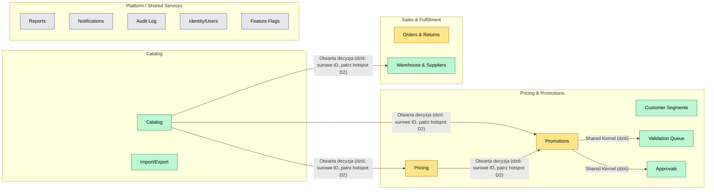
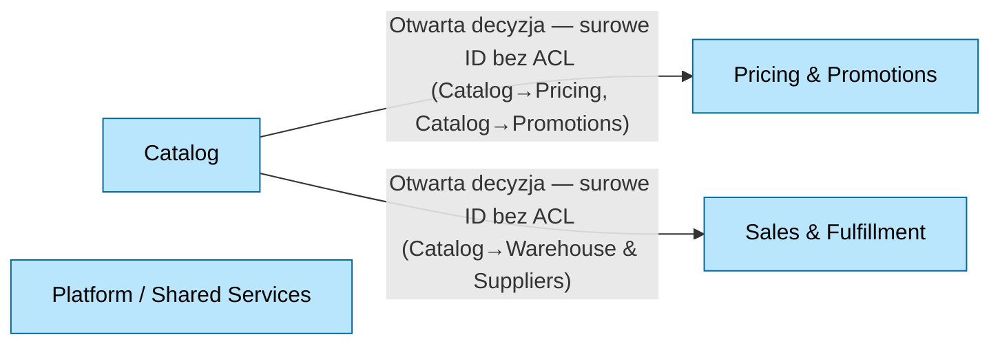

# Context Map: Retail Operations Portal

> **Living document.** Aktualizowany iteracyjnie w miarę odkrywania granic, nie jest dokumentem końcowym.
> **Status:** in-progress
> **Data:** 2026-09-01

## Wejścia źródłowe

- Event storming: [docs/event-storming/utworzenie-nowej-promocji.md](../event-storming/utworzenie-nowej-promocji.md) (proces: utworzenie i akceptacja promocji)
- Drivery architektoniczne: D1 (czas wdrożenia zmian w regułach promocji), D2 (autonomia zespołów Pricing/Catalog), D3 (odporność na częściową awarię), D4 (rozszerzalność — nowi dostawcy frontendu B2B) z [ARCHITECTURE.md](../ARCHITECTURE.md)
- Ownership map (ARCHITECTURE.md): Wybór produktów → Catalog Team, Reguły i ceny → Pricing Team, pozostałe kroki `_TBD_`
- Inne źródła: struktura kodu `retail-operations-portal/src` (routes, api, store) — kandydaci wywnioskowani z modułów, wymagają potwierdzenia

## Bounded Contexts

### Domena: Catalog

| Kontekst      | Odpowiedzialność (1 zdanie)                                    | Zespół / właściciel | Typ (Core/Supporting/Generic) |
| ------------- | -------------------------------------------------------------- | ------------------- | ----------------------------- |
| Catalog       | Definiuje produkty i kategorie oraz ich atrybuty prezentacyjne | Catalog Team        | Supporting                    |
| Import/Export | Masowy import/eksport danych katalogowych (CSV produktów)      | Catalog Team        | Supporting                    |

> Uwaga: dziś Import/Export działa wyłącznie na danych Catalog (`importProductsFromCsv`/`exportProducts` w `api/products.ts`) — kod ma komentarz sugerujący możliwą przyszłą ewolucję w kierunku generycznej, współdzielonej platformowej zdolności (patrz hotspoty).

### Domena: Pricing & Promotions

| Kontekst          | Odpowiedzialność (1 zdanie)                                                                | Zespół / właściciel | Typ (Core/Supporting/Generic) |
| ----------------- | ------------------------------------------------------------------------------------------ | ------------------- | ----------------------------- |
| Pricing           | Definiuje i wylicza reguły cenowe (`PricingRule`)                                          | Pricing Team        | Core                          |
| Promotions        | Zarządza cyklem życia promocji (draft → walidacja → akceptacja → aktywna → zarchiwizowana) | Pricing Team        | Core                          |
| Customer Segments | Definiuje segmenty klientów używane do targetowania cen/promocji                           | Pricing Team        | Supporting                    |
| Validation Queue  | Bramka jakości sprawdzająca kompletność danych promocji przed akceptacją                   | Pricing Team        | Supporting (cross-cutting)    |
| Approvals         | Workflow akceptacji/odrzucenia promocji (rola admin/manager)                               | Pricing Team        | Supporting (cross-cutting)    |

> Uwaga: "Reguła" (`PricingRule`) — test granicy Pricing vs Promotions do doprecyzowania w kroku Słownik.

### Domena: Sales & Fulfillment

| Kontekst              | Odpowiedzialność (1 zdanie)                                           | Zespół / właściciel      | Typ (Core/Supporting/Generic) |
| --------------------- | --------------------------------------------------------------------- | ------------------------ | ----------------------------- |
| Orders & Returns      | Obsługuje cykl życia zamówienia klienta wraz z procesem zwrotu towaru | Sales & Fulfillment Team | Core                          |
| Warehouse & Suppliers | Zarządza stanami magazynowymi oraz danymi i relacjami z dostawcami    | Sales & Fulfillment Team | Supporting                    |

### Domena: Platform / Shared Services

| Kontekst       | Odpowiedzialność (1 zdanie)                                 | Zespół / właściciel | Typ (Core/Supporting/Generic) |
| -------------- | ----------------------------------------------------------- | ------------------- | ----------------------------- |
| Reports        | Raportowanie zbiorcze na podstawie danych innych kontekstów | Platform Team       | Generic                       |
| Notifications  | Powiadomienia użytkownika w aplikacji                       | Platform Team       | Generic                       |
| Audit Log      | Dziennik zdarzeń/akcji użytkowników                         | Platform Team       | Generic                       |
| Identity/Users | Uwierzytelnianie, role, zarządzanie użytkownikami           | Platform Team       | Generic                       |
| Feature Flags  | Włączanie/wyłączanie funkcji                                | Platform Team       | Generic                       |

## Mapa kontekstów (diagram)

## Słownik (Ubiquitous Language)

| Termin          | Definicja                                                                                                                                                          | Kontekst              | Uwagi (homonimy/synonimy w innych kontekstach)                                                                                                    |
| --------------- | ------------------------------------------------------------------------------------------------------------------------------------------------------------------ | --------------------- | ------------------------------------------------------------------------------------------------------------------------------------------------- |
| Produkt         | Pełny rekord: `sku`, `name`, `categoryId`, `price`, `unit`, `status` (active/inactive)                                                                             | Catalog               | Promotions referuje `productId` bezpośrednio (surowe ID), bez własnej kopii ani ACL                                                               |
| Kategoria       | Płaski rekord: `id` + `name`, brak hierarchii/atrybutów w obecnym modelu                                                                                           | Catalog               | `PricingRule.categoryId` referuje wprost ten sam identyfikator                                                                                    |
| Reguła cenowa   | `PricingRule`: `type` (percentage/fixed/bundle), `value`, opcjonalny `categoryId`, `active`                                                                        | Pricing               | Promotions referuje `pricingRuleIds` bezpośrednio (surowe ID), bez ACL                                                                            |
| Promocja        | `Promotion`: stan `PromotionStatus` (draft → pending_validation → pending_approval → active → archived), `productIds`, `pricingRuleIds`, `createdBy`, `approvedBy` | Promotions            | —                                                                                                                                                 |
| Segment klienta | `CustomerSegment`: `name`, `description`, wolnotekstowe `criteria` (nieustrukturyzowane, nieegzekwowane programowo)                                                | Customer Segments     | —                                                                                                                                                 |
| Walidacja       | Nie jest osobnym agregatem — to pole `Promotion.validation` (`passed`, `issues`, `checkedAt`)                                                                      | Validation Queue      | Kod ma komentarz: "shared workflow queue... could later be reused by other domains (e.g. orders)" — dziś dotyczy wyłącznie `Promotion`            |
| Akceptacja      | `ApprovalsPage` działa wyłącznie na `Promotion` (`status === pending_approval`)                                                                                    | Approvals             | Inny mechanizm niż `approveOrder`/`Order.status: approved` w Sales & Fulfillment — ten sam wyraz "akceptacja/approve", różne, niepowiązane modele |
| Zamówienie      | `Order`: `orderNumber`, `customerName`, `total`, `status` (new/approved/shipped/cancelled)                                                                         | Orders & Returns      | —                                                                                                                                                 |
| Zwrot           | `ReturnRequest`: referuje `orderId` (obce ID, nie kopiuje danych zamówienia), własny `status` (requested/approved/rejected/refunded), `reason`                     | Orders & Returns      | —                                                                                                                                                 |
| Stan magazynowy | `WarehouseStock`: `productId` (referencja do Catalog), `location`, `quantity`, `reserved`                                                                          | Warehouse & Suppliers | —                                                                                                                                                 |
| Dostawca        | `Supplier`: `name`, `contactEmail`, `country`, `status` (active/inactive)                                                                                          | Warehouse & Suppliers | —                                                                                                                                                 |
| Powiadomienie   | `Notification`: `message`, `read`, `type` (info/warning/success)                                                                                                   | Notifications         | —                                                                                                                                                 |
| Wpis dziennika  | `AuditLogEntry`: `entityType`, `entityId`, `action`, `actor`, `timestamp` — generyczny, opisuje zmiany w dowolnym innym kontekście przez `entityType`/`entityId`   | Audit Log             | —                                                                                                                                                 |
| Użytkownik      | `User`: `name`, `email`, `role` (`UserRole`: admin/manager/viewer)                                                                                                 | Identity/Users        | —                                                                                                                                                 |
| Flaga funkcji   | `FeatureFlag`: `key`, `label`, `enabled` (bool — brak osobnego `status`)                                                                                           | Feature Flags         | —                                                                                                                                                 |

> **Notatka — problem statusów:** słowo "status" ma odrębny, niekompatybilny zbiór wartości w każdym kontekście, który go używa: `PromotionStatus` (5 wartości, workflow), `OrderStatus` (4 wartości, inny workflow), `ReturnStatus` (4 wartości, jeszcze inny workflow), `Product.status`/`Supplier.status` (tylko active/inactive, brak workflow). To nie jest jeden wspólny typ — każdy kontekst definiuje "status" na nowo. Traktować jako potwierdzenie granic (nie ujednolicać), ale uważać przy współdzielonych komponentach UI (np. `StatusBadge`), które renderują różne zbiory wartości pod tą samą nazwą.
>
> **Notatka — Reports i Import/Export nie mają własnych typów w `types.ts`:** `exportProducts()` zwraca `Product[]` (typ Catalog), a `Reports`/`ImportExportPage` nie definiują żadnego własnego agregatu — operują wyłącznie na danych innych kontekstów. Import/Export dziś operuje wyłącznie na danych Catalog, stąd przypisanie do domeny Catalog; Reports pozostaje w Platform jako celowo pusty placeholder (patrz sekcja Granice i odpowiedzialności).

## Granice i odpowiedzialności

### Catalog

- **W zakresie:** CRUD produktów (`sku`, cena bazowa, jednostka, status), zarządzanie kategoriami.
- **Poza zakresem:** reguły cenowe i promocje (Pricing/Promotions), stany magazynowe (Warehouse & Suppliers).
- **Dane własne:** `Product`, `Category`.

### Import/Export

- **W zakresie:** masowy import/eksport CSV produktów (`importProductsFromCsv`, `exportProducts`).
- **Poza zakresem:** import/eksport danych innych kontekstów (dziś niezaimplementowany).
- **Dane własne:** brak — działa wyłącznie na `Product` z Catalog.

### Pricing

- **W zakresie:** definiowanie reguł cenowych (`percentage`/`fixed`/`bundle`), powiązanie reguły z kategorią.
- **Poza zakresem:** przypisanie reguł do konkretnej promocji (robi to Promotions), dane produktu (Catalog).
- **Dane własne:** `PricingRule`.

### Promotions

- **W zakresie:** cykl życia promocji (draft → pending_validation → pending_approval → active → archived).
- **Poza zakresem:** definiowanie reguł cenowych i danych produktu — tylko referuje ich ID.
- **Dane własne:** `Promotion` (w tym osadzone `validation`, `approvedBy`, `activatedAt`).

### Customer Segments

- **W zakresie (dziś):** wyłącznie przeglądanie zdefiniowanych segmentów klientów.
- **Poza zakresem (dziś):** jakiekolwiek egzekwowanie/użycie kryteriów segmentu w Pricing lub Promotions — brak referencji `segmentId` w całym kodzie.
- **Dane własne:** `CustomerSegment`.

### Validation Queue

- **W zakresie (dziś):** uruchamianie walidacji wyłącznie dla `Promotion` (`status === pending_validation`).
- **Poza zakresem (dziś):** walidacja czegokolwiek innego niż `Promotion`.
- **Dane własne:** brak własnego agregatu — czyta/pisze pole `Promotion.validation`.

### Approvals

- **W zakresie (dziś):** akceptacja/odrzucenie wyłącznie dla `Promotion` (`status === pending_approval`, rola admin/manager).
- **Poza zakresem (dziś):** akceptacja zamówień (`approveOrder` w Orders & Returns to odrębny, niepowiązany mechanizm).
- **Dane własne:** brak własnego agregatu — modyfikuje pola `Promotion.status`/`approvedBy`.

### Orders & Returns

- **W zakresie:** cykl życia zamówienia (`new`/`approved`/`shipped`/`cancelled`), obsługa zwrotów.
- **Poza zakresem:** stany magazynowe, dane dostawców.
- **Dane własne:** `Order`, `ReturnRequest` (referuje `orderId`, nie kopiuje danych zamówienia).

### Warehouse & Suppliers

- **W zakresie:** stany magazynowe (`quantity`, `reserved` per `productId` + `location`), dane dostawców.
- **Poza zakresem:** składanie zamówień zakupowych do dostawców (brak takiej funkcji w kodzie).
- **Dane własne:** `WarehouseStock`, `Supplier`.

### Reports

- **W zakresie (docelowo):** raportowanie i analityka na podstawie danych innych kontekstów.
- **Poza zakresem (dziś):** wszystko — strona jest celowo pustym placeholderem.
- **Dane własne:** brak.

### Notifications

- **W zakresie:** powiadomienia użytkownika w aplikacji (`read`/`unread`, typ info/warning/success).
- **Poza zakresem:** generowanie treści powiadomień na podstawie zdarzeń domenowych (brak takiej integracji w kodzie — patrz hotspoty).
- **Dane własne:** `Notification`.

### Audit Log

- **W zakresie:** zapis i odczyt wpisów dziennika zdarzeń (`entityType`, `entityId`, `action`, `actor`, `timestamp`).
- **Poza zakresem:** generowanie wpisów na podstawie akcji w innych kontekstach (żadna komenda w procesie promocji nie wywołuje `addAuditLogEntry` — patrz hotspoty).
- **Dane własne:** `AuditLogEntry`.

### Identity/Users

- **W zakresie:** uwierzytelnianie, role (`admin`/`manager`/`viewer`), zarządzanie użytkownikami.
- **Poza zakresem:** egzekwowanie ról w poszczególnych modułach (dziś częściowe — patrz hotspoty).
- **Dane własne:** `User`.

### Feature Flags

- **W zakresie:** definiowanie i przełączanie flag funkcji (`key`, `label`, `enabled`).
- **Poza zakresem:** logika warunkowa oparta o flagi w innych kontekstach (poza zakresem tego kontekstu z definicji).
- **Dane własne:** `FeatureFlag`.

## Relacje i integracje

| Kontekst A (upstream) | Kontekst B (downstream) | Wzorzec DDD                                                                                   | Mechanizm integracji                                                | Kontrakt / format                                                 | Zachowanie przy awarii                                                      | Uwagi                                                        |
| --------------------- | ----------------------- | --------------------------------------------------------------------------------------------- | ------------------------------------------------------------------- | ----------------------------------------------------------------- | --------------------------------------------------------------------------- | ------------------------------------------------------------ |
| Catalog               | Promotions              | **Otwarta decyzja** (patrz hotspot) — dziś brak formalnego wzorca, referencja przez surowe ID | in-process (import modułu, wspólny Redux store, wspólny `types.ts`) | Brak formalnego kontraktu — surowe `productIds: string[]`         | Niezdefiniowane (brak granicy sieciowej — błąd runtime przy niespójnych ID) | Kandydat ADR — patrz hotspot D2                              |
| Catalog               | Pricing                 | **Otwarta decyzja** (patrz hotspot) — dziś brak formalnego wzorca, referencja przez surowe ID | in-process                                                          | Brak formalnego kontraktu — surowe `categoryId?: string`          | Niezdefiniowane                                                             | Kandydat ADR — patrz hotspot D2                              |
| Catalog               | Warehouse & Suppliers   | **Otwarta decyzja** (patrz hotspot) — dziś brak formalnego wzorca, referencja przez surowe ID | in-process                                                          | Brak formalnego kontraktu — surowe `productId: string`            | Niezdefiniowane                                                             | Kandydat ADR — patrz hotspot D2                              |
| Pricing               | Promotions              | **Otwarta decyzja** (patrz hotspot) — dziś brak formalnego wzorca, referencja przez surowe ID | in-process                                                          | Brak formalnego kontraktu — surowe `pricingRuleIds: string[]`     | Niezdefiniowane                                                             | Kandydat ADR — patrz hotspot D2                              |
| Promotions            | Validation Queue        | Shared Kernel (dziś) — brak własnego agregatu po stronie Validation Queue                     | in-process (odczyt/zapis pola `Promotion.validation`)               | Brak — dzielony kształt `ValidationResult` osadzony w `Promotion` | Niezdefiniowane                                                             | Docelowy design do dyskusji — patrz sekcja poniżej i hotspot |
| Promotions            | Approvals               | Shared Kernel (dziś) — brak własnego agregatu po stronie Approvals                            | in-process (odczyt/zapis pól `Promotion.status`/`approvedBy`)       | Brak — dzielony kształt osadzony w `Promotion`                    | Niezdefiniowane                                                             | Docelowy design do dyskusji — patrz sekcja poniżej i hotspot |

> Import/Export → Catalog: pominięte jako nieistotne na poziomie mapy kontekstów (ten sam zespół, wewnętrzna dekompozycja UI, nie relacja między właścicielami).
>
> Customer Segments, Orders & Returns, Reports, Notifications, Audit Log, Identity/Users, Feature Flags: brak potwierdzonej integracji z innymi kontekstami w kodzie — nie zapisano żadnej relacji (Separate Ways / brak integracji), zamiast zgadywać.

### Propozycja docelowego rozdzielenia Validation Queue i Approvals na własne agregaty

Dziś `ValidationResult` i pola akceptacji (`approvedBy`, `activatedAt`) są osadzone bezpośrednio w `Promotion` — stąd klasyfikacja "Shared Kernel" powyżej. Aby faktycznie rozdzielić na osobne agregaty (i umożliwić reużycie zapowiedziane w komentarzach kodu — "could later be reused by other domains, e.g. orders"), wzorować się na już istniejącym w kodzie generycznym kształcie `AuditLogEntry` (`entityType` + `entityId`):

- **`PromotionValidation`** (własność Validation Queue): `{ id, subjectType: string, subjectId: string, passed: boolean, issues: string[], checkedAt: string }` — `subjectType`/`subjectId` zamiast sztywnego `promotionId` pozwala w przyszłości walidować też np. `Order`.
- **`Approval`** (własność Approvals): `{ id, subjectType: string, subjectId: string, decision: "approved" | "rejected", decidedBy: string, decidedAt: string }` — analogicznie generyczne.
- Promotions przestaje przechowywać `validation`/`approvedBy` u siebie; zamiast tego nasłuchuje zdarzeń (`ValidationCompleted`, `ApprovalDecided`) lub odpytuje Validation Queue/Approvals po `subjectId = promotion.id` i tłumaczy wynik na własny `PromotionStatus` przez własną warstwę adaptera (ACL).
- Docelowy wzorzec relacji: Validation Queue i Approvals jako **Open Host Service + Published Language** (generyczny, reużywalny kontrakt), Promotions jako **downstream z ACL** (tłumaczy generyczny wynik na własny model statusu).

To jest propozycja projektowa do potwierdzenia — nie została jeszcze zaimplementowana ani zatwierdzona jako decyzja.

## Core Domain Chart

| Kontekst              | Klasyfikacja               | Uzasadnienie                                                  |
| --------------------- | -------------------------- | ------------------------------------------------------------- |
| Catalog               | Supporting                 | Niezbędny, ale niskie zróżnicowanie konkurencyjne             |
| Import/Export         | Supporting                 | Wspiera Catalog; dziś bez własnych danych                     |
| Pricing               | Core                       | Bezpośrednio realizuje D1 (czas wdrożenia zmian cenowych)     |
| Promotions            | Core                       | D1 wprost dotyczy promocji; wysoka złożoność biznesowa        |
| Customer Segments     | Supporting                 | Zasila (docelowo) targeting cen/promocji, dziś izolowany      |
| Validation Queue      | Supporting (cross-cutting) | Bramka jakości, potencjalnie reużywalna poza promocjami       |
| Approvals             | Supporting (cross-cutting) | Workflow akceptacji, potencjalnie reużywalny poza promocjami  |
| Orders & Returns      | Core                       | Realizacja przychodu, wysoka złożoność                        |
| Warehouse & Suppliers | Supporting                 | Wspiera Orders/Catalog, niskie zróżnicowanie                  |
| Reports               | Generic                    | Rozwiązany problem, planowany jako samodzielny MF remote (D4) |
| Notifications         | Generic                    | Platformowa zdolność, brak zróżnicowania biznesowego          |
| Audit Log             | Generic                    | Standardowy dziennik zdarzeń                                  |
| Identity/Users        | Generic                    | Auth/role — kandydat do rozwiązania gotowego                  |
| Feature Flags         | Generic                    | Standardowa platformowa zdolność                              |

### Diagram: Mapa domen i relacji (widok zagregowany)

<!-- Widok wyżej niż pojedyncze bounded context — agreguje relacje z sekcji "Relacje i integracje" do poziomu domen. -->

> Platform / Shared Services nie ma dziś żadnej potwierdzonej w kodzie integracji z pozostałymi domenami (patrz "Separate Ways" w sekcji Relacje i integracje) — stąd brak krawędzi. Wewnątrz Pricing & Promotions (Pricing→Promotions, Promotions→Validation Queue, Promotions→Approvals) relacje są wewnątrzdomenowe i pominięte na tym zagregowanym widoku — zobacz diagram w sekcji "Mapa kontekstów" powyżej.

## Open Questions / Hotspots / Inconsistencies

- [ ] Ownership map w ARCHITECTURE.md pokrywa tylko kroki procesu promocji (Walidacja→akceptacja, Aktywacja/publikacja, Raportowanie nadal `_TBD_`) — reszta modułów portalu (Orders, Warehouse, Suppliers, Users, ...) nie ma jeszcze przypisanego ownera. — kontekst: cały system
- [ ] `types.ts` ma jawny komentarz w kodzie: "Shared DTOs used across every domain — intentionally one flat file (brownfield anti-pattern)" — dziś nie ma żadnej realnej izolacji modeli między kontekstami na poziomie kodu (wszystkie DTO w jednym pliku, prawdopodobnie jeden wspólny Redux store). Driver D4 (rozszerzalność, Module Federation) jest na razie aspiracyjny, nie zaimplementowany. — kontekst: cały system
- [ ] `CustomerSegment`/`segmentId` nie jest nigdzie referowany przez `Promotion` ani `PricingRule` — segmentacja klientów jest dziś w pełni izolowaną, tylko-do-odczytu listą, mimo że nazwa sugeruje integrację z targetowaniem cen/promocji. — kontekst: Customer Segments
- [ ] `ImportExportPage.tsx` ma komentarz "Is this a domain, or a shared platform capability?" — dziś działa wyłącznie na Catalog (produkty), ale sugerowana jest przyszła ewolucja w kierunku generycznej, współdzielonej zdolności (Web Component) używanej przez inne domeny. — kontekst: Import/Export
- [ ] `ValidationQueuePage.tsx` ma komentarz "same walidacja mechanism could later be reused by other domains (e.g. orders)" — dziś Validation Queue i Approvals są ściśle powiązane wyłącznie z `Promotion` i nie mają własnych agregatów (operują na polach osadzonych w `Promotion`), mimo że zostały potwierdzone jako osobne bounded context. — kontekst: Validation Queue, Approvals
- [ ] Żadna komenda w procesie promocji (utworzenie, walidacja, akceptacja, odrzucenie, archiwizacja) nie wywołuje `addAuditLogEntry` — Audit Log nie jest dziś realnie zintegrowany z Promotions (ani prawdopodobnie z innymi kontekstami). — kontekst: Audit Log, Promotions
- [ ] Egzekwowanie ról (`admin`/`manager`) w UI jest niespójne — widoczne tylko przy akceptacji promocji (`ApprovalActionBar`), brak analogicznego sprawdzenia przy tworzeniu promocji, walidacji czy archiwizacji. — kontekst: Identity/Users, Approvals
- [ ] `ReportsPage.tsx` ma komentarz "Deliberately thin — this is the slot for the greenfield remote built live on Dzień 1 (Blok D2)" — potwierdza, że Reports to celowo zaprojektowany przyszły samodzielny Module Federation remote (driver D4), nie istniejący dziś kontekst z realnymi danymi. — kontekst: Reports
- [ ] **[WAŻNE — decyzja otwarta]** Cztery relacje oparte o surowe ID bez ACL (Catalog→Promotions, Catalog→Pricing, Catalog→Warehouse & Suppliers, Pricing→Promotions) stoją w sprzeczności z driverem D2 (Pricing i Catalog nie mogą się wzajemnie blokować przy wydaniu) — dziś zmiana kształtu `Product`/`Category`/`PricingRule` może cicho złamać zależne konteksty. Wymaga decyzji: czy formalizować jako Customer/Supplier + ACL (i gdzie budować warstwę ACL), czy zaakceptować jako świadomy Shared Kernel na etapie monolitu. Kandydat na ADR. — kontekst: Catalog, Pricing, Promotions, Warehouse & Suppliers
- [ ] **[Decyzja projektowa do potwierdzenia]** Propozycja rozdzielenia Validation Queue i Approvals na własne, generyczne agregaty (`PromotionValidation`/`Approval` z `subjectType`/`subjectId` wzorem `AuditLogEntry`) opisana w sekcji Relacje i integracje — niezaimplementowana, wymaga potwierdzenia i prawdopodobnie osobnego ADR. — kontekst: Validation Queue, Approvals
