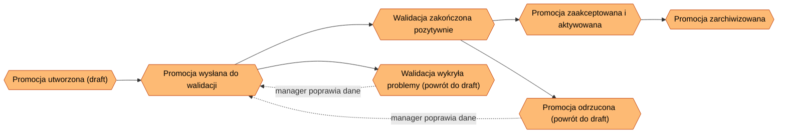
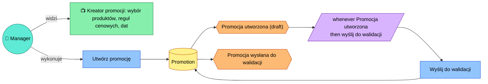
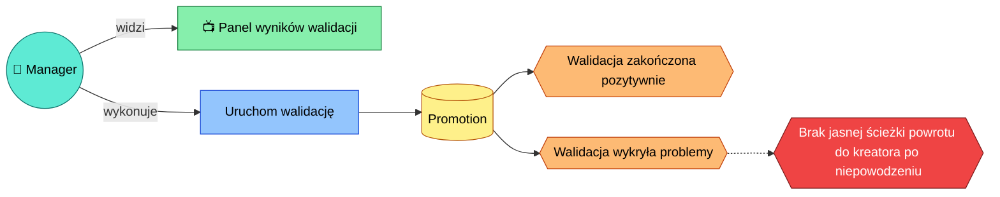
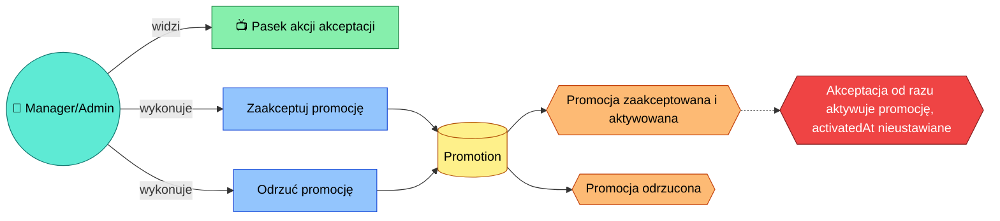
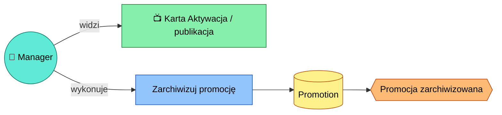

# Event Storming: Utworzenie nowej promocji

## Kontekst

- **Rola / aktor:** Manager
- **Cel końcowy (end goal):** Nowa promocja jest utworzona i czeka na zatwierdzenie
- **Status:** in-progress
- **Data:** 2026-09-01

> **Uwaga metodologiczna:** ten dokument został wywnioskowany z istniejącego kodu (`PromotionWizardPage.tsx`, `PromotionDetailsPage.tsx`, `api/promotions.ts`, `store/promotionsSlice.ts`, `PromotionStatusTimeline.tsx`, `ApprovalActionBar.tsx`, `ValidationResultsPanel.tsx`), a nie z warsztatu z użytkownikiem. Wymaga potwierdzenia przez osobę merytoryczną (manager/product owner) przed uznaniem za źródło prawdy.

## Big Picture

<!-- Diagram wysokopoziomowy: łańcuch zdarzeń domenowych (E1, E2, ...) w kolejności czasowej.
     Aktualizuj po każdym kroku - dodaj nowy węzeł zdarzenia i połącz go z poprzednim. -->

## Kroki

<!-- Jeden ### Step per zdarzenie/decyzja. Skopiuj blok poniżej dla każdego nowego kroku. -->

### Step 1: Promocja utworzona i wysłana do walidacji

- **Widok (view):** Kreator promocji (`PromotionWizardPage`) — zakładki: wybór produktów (`ProductPicker`), reguły cenowe (lista + formularz nowej reguły), oraz informacyjne zakładki walidacji/akceptacji/aktywacji odsyłające do strony szczegółów.
- **Agregat(y):** `Promotion` (nazwa, `productIds`, `pricingRuleIds`, `startDate`, `endDate`, `createdBy`, `status`).
- **Komenda(y):** "Utwórz promocję i wyślij do walidacji" (jeden przycisk w UI wywołuje dwie komendy pod spodem: `createPromotion` → `submitPromotionForValidation`).
- **Reguły / polityki:** Przycisk aktywny tylko gdy podano nazwę, co najmniej 1 produkt oraz obie daty (`canCreate`). Wysłanie do walidacji następuje automatycznie zaraz po utworzeniu, bez odrębnej decyzji managera — modelowane jako polityka.
- **Zmiany stanu:** Nowy `Promotion` powstaje ze statusem `draft`, następnie natychmiast aktualizowany na `pending_validation`.
- **Zdarzenie(a) domenowe:** `Promocja utworzona (draft)`, `Promocja wysłana do walidacji`.

### Step 2: Walidacja promocji

- **Widok (view):** `ValidationResultsPanel` na stronie szczegółów promocji (`PromotionDetailsPage`) — widoczny gdy status to `pending_validation` lub `draft` z nieudaną walidacją.
- **Agregat(y):** `Promotion` (pole `validation: { passed, issues, checkedAt }`).
- **Komenda(y):** "Uruchom walidację" (`runValidation`).
- **Reguły / polityki:** Naiwna reguła: brak wybranych produktów → issue "Brak wybranych produktów"; brak reguły cenowej → issue "Brak reguły cenowej". Walidacja przechodzi tylko gdy `issues` jest puste.
- **Zmiany stanu:** `Promotion.validation` ustawiany zawsze; `status` → `pending_approval` (sukces) lub z powrotem → `draft` (niepowodzenie).
- **Zdarzenie(a) domenowe:** `Walidacja zakończona pozytywnie`, `Walidacja wykryła problemy`.

### Step 3: Akceptacja i aktywacja promocji

- **Widok (view):** `ApprovalActionBar` na stronie szczegółów promocji — widoczny gdy status to `pending_approval`. Widoczny/aktywny tylko dla ról `admin` lub `manager`.
- **Agregat(y):** `Promotion` (pola `status`, `approvedBy`, `activatedAt`).
- **Komenda(y):** "Zaakceptuj" (`approvePromotion`), "Odrzuć" (`rejectPromotion`).
- **Reguły / polityki:** Rola musi być `admin` lub `manager`, inaczej widok informuje "Twoja rola nie pozwala na akceptację" i akcje są niedostępne.
- **Zmiany stanu:** Akceptacja → `status: active`, `approvedBy` ustawiony, `activatedAt` jawnie ustawiany na `undefined`. Odrzucenie → `status: draft` (powrót do szkicu, bez zapisania powodu w modelu poza toastem).
- **Zdarzenie(a) domenowe:** `Promocja zaakceptowana i aktywowana`, `Promocja odrzucona`.

### Step 4: Archiwizacja promocji

- **Widok (view):** Karta "Aktywacja / publikacja" na stronie szczegółów promocji, widoczna gdy status to `active`; zawiera jedynie przycisk "Zarchiwizuj".
- **Agregat(y):** `Promotion` (`status`).
- **Komenda(y):** "Zarchiwizuj" (`archivePromotion`).
- **Reguły / polityki:** Brak dodatkowych reguł widocznych w kodzie (brak potwierdzenia, brak roli-gate).
- **Zmiany stanu:** `status` → `archived`.
- **Zdarzenie(a) domenowe:** `Promocja zarchiwizowana`.

## Open Questions / Hotspots / Inconsistencies

<!-- Lista otwartych pytań, hotspotów i niespójności napotkanych podczas warsztatu.
     Każdy wpis odnosi się do kroku, w którym się pojawił. -->

- [ ] Kreator (`canCreate`) nie wymaga wybrania reguły cenowej, a walidacja w Step 2 zgłasza jej brak jako błąd — niespójność między warunkiem utworzenia a warunkiem przejścia walidacji. — krok: Step 1
- [ ] Po nieudanej walidacji promocja wraca do statusu `draft`, ale w UI brak jest jawnej ścieżki powrotu do kreatora (`PromotionWizardPage`), by uzupełnić brakujące produkty/reguły — jedyna dostępna akcja to ponowne "Uruchom walidację" na tych samych (niezmienionych) danych. — krok: Step 2
- [ ] `approvePromotion` łączy akceptację z natychmiastową aktywacją (`status: active`) i jawnie ustawia `activatedAt: undefined`. Osobne funkcje `activatePromotion`/`deactivatePromotion` w `api/promotions.ts` faktycznie zapisują `activatedAt`, ale nie są wywoływane z żadnego UI — sugeruje to niedokończony lub porzucony, odrębny krok "aktywacji" po akceptacji. — krok: Step 3
- [ ] Żadna z komend (utworzenie, walidacja, akceptacja, odrzucenie, archiwizacja) nie wywołuje `addAuditLogEntry` — sekcja "Dziennik zdarzeń" na stronie szczegółów promocji czyta wyłącznie statyczne dane mockowe (`auditLog.json`) i nigdy nie jest aktualizowana w wyniku akcji w tym procesie. — krok: Step 1-4
- [ ] Ograniczenie roli (`admin`/`manager`) egzekwowane jest tylko przy akceptacji/odrzuceniu (`ApprovalActionBar`); tworzenie promocji, uruchamianie walidacji i archiwizacja nie mają analogicznego sprawdzenia roli w UI — niespójne pokrycie autoryzacji w procesie. — krok: Step 1, Step 2, Step 4
- [ ] Funkcja `selectProductsForPromotion` w `api/promotions.ts` istnieje, ale nie jest wywoływana z żadnego UI — nieużywany kod, potencjalnie ślad po innej wersji przepływu (edycja produktów po utworzeniu promocji?). — krok: Step 1
